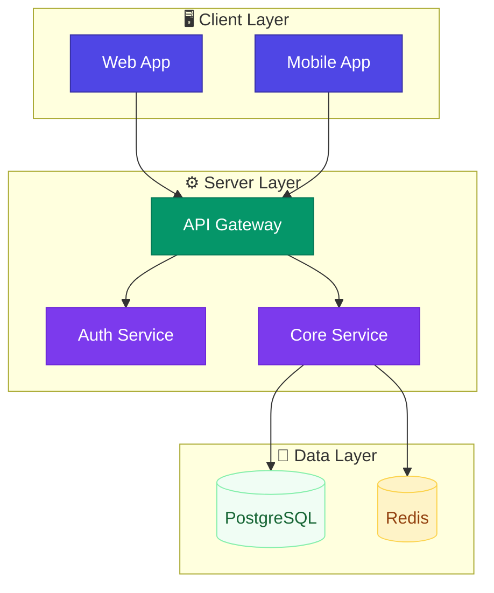
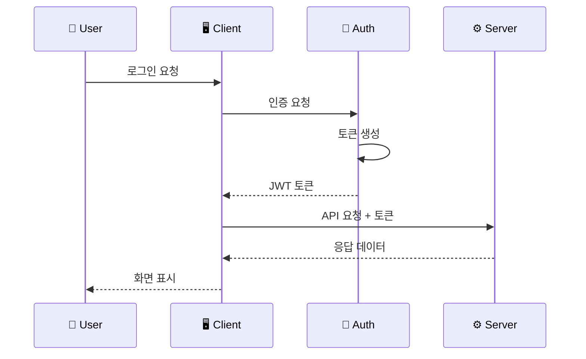
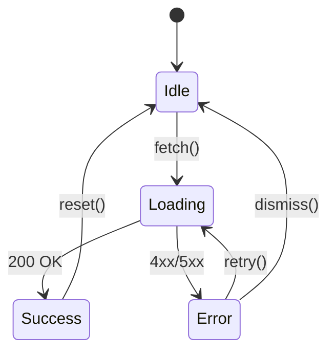

# /docs - 문서 콘텐츠 자동 생성 시스템

> 프로젝트를 분석하여 **매우 상세한** 전문적인 기술 문서 콘텐츠를 자동 생성합니다.

## 개요

`/docs` 명령어는 코드베이스를 분석하여 전문적인 기술 문서를 자동으로 작성합니다.
사이트 생성이 아닌 **문서 콘텐츠 자체**를 생성하는 것이 핵심입니다.

## 핵심 원칙: 극도로 상세한 문서

> **모든 생성 문서는 독자가 추가 질문 없이 완벽하게 이해하고 사용할 수 있어야 합니다.**

### 상세도 기준

| 기준 | 요구사항 |
|------|----------|
| **완전성** | 모든 파라미터, 옵션, 반환값, 에러 케이스 문서화 |
| **예시 다양성** | 기본 + 고급 + 에지케이스 + 에러처리 (최소 4개) |
| **실행 가능성** | 모든 코드 예시는 복사-붙여넣기로 즉시 실행 가능 |
| **맥락 제공** | 왜 필요한지, 언제 사용하는지, 대안은 무엇인지 |
| **시각화** | Mermaid 다이어그램으로 구조/흐름을 시각화 |
| **스크린샷** | UI/결과물은 이미지 플레이스홀더로 명시 |

---

## Mermaid 다이어그램 가이드

> **복잡한 개념은 다이어그램으로 시각화하여 이해를 돕습니다.**

### 적극 활용 필수 상황

| 문서 유형 | 필수 다이어그램 |
|----------|----------------|
| **Architecture** | 시스템 개요, 컴포넌트 의존성, 데이터 흐름 |
| **API** | 요청-응답 시퀀스, 인증 흐름 |
| **Guide** | 프로세스 흐름, 상태 전이 |
| **Component** | 컴포넌트 계층 구조, 상태 머신 |

### 가독성 규칙 (필수)

> **배경색과 텍스트색의 대비를 확보하여 가독성을 보장합니다.**

```
🎨 색상 대비 원칙:
- 어두운 배경 → 밝은 글자 (흰색, 밝은 노랑, 밝은 하늘색)
- 밝은 배경 → 어두운 글자 (검정, 진한 파랑, 진한 회색)
```

### 권장 색상 팔레트

```mermaid
%%{init: {'theme': 'base', 'themeVariables': { 'primaryColor': '#4f46e5', 'primaryTextColor': '#ffffff', 'primaryBorderColor': '#3730a3', 'lineColor': '#6366f1', 'secondaryColor': '#f0fdf4', 'tertiaryColor': '#fef3c7'}}}%%
```

**어두운 배경 노드 (권장):**
```
style NodeA fill:#4f46e5,stroke:#3730a3,color:#ffffff
style NodeB fill:#059669,stroke:#047857,color:#ffffff
style NodeC fill:#dc2626,stroke:#b91c1c,color:#ffffff
style NodeD fill:#7c3aed,stroke:#6d28d9,color:#ffffff
```

**밝은 배경 노드 (권장):**
```
style NodeE fill:#f0fdf4,stroke:#86efac,color:#166534
style NodeF fill:#fef3c7,stroke:#fcd34d,color:#92400e
style NodeG fill:#f1f5f9,stroke:#cbd5e1,color:#1e293b
```

### 다이어그램 유형별 예시

**1. 시스템 아키텍처 (flowchart)**


**2. 시퀀스 다이어그램 (sequence)**


**3. 상태 다이어그램 (stateDiagram)**


---

## 이미지 플레이스홀더 가이드

> **실제 스크린샷이 필요한 위치에 명시적으로 표기합니다.**

### 플레이스홀더 형식

```markdown
<!-- 📸 스크린샷 필요: [설명] -->

*캡션: [상세 설명]*
```

### 스크린샷 필수 포함 상황

| 상황 | 필수 여부 | 예시 |
|------|----------|------|
| **설치 결과 화면** | ✅ 필수 | 터미널 출력, 성공 메시지 |
| **UI 컴포넌트** | ✅ 필수 | 버튼 변형, 모달 등 |
| **설정 화면** | ✅ 필수 | 환경 설정, 옵션 패널 |
| **에러 화면** | ✅ 필수 | 에러 메시지, 디버깅 화면 |
| **대시보드** | ✅ 필수 | 메인 화면, 통계 |
| **워크플로우** | 권장 | 단계별 진행 화면 |

### 플레이스홀더 예시

```markdown
## 설치 확인

설치가 완료되면 다음과 같은 화면이 표시됩니다:

<!-- 📸 스크린샷 필요: 설치 완료 후 터미널 출력 화면 -->

*캡션: npm install 완료 후 터미널 출력*

## 대시보드 접속

브라우저에서 `http://localhost:3000`에 접속하면:

<!-- 📸 스크린샷 필요: 메인 대시보드 초기 화면 -->

*캡션: 초기 접속 시 표시되는 대시보드 메인 화면*

## 에러 발생 시

인증 실패 시 다음과 같은 에러가 표시됩니다:

<!-- 📸 스크린샷 필요: 인증 실패 에러 화면 -->

*캡션: JWT 토큰 만료 시 표시되는 에러 메시지*
```

### 이미지 파일 구조

```
.claude/docs-site/
├── images/                    # 📁 이미지 저장 폴더
│   ├── getting-started/       # 시작하기 관련
│   │   ├── installation-success.png
│   │   └── first-run.png
│   ├── architecture/          # 아키텍처 관련
│   │   └── system-overview.png
│   ├── components/            # 컴포넌트 관련
│   │   ├── button-variants.png
│   │   └── modal-example.png
│   └── guides/                # 가이드 관련
│       └── auth-flow.png
├── getting-started/
├── architecture/
...
```

## 하위 명령어

| 명령어 | 설명 |
|--------|------|
| `/docs generate` | 프로젝트 분석 후 전체 문서 자동 생성 |
| `/docs add [type]` | 특정 유형의 문서 추가 |
| `/docs update` | 코드 변경 시 기존 문서 업데이트 |
| `/docs status` | 문서 커버리지 및 품질 현황 |
| `/docs validate` | 문서 품질 검증 (링크, 일관성, 완성도) |

---

## 문서 유형별 필수 포함 항목

### 1. Getting Started (시작하기) - 필수 15개 항목

```
□ 프로젝트 한 줄 소개
□ 프로젝트가 해결하는 문제
□ 주요 기능 목록 (최소 5개)
□ 시스템 요구사항 (OS, Node 버전, 메모리 등)
□ 설치 방법 (npm, yarn, pnpm, Docker 모두)
□ 환경별 설정 (Development, Staging, Production)
□ 첫 번째 실행까지의 단계별 가이드
□ 기본 사용 예시 (3개 이상)
□ 예상 결과/출력 스크린샷
□ 흔한 설치 오류 및 해결책 (5개 이상)
□ 프록시/방화벽 환경 설정
□ 오프라인 설치 방법
□ 업그레이드 가이드
□ 롤백 방법
□ 다음 단계 안내
```

### 2. Architecture (아키텍처) - 필수 12개 항목

```
□ 시스템 전체 개요 다이어그램
□ 핵심 컴포넌트 설명 (각각 상세히)
□ 컴포넌트 간 의존성 다이어그램
□ 데이터 흐름 다이어그램
□ 요청-응답 시퀀스 다이어그램
□ 디렉토리 구조 및 각 폴더 역할
□ 핵심 디자인 패턴 설명
□ 확장 포인트 (어디서 커스터마이징 가능한지)
□ 성능 고려사항
□ 보안 아키텍처
□ 배포 아키텍처 (선택적)
□ 기술 선택 이유 (Why 문서)
```

### 3. API Reference - 필수 20개 항목 (엔드포인트당)

```
□ 엔드포인트 URL 및 HTTP 메서드
□ 한 줄 설명
□ 상세 설명 (언제 사용하는지)
□ 인증 요구사항 (토큰 타입, 권한 등)
□ Rate Limiting 정보
□ Path 파라미터 (타입, 필수여부, 설명, 예시)
□ Query 파라미터 (타입, 필수여부, 기본값, 유효값 범위)
□ Request Header (필수/선택)
□ Request Body 전체 스키마 (중첩 객체 포함)
□ 각 필드별 유효성 검사 규칙
□ 성공 응답 (200, 201 등) 전체 스키마
□ 에러 응답 (400, 401, 403, 404, 500) 각각의 스키마
□ 에러 코드별 원인 및 해결 방법
□ curl 예시
□ JavaScript/TypeScript 예시
□ Python 예시 (선택적)
□ 페이지네이션 방식 (있는 경우)
□ 필터링/정렬 옵션 (있는 경우)
□ Webhook 연동 (있는 경우)
□ Deprecation 정보 (있는 경우)
```

### 4. Components (컴포넌트) - 필수 18개 항목 (컴포넌트당)

```
□ 컴포넌트 이름 및 한 줄 설명
□ 언제 사용하는지 (Use Cases)
□ 언제 사용하지 말아야 하는지
□ 설치/Import 방법
□ 기본 사용 예시
□ 모든 Props 테이블 (타입, 기본값, 필수, 상세 설명)
□ 복합 타입 Props의 상세 스키마
□ 조건부 Props 설명 (A가 있으면 B 필수 등)
□ 모든 이벤트/콜백 목록 및 파라미터
□ Slots/Children 사용법
□ Ref로 접근 가능한 메서드
□ CSS Variables 목록
□ 커스텀 Class Names
□ 테마/변형(Variants) 예시
□ 제어/비제어 컴포넌트 패턴
□ 접근성(a11y) 정보 (ARIA, 키보드 내비게이션)
□ 성능 최적화 팁 (memo, useCallback 등)
□ 관련 컴포넌트 링크
```

### 5. Guides (가이드) - 필수 10개 항목

```
□ 가이드 목적 한 줄 설명
□ 이 가이드가 필요한 상황
□ 사전 요구사항 체크리스트
□ 예상 소요 시간
□ 단계별 절차 (각 단계에 코드 예시)
□ 각 단계별 예상 결과
□ 흔한 실수 및 해결책
□ 고급 옵션/커스터마이징
□ 완료 후 검증 방법
□ 다음 단계/관련 가이드
```

### 6. Configuration (설정) - 필수 8개 항목 (옵션당)

```
□ 옵션 이름
□ 타입 및 기본값
□ 설명 (무엇을 제어하는지)
□ 유효한 값 범위/목록
□ 환경별 권장값 (dev/staging/prod)
□ 관련된 다른 옵션
□ 설정 예시 (최소 2개)
□ 잘못 설정 시 발생하는 문제
```

### 7. FAQ - 필수 형식

```
□ 질문 (자연스러운 문장)
□ 짧은 답변 (1-2문장)
□ 상세 설명 (필요시)
□ 코드 예시 (해당시)
□ 관련 문서 링크
```

### 8. Troubleshooting - 필수 형식

```
□ 에러 메시지/증상
□ 발생 원인 (가능한 모든 원인)
□ 해결 방법 (단계별)
□ 해결 코드 예시
□ 예방 방법
□ 관련 이슈 링크 (있는 경우)
```

---

## 코드 예시 필수 요건

### 모든 기능에 최소 4가지 예시

```
1. 기본 예시 (가장 단순한 사용법)
2. 실전 예시 (실제 프로젝트에서 사용하는 방식)
3. 고급 예시 (모든 옵션 활용)
4. 에러 처리 예시 (예외 상황 처리)
```

### 코드 예시 필수 포함 항목

```typescript
// ✅ 좋은 예시
import { createUser } from '@/api/users';  // import문 필수

// 사용 목적 설명
// 새 사용자를 생성하고 환영 이메일을 발송합니다.

async function example() {
  try {
    const user = await createUser({
      email: 'user@example.com',  // 실제 동작하는 값
      name: 'John Doe',
      role: 'admin',  // 가능한 값: 'admin' | 'user' | 'guest'
    });

    console.log(user);
    // 예상 출력:
    // {
    //   id: 'usr_abc123',
    //   email: 'user@example.com',
    //   name: 'John Doe',
    //   role: 'admin',
    //   createdAt: '2024-01-20T10:30:00Z'
    // }
  } catch (error) {
    // 에러 처리 방법
    if (error.code === 'USER_EXISTS') {
      console.error('이미 존재하는 이메일입니다.');
    }
  }
}
```

---

## 문서 저장 위치

생성된 문서는 `.claude/docs-site/` 폴더에 저장됩니다:

```
.claude/docs-site/
├── getting-started/
│   ├── introduction.md
│   ├── installation.md
│   ├── quick-start.md
│   └── basic-usage.md
├── architecture/
│   ├── overview.md
│   ├── components.md
│   ├── data-flow.md
│   └── diagrams.md
├── api-reference/
│   ├── overview.md
│   ├── authentication.md
│   ├── endpoints/
│   │   └── [resource].md
│   ├── types.md
│   └── errors.md
├── components/
│   └── [component-name].md
├── guides/
│   └── [guide-name].md
├── configuration/
│   ├── environment.md
│   └── options.md
├── faq.md
└── troubleshooting.md
```

---

## 문서 검증 기준

### 완성도 체크리스트

모든 문서는 다음을 만족해야 합니다:

| 항목 | 기준 |
|------|------|
| 필수 섹션 | 해당 문서 유형의 모든 필수 항목 포함 |
| 코드 예시 | 기능당 최소 4개 예시 |
| 실행 가능성 | 모든 코드가 복사-붙여넣기로 실행 가능 |
| 링크 유효성 | 모든 내부/외부 링크 동작 |
| 일관성 | 용어, 포맷, 스타일 통일 |

### 자동 검증 항목

```
✓ TypeScript 코드 컴파일 검증
✓ import 경로 유효성 검증
✓ 내부 링크 존재 여부 검증
✓ 필수 섹션 포함 여부 검증
✓ 코드 예시 개수 검증 (최소 4개)
✓ 예상 출력 포함 여부 검증
```

---

## 사용 예시

```bash
# 전체 문서 생성
/docs generate

# 특정 유형 문서 추가
/docs add api
/docs add guide "인증 설정하기"

# 문서 업데이트
/docs update

# 문서 현황 확인
/docs status

# 문서 검증
/docs validate
```
