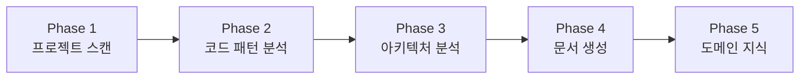

# /onboard - 프로젝트 온보딩

> **🚨 중요**: 문서, 코드, 기타 확인 및 검증이 필요한 부분은 **전부 에이전트 사용 필수**. 에이전트를 적극 활용하고, 파일이 크면 분할해서 읽어라.

## 설명

기존 프로젝트를 **체계적으로 분석**하여 AI가 효과적으로 개발을 이어나갈 수 있도록 컨텍스트 문서를 생성합니다.

**C4 Model 기반** 아키텍처 문서화와 **Docs-as-Code** 원칙을 적용합니다.

## 사용법

```bash
/onboard                 # 전체 온보딩 (5개 문서 생성)
/onboard --skip-domain   # 도메인 지식 단계 건너뛰기
```

---

## 온보딩 프로세스 개요



---

## Phase 실행

### Phase 1-2: Discovery + Pattern
**상세**: `commands/onboard-phases/01-discovery.md`

- 설정 파일 분석 (package.json, tsconfig.json)
- 기술 스택 식별 (Frontend, Backend, Database, Infra)
- 디렉토리 구조 매핑
- 대표 파일 선정 및 패턴 추출
- Import 순서 분석

### Phase 3: Architecture (C4 Model)
**상세**: `commands/onboard-phases/02-architecture.md`

- System Context (Level 1)
- Container Diagram (Level 2)
- Component Diagram (Level 3)
- 의존성 분석

### Phase 4: Context Generation
**상세**: `commands/onboard-phases/03-context-gen.md`

생성 문서:
- `PROJECT_SUMMARY.md` - 프로젝트 개요, 기술 스택, 명령어
- `ARCHITECTURE.md` - C4 다이어그램, 레이어 구조, ADR
- `CODE_PATTERNS.md` - 컴포넌트/API/훅/에러 패턴
- `CONVENTIONS.md` - 명명 규칙, Import 순서, Git 규칙

### Phase 5: Domain Knowledge
**상세**: `commands/onboard-phases/04-domain.md`

- 비즈니스 도메인 인터뷰
- 엔티티, 값 객체, 비즈니스 규칙
- 도메인 용어 사전
- `--skip-domain` 옵션으로 건너뛰기 가능

---

## 실행 순서

1. **Phase 1-2 실행** → `01-discovery.md` 참조
2. **Phase 3 실행** → `02-architecture.md` 참조
3. **Phase 4 실행** → `03-context-gen.md` 참조
4. **Phase 5 실행** (선택) → `04-domain.md` 참조

각 Phase는 해당 파일의 상세 지침을 따릅니다.

---

## 생성 결과

```
📁 생성된 컨텍스트 문서:
├── .claude/project-context/PROJECT_SUMMARY.md
├── .claude/project-context/ARCHITECTURE.md
├── .claude/project-context/CODE_PATTERNS.md
├── .claude/project-context/CONVENTIONS.md
└── .claude/project-context/DOMAIN_KNOWLEDGE.md
```

## 다음 단계

| 명령어 | 설명 |
|--------|------|
| `/dev plan [아이디어]` | 새 기능 개발 시작 |
| `/learn <path>` | 특정 영역 심층 학습 |
| `/context-show` | 컨텍스트 확인 |

---

## 참조

- `skills/project-onboarding/SKILL.md`
- `.claude/best-practices/project-onboarding.md`
- [C4 Model](https://c4model.com/) - 아키텍처 문서화 표준
