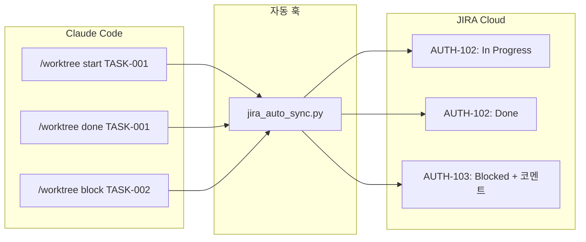

# JIRA Integration Skill

## 자동 활성화 조건

이 스킬은 다음 키워드가 감지되면 자동으로 활성화됩니다:
- "JIRA", "지라", "Jira"
- "이슈", "티켓", "issue", "ticket"
- "동기화", "sync", "연동"
- "프로젝트 관리", "진행 상황 공유"
- "관리자", "PM", "대시보드"

## 핵심 기능

### 1. Worktree ↔ JIRA 동기화

```
Worktree (로컬)          JIRA (원격)
┌──────────────┐        ┌──────────────┐
│ Epic         │ ←────→ │ Epic         │
│ └─ Story     │ ←────→ │ └─ Story     │
│    └─ Task   │ ←────→ │    └─ Task   │
└──────────────┘        └──────────────┘
```

### 2. 자동 상태 동기화

| Worktree 상태 | JIRA 상태 | 트리거 |
|--------------|-----------|--------|
| `pending` | To Do | 기본값 |
| `in_progress` | In Progress | `/worktree start` |
| `done` | Done | `/worktree done` |
| `blocked` | Blocked + 코멘트 | `/worktree block` |

### 3. 양방향 동기화

- **Push**: 개발자가 Worktree 변경 → JIRA 자동 업데이트
- **Pull**: 관리자가 JIRA 변경 → Worktree 반영

## 사용 가능한 명령어

| 명령어 | 설명 |
|--------|------|
| `/jira-init <project-key>` | JIRA 연동 초기화 |
| `/jira-push` | Worktree → JIRA 동기화 |
| `/jira-pull` | JIRA → Worktree 동기화 |
| `/jira-sync` | 양방향 동기화 |
| `/jira-link <id> <key>` | 수동 매핑 |
| `/jira-status` | 연동 상태 확인 |

## 설정 파일

### jira_config.json

```json
{
  "jira": {
    "enabled": true,
    "base_url": "https://company.atlassian.net",
    "project_key": "AUTH",
    "auto_sync": {
      "enabled": true,
      "on_task_start": true,
      "on_task_done": true,
      "on_blocker": true
    }
  }
}
```

### 환경변수

```bash
export JIRA_EMAIL='your-email@company.com'
export JIRA_API_TOKEN='your-api-token'
```

## Worktree 연계

### 자동 연동 플로우



### /dev tasks → JIRA 자동 생성

`/dev tasks` 실행 시:
1. `worktree.json` 자동 생성
2. JIRA 연동 활성화 시 → `/jira-push` 자동 실행 (옵션)

설정:
```json
{
  "worktree_integration": {
    "auto_create_on_dev_tasks": true
  }
}
```

## API 정보 (2025년 기준)

### 중요 변경사항

| 변경 | 기존 | 신규 |
|------|------|------|
| Epic 연결 | `epic-link` 필드 | `parent` 필드 |
| 검색 API | `/rest/api/3/search` | `/rest/api/3/search/jql` |
| Description | Plain text | ADF 형식 |

### REST API 엔드포인트

```
POST /rest/api/3/issue              # 이슈 생성
GET  /rest/api/3/issue/{key}        # 이슈 조회
PUT  /rest/api/3/issue/{key}        # 이슈 수정
POST /rest/api/3/issue/{key}/transitions  # 상태 전환
POST /rest/api/3/search/jql         # 이슈 검색 (신규)
```

## 에러 처리

| 에러 | 원인 | 해결 |
|------|------|------|
| 401 Unauthorized | API 토큰 오류 | 토큰 재생성 |
| 403 Forbidden | 권한 없음 | JIRA 관리자 문의 |
| 404 Not Found | 이슈/프로젝트 없음 | 키 확인 |
| 전환 실패 | 워크플로우 제한 | 가능한 전환 확인 |

## 참조 문서

- `.claude/integrations/jira_config.json` - 설정 파일
- `.claude/integrations/jira_connector.py` - API 커넥터
- `.claude-state/jira_mapping.json` - ID 매핑
- `.claude/hooks/jira_auto_sync.py` - 자동 동기화 훅
