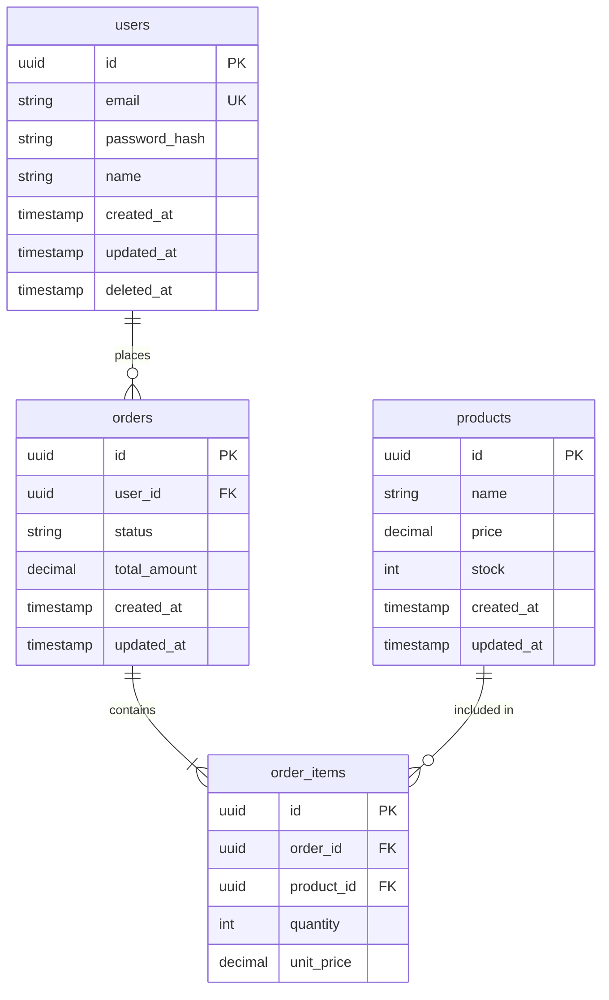

# Database 설계 베스트 프랙티스 (2025)

> 이 문서는 데이터베이스 스키마 설계 및 ERD 작성 시 **반드시** 참조해야 합니다.

---

## 1. 테이블 설계 원칙

### 1.1 필수 컬럼

모든 테이블에 다음 컬럼 포함:

```sql
CREATE TABLE users (
  id UUID PRIMARY KEY DEFAULT gen_random_uuid(),
  -- 비즈니스 컬럼들...
  created_at TIMESTAMP WITH TIME ZONE DEFAULT NOW() NOT NULL,
  updated_at TIMESTAMP WITH TIME ZONE DEFAULT NOW() NOT NULL,
  deleted_at TIMESTAMP WITH TIME ZONE  -- Soft Delete
);

-- updated_at 자동 갱신 트리거
CREATE OR REPLACE FUNCTION update_updated_at_column()
RETURNS TRIGGER AS $$
BEGIN
    NEW.updated_at = NOW();
    RETURN NEW;
END;
$$ language 'plpgsql';

CREATE TRIGGER update_users_updated_at
    BEFORE UPDATE ON users
    FOR EACH ROW
    EXECUTE FUNCTION update_updated_at_column();
```

### 1.2 네이밍 규칙

```
테이블명: snake_case, 복수형 (users, order_items)
컬럼명: snake_case (user_id, created_at)
PK: id (UUID 권장)
FK: {referenced_table_singular}_id (user_id, order_id)
인덱스: idx_{table}_{columns}
유니크 제약: uk_{table}_{columns}
```

### 1.3 UUID vs Auto-increment

```sql
-- UUID 사용 (권장)
id UUID PRIMARY KEY DEFAULT gen_random_uuid()

-- 이유:
-- 1. 분산 시스템에서 충돌 없음
-- 2. 보안 (순차 ID 추측 불가)
-- 3. 마이그레이션 시 충돌 없음
```

---

## 2. 정규화

### 최소 3NF 적용

```
1NF: 원자값, 중복 그룹 제거
     - 한 컬럼에 여러 값 저장 금지
     - 반복 컬럼 금지 (phone1, phone2 → phones 테이블)

2NF: 부분 함수 종속 제거
     - 복합 키의 일부에만 종속된 컬럼 분리

3NF: 이행 함수 종속 제거
     - A → B → C 관계에서 C는 별도 테이블로
```

### 역정규화 허용 조건

- 읽기 성능이 중요한 경우 (집계 테이블)
- 변경이 거의 없는 데이터 (캐시 컬럼)
- JOIN 비용이 매우 높은 경우

```sql
-- 역정규화 예시: 주문에 사용자 이름 저장
CREATE TABLE orders (
  id UUID PRIMARY KEY,
  user_id UUID REFERENCES users(id),
  user_name VARCHAR(100), -- 역정규화: 조회 성능
  -- ...
);
```

---

## 3. 인덱스 전략

### 인덱스 생성 기준

```sql
-- 1. 외래 키 (필수)
CREATE INDEX idx_orders_user_id ON orders(user_id);

-- 2. WHERE 절 자주 사용
CREATE INDEX idx_users_email ON users(email);
CREATE INDEX idx_orders_status ON orders(status);

-- 3. 정렬 컬럼
CREATE INDEX idx_posts_created_at ON posts(created_at DESC);

-- 4. 복합 인덱스 (순서 중요)
CREATE INDEX idx_orders_user_status ON orders(user_id, status);
-- user_id만 검색 OK, status만 검색 X

-- 5. 부분 인덱스 (조건부)
CREATE INDEX idx_orders_pending
ON orders(created_at)
WHERE status = 'pending';
```

### 인덱스 피해야 할 경우

```
- 자주 변경되는 컬럼
- 카디널리티 낮은 컬럼 (boolean, status 등은 부분 인덱스로)
- 작은 테이블 (1000행 미만)
- TEXT/BLOB 컬럼 (Full-text 검색 사용)
```

---

## 4. 관계 설계

### 1:1 관계

```sql
-- 선택적 1:1 (별도 테이블)
CREATE TABLE users (
  id UUID PRIMARY KEY
);

CREATE TABLE user_profiles (
  user_id UUID PRIMARY KEY REFERENCES users(id),
  bio TEXT,
  avatar_url VARCHAR(255)
);
```

### 1:N 관계

```sql
CREATE TABLE orders (
  id UUID PRIMARY KEY,
  user_id UUID NOT NULL REFERENCES users(id),
  -- ON DELETE 전략 결정 필요
  -- CASCADE: 부모 삭제 시 자식도 삭제
  -- SET NULL: 부모 삭제 시 NULL
  -- RESTRICT: 부모 삭제 방지
);

CREATE INDEX idx_orders_user_id ON orders(user_id);
```

### N:M 관계

```sql
-- 중간 테이블 사용
CREATE TABLE user_roles (
  user_id UUID REFERENCES users(id) ON DELETE CASCADE,
  role_id UUID REFERENCES roles(id) ON DELETE CASCADE,
  assigned_at TIMESTAMP DEFAULT NOW(),
  assigned_by UUID REFERENCES users(id),
  PRIMARY KEY (user_id, role_id)
);

CREATE INDEX idx_user_roles_role_id ON user_roles(role_id);
```

---

## 5. Soft Delete

### 구현 방법

```sql
-- deleted_at 컬럼 사용
CREATE TABLE users (
  id UUID PRIMARY KEY,
  email VARCHAR(255) NOT NULL,
  deleted_at TIMESTAMP WITH TIME ZONE
);

-- 조회 시 deleted_at IS NULL 필터
CREATE INDEX idx_users_active ON users(id) WHERE deleted_at IS NULL;

-- 유니크 제약은 부분 인덱스로
CREATE UNIQUE INDEX uk_users_email_active
ON users(email)
WHERE deleted_at IS NULL;
```

### Prisma Soft Delete 미들웨어

```typescript
prisma.$use(async (params, next) => {
  // find 쿼리 시 deleted_at IS NULL 자동 추가
  if (params.action === 'findMany' || params.action === 'findFirst') {
    params.args.where = {
      ...params.args.where,
      deletedAt: null,
    };
  }

  // delete를 update로 변환
  if (params.action === 'delete') {
    params.action = 'update';
    params.args.data = { deletedAt: new Date() };
  }

  return next(params);
});
```

---

## 6. ERD 작성 규칙

### Mermaid 형식



### 관계 표기법

```
||--|| : 1:1 (필수)
||--o| : 1:1 (선택)
||--o{ : 1:N
}o--o{ : N:M
```

---

## 7. Prisma 스키마 예시

```prisma
model User {
  id           String    @id @default(uuid())
  email        String    @unique
  passwordHash String    @map("password_hash")
  name         String?
  createdAt    DateTime  @default(now()) @map("created_at")
  updatedAt    DateTime  @updatedAt @map("updated_at")
  deletedAt    DateTime? @map("deleted_at")

  orders       Order[]
  profile      UserProfile?

  @@index([email])
  @@map("users")
}

model Order {
  id          String      @id @default(uuid())
  userId      String      @map("user_id")
  status      OrderStatus @default(PENDING)
  totalAmount Decimal     @map("total_amount") @db.Decimal(10, 2)
  createdAt   DateTime    @default(now()) @map("created_at")
  updatedAt   DateTime    @updatedAt @map("updated_at")

  user        User        @relation(fields: [userId], references: [id])
  items       OrderItem[]

  @@index([userId])
  @@index([status])
  @@map("orders")
}

enum OrderStatus {
  PENDING
  CONFIRMED
  SHIPPED
  DELIVERED
  CANCELLED
}
```

---

## 8. 금지 사항

- [ ] Auto-increment ID (분산 시스템 불가)
- [ ] 물리적 삭제 (Soft Delete 사용)
- [ ] created_at, updated_at 누락
- [ ] 외래 키 인덱스 누락
- [ ] TEXT 컬럼에 일반 인덱스
- [ ] 과도한 역정규화
- [ ] 한 컬럼에 여러 값 저장 (CSV)

---

## 9. 체크리스트

스키마 설계 시 확인:

- [ ] UUID 사용
- [ ] created_at, updated_at, deleted_at 포함
- [ ] snake_case 네이밍
- [ ] FK에 인덱스 생성
- [ ] Soft Delete 적용
- [ ] 3NF 정규화
- [ ] 유니크 제약 설정
