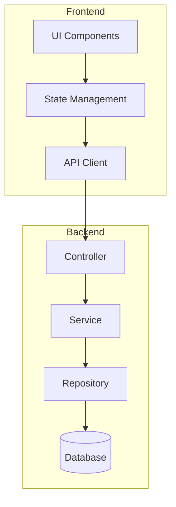

# 아키텍처 설계

## 목적

PRD를 기반으로 시스템 아키텍처를 설계하고, 기술적 구현 방향을 결정합니다.

## 실행 절차

### Step 1: 컨텍스트 로드

```
1. .claude/memory/CURRENT_CONTEXT.md - 현재 작업 상태
2. docs/prd/{feature}/prd.md - PRD 문서
3. .claude/memory/TECH_STACK.md - 기술 스택
4. .claude/best-practices/ - 베스트 프랙티스
```

### Step 2: 시스템 아키텍처 설계

#### 2.1 컴포넌트 구조



#### 2.2 데이터 흐름

```
1. 사용자 요청 → Frontend
2. Frontend → API Gateway → Backend
3. Backend → Database
4. 응답 반환
```

#### 2.3 디렉토리 구조 (Feature-based)

```
src/
├── features/
│   └── {feature-name}/
│       ├── components/
│       ├── hooks/
│       ├── services/
│       ├── types/
│       └── index.ts
├── shared/
│   ├── components/
│   ├── hooks/
│   └── utils/
└── app/
```

### Step 3: 기술 결정

TECH_STACK.md와 베스트 프랙티스를 기반으로:

#### Frontend
- 컴포넌트 패턴: Function Components + Custom Hooks
- 상태 관리: 선택 (React Query / Zustand / Context)
- 스타일링: Tailwind CSS

#### Backend
- 아키텍처: Layered (Controller → Service → Repository)
- 에러 처리: 중앙화된 에러 핸들러
- 로깅: 구조화된 로깅

### Step 4: 아키텍처 문서 작성

`docs/architecture/system-architecture.md` 작성:

```markdown
# 시스템 아키텍처: {기능명}

**작성일**: {날짜}

---

## 1. 개요

### 1.1 목적
{아키텍처 목적}

### 1.2 범위
{포함/제외 범위}

---

## 2. 아키텍처 다이어그램

### 2.1 시스템 구조

\`\`\`mermaid
graph TB
    ...
\`\`\`

### 2.2 컴포넌트 다이어그램

\`\`\`mermaid
graph LR
    ...
\`\`\`

---

## 3. 컴포넌트 설명

### 3.1 Frontend

| 컴포넌트 | 책임 | 기술 |
|---------|------|------|
| {컴포넌트} | {책임} | {기술} |

### 3.2 Backend

| 레이어 | 책임 | 기술 |
|--------|------|------|
| Controller | HTTP 처리 | Express/Fastify |
| Service | 비즈니스 로직 | TypeScript |
| Repository | 데이터 접근 | Prisma |

---

## 4. 데이터 흐름

### 4.1 주요 흐름

\`\`\`
1. 사용자 액션 → Component
2. Component → Custom Hook
3. Hook → API Client → Backend
4. Backend → Database
5. 응답 → State Update → UI Render
\`\`\`

---

## 5. 기술 결정

### 5.1 선택한 기술

| 영역 | 기술 | 이유 |
|------|------|------|
| {영역} | {기술} | {선택 이유} |

### 5.2 적용할 베스트 프랙티스

- React: `.claude/best-practices/react.md`
- Node.js: `.claude/best-practices/nodejs.md`

---

## 6. 보안 고려사항

- [ ] 인증/인가 방식
- [ ] 입력 검증
- [ ] 민감 데이터 암호화

---

*다음 단계: /dev-erd*
```

### Step 5: 상태 업데이트

`.claude/memory/CURRENT_CONTEXT.md` 업데이트

### Step 6: 완료 보고

```
============================================
[ARCHITECTURE] 아키텍처 설계 완료
============================================

 기능: {feature-name}
 생성된 문서: docs/architecture/system-architecture.md

 아키텍처 요약:
• 프론트엔드: React + TypeScript
• 백엔드: Node.js + Express
• 데이터베이스: PostgreSQL

 적용 베스트 프랙티스:
• Feature-based Directory Structure
• Layered Architecture
• Custom Hooks Pattern

 다음 단계: /dev-erd

============================================
```

## 참조 파일

- `.claude/memory/TECH_STACK.md` - 기술 스택
- `.claude/best-practices/` - 베스트 프랙티스
- `docs/prd/{feature}/prd.md` - PRD 문서
