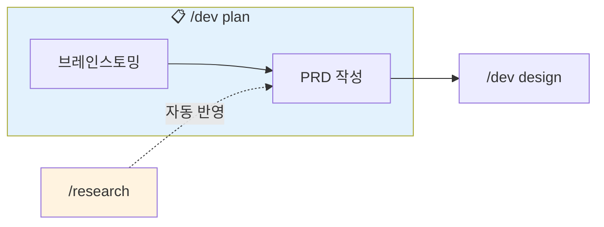

# 기획 (Plan)

## 목적

아이디어를 체계적으로 정리하고 요구사항 문서(PRD)를 작성합니다.

## 워크플로우



**자동 연계:**
- `/research` 결과가 있으면 PRD 작성 시 자동 참조
- 완료 후 `/dev design` 으로 자연스럽게 이어짐

## 옵션

| 옵션 | 설명 |
|------|------|
| (기본) | brainstorm + prd 순차 실행 |
| `--brainstorm` | 브레인스토밍만 실행 |
| `--prd` | PRD 작성만 실행 |

## 실행 절차

### Step 1: 옵션 확인

$ARGUMENTS에서 옵션 확인:
- `--brainstorm`: Phase 1만 실행
- `--prd`: Phase 2만 실행
- 옵션 없음: Phase 1 → Phase 2 순차 실행

---

## Phase 1: 브레인스토밍

### 1.1 아이디어 수집

$ARGUMENTS에서 아이디어를 파악하거나 질문:

```
무엇을 만들고 싶으신가요?
```

### 1.2 브레인스토밍 질문

#### 문제 정의
```
Q1. 어떤 문제를 해결하려고 하나요?
Q2. 현재 이 문제는 어떻게 해결되고 있나요?
Q3. 현재 솔루션의 문제점은 무엇인가요?
```

#### 타겟 사용자
```
Q4. 이 기능을 누가 사용하나요?
Q5. 사용자의 주요 니즈는 무엇인가요?
```

#### 범위 정의
```
Q6. 반드시 포함해야 할 기능은? (Must-have)
Q7. 이번에 포함하지 않을 기능은? (Out of scope)
```

### 1.3 브레인스토밍 문서 작성

`docs/prd/{feature-name}/brainstorm.md` 생성

```
============================================
[PLAN] Phase 1 완료: 브레인스토밍
============================================

 기능: {feature-name}
 문서: docs/prd/{feature-name}/brainstorm.md

 요약:
• 문제: {문제 요약}
• 타겟: {타겟 사용자}
• 핵심 가치: {핵심 가치}

============================================
```

---

## Phase 2: PRD 작성

### 2.1 컨텍스트 로드

```
1. docs/prd/{feature}/brainstorm.md - 브레인스토밍 결과
2. .claude/templates/prd-template.md - PRD 템플릿
3. .claude/research/{관련주제}/ - 관련 리서치 (있는 경우)
```

### 2.2 리서치 결과 자동 통합

`.claude/research/` 디렉토리에서 관련 리서치 검색 후 자동 반영

### 2.3 PRD 작성

다음 섹션 포함:

1. **배경 및 목적**
2. **목표 및 비목표**
3. **사용자 스토리**
4. **기능 요구사항** (우선순위: P0/P1/P2)
5. **비기능 요구사항**
6. **성공 지표 (KPIs)**

### 2.4 PRD 문서 저장

`docs/prd/{feature-name}/prd.md` 생성

---

## 완료 보고

```
============================================
[PLAN] 기획 완료
============================================

 기능: {feature-name}

 생성된 문서:
• docs/prd/{feature-name}/brainstorm.md
• docs/prd/{feature-name}/prd.md

 요약:
• 목표: {n}개
• 기능 요구사항: {n}개 (P0: {n}, P1: {n}, P2: {n})
• 사용자 스토리: {n}개

 다음 단계: /dev design

============================================
```

## 상태 업데이트

`.claude/memory/CURRENT_CONTEXT.md` 업데이트:

```markdown
## 워크플로우 상태

- **현재 기능**: {feature-name}
- **현재 단계**: Plan 완료
- **다음 단계**: Design
```

## 참조 파일

- `.claude/templates/prd-template.md` - PRD 템플릿
- `.claude/research/` - 리서치 결과
