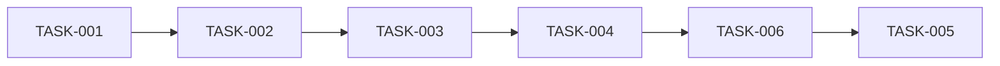

# 태스크 분해

## 목적

PRD와 아키텍처 문서를 기반으로 구현 가능한 태스크로 분해합니다.

## 실행 절차

### Step 1: 컨텍스트 로드

```
1. .claude/memory/CURRENT_CONTEXT.md - 현재 작업 상태
2. docs/prd/{feature}/prd.md - PRD 문서
3. docs/architecture/system-architecture.md - 아키텍처 문서
4. docs/architecture/erd.md - ERD 문서
```

### Step 2: 에픽 정의

PRD의 기능 요구사항을 에픽으로 그룹화:

```
Epic 1: 사용자 인증
Epic 2: 상품 관리
Epic 3: 주문 처리
```

### Step 3: 스토리 분해

각 에픽을 사용자 스토리로 분해:

```
Epic 1: 사용자 인증
├── Story 1.1: 회원가입
├── Story 1.2: 로그인
├── Story 1.3: 로그아웃
└── Story 1.4: 비밀번호 재설정
```

### Step 4: 태스크 분해

각 스토리를 구현 태스크로 분해:

```
Story 1.1: 회원가입
├── TASK-001: User 테이블 마이그레이션
├── TASK-002: RegisterDto 정의
├── TASK-003: AuthService.register() 구현
├── TASK-004: AuthController POST /auth/register 구현
├── TASK-005: 회원가입 폼 컴포넌트 구현
├── TASK-006: useRegister 커스텀 훅 구현
└── TASK-007: 회원가입 유닛 테스트 작성
```

### Step 5: 의존성 분석



### Step 6: 우선순위 결정

```
P0 (Critical): 기능의 핵심, 즉시 필요
P1 (High): 중요하지만 조금 미룰 수 있음
P2 (Medium): 있으면 좋음
P3 (Low): 나중에 해도 됨
```

### Step 7: 태스크 문서 작성

`docs/tasks/{feature-name}/tasks.md` 작성:

```markdown
# 태스크 목록: {기능명}

**작성일**: {날짜}
**총 태스크**: {n}개

---

## 요약

| 우선순위 | 개수 |
|---------|------|
| P0 (Critical) | {n} |
| P1 (High) | {n} |
| P2 (Medium) | {n} |
| P3 (Low) | {n} |

---

## Epic 1: {에픽명}

### Story 1.1: {스토리명}

| ID | 태스크 | 우선순위 | 의존성 | 상태 |
|----|--------|---------|--------|------|
| TASK-001 | User 테이블 마이그레이션 | P0 | - | TODO |
| TASK-002 | RegisterDto 정의 | P0 | TASK-001 | TODO |
| TASK-003 | AuthService.register() 구현 | P0 | TASK-002 | TODO |
| TASK-004 | AuthController 구현 | P0 | TASK-003 | TODO |
| TASK-005 | 회원가입 폼 컴포넌트 | P1 | TASK-004 | TODO |
| TASK-006 | useRegister 훅 구현 | P1 | TASK-004 | TODO |
| TASK-007 | 유닛 테스트 작성 | P2 | TASK-003,004 | TODO |

#### TASK-001: User 테이블 마이그레이션

**설명**: Prisma 스키마에 User 모델 정의 및 마이그레이션 실행

**Acceptance Criteria**:
- [ ] User 모델 정의 완료
- [ ] 마이그레이션 파일 생성
- [ ] 마이그레이션 실행 성공

**참조**:
- `docs/architecture/erd.md`

---

## Epic 2: {에픽명}

...

---

## 의존성 다이어그램

\`\`\`mermaid
graph TD
    T001 --> T002
    T002 --> T003
    T003 --> T004
    T004 --> T005
    T004 --> T006
    T003 --> T007
    T004 --> T007
\`\`\`

---

## 구현 순서 권장

1. **Phase 1: Database & Types**
   - TASK-001, TASK-002

2. **Phase 2: Backend**
   - TASK-003, TASK-004

3. **Phase 3: Frontend**
   - TASK-005, TASK-006

4. **Phase 4: Testing**
   - TASK-007

---

*구현 시작: /dev-implement TASK-001*
```

### Step 8: Worktree 생성

태스크 분해 완료 시 `.claude-state/worktree.json` 자동 생성:

```json
{
  "project": "{feature-name}",
  "created_at": "2024-01-15T09:00:00Z",
  "updated_at": "2024-01-15T09:00:00Z",
  "current_task": "TASK-001",
  "progress": {
    "total": 10,
    "done": 0,
    "in_progress": 0,
    "blocked": 0,
    "pending": 10,
    "percentage": 0
  },
  "epics": [
    {
      "id": "EPIC-1",
      "name": "사용자 인증",
      "stories": [
        {
          "id": "STORY-1.1",
          "name": "회원가입",
          "tasks": [
            {
              "id": "TASK-001",
              "name": "User 테이블 마이그레이션",
              "priority": "P0",
              "status": "pending",
              "dependencies": []
            }
          ]
        }
      ]
    }
  ],
  "blockers": [],
  "daily_log": []
}
```

### Step 9: 상태 업데이트

`.claude/memory/CURRENT_CONTEXT.md` 업데이트:

```markdown
## 워크플로우 상태

- **현재 기능**: {feature-name}
- **현재 단계**: Phase 4 완료 (Task Planning)
- **다음 단계**: Phase 5 (Implementation)

## 생성된 문서

- [x] brainstorm.md
- [x] prd.md
- [x] architecture.md
- [x] erd.md
- [x] tasks.md
```

### Step 9: 완료 보고

```
============================================
[TASKS] 태스크 분해 완료
============================================

 기능: {feature-name}
 생성된 문서: docs/tasks/{feature-name}/tasks.md

 태스크 요약:
• 총 태스크: {n}개
• P0 (Critical): {n}개
• P1 (High): {n}개
• P2 (Medium): {n}개

 구현 순서:
1. Database & Types
2. Backend Services
3. Frontend Components
4. Testing

 다음 단계: /dev-implement TASK-001

============================================
```

## 참조 파일

- `docs/prd/{feature}/prd.md` - PRD 문서
- `docs/architecture/` - 아키텍처 문서
