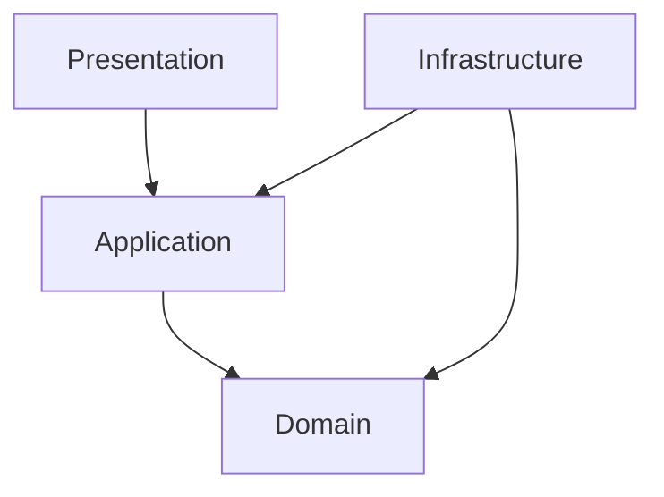

# 아키텍처 분석

> 이 문서는 `/onboard` 명령어로 자동 생성됩니다.

---

## 아키텍처 개요

```
{아키텍처 다이어그램}
```

---

## 레이어 구조

### 1. Presentation Layer

```
{프레젠테이션 레이어 구조}
```

**역할**: {역할 설명}

### 2. Application Layer

```
{애플리케이션 레이어 구조}
```

**역할**: {역할 설명}

### 3. Domain Layer

```
{도메인 레이어 구조}
```

**역할**: {역할 설명}

### 4. Infrastructure Layer

```
{인프라 레이어 구조}
```

**역할**: {역할 설명}

---

## 모듈 의존성



---

## 데이터 흐름

### API 요청 처리

```
Request → Controller → UseCase → Repository → Database
                  ↓
Response ← Presenter ← Entity ← Model ←
```

### 상태 관리

| 구분 | 방식 | 위치 |
|------|------|------|
| 서버 상태 | {방식} | {위치} |
| 클라이언트 상태 | {방식} | {위치} |
| 폼 상태 | {방식} | {위치} |

---

## 핵심 모듈

### {모듈1}

| 항목 | 내용 |
|------|------|
| 경로 | {경로} |
| 역할 | {역할} |
| 의존성 | {의존성} |

### {모듈2}

| 항목 | 내용 |
|------|------|
| 경로 | {경로} |
| 역할 | {역할} |
| 의존성 | {의존성} |

---

## 외부 서비스 연동

| 서비스 | 용도 | 연동 방식 |
|--------|------|----------|
| {서비스1} | {용도} | {방식} |
| {서비스2} | {용도} | {방식} |

---

*이 문서는 /onboard 명령어로 자동 생성되었습니다.*
*갱신: /context-refresh*
