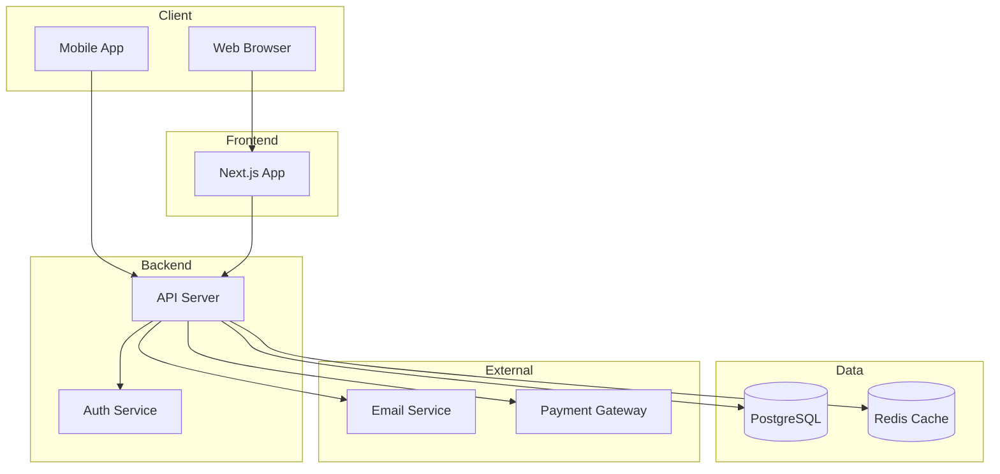
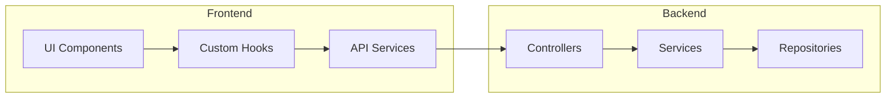

# 시스템 아키텍처: {기능명}

## 문서 정보

| 항목 | 내용 |
|------|------|
| 작성자 | {작성자} |
| 작성일 | {날짜} |
| 버전 | 1.0 |

---

## 1. 개요

### 1.1 목적

{이 아키텍처 문서의 목적}

### 1.2 범위

**포함**:
- {포함 항목 1}
- {포함 항목 2}

**제외**:
- {제외 항목 1}

---

## 2. 시스템 아키텍처

### 2.1 시스템 구조



### 2.2 컴포넌트 다이어그램



---

## 3. 컴포넌트 설명

### 3.1 Frontend

| 컴포넌트 | 책임 | 기술 |
|---------|------|------|
| UI Components | 사용자 인터페이스 렌더링 | React + Tailwind |
| Custom Hooks | 비즈니스 로직 캡슐화 | React Hooks |
| API Services | 백엔드 API 통신 | Axios / Fetch |
| State Management | 전역 상태 관리 | Zustand / React Query |

### 3.2 Backend

| 레이어 | 책임 | 기술 |
|--------|------|------|
| Controller | HTTP 요청/응답 처리 | Express / Fastify |
| Service | 비즈니스 로직 | TypeScript |
| Repository | 데이터 접근 | Prisma |

### 3.3 데이터베이스

| 저장소 | 용도 | 기술 |
|--------|------|------|
| Primary DB | 영속 데이터 저장 | PostgreSQL |
| Cache | 세션, 임시 데이터 | Redis |

---

## 4. 데이터 흐름

### 4.1 읽기 작업 (Read)

```
1. 사용자 액션 → UI Component
2. Component → Custom Hook (useQuery)
3. Hook → API Service
4. API Service → HTTP Request
5. Controller → Service → Repository
6. Repository → Database
7. 응답 반환 → UI 렌더링
```

### 4.2 쓰기 작업 (Write)

```
1. 사용자 입력 → Form Component
2. Form Submit → Custom Hook (useMutation)
3. Hook → API Service
4. Controller → Validation → Service
5. Service → Business Logic → Repository
6. Repository → Database
7. 캐시 무효화 → UI 업데이트
```

---

## 5. 기술 스택

### 5.1 선택한 기술

| 영역 | 기술 | 버전 | 선택 이유 |
|------|------|------|----------|
| Frontend | Next.js | 14+ | SSR, App Router |
| Language | TypeScript | 5+ | 타입 안전성 |
| Styling | Tailwind CSS | 3+ | 유틸리티 우선 |
| Backend | Node.js | 20+ | LTS, 성능 |
| ORM | Prisma | 5+ | 타입 안전성, 마이그레이션 |
| Database | PostgreSQL | 15+ | ACID, JSON 지원 |
| Cache | Redis | 7+ | 세션, 캐싱 |

### 5.2 적용할 베스트 프랙티스

- `.claude/best-practices/react.md`
- `.claude/best-practices/nodejs.md`
- `.claude/best-practices/typescript.md`
- `.claude/best-practices/database.md`

---

## 6. 디렉토리 구조

```
src/
├── features/
│   └── {feature-name}/
│       ├── components/
│       ├── hooks/
│       ├── services/
│       ├── types/
│       └── index.ts
├── shared/
│   ├── components/
│   ├── hooks/
│   ├── utils/
│   └── types/
├── app/                    # Next.js App Router
│   ├── api/
│   ├── (auth)/
│   └── layout.tsx
└── lib/
    ├── prisma.ts
    └── redis.ts
```

---

## 7. API 설계

### 7.1 엔드포인트 목록

| Method | Endpoint | 설명 |
|--------|----------|------|
| GET | /api/{resource} | 목록 조회 |
| GET | /api/{resource}/{id} | 상세 조회 |
| POST | /api/{resource} | 생성 |
| PUT | /api/{resource}/{id} | 전체 수정 |
| PATCH | /api/{resource}/{id} | 부분 수정 |
| DELETE | /api/{resource}/{id} | 삭제 |

### 7.2 상세 스펙

`docs/architecture/api-spec.md` 참조

---

## 8. 보안 고려사항

### 8.1 인증/인가

- [ ] JWT 기반 인증
- [ ] Role-based Access Control (RBAC)
- [ ] Refresh Token 구현

### 8.2 데이터 보안

- [ ] 비밀번호 bcrypt 해싱
- [ ] 민감 데이터 암호화
- [ ] SQL Injection 방지 (Prisma)
- [ ] XSS 방지

### 8.3 인프라 보안

- [ ] HTTPS 적용
- [ ] Rate Limiting
- [ ] CORS 설정

---

## 9. 확장성 고려

### 9.1 수평 확장

- Stateless 서버 설계
- 세션은 Redis에 저장
- 로드 밸런서 사용

### 9.2 성능 최적화

- DB 인덱스 최적화
- Redis 캐싱
- CDN 활용

---

## 10. 모니터링

### 10.1 로깅

- 구조화된 로깅 (JSON)
- 로그 레벨: info, warn, error

### 10.2 메트릭

- 응답 시간
- 에러율
- CPU/메모리 사용량

---

*다음 단계: /dev design --erd*
