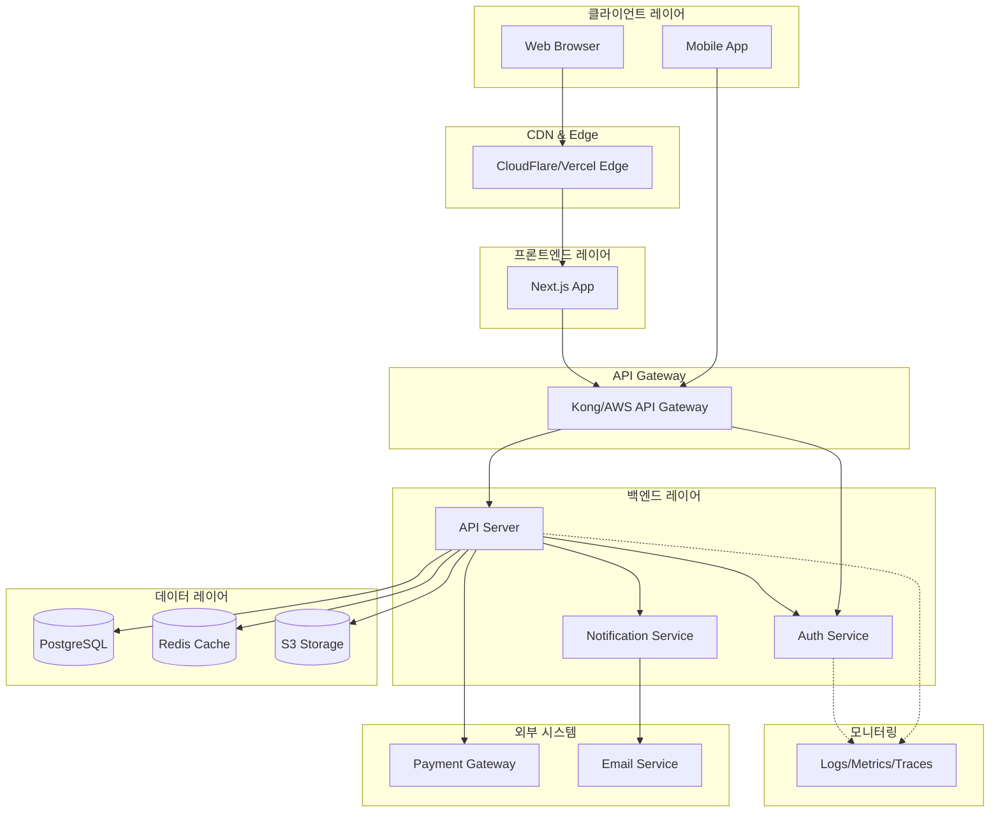
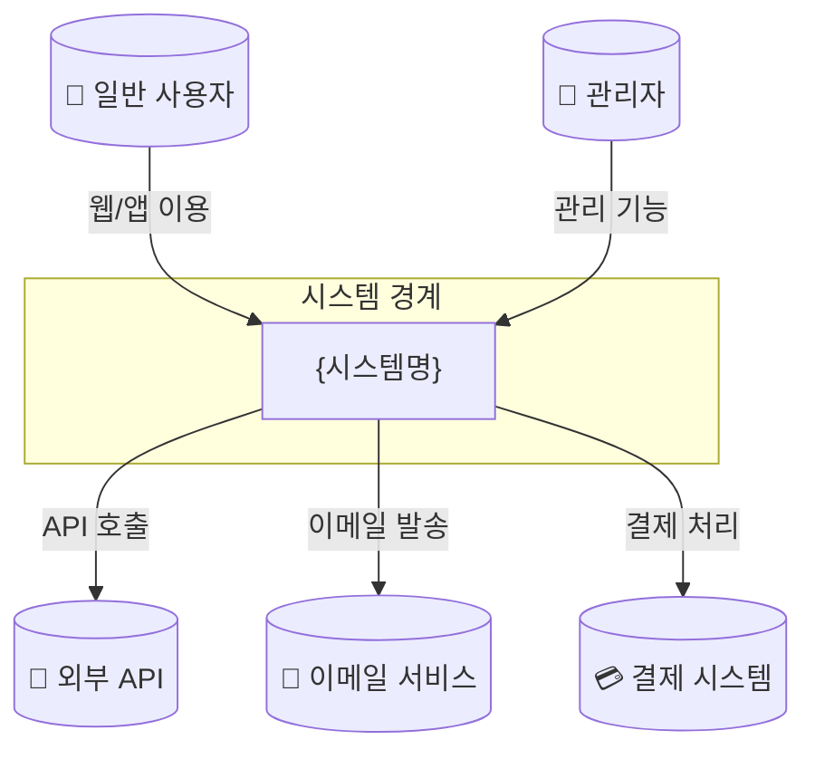
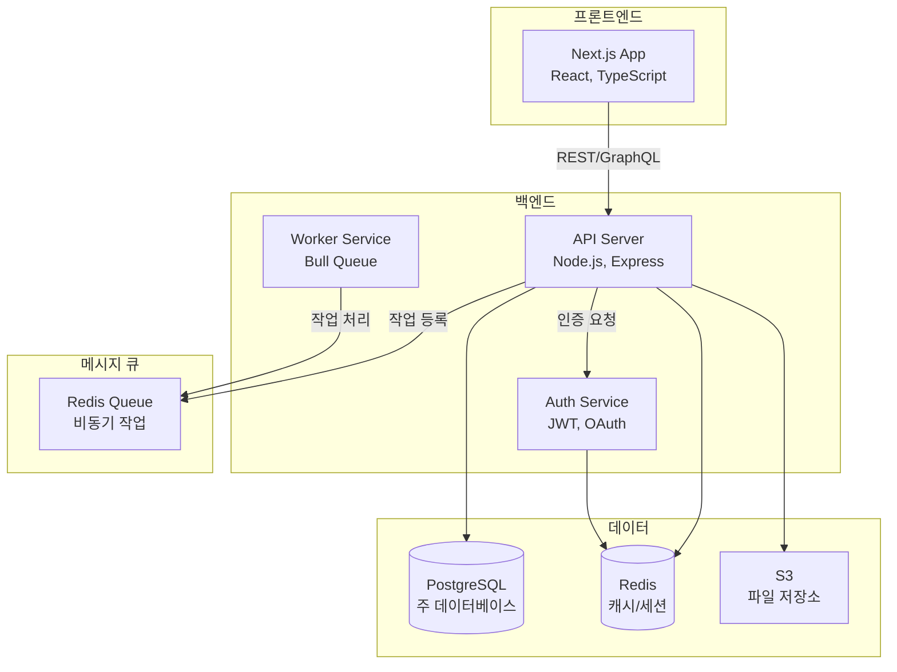
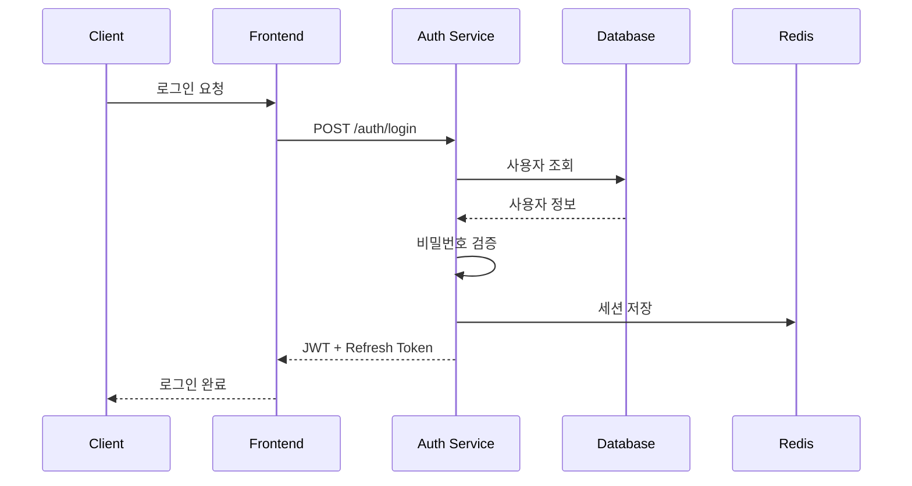
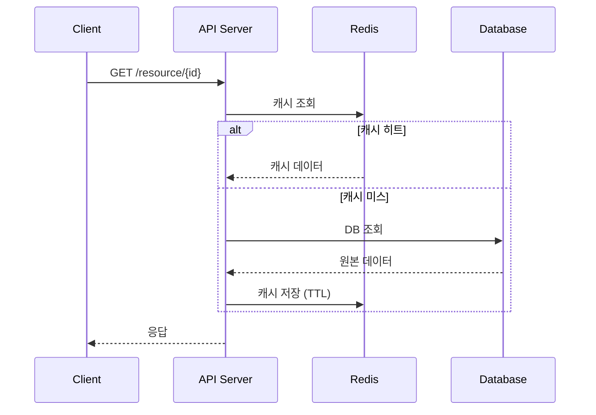
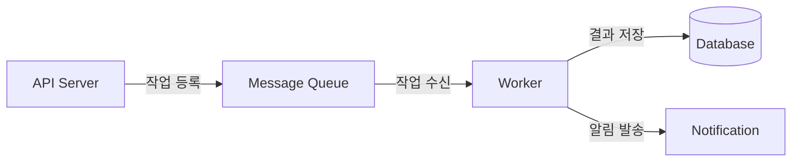
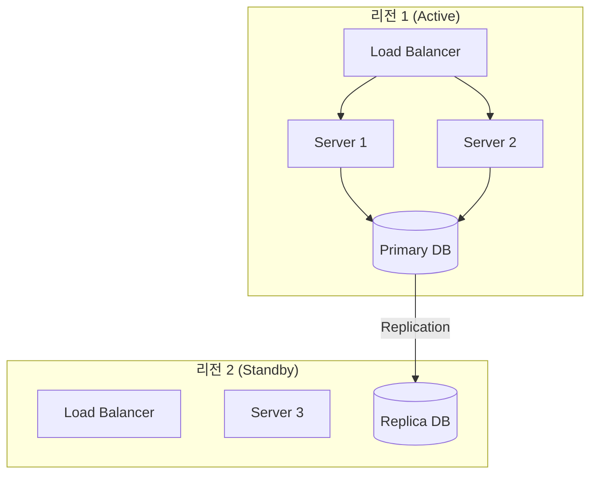

# 시스템 아키텍처: {기능명}

## 문서 정보

| 항목 | 내용 |
|------|------|
| 작성자 | {작성자} |
| 작성일 | {날짜} |
| 버전 | 1.0 |
| 관련 PRD | {PRD 링크} |
| 상태 | Draft / Review / Approved |

---

## 1. 개요

### 1.1 Executive Summary

> **한 줄 요약**: {이 시스템이 무엇을 하는지 간단히}

**핵심 특징**:
- {특징 1}
- {특징 2}
- {특징 3}

### 1.2 목적

{이 아키텍처 문서의 목적}

### 1.3 범위

**포함 (In Scope)**:
- {포함 항목 1}
- {포함 항목 2}

**제외 (Out of Scope)**:
- {제외 항목 1}
- {제외 항목 2}

### 1.4 용어 정의

| 용어 | 정의 |
|------|------|
| {용어 1} | {정의} |
| {용어 2} | {정의} |

---

## 2. 아키텍처 원칙 & 제약사항

### 2.1 아키텍처 원칙

| 원칙 | 설명 | 적용 예시 |
|------|------|----------|
| **Separation of Concerns** | 관심사 분리 | 레이어별 책임 분리 |
| **Single Responsibility** | 단일 책임 | 마이크로서비스 분리 |
| **Fail-Fast** | 빠른 실패 | 입력 검증 우선 |
| **Defense in Depth** | 다층 방어 | 인증 + 인가 + 암호화 |

### 2.2 제약사항 (Constraints)

| 유형 | 제약 | 영향 |
|------|------|------|
| 기술 | {기술 제약} | {영향} |
| 비즈니스 | {비즈니스 제약} | {영향} |
| 규정 | {규정 제약: GDPR 등} | {영향} |
| 인프라 | {인프라 제약} | {영향} |

### 2.3 품질 속성 요구사항 (Quality Attributes)

| 속성 | 요구사항 | 측정 방법 | 우선순위 |
|------|---------|----------|---------|
| **성능** | P95 응답시간 < 200ms | APM | P0 |
| **확장성** | 수평 확장 가능 | 부하 테스트 | P0 |
| **가용성** | 99.9% Uptime | 모니터링 | P0 |
| **보안** | OWASP Top 10 대응 | 보안 감사 | P0 |
| **유지보수성** | 변경 영향 범위 최소화 | 코드 리뷰 | P1 |

---

## 3. 시스템 아키텍처

### 3.1 High-Level Architecture



### 3.2 Context Diagram (C4 Level 1)



### 3.3 Container Diagram (C4 Level 2)



---

## 4. 컴포넌트 상세

### 4.1 Frontend Layer

| 컴포넌트 | 책임 | 기술 스택 | 주요 패턴 |
|---------|------|----------|----------|
| **UI Components** | 화면 렌더링 | React + Tailwind | Compound Components |
| **State Management** | 전역 상태 관리 | Zustand / React Query | Query Invalidation |
| **API Client** | 서버 통신 | Axios + SWR | Retry with Backoff |
| **Auth Provider** | 인증 상태 | NextAuth.js | Session-based |

### 4.2 Backend Layer

| 컴포넌트 | 책임 | 기술 스택 | 주요 패턴 |
|---------|------|----------|----------|
| **API Server** | HTTP 요청 처리 | Express / Fastify | Controller-Service-Repository |
| **Auth Service** | 인증/인가 | JWT + OAuth2 | Strategy Pattern |
| **Worker Service** | 비동기 작업 | Bull Queue | Pub/Sub |
| **Notification** | 알림 발송 | Nodemailer + FCM | Event-driven |

### 4.3 Data Layer

| 저장소 | 용도 | 기술 | 특징 |
|--------|------|------|------|
| **Primary DB** | 영속 데이터 | PostgreSQL | ACID, JSON 지원 |
| **Cache** | 읽기 캐시, 세션 | Redis | TTL, Pub/Sub |
| **Object Storage** | 파일 저장 | S3 / MinIO | CDN 연동 |
| **Search Engine** | 전문 검색 | Elasticsearch | Full-text search |

---

## 5. 데이터 흐름

### 5.1 주요 시나리오별 데이터 흐름

#### 시나리오 1: 사용자 인증



#### 시나리오 2: 데이터 조회 (캐시 포함)



### 5.2 비동기 처리 흐름



---

## 6. 기술 스택

### 6.1 기술 선택 매트릭스

| 영역 | 기술 | 버전 | 선택 이유 | 대안 고려 |
|------|------|------|----------|----------|
| **Framework** | Next.js | 14+ | App Router, SSR | Remix (유사 성능) |
| **Language** | TypeScript | 5+ | 타입 안전성 | JavaScript (타입 없음) |
| **Styling** | Tailwind CSS | 3+ | 유틸리티 우선 | Styled-components |
| **UI Library** | ShadCN/UI | latest | 접근성, 커스터마이징 | Radix UI |
| **Backend** | Node.js | 20+ | LTS, 성능 | Bun (생태계 미성숙) |
| **ORM** | Prisma | 5+ | 타입 안전, DX | TypeORM |
| **Database** | PostgreSQL | 15+ | ACID, JSON | MySQL |
| **Cache** | Redis | 7+ | 성능, Pub/Sub | Memcached |
| **Queue** | Bull | 4+ | Redis 기반 | RabbitMQ |

### 6.2 적용 베스트 프랙티스

- `.claude/best-practices/react.md`
- `.claude/best-practices/nodejs.md`
- `.claude/best-practices/typescript.md`
- `.claude/best-practices/database.md`
- `.claude/best-practices/api-design.md`

---

## 7. 디렉토리 구조

### 7.1 모노레포 구조 (권장)

```
project/
├── apps/
│   ├── web/                    # Next.js 웹 앱
│   │   ├── app/               # App Router
│   │   ├── components/        # 앱 전용 컴포넌트
│   │   └── lib/               # 앱 전용 유틸
│   └── api/                    # 백엔드 API
│       ├── src/
│       │   ├── domain/        # 도메인 레이어
│       │   ├── application/   # 유스케이스
│       │   ├── adapters/      # 어댑터
│       │   └── infrastructure/# 인프라
│       └── prisma/
├── packages/
│   ├── ui/                     # 공유 UI 컴포넌트
│   ├── config/                 # 공유 설정
│   └── types/                  # 공유 타입
├── tooling/
│   ├── eslint/
│   └── typescript/
└── turbo.json
```

### 7.2 단일 앱 구조

```
src/
├── features/                   # 기능별 모듈
│   └── {feature-name}/
│       ├── components/        # 기능 컴포넌트
│       ├── hooks/             # 커스텀 훅
│       ├── services/          # API 서비스
│       ├── types/             # 타입 정의
│       └── index.ts           # 공개 API
├── shared/                     # 공유 모듈
│   ├── components/            # 공통 컴포넌트
│   ├── hooks/                 # 공통 훅
│   ├── utils/                 # 유틸리티
│   └── types/                 # 공통 타입
├── app/                        # Next.js App Router
│   ├── api/                   # API Routes
│   ├── (auth)/                # 인증 그룹
│   ├── (dashboard)/           # 대시보드 그룹
│   └── layout.tsx
└── lib/                        # 외부 라이브러리 설정
    ├── prisma.ts
    ├── redis.ts
    └── auth.ts
```

---

## 8. API 설계

### 8.1 API 스타일 가이드

| 원칙 | 설명 | 예시 |
|------|------|------|
| RESTful | 리소스 중심 설계 | `GET /users/{id}` |
| Versioning | URL 버저닝 | `/api/v1/...` |
| Pagination | 커서 기반 권장 | `?cursor=xxx&limit=20` |
| Error Format | RFC 7807 | `{ type, title, detail, status }` |

### 8.2 엔드포인트 목록

| Method | Endpoint | 설명 | 인증 |
|--------|----------|------|------|
| `GET` | `/api/v1/{resource}` | 목록 조회 | Required |
| `GET` | `/api/v1/{resource}/{id}` | 상세 조회 | Required |
| `POST` | `/api/v1/{resource}` | 생성 | Required |
| `PUT` | `/api/v1/{resource}/{id}` | 전체 수정 | Required |
| `PATCH` | `/api/v1/{resource}/{id}` | 부분 수정 | Required |
| `DELETE` | `/api/v1/{resource}/{id}` | 삭제 | Required |

### 8.3 상세 API 스펙

→ `~/.claude/templates/api-spec-template.md` 참조 (글로벌)

---

## 9. 보안 아키텍처

### 9.1 보안 레이어

```
[클라이언트]
    ↓ HTTPS + HSTS
[CDN/WAF]
    ↓ DDoS 방어, Rate Limiting
[API Gateway]
    ↓ 인증, 인가
[Application]
    ↓ 입력 검증, 출력 인코딩
[Database]
    ↓ 암호화, 접근 제어
[Infrastructure]
    ↓ 네트워크 격리, 감사 로그
```

### 9.2 인증/인가 설계

| 항목 | 방식 | 설명 |
|------|------|------|
| **인증** | JWT + Refresh Token | Access Token 15분, Refresh 7일 |
| **인가** | RBAC | Role-based Access Control |
| **MFA** | TOTP | 선택적 2FA |
| **OAuth** | OAuth 2.0 | Google, GitHub SSO |

### 9.3 보안 체크리스트

- [ ] OWASP Top 10 대응
- [ ] SQL Injection 방지 (Prepared Statements)
- [ ] XSS 방지 (Output Encoding)
- [ ] CSRF 방지 (Token)
- [ ] 비밀번호 bcrypt 해싱
- [ ] 민감 데이터 암호화 (AES-256)
- [ ] Rate Limiting
- [ ] 감사 로그

---

## 10. 확장성 & 성능

### 10.1 확장 전략

| 전략 | 적용 대상 | 구현 방법 |
|------|----------|----------|
| **수평 확장** | API 서버 | Stateless 설계 + LB |
| **수직 확장** | 데이터베이스 | Read Replica |
| **캐싱** | 읽기 부하 | Redis + CDN |
| **비동기 처리** | 무거운 작업 | Message Queue |
| **샤딩** | 대용량 데이터 | 테이블 파티셔닝 |

### 10.2 성능 최적화

| 영역 | 전략 | 목표 |
|------|------|------|
| **Frontend** | Code Splitting, Lazy Loading | FCP < 1.5s |
| **API** | 캐싱, 페이지네이션 | P95 < 200ms |
| **Database** | 인덱스, 쿼리 최적화 | Query < 50ms |
| **네트워크** | CDN, Compression | TTFB < 200ms |

### 10.3 부하 예측

| 시나리오 | 예상 부하 | 인프라 요구사항 |
|---------|---------|----------------|
| 일반 | 100 RPS | 2 인스턴스 |
| 피크 | 500 RPS | 5 인스턴스 + 오토스케일링 |
| 최대 | 1000 RPS | 10 인스턴스 |

---

## 11. 신뢰성 & 장애 대응

### 11.1 고가용성 설계



### 11.2 장애 시나리오 & 대응

| 장애 유형 | 영향 | 감지 | 복구 방법 | RTO |
|---------|------|------|----------|-----|
| 서버 다운 | 부분 중단 | 헬스체크 | 오토스케일링 | < 1분 |
| DB 장애 | 전체 중단 | 모니터링 | 페일오버 | < 5분 |
| 리전 장애 | 전체 중단 | 모니터링 | DR 전환 | < 30분 |

### 11.3 백업 전략

| 대상 | 주기 | 보관 기간 | 복구 테스트 |
|------|------|---------|------------|
| Database | 매일 + WAL | 30일 | 월 1회 |
| 파일 스토리지 | 실시간 복제 | 90일 | 분기 1회 |
| 설정 | Git | 무제한 | N/A |

---

## 12. 모니터링 & 관측성

### 12.1 관측성 스택

| 영역 | 도구 | 용도 |
|------|------|------|
| **Metrics** | Prometheus + Grafana | 시스템 메트릭 |
| **Logs** | ELK / Loki | 로그 수집 및 분석 |
| **Traces** | Jaeger / OpenTelemetry | 분산 트레이싱 |
| **Alerts** | Alertmanager / PagerDuty | 알림 |

### 12.2 핵심 메트릭

| 메트릭 | 임계값 | 알림 조건 |
|--------|-------|----------|
| Response Time (P95) | 200ms | > 500ms for 5min |
| Error Rate | 0.1% | > 1% for 5min |
| CPU Usage | 70% | > 90% for 10min |
| Memory Usage | 70% | > 90% for 10min |
| DB Connections | 80% | > 90% |

### 12.3 SLI/SLO 정의

| SLI | SLO | 측정 방법 |
|-----|-----|----------|
| Availability | 99.9% | Uptime / Total Time |
| Latency (P95) | < 200ms | APM |
| Error Rate | < 0.1% | Error Count / Total Requests |

---

## 13. 아키텍처 결정 기록 (ADR)

### ADR-001: 프레임워크 선택

| 항목 | 내용 |
|------|------|
| **상태** | Accepted |
| **날짜** | {날짜} |
| **의사결정자** | {이름} |

**컨텍스트**: {결정이 필요한 상황}

**결정**: Next.js 14 App Router 채택

**대안 고려**:
| 대안 | 장점 | 단점 |
|------|------|------|
| Remix | 비슷한 DX | 생태계 작음 |
| Vite + React | 빠른 빌드 | SSR 복잡 |

**결과**:
- (+) SSR/SSG 지원
- (+) 대규모 커뮤니티
- (-) 서버 비용 증가

### ADR-002: 데이터베이스 선택

| 항목 | 내용 |
|------|------|
| **상태** | Accepted |
| **날짜** | {날짜} |

**컨텍스트**: {결정이 필요한 상황}

**결정**: PostgreSQL 채택

**이유**: ACID 보장, JSON 지원, 성숙한 에코시스템

---

## 14. 마이그레이션 계획 (해당 시)

### 14.1 마이그레이션 전략

- [ ] Big Bang / Strangler Fig / Parallel Run

### 14.2 단계별 계획

| 단계 | 작업 | 롤백 계획 |
|------|------|----------|
| 1 | {작업} | {롤백 방법} |
| 2 | {작업} | {롤백 방법} |

---

## 15. 체크리스트

### 15.1 아키텍처 리뷰 체크리스트

- [ ] 요구사항이 모두 반영되었는가?
- [ ] 품질 속성 요구사항을 충족하는가?
- [ ] 확장성이 고려되었는가?
- [ ] 보안이 적절히 설계되었는가?
- [ ] 장애 대응 계획이 있는가?
- [ ] 모니터링 전략이 있는가?
- [ ] 비용이 합리적인가?

### 15.2 금지 사항

- ❌ Single Point of Failure 설계
- ❌ 하드코딩된 설정값
- ❌ 암호화되지 않은 민감 데이터
- ❌ 로깅/모니터링 없는 시스템
- ❌ 문서화되지 않은 결정

---

## 부록

### A. 참고 문서

- {참고 링크 1}
- {참고 링크 2}

### B. 변경 이력

| 버전 | 날짜 | 변경 내용 | 작성자 |
|------|------|----------|--------|
| 1.0 | {날짜} | 초안 작성 | {이름} |

---

*다음 단계: /dev design --erd*
