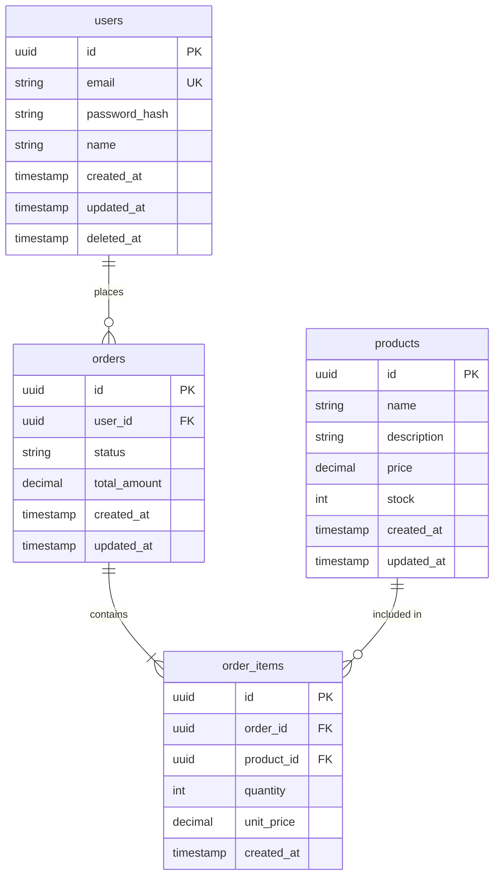

# ERD: {기능명}

## 문서 정보

| 항목 | 내용 |
|------|------|
| 작성자 | {작성자} |
| 작성일 | {날짜} |
| 버전 | 1.0 |

---

## 1. ERD 다이어그램



---

## 2. 테이블 정의

### 2.1 users (사용자)

| 컬럼 | 타입 | 제약조건 | 설명 |
|------|------|---------|------|
| id | UUID | PK | 고유 식별자 |
| email | VARCHAR(255) | UK, NOT NULL | 이메일 주소 |
| password_hash | VARCHAR(255) | NOT NULL | 암호화된 비밀번호 |
| name | VARCHAR(100) | | 사용자 이름 |
| created_at | TIMESTAMP | NOT NULL, DEFAULT NOW() | 생성일시 |
| updated_at | TIMESTAMP | NOT NULL | 수정일시 |
| deleted_at | TIMESTAMP | | 삭제일시 (Soft Delete) |

**인덱스**:
- `idx_users_email` ON (email)

### 2.2 orders (주문)

| 컬럼 | 타입 | 제약조건 | 설명 |
|------|------|---------|------|
| id | UUID | PK | 고유 식별자 |
| user_id | UUID | FK(users.id), NOT NULL | 주문자 |
| status | VARCHAR(20) | NOT NULL | 주문 상태 |
| total_amount | DECIMAL(10,2) | NOT NULL | 총 금액 |
| created_at | TIMESTAMP | NOT NULL | 주문일시 |
| updated_at | TIMESTAMP | NOT NULL | 수정일시 |

**인덱스**:
- `idx_orders_user_id` ON (user_id)
- `idx_orders_status` ON (status)
- `idx_orders_created_at` ON (created_at DESC)

### 2.3 products (상품)

| 컬럼 | 타입 | 제약조건 | 설명 |
|------|------|---------|------|
| id | UUID | PK | 고유 식별자 |
| name | VARCHAR(200) | NOT NULL | 상품명 |
| description | TEXT | | 상품 설명 |
| price | DECIMAL(10,2) | NOT NULL | 가격 |
| stock | INT | NOT NULL, DEFAULT 0 | 재고 수량 |
| created_at | TIMESTAMP | NOT NULL | 생성일시 |
| updated_at | TIMESTAMP | NOT NULL | 수정일시 |

**인덱스**:
- `idx_products_name` ON (name)

### 2.4 order_items (주문 항목)

| 컬럼 | 타입 | 제약조건 | 설명 |
|------|------|---------|------|
| id | UUID | PK | 고유 식별자 |
| order_id | UUID | FK(orders.id), NOT NULL | 주문 ID |
| product_id | UUID | FK(products.id), NOT NULL | 상품 ID |
| quantity | INT | NOT NULL | 수량 |
| unit_price | DECIMAL(10,2) | NOT NULL | 단가 |
| created_at | TIMESTAMP | NOT NULL | 생성일시 |

**인덱스**:
- `idx_order_items_order_id` ON (order_id)
- `idx_order_items_product_id` ON (product_id)

---

## 3. 관계 정의

| 관계 | 설명 | 카디널리티 |
|------|------|-----------|
| users - orders | 사용자가 주문을 생성 | 1:N |
| orders - order_items | 주문이 여러 항목 포함 | 1:N |
| products - order_items | 상품이 여러 주문에 포함 | 1:N |

---

## 4. 인덱스 전략

### 4.1 필수 인덱스

```sql
-- 외래 키 인덱스
CREATE INDEX idx_orders_user_id ON orders(user_id);
CREATE INDEX idx_order_items_order_id ON order_items(order_id);
CREATE INDEX idx_order_items_product_id ON order_items(product_id);

-- 유니크 인덱스
CREATE UNIQUE INDEX uk_users_email_active ON users(email) WHERE deleted_at IS NULL;
```

### 4.2 검색/정렬 인덱스

```sql
-- 자주 검색되는 컬럼
CREATE INDEX idx_orders_status ON orders(status);
CREATE INDEX idx_orders_created_at ON orders(created_at DESC);
CREATE INDEX idx_products_name ON products(name);

-- 복합 인덱스
CREATE INDEX idx_orders_user_status ON orders(user_id, status);
```

---

## 5. Enum 정의

### 5.1 OrderStatus

```sql
CREATE TYPE order_status AS ENUM (
  'pending',     -- 대기중
  'confirmed',   -- 확정
  'shipped',     -- 배송중
  'delivered',   -- 배송완료
  'cancelled'    -- 취소됨
);
```

---

## 6. Prisma 스키마

```prisma
model User {
  id           String    @id @default(uuid())
  email        String    @unique
  passwordHash String    @map("password_hash")
  name         String?
  createdAt    DateTime  @default(now()) @map("created_at")
  updatedAt    DateTime  @updatedAt @map("updated_at")
  deletedAt    DateTime? @map("deleted_at")

  orders       Order[]

  @@index([email])
  @@map("users")
}

model Order {
  id          String      @id @default(uuid())
  userId      String      @map("user_id")
  status      OrderStatus @default(PENDING)
  totalAmount Decimal     @map("total_amount") @db.Decimal(10, 2)
  createdAt   DateTime    @default(now()) @map("created_at")
  updatedAt   DateTime    @updatedAt @map("updated_at")

  user        User        @relation(fields: [userId], references: [id])
  items       OrderItem[]

  @@index([userId])
  @@index([status])
  @@index([createdAt(sort: Desc)])
  @@map("orders")
}

model Product {
  id          String      @id @default(uuid())
  name        String
  description String?
  price       Decimal     @db.Decimal(10, 2)
  stock       Int         @default(0)
  createdAt   DateTime    @default(now()) @map("created_at")
  updatedAt   DateTime    @updatedAt @map("updated_at")

  orderItems  OrderItem[]

  @@index([name])
  @@map("products")
}

model OrderItem {
  id        String   @id @default(uuid())
  orderId   String   @map("order_id")
  productId String   @map("product_id")
  quantity  Int
  unitPrice Decimal  @map("unit_price") @db.Decimal(10, 2)
  createdAt DateTime @default(now()) @map("created_at")

  order     Order    @relation(fields: [orderId], references: [id])
  product   Product  @relation(fields: [productId], references: [id])

  @@index([orderId])
  @@index([productId])
  @@map("order_items")
}

enum OrderStatus {
  PENDING
  CONFIRMED
  SHIPPED
  DELIVERED
  CANCELLED
}
```

---

## 7. 마이그레이션 고려사항

- [ ] 기존 데이터 마이그레이션 필요 여부
- [ ] 롤백 계획
- [ ] 인덱스 생성 순서 (대용량 테이블 주의)
- [ ] 외래 키 제약 조건 순서

---

## 8. 데이터 무결성

### 8.1 제약 조건

```sql
-- Check 제약 조건
ALTER TABLE products ADD CONSTRAINT chk_products_price
  CHECK (price >= 0);

ALTER TABLE products ADD CONSTRAINT chk_products_stock
  CHECK (stock >= 0);

ALTER TABLE order_items ADD CONSTRAINT chk_order_items_quantity
  CHECK (quantity > 0);
```

### 8.2 트리거

```sql
-- updated_at 자동 갱신
CREATE OR REPLACE FUNCTION update_updated_at_column()
RETURNS TRIGGER AS $$
BEGIN
    NEW.updated_at = NOW();
    RETURN NEW;
END;
$$ language 'plpgsql';
```

---

*다음 단계: /dev-tasks*
