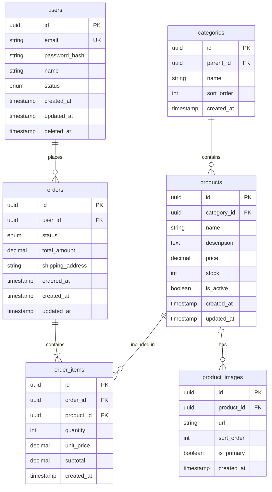
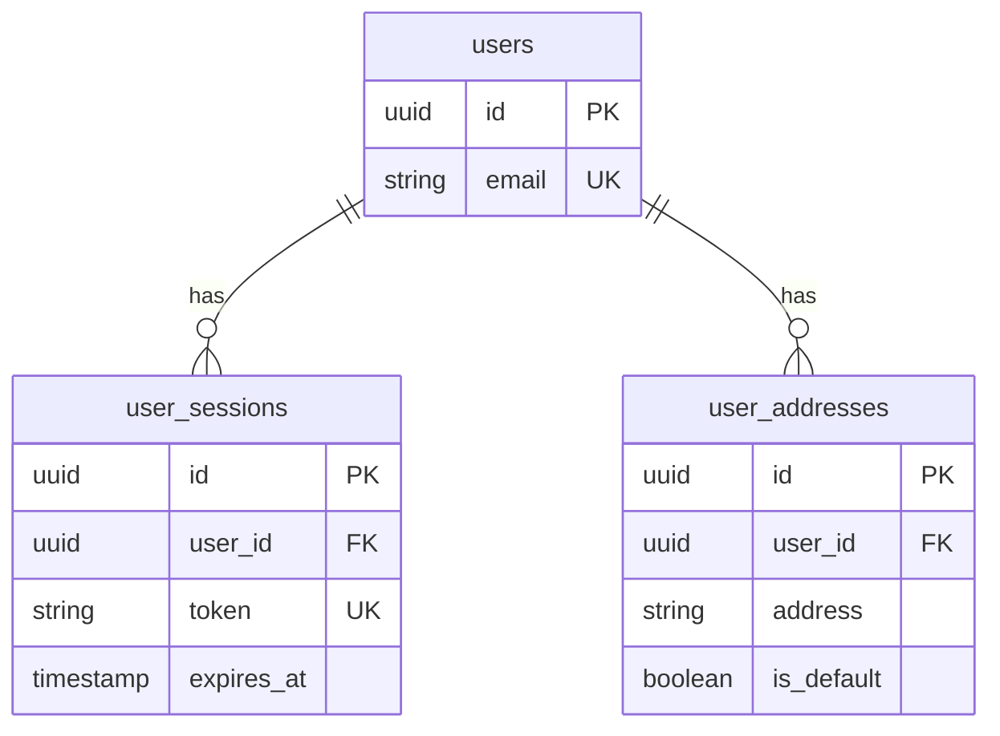
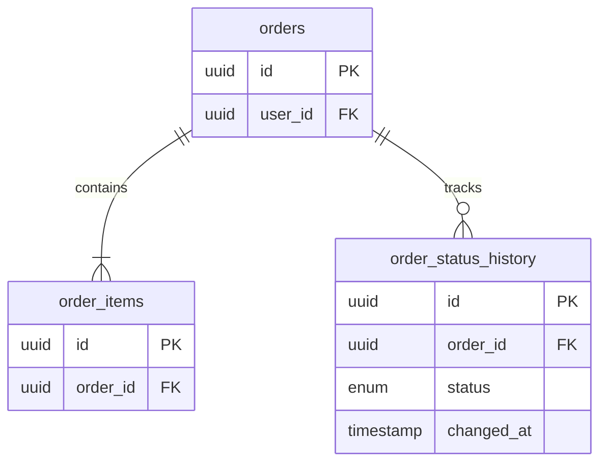

# ERD: {기능명}

## 문서 정보

| 항목 | 내용 |
|------|------|
| 작성자 | {작성자} |
| 작성일 | {날짜} |
| 버전 | 1.0 |
| 상태 | Draft / Review / Approved |
| 데이터베이스 | PostgreSQL / MySQL / MongoDB |

---

## 목차

1. [개요](#1-개요)
2. [ERD 다이어그램](#2-erd-다이어그램)
3. [테이블 정의](#3-테이블-정의)
4. [관계 정의](#4-관계-정의)
5. [인덱스 전략](#5-인덱스-전략)
6. [Enum 및 상수 정의](#6-enum-및-상수-정의)
7. [ORM 스키마](#7-orm-스키마)
8. [마이그레이션 계획](#8-마이그레이션-계획)
9. [데이터 무결성](#9-데이터-무결성)
10. [성능 고려사항](#10-성능-고려사항)
11. [보안 고려사항](#11-보안-고려사항)
12. [체크리스트](#12-체크리스트)

---

## 1. 개요

### 1.1 문서 목적

이 문서는 {기능명} 기능에 필요한 데이터 모델을 정의합니다.

### 1.2 도메인 범위

| 항목 | 설명 |
|------|------|
| **핵심 엔티티** | {엔티티 목록} |
| **주요 관계** | {관계 설명} |
| **예상 데이터량** | {규모 추정} |

### 1.3 설계 원칙

| 원칙 | 설명 | 적용 |
|------|------|------|
| **정규화** | 3NF 이상 유지 | 중복 데이터 최소화 |
| **확장성** | 수평적 확장 고려 | UUID PK, 파티셔닝 |
| **성능** | 쿼리 패턴 기반 최적화 | 적절한 인덱스 |
| **감사** | 변경 이력 추적 | created_at, updated_at |

### 1.4 명명 규칙

| 대상 | 규칙 | 예시 |
|------|------|------|
| 테이블명 | snake_case, 복수형 | `users`, `order_items` |
| 컬럼명 | snake_case | `user_id`, `created_at` |
| 외래 키 | `{테이블}_id` | `user_id`, `product_id` |
| 인덱스 | `idx_{테이블}_{컬럼}` | `idx_users_email` |
| 유니크 | `uk_{테이블}_{컬럼}` | `uk_users_email` |

---

## 2. ERD 다이어그램

### 2.1 전체 ERD



### 2.2 도메인별 ERD (대규모 시스템인 경우)

#### 사용자 도메인



#### 주문 도메인



---

## 3. 테이블 정의

### 3.1 users (사용자)

> 시스템 사용자 정보를 저장하는 핵심 테이블

| 컬럼 | 타입 | 제약조건 | 기본값 | 설명 |
|------|------|---------|--------|------|
| id | UUID | PK | gen_random_uuid() | 고유 식별자 |
| email | VARCHAR(255) | UK, NOT NULL | - | 이메일 주소 |
| password_hash | VARCHAR(255) | NOT NULL | - | bcrypt 해시 비밀번호 |
| name | VARCHAR(100) | NOT NULL | - | 사용자 이름 |
| status | user_status | NOT NULL | 'active' | 계정 상태 |
| role | user_role | NOT NULL | 'user' | 권한 역할 |
| email_verified_at | TIMESTAMP | - | NULL | 이메일 인증 일시 |
| last_login_at | TIMESTAMP | - | NULL | 마지막 로그인 |
| created_at | TIMESTAMP | NOT NULL | NOW() | 생성일시 |
| updated_at | TIMESTAMP | NOT NULL | NOW() | 수정일시 |
| deleted_at | TIMESTAMP | - | NULL | 삭제일시 (Soft Delete) |

**인덱스**:
```sql
CREATE UNIQUE INDEX uk_users_email ON users(email) WHERE deleted_at IS NULL;
CREATE INDEX idx_users_status ON users(status);
CREATE INDEX idx_users_created_at ON users(created_at DESC);
```

**비고**:
- Soft Delete 패턴 사용 (deleted_at)
- 이메일 유니크 제약은 삭제되지 않은 레코드에만 적용
- 비밀번호는 bcrypt (cost factor 12) 사용

---

### 3.2 orders (주문)

> 사용자의 주문 정보를 저장

| 컬럼 | 타입 | 제약조건 | 기본값 | 설명 |
|------|------|---------|--------|------|
| id | UUID | PK | gen_random_uuid() | 고유 식별자 |
| user_id | UUID | FK(users.id), NOT NULL | - | 주문자 |
| order_number | VARCHAR(20) | UK, NOT NULL | - | 주문번호 (ORD-YYYYMMDD-XXXX) |
| status | order_status | NOT NULL | 'pending' | 주문 상태 |
| total_amount | DECIMAL(12,2) | NOT NULL | 0 | 총 금액 |
| discount_amount | DECIMAL(12,2) | NOT NULL | 0 | 할인 금액 |
| shipping_fee | DECIMAL(10,2) | NOT NULL | 0 | 배송비 |
| shipping_address | JSONB | NOT NULL | - | 배송지 정보 |
| payment_method | VARCHAR(50) | - | NULL | 결제 수단 |
| paid_at | TIMESTAMP | - | NULL | 결제 완료 일시 |
| shipped_at | TIMESTAMP | - | NULL | 배송 시작 일시 |
| delivered_at | TIMESTAMP | - | NULL | 배송 완료 일시 |
| cancelled_at | TIMESTAMP | - | NULL | 취소 일시 |
| cancel_reason | TEXT | - | NULL | 취소 사유 |
| notes | TEXT | - | NULL | 주문 메모 |
| created_at | TIMESTAMP | NOT NULL | NOW() | 주문일시 |
| updated_at | TIMESTAMP | NOT NULL | NOW() | 수정일시 |

**JSONB 구조 (shipping_address)**:
```json
{
  "recipient": "홍길동",
  "phone": "010-1234-5678",
  "zipcode": "12345",
  "address1": "서울시 강남구 테헤란로 123",
  "address2": "OO빌딩 5층",
  "memo": "부재 시 경비실에 맡겨주세요"
}
```

**인덱스**:
```sql
CREATE UNIQUE INDEX uk_orders_order_number ON orders(order_number);
CREATE INDEX idx_orders_user_id ON orders(user_id);
CREATE INDEX idx_orders_status ON orders(status);
CREATE INDEX idx_orders_created_at ON orders(created_at DESC);
CREATE INDEX idx_orders_user_status ON orders(user_id, status);
```

---

### 3.3 products (상품)

> 판매 상품 정보를 저장

| 컬럼 | 타입 | 제약조건 | 기본값 | 설명 |
|------|------|---------|--------|------|
| id | UUID | PK | gen_random_uuid() | 고유 식별자 |
| category_id | UUID | FK(categories.id) | NULL | 카테고리 |
| sku | VARCHAR(50) | UK, NOT NULL | - | 상품 코드 |
| name | VARCHAR(200) | NOT NULL | - | 상품명 |
| slug | VARCHAR(200) | UK, NOT NULL | - | URL 슬러그 |
| description | TEXT | - | NULL | 상품 설명 |
| price | DECIMAL(10,2) | NOT NULL | - | 정가 |
| sale_price | DECIMAL(10,2) | - | NULL | 할인가 |
| stock | INT | NOT NULL | 0 | 재고 수량 |
| low_stock_threshold | INT | NOT NULL | 10 | 재고 부족 알림 기준 |
| is_active | BOOLEAN | NOT NULL | TRUE | 판매 활성화 |
| is_featured | BOOLEAN | NOT NULL | FALSE | 추천 상품 |
| weight | DECIMAL(8,2) | - | NULL | 무게 (kg) |
| dimensions | JSONB | - | NULL | 크기 정보 |
| metadata | JSONB | - | '{}' | 추가 정보 |
| created_at | TIMESTAMP | NOT NULL | NOW() | 생성일시 |
| updated_at | TIMESTAMP | NOT NULL | NOW() | 수정일시 |
| deleted_at | TIMESTAMP | - | NULL | 삭제일시 |

**인덱스**:
```sql
CREATE UNIQUE INDEX uk_products_sku ON products(sku);
CREATE UNIQUE INDEX uk_products_slug ON products(slug);
CREATE INDEX idx_products_category_id ON products(category_id);
CREATE INDEX idx_products_is_active ON products(is_active) WHERE is_active = TRUE;
CREATE INDEX idx_products_price ON products(price);
CREATE INDEX idx_products_name_search ON products USING gin(to_tsvector('korean', name));
```

---

### 3.4 order_items (주문 항목)

> 주문에 포함된 개별 상품 정보

| 컬럼 | 타입 | 제약조건 | 기본값 | 설명 |
|------|------|---------|--------|------|
| id | UUID | PK | gen_random_uuid() | 고유 식별자 |
| order_id | UUID | FK(orders.id), NOT NULL | - | 주문 ID |
| product_id | UUID | FK(products.id), NOT NULL | - | 상품 ID |
| product_name | VARCHAR(200) | NOT NULL | - | 주문 시점 상품명 |
| quantity | INT | NOT NULL, CHECK(>0) | - | 수량 |
| unit_price | DECIMAL(10,2) | NOT NULL | - | 주문 시점 단가 |
| subtotal | DECIMAL(12,2) | NOT NULL | - | 소계 (quantity * unit_price) |
| created_at | TIMESTAMP | NOT NULL | NOW() | 생성일시 |

**인덱스**:
```sql
CREATE INDEX idx_order_items_order_id ON order_items(order_id);
CREATE INDEX idx_order_items_product_id ON order_items(product_id);
CREATE UNIQUE INDEX uk_order_items_order_product ON order_items(order_id, product_id);
```

**비고**:
- product_name, unit_price는 주문 시점의 값을 스냅샷으로 저장 (상품 정보 변경에 영향 없음)
- subtotal은 비정규화된 필드로 쿼리 성능 최적화

---

### 3.5 categories (카테고리)

> 상품 카테고리 (계층 구조)

| 컬럼 | 타입 | 제약조건 | 기본값 | 설명 |
|------|------|---------|--------|------|
| id | UUID | PK | gen_random_uuid() | 고유 식별자 |
| parent_id | UUID | FK(categories.id) | NULL | 상위 카테고리 |
| name | VARCHAR(100) | NOT NULL | - | 카테고리명 |
| slug | VARCHAR(100) | UK, NOT NULL | - | URL 슬러그 |
| description | TEXT | - | NULL | 설명 |
| image_url | VARCHAR(500) | - | NULL | 이미지 URL |
| depth | INT | NOT NULL | 0 | 계층 깊이 (0=루트) |
| path | VARCHAR(500) | NOT NULL | - | 경로 (1/2/3 형식) |
| sort_order | INT | NOT NULL | 0 | 정렬 순서 |
| is_active | BOOLEAN | NOT NULL | TRUE | 활성화 상태 |
| created_at | TIMESTAMP | NOT NULL | NOW() | 생성일시 |
| updated_at | TIMESTAMP | NOT NULL | NOW() | 수정일시 |

**인덱스**:
```sql
CREATE UNIQUE INDEX uk_categories_slug ON categories(slug);
CREATE INDEX idx_categories_parent_id ON categories(parent_id);
CREATE INDEX idx_categories_path ON categories(path);
CREATE INDEX idx_categories_sort ON categories(parent_id, sort_order);
```

**비고**:
- Materialized Path 패턴 사용 (path 컬럼)
- depth는 비정규화 필드로 쿼리 성능 최적화

---

## 4. 관계 정의

### 4.1 관계 매트릭스

| 관계 | 설명 | 카디널리티 | 필수 여부 | 삭제 정책 |
|------|------|-----------|----------|----------|
| users → orders | 사용자가 주문 생성 | 1:N | 필수 | RESTRICT |
| orders → order_items | 주문이 항목 포함 | 1:N | 필수 | CASCADE |
| products → order_items | 상품이 주문에 포함 | 1:N | 필수 | RESTRICT |
| categories → products | 카테고리가 상품 포함 | 1:N | 선택 | SET NULL |
| categories → categories | 자기 참조 (계층) | 1:N | 선택 | RESTRICT |

### 4.2 삭제 정책 상세

| 정책 | 설명 | 적용 |
|------|------|------|
| **CASCADE** | 부모 삭제 시 자식도 삭제 | 주문 → 주문항목 |
| **RESTRICT** | 자식이 있으면 삭제 불가 | 사용자 → 주문, 상품 → 주문항목 |
| **SET NULL** | 부모 삭제 시 FK를 NULL로 | 카테고리 → 상품 |
| **SET DEFAULT** | 부모 삭제 시 기본값으로 | - |

### 4.3 관계 다이어그램

```
                    ┌─────────────┐
                    │  categories │
                    └──────┬──────┘
                           │ 1:N (SET NULL)
                           ▼
┌─────────┐  1:N   ┌─────────────┐  1:N   ┌─────────────────┐
│  users  │───────►│   orders    │───────►│   order_items   │
└─────────┘        └─────────────┘        └────────┬────────┘
 RESTRICT                CASCADE                    │
                                                    │ N:1 (RESTRICT)
                                                    ▼
                                            ┌─────────────┐
                                            │  products   │
                                            └─────────────┘
```

---

## 5. 인덱스 전략

### 5.1 인덱스 유형별 가이드

| 유형 | 용도 | 예시 |
|------|------|------|
| **B-tree** (기본) | 범위 검색, 정렬 | `created_at`, `price` |
| **Hash** | 동등 비교만 | `status` (PostgreSQL) |
| **GIN** | 전문 검색, JSONB | `name` 검색, `metadata` |
| **GiST** | 지리정보, 범위 | 좌표 검색 |
| **Partial** | 조건부 인덱스 | `is_active = TRUE` |
| **Covering** | 인덱스만으로 쿼리 | INCLUDE 절 사용 |

### 5.2 필수 인덱스 (모든 테이블)

```sql
-- Primary Key (자동 생성)
-- 외래 키 인덱스 (수동 생성 필요)
CREATE INDEX idx_{table}_{fk_column} ON {table}({fk_column});

-- 시간 기반 조회
CREATE INDEX idx_{table}_created_at ON {table}(created_at DESC);
```

### 5.3 쿼리 패턴별 인덱스

#### 패턴 1: 사용자의 주문 목록 조회
```sql
-- 쿼리
SELECT * FROM orders WHERE user_id = ? ORDER BY created_at DESC;

-- 인덱스
CREATE INDEX idx_orders_user_created ON orders(user_id, created_at DESC);
```

#### 패턴 2: 상태별 주문 집계
```sql
-- 쿼리
SELECT status, COUNT(*) FROM orders GROUP BY status;

-- 인덱스
CREATE INDEX idx_orders_status ON orders(status);
```

#### 패턴 3: 상품 검색
```sql
-- 쿼리
SELECT * FROM products
WHERE name ILIKE '%검색어%'
  AND is_active = TRUE
ORDER BY created_at DESC;

-- 인덱스
CREATE INDEX idx_products_search ON products USING gin(to_tsvector('korean', name))
WHERE is_active = TRUE;
```

#### 패턴 4: 복합 조건 조회
```sql
-- 쿼리
SELECT * FROM orders
WHERE user_id = ? AND status IN ('pending', 'confirmed');

-- 인덱스 (커버링)
CREATE INDEX idx_orders_user_status ON orders(user_id, status)
INCLUDE (total_amount, created_at);
```

### 5.4 인덱스 주의사항

| 주의사항 | 설명 |
|----------|------|
| **과도한 인덱스** | INSERT/UPDATE 성능 저하, 저장 공간 증가 |
| **낮은 선택도** | Boolean, Enum 컬럼은 단독 인덱스 비효율적 |
| **복합 인덱스 순서** | 선택도 높은 컬럼을 앞에 배치 |
| **NULL 처리** | B-tree는 NULL 포함, 부분 인덱스 고려 |

---

## 6. Enum 및 상수 정의

### 6.1 user_status (사용자 상태)

```sql
CREATE TYPE user_status AS ENUM (
  'pending',    -- 가입 대기 (이메일 인증 전)
  'active',     -- 정상
  'suspended',  -- 일시 정지
  'banned',     -- 영구 정지
  'withdrawn'   -- 탈퇴
);
```

| 값 | 설명 | 전이 가능 상태 |
|----|------|---------------|
| pending | 이메일 인증 대기 | active |
| active | 정상 사용 가능 | suspended, banned, withdrawn |
| suspended | 일시 정지 | active, banned |
| banned | 영구 정지 | - |
| withdrawn | 탈퇴 완료 | - |

### 6.2 user_role (사용자 역할)

```sql
CREATE TYPE user_role AS ENUM (
  'user',       -- 일반 사용자
  'seller',     -- 판매자
  'admin',      -- 관리자
  'super_admin' -- 최고 관리자
);
```

### 6.3 order_status (주문 상태)

```sql
CREATE TYPE order_status AS ENUM (
  'pending',     -- 주문 대기 (결제 전)
  'paid',        -- 결제 완료
  'confirmed',   -- 주문 확정 (판매자 확인)
  'preparing',   -- 상품 준비중
  'shipped',     -- 배송중
  'delivered',   -- 배송 완료
  'completed',   -- 구매 확정
  'cancelled',   -- 취소됨
  'refunded'     -- 환불됨
);
```

**상태 전이 다이어그램**:
```
pending ──► paid ──► confirmed ──► preparing ──► shipped ──► delivered ──► completed
    │         │          │             │           │            │
    │         └──────────┴─────────────┴───────────┴────────────┘
    │                                  │
    └──────────► cancelled ◄───────────┘
                     │
                     ▼
                 refunded
```

---

## 7. ORM 스키마

### 7.1 Prisma Schema

```prisma
// This is your Prisma schema file

generator client {
  provider = "prisma-client-js"
}

datasource db {
  provider = "postgresql"
  url      = env("DATABASE_URL")
}

// ============================================
// Enums
// ============================================

enum UserStatus {
  PENDING
  ACTIVE
  SUSPENDED
  BANNED
  WITHDRAWN
}

enum UserRole {
  USER
  SELLER
  ADMIN
  SUPER_ADMIN
}

enum OrderStatus {
  PENDING
  PAID
  CONFIRMED
  PREPARING
  SHIPPED
  DELIVERED
  COMPLETED
  CANCELLED
  REFUNDED
}

// ============================================
// Models
// ============================================

model User {
  id              String      @id @default(uuid())
  email           String      @unique
  passwordHash    String      @map("password_hash")
  name            String
  status          UserStatus  @default(ACTIVE)
  role            UserRole    @default(USER)
  emailVerifiedAt DateTime?   @map("email_verified_at")
  lastLoginAt     DateTime?   @map("last_login_at")
  createdAt       DateTime    @default(now()) @map("created_at")
  updatedAt       DateTime    @updatedAt @map("updated_at")
  deletedAt       DateTime?   @map("deleted_at")

  // Relations
  orders          Order[]
  addresses       UserAddress[]
  sessions        UserSession[]

  // Indexes
  @@index([status])
  @@index([createdAt(sort: Desc)])
  @@map("users")
}

model Order {
  id              String       @id @default(uuid())
  userId          String       @map("user_id")
  orderNumber     String       @unique @map("order_number")
  status          OrderStatus  @default(PENDING)
  totalAmount     Decimal      @map("total_amount") @db.Decimal(12, 2)
  discountAmount  Decimal      @default(0) @map("discount_amount") @db.Decimal(12, 2)
  shippingFee     Decimal      @default(0) @map("shipping_fee") @db.Decimal(10, 2)
  shippingAddress Json         @map("shipping_address")
  paymentMethod   String?      @map("payment_method")
  paidAt          DateTime?    @map("paid_at")
  shippedAt       DateTime?    @map("shipped_at")
  deliveredAt     DateTime?    @map("delivered_at")
  cancelledAt     DateTime?    @map("cancelled_at")
  cancelReason    String?      @map("cancel_reason")
  notes           String?
  createdAt       DateTime     @default(now()) @map("created_at")
  updatedAt       DateTime     @updatedAt @map("updated_at")

  // Relations
  user            User         @relation(fields: [userId], references: [id], onDelete: Restrict)
  items           OrderItem[]
  statusHistory   OrderStatusHistory[]

  // Indexes
  @@index([userId])
  @@index([status])
  @@index([createdAt(sort: Desc)])
  @@index([userId, status])
  @@map("orders")
}

model Product {
  id                String      @id @default(uuid())
  categoryId        String?     @map("category_id")
  sku               String      @unique
  name              String
  slug              String      @unique
  description       String?
  price             Decimal     @db.Decimal(10, 2)
  salePrice         Decimal?    @map("sale_price") @db.Decimal(10, 2)
  stock             Int         @default(0)
  lowStockThreshold Int         @default(10) @map("low_stock_threshold")
  isActive          Boolean     @default(true) @map("is_active")
  isFeatured        Boolean     @default(false) @map("is_featured")
  weight            Decimal?    @db.Decimal(8, 2)
  dimensions        Json?
  metadata          Json        @default("{}")
  createdAt         DateTime    @default(now()) @map("created_at")
  updatedAt         DateTime    @updatedAt @map("updated_at")
  deletedAt         DateTime?   @map("deleted_at")

  // Relations
  category          Category?   @relation(fields: [categoryId], references: [id], onDelete: SetNull)
  orderItems        OrderItem[]
  images            ProductImage[]

  // Indexes
  @@index([categoryId])
  @@index([isActive])
  @@index([price])
  @@map("products")
}

model OrderItem {
  id          String   @id @default(uuid())
  orderId     String   @map("order_id")
  productId   String   @map("product_id")
  productName String   @map("product_name")
  quantity    Int
  unitPrice   Decimal  @map("unit_price") @db.Decimal(10, 2)
  subtotal    Decimal  @db.Decimal(12, 2)
  createdAt   DateTime @default(now()) @map("created_at")

  // Relations
  order       Order    @relation(fields: [orderId], references: [id], onDelete: Cascade)
  product     Product  @relation(fields: [productId], references: [id], onDelete: Restrict)

  // Indexes
  @@unique([orderId, productId])
  @@index([orderId])
  @@index([productId])
  @@map("order_items")
}

model Category {
  id          String      @id @default(uuid())
  parentId    String?     @map("parent_id")
  name        String
  slug        String      @unique
  description String?
  imageUrl    String?     @map("image_url")
  depth       Int         @default(0)
  path        String
  sortOrder   Int         @default(0) @map("sort_order")
  isActive    Boolean     @default(true) @map("is_active")
  createdAt   DateTime    @default(now()) @map("created_at")
  updatedAt   DateTime    @updatedAt @map("updated_at")

  // Relations (Self-referencing)
  parent      Category?   @relation("CategoryHierarchy", fields: [parentId], references: [id], onDelete: Restrict)
  children    Category[]  @relation("CategoryHierarchy")
  products    Product[]

  // Indexes
  @@index([parentId])
  @@index([path])
  @@index([parentId, sortOrder])
  @@map("categories")
}
```

### 7.2 TypeORM Entity (대안)

```typescript
@Entity('users')
export class User {
  @PrimaryGeneratedColumn('uuid')
  id: string;

  @Column({ unique: true, length: 255 })
  email: string;

  @Column({ name: 'password_hash', length: 255 })
  passwordHash: string;

  @Column({ length: 100 })
  name: string;

  @Column({ type: 'enum', enum: UserStatus, default: UserStatus.ACTIVE })
  status: UserStatus;

  @CreateDateColumn({ name: 'created_at' })
  createdAt: Date;

  @UpdateDateColumn({ name: 'updated_at' })
  updatedAt: Date;

  @DeleteDateColumn({ name: 'deleted_at' })
  deletedAt: Date | null;

  @OneToMany(() => Order, order => order.user)
  orders: Order[];
}
```

---

## 8. 마이그레이션 계획

### 8.1 마이그레이션 순서

| 순서 | 테이블 | 의존성 | 비고 |
|------|--------|--------|------|
| 1 | Enum 타입 생성 | - | 먼저 생성 필요 |
| 2 | users | - | 기본 테이블 |
| 3 | categories | categories (self) | 자기 참조 |
| 4 | products | categories | FK 의존 |
| 5 | orders | users | FK 의존 |
| 6 | order_items | orders, products | 복합 FK |
| 7 | 인덱스 생성 | 전체 | 대용량 시 주의 |

### 8.2 마이그레이션 스크립트 예시

```sql
-- Migration: 001_create_enums.sql
-- =================================

CREATE TYPE user_status AS ENUM ('pending', 'active', 'suspended', 'banned', 'withdrawn');
CREATE TYPE user_role AS ENUM ('user', 'seller', 'admin', 'super_admin');
CREATE TYPE order_status AS ENUM ('pending', 'paid', 'confirmed', 'preparing', 'shipped', 'delivered', 'completed', 'cancelled', 'refunded');

-- Migration: 002_create_users.sql
-- =================================

CREATE TABLE users (
  id UUID PRIMARY KEY DEFAULT gen_random_uuid(),
  email VARCHAR(255) NOT NULL,
  password_hash VARCHAR(255) NOT NULL,
  name VARCHAR(100) NOT NULL,
  status user_status NOT NULL DEFAULT 'active',
  role user_role NOT NULL DEFAULT 'user',
  email_verified_at TIMESTAMP,
  last_login_at TIMESTAMP,
  created_at TIMESTAMP NOT NULL DEFAULT NOW(),
  updated_at TIMESTAMP NOT NULL DEFAULT NOW(),
  deleted_at TIMESTAMP
);

CREATE UNIQUE INDEX uk_users_email ON users(email) WHERE deleted_at IS NULL;
CREATE INDEX idx_users_status ON users(status);
CREATE INDEX idx_users_created_at ON users(created_at DESC);

-- Trigger: updated_at 자동 갱신
CREATE OR REPLACE FUNCTION update_updated_at()
RETURNS TRIGGER AS $$
BEGIN
  NEW.updated_at = NOW();
  RETURN NEW;
END;
$$ LANGUAGE plpgsql;

CREATE TRIGGER tr_users_updated_at
  BEFORE UPDATE ON users
  FOR EACH ROW
  EXECUTE FUNCTION update_updated_at();
```

### 8.3 롤백 계획

```sql
-- Rollback: 002_create_users.sql
DROP TRIGGER IF EXISTS tr_users_updated_at ON users;
DROP TABLE IF EXISTS users;

-- Rollback: 001_create_enums.sql
DROP TYPE IF EXISTS order_status;
DROP TYPE IF EXISTS user_role;
DROP TYPE IF EXISTS user_status;
```

### 8.4 대용량 데이터 마이그레이션

| 상황 | 전략 | 예시 |
|------|------|------|
| **인덱스 생성** | CONCURRENTLY 옵션 | `CREATE INDEX CONCURRENTLY` |
| **컬럼 추가** | NULL 허용 후 채우기 | ALTER ADD → UPDATE → ALTER NOT NULL |
| **타입 변경** | 새 컬럼 후 마이그레이션 | 임시 컬럼 → 데이터 이동 → 컬럼명 변경 |
| **대량 UPDATE** | 배치 처리 | LIMIT + OFFSET 반복 |

---

## 9. 데이터 무결성

### 9.1 Check 제약 조건

```sql
-- 가격/금액 양수
ALTER TABLE products ADD CONSTRAINT chk_products_price
  CHECK (price >= 0);

ALTER TABLE products ADD CONSTRAINT chk_products_sale_price
  CHECK (sale_price IS NULL OR sale_price >= 0);

ALTER TABLE products ADD CONSTRAINT chk_products_sale_less_than_price
  CHECK (sale_price IS NULL OR sale_price <= price);

-- 재고 음수 방지
ALTER TABLE products ADD CONSTRAINT chk_products_stock
  CHECK (stock >= 0);

-- 수량 양수
ALTER TABLE order_items ADD CONSTRAINT chk_order_items_quantity
  CHECK (quantity > 0);

-- 이메일 형식
ALTER TABLE users ADD CONSTRAINT chk_users_email_format
  CHECK (email ~* '^[A-Za-z0-9._%+-]+@[A-Za-z0-9.-]+\.[A-Za-z]{2,}$');
```

### 9.2 Trigger 기반 무결성

```sql
-- 주문 총액 자동 계산
CREATE OR REPLACE FUNCTION calculate_order_total()
RETURNS TRIGGER AS $$
BEGIN
  UPDATE orders
  SET total_amount = (
    SELECT COALESCE(SUM(subtotal), 0)
    FROM order_items
    WHERE order_id = COALESCE(NEW.order_id, OLD.order_id)
  )
  WHERE id = COALESCE(NEW.order_id, OLD.order_id);
  RETURN NULL;
END;
$$ LANGUAGE plpgsql;

CREATE TRIGGER tr_order_items_calculate_total
  AFTER INSERT OR UPDATE OR DELETE ON order_items
  FOR EACH ROW
  EXECUTE FUNCTION calculate_order_total();

-- 재고 차감
CREATE OR REPLACE FUNCTION decrease_product_stock()
RETURNS TRIGGER AS $$
BEGIN
  UPDATE products
  SET stock = stock - NEW.quantity
  WHERE id = NEW.product_id;

  IF (SELECT stock FROM products WHERE id = NEW.product_id) < 0 THEN
    RAISE EXCEPTION '재고가 부족합니다: %', NEW.product_id;
  END IF;

  RETURN NEW;
END;
$$ LANGUAGE plpgsql;

CREATE TRIGGER tr_order_items_stock
  AFTER INSERT ON order_items
  FOR EACH ROW
  EXECUTE FUNCTION decrease_product_stock();
```

### 9.3 애플리케이션 레벨 검증

```typescript
// Validation at application level (Zod example)
const createOrderSchema = z.object({
  items: z.array(z.object({
    productId: z.string().uuid(),
    quantity: z.number().int().positive(),
  })).min(1, '최소 1개 이상의 상품이 필요합니다'),
  shippingAddress: z.object({
    recipient: z.string().min(2).max(50),
    phone: z.string().regex(/^01[0-9]-\d{3,4}-\d{4}$/),
    zipcode: z.string().length(5),
    address1: z.string().max(200),
    address2: z.string().max(200).optional(),
  }),
});
```

---

## 10. 성능 고려사항

### 10.1 파티셔닝 전략

| 테이블 | 파티셔닝 방식 | 키 | 적용 조건 |
|--------|-------------|-----|----------|
| orders | RANGE | created_at (월별) | 1000만 건 이상 |
| order_items | RANGE | created_at (월별) | 5000만 건 이상 |
| logs | RANGE | created_at (일별) | 로그 테이블 |

```sql
-- 파티셔닝 예시
CREATE TABLE orders (
  id UUID,
  created_at TIMESTAMP NOT NULL,
  ...
) PARTITION BY RANGE (created_at);

CREATE TABLE orders_2024_01 PARTITION OF orders
  FOR VALUES FROM ('2024-01-01') TO ('2024-02-01');
```

### 10.2 쿼리 최적화 팁

| 문제 | 해결책 |
|------|--------|
| N+1 쿼리 | Eager loading, DataLoader |
| 대량 조회 | Cursor pagination |
| 집계 쿼리 | Materialized View |
| 전문 검색 | Full-text index (GIN) |
| 복잡한 JOIN | 비정규화, 캐싱 |

### 10.3 캐싱 전략

| 데이터 | 캐시 위치 | TTL | 무효화 전략 |
|--------|----------|-----|-------------|
| 상품 목록 | Redis | 5분 | 상품 수정 시 |
| 카테고리 | Application | 1시간 | 수동 |
| 사용자 세션 | Redis | 24시간 | 로그아웃 시 |
| 주문 상세 | - | - | 캐시 안 함 |

---

## 11. 보안 고려사항

### 11.1 민감 데이터 처리

| 컬럼 | 처리 방식 | 비고 |
|------|----------|------|
| password_hash | bcrypt (cost 12) | 평문 저장 금지 |
| email | 마스킹 (조회 시) | h***@example.com |
| phone | 마스킹 | 010-****-5678 |
| address | 암호화 (AES-256) | 필요 시 |
| card_number | 토큰화 | PG사 토큰 사용 |

### 11.2 접근 제어

```sql
-- Row-Level Security (PostgreSQL)
ALTER TABLE orders ENABLE ROW LEVEL SECURITY;

CREATE POLICY orders_user_policy ON orders
  USING (user_id = current_setting('app.current_user_id')::uuid);

-- Role-based access
GRANT SELECT ON users TO app_readonly;
GRANT SELECT, INSERT, UPDATE ON orders TO app_readwrite;
REVOKE DELETE ON users FROM app_readwrite;
```

### 11.3 감사 로그

```sql
CREATE TABLE audit_logs (
  id UUID PRIMARY KEY DEFAULT gen_random_uuid(),
  table_name VARCHAR(50) NOT NULL,
  record_id UUID NOT NULL,
  action VARCHAR(10) NOT NULL, -- INSERT, UPDATE, DELETE
  old_values JSONB,
  new_values JSONB,
  user_id UUID,
  ip_address INET,
  created_at TIMESTAMP NOT NULL DEFAULT NOW()
);

-- 감사 트리거 (예시)
CREATE OR REPLACE FUNCTION audit_trigger()
RETURNS TRIGGER AS $$
BEGIN
  INSERT INTO audit_logs (table_name, record_id, action, old_values, new_values, user_id)
  VALUES (
    TG_TABLE_NAME,
    COALESCE(NEW.id, OLD.id),
    TG_OP,
    CASE WHEN TG_OP = 'DELETE' THEN row_to_json(OLD) ELSE NULL END,
    CASE WHEN TG_OP != 'DELETE' THEN row_to_json(NEW) ELSE NULL END,
    current_setting('app.current_user_id', TRUE)::uuid
  );
  RETURN COALESCE(NEW, OLD);
END;
$$ LANGUAGE plpgsql;
```

---

## 12. 체크리스트

### 12.1 설계 완료 체크리스트

#### 스키마 설계
- [ ] 모든 테이블에 PK 정의됨
- [ ] 적절한 FK 관계 설정됨
- [ ] 삭제 정책(CASCADE/RESTRICT/SET NULL) 정의됨
- [ ] 필수 컬럼에 NOT NULL 제약 설정됨
- [ ] 적절한 기본값 설정됨
- [ ] 데이터 타입이 적절함 (VARCHAR 길이, DECIMAL 정밀도)

#### 인덱스
- [ ] 모든 FK에 인덱스 생성됨
- [ ] 주요 쿼리 패턴에 맞는 인덱스 설계됨
- [ ] 복합 인덱스 컬럼 순서 최적화됨
- [ ] 불필요한 중복 인덱스 없음

#### 무결성
- [ ] Check 제약 조건 정의됨
- [ ] Unique 제약 조건 정의됨
- [ ] 트리거 기반 무결성 검토됨

#### 정규화
- [ ] 3NF 이상 정규화됨
- [ ] 의도적 비정규화 문서화됨
- [ ] 비정규화 데이터 동기화 전략 수립됨

### 12.2 마이그레이션 체크리스트

- [ ] 마이그레이션 순서 정의됨
- [ ] 롤백 스크립트 준비됨
- [ ] 대용량 테이블 인덱스 생성 전략 수립됨
- [ ] 다운타임 예상 시간 계산됨
- [ ] 기존 데이터 마이그레이션 스크립트 준비됨

### 12.3 보안 체크리스트

- [ ] 민감 데이터 암호화/해싱 적용됨
- [ ] Row-Level Security 검토됨
- [ ] 최소 권한 원칙 적용됨
- [ ] 감사 로그 설정됨

---

## 금지 사항

### 설계 시 하지 말아야 할 것

1. **PK 설계**
   - Auto-increment INT를 분산 시스템에서 사용 금지 → UUID 사용
   - 의미 있는 값(이메일, 코드)을 PK로 사용 금지 → 별도 UK로 분리

2. **타입 선택**
   - 금액에 FLOAT/DOUBLE 사용 금지 → DECIMAL 사용
   - 상태값에 문자열 사용 금지 → ENUM 사용
   - 날짜에 VARCHAR 사용 금지 → TIMESTAMP 사용

3. **관계 설계**
   - FK 없이 암묵적 관계 금지 → 명시적 FK 선언
   - 다대다 관계를 직접 표현 금지 → 중간 테이블 사용
   - 순환 참조 금지 (A→B→C→A)

4. **인덱스**
   - 모든 컬럼에 인덱스 생성 금지 → 필요한 것만
   - 낮은 카디널리티 컬럼 단독 인덱스 금지 (Boolean 등)
   - FK 인덱스 누락 금지

5. **기타**
   - 테이블/컬럼 명에 예약어 사용 금지 (order, user, group 등)
   - JSON 컬럼 남용 금지 → 관계가 있으면 테이블 분리
   - 물리 삭제 기본 사용 금지 → Soft Delete 우선 검토

---

## 참조

- `.claude/best-practices/database.md` - 데이터베이스 베스트 프랙티스
- `.claude/templates/api-spec-template.md` - API 스펙 템플릿
- `.claude/docs/active/{feature}/03-architecture.md` - 시스템 아키텍처

---

*다음 단계: /dev-tasks*
