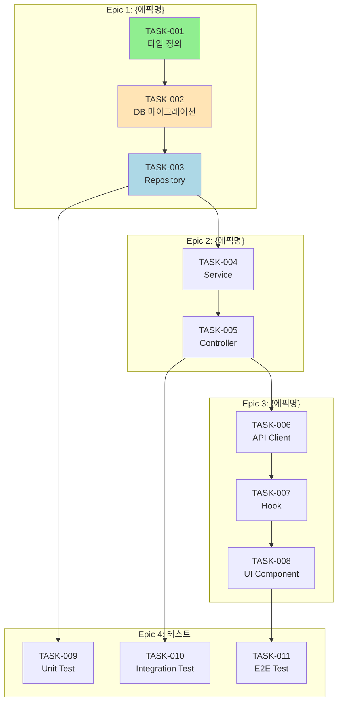

# 태스크 목록: {기능명}

## 문서 정보

| 항목 | 내용 |
|------|------|
| 작성자 | {작성자} |
| 작성일 | {날짜} |
| 총 태스크 | {n}개 |
| 상태 | In Progress |
| 관련 PRD | `docs/prd/{feature}/prd.md` |
| 관련 아키텍처 | `docs/architecture/system-architecture.md` |

---

## 목차

1. [진행 현황](#1-진행-현황)
2. [태스크 전체 목록](#2-태스크-전체-목록)
3. [Epic 상세](#3-epic-상세)
4. [의존성 다이어그램](#4-의존성-다이어그램)
5. [구현 순서 권장](#5-구현-순서-권장)
6. [진행 상황 추적](#6-진행-상황-추적)
7. [체크리스트](#7-체크리스트)

---

## 1. 진행 현황

### 1.1 요약

| 우선순위 | 설명 | 개수 | 완료 | 진행률 |
|---------|------|------|------|--------|
| **P0** (Critical) | 핵심 기능, 블로커 | {n} | {n} | {n}% |
| **P1** (High) | 중요 기능 | {n} | {n} | {n}% |
| **P2** (Medium) | 일반 기능 | {n} | {n} | {n}% |
| **P3** (Low) | Nice-to-have | {n} | {n} | {n}% |
| **합계** | | **{n}** | **{n}** | **{n}%** |

### 1.2 진행률 바

```
전체 진행률
████████████░░░░░░░░░░░░░░░░░  {n}% ({n}/{n})

P0 (Critical)
██████████████████████████████  100% ({n}/{n})

P1 (High)
████████████████░░░░░░░░░░░░░░  50% ({n}/{n})

P2 (Medium)
░░░░░░░░░░░░░░░░░░░░░░░░░░░░░░  0% ({n}/{n})
```

### 1.3 상태별 현황

| 상태 | 개수 | 태스크 ID |
|------|------|----------|
| ✅ DONE | {n} | TASK-001, TASK-002 |
| 🔄 IN PROGRESS | {n} | TASK-003 |
| ⏸️ BLOCKED | {n} | TASK-004 |
| ⬜ TODO | {n} | TASK-005, TASK-006, ... |

---

## 2. 태스크 전체 목록

### 2.1 Epic 1: {에픽명}

> {에픽 설명 - 이 에픽이 해결하는 문제나 제공하는 가치}

| ID | 태스크 | 우선순위 | 의존성 | 담당 | 상태 |
|----|--------|---------|--------|------|------|
| TASK-001 | {태스크 설명} | P0 | - | - | ⬜ TODO |
| TASK-002 | {태스크 설명} | P0 | TASK-001 | - | ⬜ TODO |
| TASK-003 | {태스크 설명} | P1 | TASK-002 | - | ⬜ TODO |

### 2.2 Epic 2: {에픽명}

> {에픽 설명}

| ID | 태스크 | 우선순위 | 의존성 | 담당 | 상태 |
|----|--------|---------|--------|------|------|
| TASK-004 | {태스크 설명} | P1 | TASK-003 | - | ⬜ TODO |
| TASK-005 | {태스크 설명} | P2 | TASK-004 | - | ⬜ TODO |

---

## 3. Epic 상세

### 3.1 Epic 1: {에픽명}

#### TASK-001: {태스크 제목}

**기본 정보**

| 항목 | 내용 |
|------|------|
| **ID** | TASK-001 |
| **우선순위** | P0 (Critical) |
| **의존성** | 없음 |
| **상태** | ⬜ TODO |
| **담당** | - |

**설명**

{태스크가 왜 필요한지, 무엇을 해야 하는지 상세 설명}

**User Story**

```
As a {사용자 유형}
I want to {원하는 기능}
So that {얻고자 하는 가치}
```

**Acceptance Criteria (Given-When-Then)**

```gherkin
Feature: {기능명}

  Scenario: {시나리오 1}
    Given {전제 조건}
    When {사용자 행동}
    Then {기대 결과}
    And {추가 결과}

  Scenario: {시나리오 2 - 예외 케이스}
    Given {전제 조건}
    When {예외적인 행동}
    Then {예외 처리 결과}
```

**Acceptance Criteria (체크리스트)**

- [ ] AC1: {검증 가능한 조건 1}
- [ ] AC2: {검증 가능한 조건 2}
- [ ] AC3: {검증 가능한 조건 3}
- [ ] AC4: 에러 케이스 처리됨
- [ ] AC5: 테스트 코드 작성됨

**기술 참고**

| 항목 | 참조 |
|------|------|
| 베스트 프랙티스 | `.claude/best-practices/{tech}.md` |
| API 스펙 | `docs/architecture/api-spec.md` |
| ERD | `docs/architecture/erd.md` |

**예상 파일**

```
src/
├── features/{feature}/
│   ├── types/{name}.types.ts
│   ├── services/{name}Service.ts
│   ├── hooks/use{Name}.ts
│   └── components/{Name}.tsx
└── tests/
    └── features/{feature}/
        └── {name}.test.ts
```

**구현 힌트**

```typescript
// 핵심 로직 스케치
interface Example {
  // ...
}

function example(): Example {
  // 1. 입력 검증
  // 2. 비즈니스 로직
  // 3. 결과 반환
}
```

**테스트 케이스**

| # | 케이스 | 입력 | 예상 결과 |
|---|--------|------|----------|
| 1 | 정상 케이스 | {입력} | {결과} |
| 2 | 빈 입력 | - | ValidationError |
| 3 | 권한 없음 | 미인증 | 401 Unauthorized |

**Definition of Done (DoD)**

- [ ] 모든 AC 충족
- [ ] 코드 리뷰 완료
- [ ] 단위 테스트 통과
- [ ] 통합 테스트 통과
- [ ] 문서화 완료

---

#### TASK-002: {태스크 제목}

**기본 정보**

| 항목 | 내용 |
|------|------|
| **ID** | TASK-002 |
| **우선순위** | P0 (Critical) |
| **의존성** | TASK-001 |
| **상태** | ⬜ TODO |
| **담당** | - |

**설명**

{태스크 상세 설명}

**User Story**

```
As a {사용자 유형}
I want to {원하는 기능}
So that {얻고자 하는 가치}
```

**Acceptance Criteria**

```gherkin
Scenario: {시나리오}
  Given {전제 조건}
  When {사용자 행동}
  Then {기대 결과}
```

- [ ] AC1: {조건 1}
- [ ] AC2: {조건 2}

**예상 파일**

- `src/features/{feature}/services/{name}Service.ts`
- `src/tests/{name}.test.ts`

---

### 3.2 Epic 2: {에픽명}

#### TASK-003: {태스크 제목}

{... 위와 동일한 형식 ...}

---

## 4. 의존성 다이어그램

### 4.1 전체 의존성



### 4.2 크리티컬 패스

```
TASK-001 → TASK-002 → TASK-003 → TASK-004 → TASK-005 → TASK-008
```

**병렬 가능 태스크:**
- TASK-009 (Unit Test) - TASK-003 완료 후 병렬 가능
- TASK-010 (Integration Test) - TASK-005 완료 후 병렬 가능

---

## 5. 구현 순서 권장

### 5.1 Phase 1: 기반 구조 (Foundation)

> 다른 모든 작업의 기반이 되는 타입, 스키마, 인프라 설정

| 순서 | 태스크 ID | 설명 | 우선순위 |
|------|----------|------|---------|
| 1 | TASK-001 | 타입/인터페이스 정의 | P0 |
| 2 | TASK-002 | DB 스키마 & 마이그레이션 | P0 |

**완료 기준**: 타입 정의 완료, DB 테이블 생성됨

### 5.2 Phase 2: 백엔드 (Backend)

> 데이터 접근 계층부터 API 계층까지 순차 구현

| 순서 | 태스크 ID | 설명 | 우선순위 |
|------|----------|------|---------|
| 3 | TASK-003 | Repository 구현 | P0 |
| 4 | TASK-004 | Service (비즈니스 로직) 구현 | P0 |
| 5 | TASK-005 | Controller/Handler 구현 | P1 |

**완료 기준**: API 엔드포인트 동작, Postman/curl 테스트 통과

### 5.3 Phase 3: 프론트엔드 (Frontend)

> API 클라이언트부터 UI 컴포넌트까지 순차 구현

| 순서 | 태스크 ID | 설명 | 우선순위 |
|------|----------|------|---------|
| 6 | TASK-006 | API Service/Client 구현 | P1 |
| 7 | TASK-007 | Custom Hook 구현 | P1 |
| 8 | TASK-008 | UI Component 구현 | P1 |

**완료 기준**: UI 렌더링, 사용자 인터랙션 동작

### 5.4 Phase 4: 테스트 (Testing)

> 각 레이어별 테스트 작성

| 순서 | 태스크 ID | 설명 | 우선순위 |
|------|----------|------|---------|
| 9 | TASK-009 | Unit Test | P1 |
| 10 | TASK-010 | Integration Test | P2 |
| 11 | TASK-011 | E2E Test | P2 |

**완료 기준**: 테스트 커버리지 80% 이상

### 5.5 Phase 5: 마무리 (Finalization)

| 순서 | 태스크 ID | 설명 | 우선순위 |
|------|----------|------|---------|
| 12 | TASK-012 | 문서화 | P2 |
| 13 | TASK-013 | 성능 최적화 | P3 |
| 14 | TASK-014 | 배포 설정 | P2 |

---

## 6. 진행 상황 추적

### 6.1 완료된 태스크

| 태스크 | 완료일 | 소요 시간 | 비고 |
|--------|--------|----------|------|
| ~~TASK-001: 타입 정의~~ | 2024-01-15 | 2h | - |
| ~~TASK-002: DB 마이그레이션~~ | 2024-01-15 | 3h | 인덱스 추가 |

### 6.2 진행 중

| 태스크 | 시작일 | 진행률 | 예상 완료 |
|--------|--------|--------|----------|
| TASK-003: Repository 구현 | 2024-01-16 | 60% | 2024-01-16 |

**현재 작업 내용:**
- [x] CRUD 기본 메서드 구현
- [ ] 복잡 쿼리 구현 중
- [ ] 트랜잭션 처리

### 6.3 블로커

| 태스크 | 블로커 | 담당 | 예상 해결일 |
|--------|--------|------|-----------|
| TASK-004 | 외부 API 스펙 미확정 | {담당자} | 2024-01-17 |

**블로커 상세:**

**TASK-004 블로커: 외부 API 스펙 미확정**
- **상황**: 결제 PG사 API 문서 대기 중
- **영향**: 결제 서비스 구현 지연
- **대안**: Mock 서비스로 우선 개발, 추후 교체
- **담당**: {담당자}
- **예상 해결**: 2024-01-17

### 6.4 리스크

| 리스크 | 가능성 | 영향도 | 대응 |
|--------|--------|--------|------|
| 외부 API 지연 | 높음 | 중간 | Mock 서비스 준비 |
| 성능 이슈 | 중간 | 높음 | 조기 성능 테스트 |
| 스펙 변경 | 낮음 | 높음 | 변경 관리 프로세스 |

---

## 7. 체크리스트

### 7.1 태스크 분해 체크리스트

#### 태스크 정의
- [ ] 모든 태스크가 명확한 범위를 가짐
- [ ] 각 태스크가 독립적으로 테스트 가능
- [ ] 태스크 크기가 적절함 (1-8시간)
- [ ] 의존성이 명확히 정의됨

#### Acceptance Criteria
- [ ] 모든 태스크에 AC 정의됨
- [ ] AC가 검증 가능하고 명확함
- [ ] Given-When-Then 형식 사용 (권장)
- [ ] 예외 케이스 포함됨

#### 우선순위
- [ ] P0: 핵심 기능, 블로커
- [ ] P1: 중요하지만 우회 가능
- [ ] P2: 일반 기능
- [ ] P3: Nice-to-have

### 7.2 태스크 완료 체크리스트

각 태스크 완료 시:

- [ ] 모든 Acceptance Criteria 충족
- [ ] 코드 리뷰 완료
- [ ] 단위 테스트 작성 및 통과
- [ ] 통합 테스트 통과 (해당 시)
- [ ] 문서화 완료 (해당 시)
- [ ] worktree 상태 업데이트

---

## 금지 사항

### 태스크 분해 시 하지 말아야 할 것

1. **범위**
   - 하루 이상 걸리는 거대한 태스크 생성 금지
   - 범위가 모호한 태스크 생성 금지 ("개선", "리팩토링" 등 막연한 표현)
   - 여러 기능을 하나의 태스크로 묶기 금지

2. **Acceptance Criteria**
   - AC 없이 태스크 생성 금지
   - 검증 불가능한 AC 작성 금지 ("성능 향상" → "응답 시간 200ms 이하")
   - 주관적인 AC 작성 금지 ("사용하기 쉬운" → 구체적 UX 요구사항)

3. **의존성**
   - 순환 의존성 생성 금지
   - 암묵적 의존성 (문서화하지 않은 의존성) 금지
   - 불필요한 의존성 생성 금지

4. **상태 관리**
   - 완료되지 않은 태스크를 DONE으로 표시 금지
   - 블로커 없이 태스크를 BLOCKED로 표시 금지
   - 진행 상황 업데이트 없이 장기간 IN PROGRESS 유지 금지

5. **기타**
   - 테스트 태스크를 별도로 분리하지 않고 "구현 시 테스트 포함" 금지
   - 문서화를 마지막에 몰아서 하기 금지

---

## 참조 문서

### 설계 문서
- `docs/prd/{feature}/prd.md` - PRD
- `docs/architecture/system-architecture.md` - 아키텍처
- `docs/architecture/erd.md` - ERD
- `docs/architecture/api-spec.md` - API 스펙

### 베스트 프랙티스
- `.claude/best-practices/typescript.md`
- `.claude/best-practices/react.md`
- `.claude/best-practices/testing.md`

### 관련 명령어
- `/dev build TASK-001` - 태스크 구현 시작
- `/worktree start TASK-001` - 태스크 시작 추적
- `/worktree done TASK-001` - 태스크 완료 표시

---

*구현 시작: `/dev build TASK-001`*
