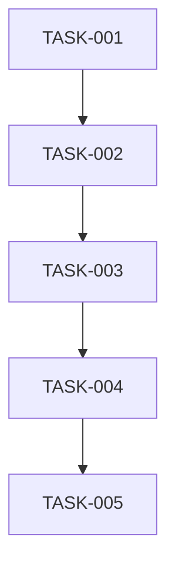

# 태스크 목록: {기능명}

## 문서 정보

| 항목 | 내용 |
|------|------|
| 작성일 | {날짜} |
| 총 태스크 | {n}개 |
| 상태 | In Progress |

---

## 요약

| 우선순위 | 개수 | 완료 |
|---------|------|------|
| P0 (Critical) | {n} | {n} |
| P1 (High) | {n} | {n} |
| P2 (Medium) | {n} | {n} |
| P3 (Low) | {n} | {n} |
| **합계** | **{n}** | **{n}** |

**진행률**: {n}%

```
████████████░░░░░░░░░░░░░░░░░  {n}%
```

---

## Epic 1: {에픽명}

### Story 1.1: {스토리명}

| ID | 태스크 | 우선순위 | 의존성 | 상태 |
|----|--------|---------|--------|------|
| TASK-001 | {태스크 설명} | P0 | - | TODO |
| TASK-002 | {태스크 설명} | P0 | TASK-001 | TODO |
| TASK-003 | {태스크 설명} | P1 | TASK-002 | TODO |

---

### TASK-001: {태스크 제목}

**우선순위**: P0 (Critical)
**의존성**: 없음
**상태**: TODO

**설명**:
{태스크 상세 설명}

**Acceptance Criteria**:
- [ ] {조건 1}
- [ ] {조건 2}
- [ ] {조건 3}

**기술 참고**:
- `.claude/best-practices/{tech}.md`

**예상 파일**:
- `src/features/{feature}/types/{name}.types.ts`
- `src/features/{feature}/services/{name}Service.ts`

---

### TASK-002: {태스크 제목}

**우선순위**: P0 (Critical)
**의존성**: TASK-001
**상태**: TODO

**설명**:
{태스크 상세 설명}

**Acceptance Criteria**:
- [ ] {조건 1}
- [ ] {조건 2}

---

## Epic 2: {에픽명}

### Story 2.1: {스토리명}

| ID | 태스크 | 우선순위 | 의존성 | 상태 |
|----|--------|---------|--------|------|
| TASK-004 | {태스크 설명} | P1 | TASK-003 | TODO |
| TASK-005 | {태스크 설명} | P2 | TASK-004 | TODO |

---

## 의존성 다이어그램



---

## 구현 순서 권장

### Phase 1: 기반 구조

| 순서 | 태스크 ID | 설명 |
|------|----------|------|
| 1 | TASK-001 | 타입 정의 |
| 2 | TASK-002 | DB 마이그레이션 |

### Phase 2: 백엔드

| 순서 | 태스크 ID | 설명 |
|------|----------|------|
| 3 | TASK-003 | Repository 구현 |
| 4 | TASK-004 | Service 구현 |
| 5 | TASK-005 | Controller 구현 |

### Phase 3: 프론트엔드

| 순서 | 태스크 ID | 설명 |
|------|----------|------|
| 6 | TASK-006 | API Service 구현 |
| 7 | TASK-007 | Custom Hook 구현 |
| 8 | TASK-008 | UI Component 구현 |

### Phase 4: 테스트

| 순서 | 태스크 ID | 설명 |
|------|----------|------|
| 9 | TASK-009 | Unit Test |
| 10 | TASK-010 | Integration Test |

---

## 진행 상황 추적

### 완료된 태스크

- [x] TASK-001: {설명} - 완료일: {날짜}

### 진행 중

- [ ] TASK-002: {설명} - 진행률: {n}%

### 블로커

| 태스크 | 블로커 | 담당 |
|--------|--------|------|
| TASK-003 | {블로커 설명} | {담당자} |

---

## 참조 문서

- `docs/prd/{feature}/prd.md` - PRD
- `docs/architecture/system-architecture.md` - 아키텍처
- `docs/architecture/erd.md` - ERD
- `docs/architecture/api-spec.md` - API 스펙

---

*구현 시작: /dev-implement TASK-001*
