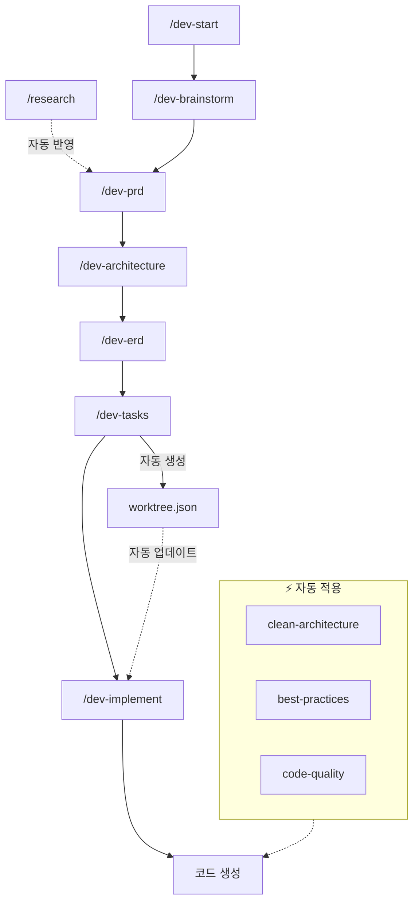

# 원더 무브 연구소 Claude Plug-in

> **어떤 상황에서든 동일한 개발 품질을 보장하는** 업무 자동화 플러그인

---

## CRITICAL RULES (절대 무시 금지)

이 섹션의 규칙들은 **모든 응답에서 반드시 준수**해야 합니다.
컨텍스트가 compact되더라도 이 규칙들을 잊지 마세요.

### 핵심 규칙 요약

1. **컨텍스트 유지**: 작업 시작 전 `.claude/memory/CURRENT_CONTEXT.md` 확인 필수
2. **규칙 준수**: 코드 작성 전 `.claude/memory/PROJECT_RULES.md` 참조 필수
3. **진행 상황 저장**: 중요 진행점마다 `/save-progress` 실행 권장
4. **작업 스택 유지**: 하위 작업 진입 시 상위 작업 목표 기억
5. **Worktree 추적**: 태스크 진행 시 `/worktree` 상태 자동 업데이트

상세 규칙은 `.claude/memory/PROJECT_RULES.md` 참조

---

## 빠른 시작

```bash
# 상황 1: 새 프로젝트 시작
/dev-start [아이디어]

# 상황 2: 기존 프로젝트 투입
/onboard

# 상황 3: 작업 재개 (세션 시작, Compact 후)
/restore-context
```

---

## 주요 명령어

### 개발 워크플로우

| 명령어 | 설명 |
|--------|------|
| `/dev-start` | 전체 워크플로우 시작 (브레인스토밍 → PRD → 설계 → 구현) |
| `/dev-brainstorm` | 아이디어 브레인스토밍 |
| `/dev-prd` | PRD 문서 작성 (리서치 결과 자동 반영) |
| `/dev-architecture` | 시스템 아키텍처 설계 |
| `/dev-erd` | ERD 데이터 모델 설계 |
| `/dev-tasks` | 구현 태스크 분해 → worktree.json 자동 생성 |
| `/dev-implement [task-id]` | 태스크 구현 |
| `/dev-status` | 진행 상황 확인 |

### 클린 아키텍처

| 명령어 | 설명 |
|--------|------|
| `/clean-init` | 4-레이어 디렉토리 구조 초기화 |
| `/clean-entity <name>` | 도메인 엔티티 생성 |
| `/clean-usecase <name>` | 유스케이스 생성 |
| `/clean-validate` | 아키텍처 규칙 검증 |

### 프로젝트 온보딩

| 명령어 | 설명 |
|--------|------|
| `/onboard` | 전체 프로젝트 분석 → 5개 컨텍스트 문서 생성 |
| `/onboard-quick` | 빠른 분석 (핵심만) |
| `/learn <path>` | 특정 영역 심층 학습 |
| `/context-refresh` | 컨텍스트 문서 갱신 |
| `/context-show` | 현재 컨텍스트 표시 |

### 리서치

| 명령어 | 설명 |
|--------|------|
| `/research <주제>` | 심층 리서치 (5-10회 자동 검색 + 핵심 요약) |
| `/research <주제> --quick` | 빠른 리서치 (3회 검색) |
| `/research <주제> --deep` | 심층 리서치 (10회 검색) |

### Worktree (작업 추적)

| 명령어 | 설명 |
|--------|------|
| `/worktree` | 현재 작업 트리 표시 |
| `/worktree status` | 상태 요약 (진행률, 통계) |
| `/worktree start <task-id>` | 태스크 시작 |
| `/worktree done <task-id>` | 태스크 완료 |
| `/worktree block <task-id> "사유"` | 블로커 등록 |

### 컨텍스트 관리

| 명령어 | 설명 |
|--------|------|
| `/restore-context` | 핵심 규칙 + 작업 상태 복원 |
| `/save-progress [메시지]` | 현재 진행 상황 저장 |
| `/show-rules` | 전체 프로젝트 규칙 표시 |

### 코드 품질

| 명령어 | 설명 |
|--------|------|
| `/check-quality` | 전체 프로젝트 품질 검사 |

---

## 자동 활성화 스킬

다음 스킬들이 키워드 감지 시 자동으로 활성화됩니다:

| 스킬 | 활성화 키워드 | 동작 |
|------|--------------|------|
| `project-rules` | 코드 작성, 수정, 리뷰 | 프로젝트 규칙 자동 참조 |
| `work-tracker` | 작업 시작, 전환, 완료 | 작업 상태 + Worktree 자동 추적 |
| `code-quality` | 코드 생성, 함수 추가 | 300줄 제한, 주석 필수 적용 |
| `dev-workflow` | 새 기능 개발, 프로젝트 시작 | 개발 워크플로우 안내 |
| `best-practices` | React, Node.js, TypeScript 개발 | 기술별 베스트 프랙티스 적용 |
| `clean-architecture` | 코드 구현, 클래스 생성 | 클린 아키텍처 강제 |
| `project-onboarding` | 프로젝트 분석, 코드베이스 학습 | 컨텍스트 문서 참조 |
| `research` | 리서치, 조사, 알아봐, 찾아봐 | 다각도 검색 + 핵심 요약 |

---

## 플러그인 통합 플로우



---

## Compact 발생 시 대응

컨텍스트가 압축되면 다음을 수행하세요:

1. `/restore-context` 실행
2. 복원된 규칙과 작업 상태 확인
3. 필요시 `/worktree` 로 진행 상황 확인
4. 작업 재개

---

## 프로젝트 구조

```
project/
├── CLAUDE.md                    # 이 파일 (항상 로드됨)
├── README.md                    # 상세 문서
│
├── .claude/
│   ├── memory/                  # 영구 메모리
│   │   ├── PROJECT_RULES.md     # 프로젝트 규칙
│   │   ├── CURRENT_CONTEXT.md   # 현재 작업 컨텍스트
│   │   └── WORK_HISTORY.md      # 작업 히스토리
│   │
│   ├── project-context/         # 온보딩 생성 컨텍스트
│   │   ├── PROJECT_SUMMARY.md
│   │   ├── ARCHITECTURE.md
│   │   ├── CODE_PATTERNS.md
│   │   ├── CONVENTIONS.md
│   │   └── DOMAIN_KNOWLEDGE.md
│   │
│   ├── research/                # 리서치 결과
│   │   └── {topic}/
│   │       ├── report.md
│   │       ├── summary.md
│   │       └── sources.md
│   │
│   ├── skills/                  # 자동 활성화 스킬 (8개)
│   ├── commands/                # 슬래시 커맨드 (26개+)
│   ├── hooks/                   # 이벤트 훅
│   ├── best-practices/          # 기술별 베스트 프랙티스
│   ├── templates/               # 문서 템플릿
│   └── agents/                  # 서브에이전트
│
├── .claude-state/               # 런타임 상태
│   └── worktree.json            # 작업 트리 상태
│
├── docs/                        # 생성된 문서
└── requirement/                 # PRD 및 요구사항
```

---

## 상세 문서

전체 명령어 레퍼런스, 사용 예시, 트러블슈팅은 `README.md` 참조
