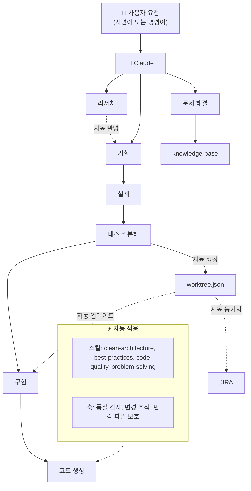

# 원더 무브 연구소 Claude Plug-in

> **어떤 상황에서든 동일한 개발 품질을 보장하는** 업무 자동화 플러그인

---

## CRITICAL RULES (절대 무시 금지)

이 섹션의 규칙들은 **모든 응답에서 반드시 준수**해야 합니다.
컨텍스트가 compact되더라도 이 규칙들을 잊지 마세요.

### 핵심 규칙 요약

1. **컨텍스트 유지**: 작업 시작 전 `.claude/memory/CURRENT_CONTEXT.md` 확인 필수
2. **규칙 준수**: 코드 작성 전 `.claude/memory/PROJECT_RULES.md` 참조 필수
3. **🚨 작업 내용 상세 기록**: 의미 있는 작업 완료 시 Memory에 직접 기록 (아래 참조)
4. **작업 스택 유지**: 하위 작업 진입 시 상위 작업 목표 기억
5. **Worktree 추적**: 소스 코드 수정 시 자동 시작 (완료는 수동)
6. **UI/UX 필수**: ShadCN/UI 컴포넌트 우선 사용, 커스터마이징 시 문서화 필수

### 🚨 Memory 상세 기록 규칙 (절대 준수)

**Hook은 파일 변경만 감지합니다. Claude가 실제로 무슨 작업을 했는지는 Claude 자신만 알 수 있습니다.**

**의미 있는 작업 완료 시** (단순 조회/검색 제외) 다음을 직접 기록해야 합니다:

**기록 위치:** `.claude/memory/CURRENT_CONTEXT.md` 작업 스택 섹션

**기록 형식:**
```markdown
- [HH:MM] **[카테고리]** 작업 제목
  - **목적**: 왜 이 작업을 했는지
  - **수행**: 구체적으로 무엇을 했는지
  - **변경**: 수정/생성한 파일 목록
  - **결과**: 성공/실패, 발견한 문제
  - **다음**: 후속 작업 (있다면)
```

**카테고리:** 구현, 수정, 버그픽스, 리팩토링, 설계, 문서화, 테스트, 문제해결

**예시:**
```markdown
- [17:30] **[문제해결]** Memory 기록 품질 개선
  - **목적**: Memory에 기록되는 내용이 허접해서 작업 추적 불가
  - **수행**: work-tracker 스킬에 상세 기록 의무 추가, CLAUDE.md 규칙 강화
  - **변경**: SKILL.md, CLAUDE.md
  - **결과**: ✅ Claude가 직접 상세 기록하도록 규칙 강화 완료
  - **다음**: 실제 작업에서 테스트 필요
```

### UI/UX 규칙 (절대 준수)

- **ShadCN/UI** (https://github.com/shadcn-ui/ui) 표준 컴포넌트 라이브러리로 사용
- UI 작업 시 기존 ShadCN 컴포넌트 **우선 확인 후 사용**
- 컴포넌트 커스터마이징 시 **변경 사항 문서화 필수** (무엇을, 왜 변경했는지)

상세 규칙은 `.claude/memory/PROJECT_RULES.md` 참조

---

## 사용 방법

사용자는 **자연어** 또는 **명령어 직접 입력** 두 가지 방식으로 요청할 수 있습니다.

```
사용 방식 1: 자연어
→ "사용자 인증 시스템 기획해줘"
→ "OAuth 2.0에 대해 조사해줘"

사용 방식 2: 명령어 직접 입력
→ /dev plan 사용자 인증
→ /research OAuth 2.0
→ /onboard
```

---

## 빠른 시작

### 상황 1: 새 프로젝트 시작
| 자연어 | 명령어 직접 입력 |
|--------|----------------|
| "사용자 인증 시스템 기획해줘" | `/dev plan 사용자 인증` |

### 상황 2: 기존 프로젝트 투입
| 자연어 | 명령어 직접 입력 |
|--------|----------------|
| "이 프로젝트 분석해줘" | `/onboard` |

### 상황 3: 작업 재개 (세션 시작, Compact 후)
| 자연어 | 명령어 직접 입력 |
|--------|----------------|
| "이전 컨텍스트 복원해줘" | `/restore-context` |

### 상황 4: 버그/에러 체계적 해결
| 자연어 | 명령어 직접 입력 |
|--------|----------------|
| "로그인 에러 해결해줘" | `/solve 로그인 에러` |

### 옵션 사용법

명령어 옵션도 자연어로 표현할 수 있습니다:

| 옵션 표현 | 자연어 대안 |
|----------|------------|
| `/research OAuth --quick` | "OAuth 빠르게 알아봐줘" |
| `/research OAuth --deep` | "OAuth 자세히 조사해줘" |
| `/dev plan --brainstorm` | "브레인스토밍해줘" |
| `/dev build TASK-001 --tdd` | "TDD로 구현해줘" |
| `/save-progress "메시지"` | "메시지로 저장해줘" |
| `/solve 에러 --5whys` | "5 Whys로 분석해줘" |
| `/solve-history DB` | "DB 관련 해결 이력 보여줘" |

---

## 전체 명령어 요약

| 카테고리 | 명령어 | 옵션 | 자연어 | 설명 |
|----------|--------|------|--------|------|
| **개발 워크플로우** | `/dev plan [기능]` | `--brainstorm`, `--prd` | "기획해줘" | 브레인스토밍 + PRD |
| | `/dev design` | `--arch`, `--erd` | "설계해줘" | 아키텍처 + ERD |
| | `/dev tasks` | - | "태스크 분해해줘" | 태스크 목록 생성 |
| | `/dev build [task-id]` | `--tdd` | "구현해줘" | 태스크 구현 |
| | `/dev status` | - | "진행 상황 보여줘" | 진행률 확인 |
| **클린 아키텍처** | `/clean-init` | - | "클린 아키텍처 만들어줘" | 4-레이어 구조 초기화 |
| | `/clean-entity [name]` | - | "엔티티 만들어줘" | 도메인 엔티티 생성 |
| | `/clean-usecase [name]` | - | "유스케이스 만들어줘" | 유스케이스 생성 |
| | `/clean-validate` | - | "아키텍처 검증해줘" | 의존성 검증 |
| **온보딩** | `/onboard` | - | "프로젝트 분석해줘" | 5개 컨텍스트 문서 생성 |
| | `/onboard-quick` | - | "빠르게 파악해줘" | 핵심만 빠른 분석 |
| | `/learn [path]` | - | "폴더 분석해줘" | 특정 영역 심층 학습 |
| | `/context-refresh` | - | "컨텍스트 업데이트해줘" | 문서 갱신 |
| | `/context-show` | - | "컨텍스트 보여줘" | 컨텍스트 표시 |
| **리서치** | `/research [주제]` | `--quick`, `--deep` | "조사해줘" | 5-10회 검색 + 핵심 요약 |
| **Worktree** | `/worktree` | - | "작업 트리 보여줘" | 트리 구조 시각화 |
| | `/worktree status` | - | "진행률 보여줘" | 상태 요약 |
| | `/worktree start [id]` | - | "시작해줘" | 태스크 시작 |
| | `/worktree done [id]` | - | "완료" | 태스크 완료 |
| | `/worktree block [id] [사유]` | - | "블로킹됨" | 블로커 등록 |
| | `/worktree reset` | - | "작업 초기화해줘" | 트리 초기화 |
| **컨텍스트 관리** | `/restore-context` | - | "컨텍스트 복원해줘" | 규칙 + 작업 상태 복원 |
| | `/save-progress [메시지]` | - | "저장해줘" | 체크포인트 저장 |
| | `/show-rules` | - | "규칙 보여줘" | 전체 규칙 표시 |
| **코드 품질** | `/check-quality` | - | "품질 검사해줘" | 전체 프로젝트 검사 |
| **문제 해결** | `/solve [문제]` | `--5whys`, `--rca`, `--hypothesis`, `--binary` | "해결해줘" | 체계적 문제 분석 |
| | `/solve-log` | - | "분석 로그 보여줘" | 진행 중 문제 확인 |
| | `/solve-history [키워드]` | `--recent`, `--keyword` | "해결 이력 보여줘" | 과거 사례 검색 |
| | `/solve-report [id]` | `--draft`, `--summary`, `--full` | "보고서 만들어줘" | 해결 보고서 생성 |
| **JIRA 연동** | `/jira-init [key]` | - | "JIRA 연결해줘" | 연동 초기화 |
| | `/jira-push` | - | "JIRA로 동기화해줘" | Worktree → JIRA |
| | `/jira-pull` | - | "JIRA에서 가져와줘" | JIRA → Worktree |
| | `/jira-sync` | - | "양방향 동기화해줘" | 양방향 동기화 |
| | `/jira-link [id] [key]` | - | "JIRA에 연결해줘" | 수동 매핑 |
| | `/jira-status` | - | "JIRA 상태 보여줘" | 상태 확인 |

---

## 주요 기능

### 개발 워크플로우

순서대로 진행되는 체계적인 개발 프로세스입니다:


| 명령어 | 옵션 | 자연어 | 설명 |
|--------|------|--------|------|
| `/dev plan [기능]` | `--brainstorm`, `--prd` | "결제 시스템 기획해줘" | 브레인스토밍 + PRD |
| `/dev design` | `--arch`, `--erd` | "아키텍처 설계해줘" | 아키텍처 + ERD |
| `/dev tasks` | - | "태스크 분해해줘" | 태스크 목록 생성 |
| `/dev build [task-id]` | `--tdd` | "TASK-001 구현해줘" | 태스크 구현 |
| `/dev status` | - | "진행 상황 보여줘" | 진행률 확인 |

### 클린 아키텍처

| 명령어 | 옵션 | 자연어 | 설명 |
|--------|------|--------|------|
| `/clean-init` | - | "클린 아키텍처 구조 만들어줘" | 4-레이어 구조 초기화 |
| `/clean-entity [name]` | - | "User 엔티티 만들어줘" | 도메인 엔티티 생성 |
| `/clean-usecase [name]` | - | "CreateUser 유스케이스 만들어줘" | 유스케이스 생성 |
| `/clean-validate` | - | "아키텍처 규칙 검증해줘" | 의존성 검증 |

### 프로젝트 온보딩

| 명령어 | 옵션 | 자연어 | 설명 |
|--------|------|--------|------|
| `/onboard` | - | "이 프로젝트 분석해줘" | 5개 컨텍스트 문서 생성 |
| `/onboard-quick` | - | "프로젝트 빠르게 파악해줘" | 핵심만 빠른 분석 |
| `/learn [path]` | - | "src/services 폴더 분석해줘" | 특정 영역 심층 학습 |
| `/context-refresh` | - | "컨텍스트 문서 업데이트해줘" | 문서 갱신 |
| `/context-show` | - | "현재 컨텍스트 보여줘" | 컨텍스트 표시 |

### 리서치

| 명령어 | 옵션 | 자연어 | 설명 |
|--------|------|--------|------|
| `/research [주제]` | - | "OAuth 2.0에 대해 조사해줘" | 5-10회 검색 + 핵심 요약 |
| `/research [주제]` | `--quick` | "JWT 빠르게 알아봐줘" | 3회 검색 |
| `/research [주제]` | `--deep` | "클린 아키텍처 자세히 조사해줘" | 10회 검색 |

### Worktree (작업 추적)

| 명령어 | 옵션 | 자연어 | 설명 |
|--------|------|--------|------|
| `/worktree` | - | "현재 작업 트리 보여줘" | 트리 구조 시각화 |
| `/worktree status` | - | "진행률 보여줘" | 상태 요약 |
| `/worktree start [task-id]` | - | "TASK-001 시작해줘" | 태스크 시작 |
| `/worktree done [task-id]` | - | "TASK-001 완료" | 태스크 완료 |
| `/worktree block [task-id] [사유]` | - | "TASK-001 블로킹됨, API 대기중" | 블로커 등록 |
| `/worktree reset` | - | "작업 트리 초기화해줘" | 트리 초기화 |

### 컨텍스트 관리

| 명령어 | 옵션 | 자연어 | 설명 |
|--------|------|--------|------|
| `/restore-context` | - | "이전 컨텍스트 복원해줘" | 규칙 + 작업 상태 복원 |
| `/save-progress [메시지]` | - | "현재 상태 저장해줘" | 체크포인트 저장 |
| `/show-rules` | - | "프로젝트 규칙 보여줘" | 전체 규칙 표시 |

### 코드 품질

| 명령어 | 옵션 | 자연어 | 설명 |
|--------|------|--------|------|
| `/check-quality` | - | "코드 품질 검사해줘" | 전체 프로젝트 검사 |

### 문제 해결

체계적인 방법론(5 Whys, RCA, 가설 기반)으로 문제를 분석하고 해결합니다:


| 명령어 | 옵션 | 자연어 | 설명 |
|--------|------|--------|------|
| `/solve [문제]` | `--5whys`, `--rca`, `--hypothesis`, `--binary` | "에러 해결해줘" | 6단계 문제 해결 |
| `/solve-log` | - | "분석 진행 상황 보여줘" | 진행 중 문제 확인 |
| `/solve-history [키워드]` | `--recent`, `--keyword` | "과거 해결 사례 검색해줘" | 유사 문제 검색 |
| `/solve-report [id]` | `--draft`, `--summary`, `--full` | "해결 보고서 만들어줘" | 보고서 생성 |

### JIRA 연동

**사전 설정 (터미널에서):**
```bash
export JIRA_EMAIL='your-email@company.com'
export JIRA_API_TOKEN='your-api-token'
```

| 명령어 | 옵션 | 자연어 | 설명 |
|--------|------|--------|------|
| `/jira-init [project-key]` | - | "JIRA AUTH 프로젝트 연결해줘" | 연동 초기화 |
| `/jira-push` | - | "JIRA로 동기화해줘" | Worktree → JIRA |
| `/jira-pull` | - | "JIRA에서 가져와줘" | JIRA → Worktree |
| `/jira-sync` | - | "JIRA 양방향 동기화해줘" | 양방향 동기화 |
| `/jira-link [task-id] [jira-key]` | - | "TASK-001을 AUTH-123에 연결해줘" | 수동 매핑 |
| `/jira-status` | - | "JIRA 연동 상태 보여줘" | 상태 확인 |

---

## 자동 동작 (Hooks) - 완전 패시브

다음 기능들은 **이벤트 발생 시 자동으로 실행**됩니다. **사용자가 별도로 저장하거나 기록할 필요 없이** 모든 것이 자동으로 관리됩니다.

### Memory 완전 자동화

| 트리거 | 자동 동작 | 저장 위치 |
|--------|----------|----------|
| **사용자 입력 (자연어 + 슬래시 명령어)** | 작업 의도 감지 → 현재 목표 자동 업데이트 | `.claude/memory/CURRENT_CONTEXT.md` |
| **모든 프롬프트** | 히스토리 자동 기록 (명령어 + 자연어) | `.claude-state/prompt_history.json` |
| **응답 완료** | 변경 파일 분석 → 작업 내용 자동 기록 | `.claude/memory/CURRENT_CONTEXT.md` |
| **파일 수정** | 파일 카테고리 분류 → 변경 이력 기록 | `.claude-state/recent_changes.json` |
| **세션 시작** | 이전 컨텍스트 안내 | 콘솔 출력 |
| **Context Compact** | 체크포인트 자동 저장 | `.claude-state/checkpoint.json` |

### 기타 자동 동작

| 트리거 | 자동 동작 | 관련 파일 |
|--------|----------|----------|
| **파일 수정 (Edit/Write)** | 코드 품질 검사 | 300줄 초과, 주석 누락 경고 |
| **소스 코드 수정** | worktree 태스크 자동 시작 (in_progress) | `.claude-state/worktree.json` |
| **파일 수정 (Edit/Write)** | JIRA 이슈 상태 자동 업데이트 | JIRA 연동 활성화 시 |
| **민감 파일 수정 시도** | 자동 차단 | `.env`, `credentials` 등 |
| **알림 발생** | 데스크톱 알림 + 로그 기록 | `.claude-state/notifications.log` |
| **서브에이전트 시작/종료** | 에이전트 사용 추적 | `.claude-state/subagent_stats.json` |

---

## 자동 활성화 스킬

다음 스킬들은 **키워드 감지 시 자동으로 적용**됩니다.
사용자가 별도로 요청하지 않아도 Claude가 자동으로 활성화합니다.

| 스킬 | 활성화 조건 | 자동 동작 |
|------|------------|----------|
| `project-rules` | 코드 작성, 수정, 리뷰 시 | 프로젝트 규칙 자동 참조 |
| `work-tracker` | 작업 시작, 전환, 완료 언급 시 | Worktree 추적 (시작 자동, 완료는 수동) |
| `code-quality` | 코드 생성, 함수 추가 시 | 300줄 제한, 주석 필수 적용 |
| `dev-workflow` | 기능 개발, 설계 언급 시 | 개발 워크플로우 안내 |
| `best-practices` | React, TypeScript, TDD 언급 시 | 기술별 베스트 프랙티스 적용 |
| `clean-architecture` | 클래스 생성, 레이어 언급 시 | 클린 아키텍처 강제 |
| `project-onboarding` | 프로젝트 분석 요청 시 | 컨텍스트 문서 참조 |
| `research-skill` | 조사, 알아봐, 리서치 언급 시 | 다각도 검색 + 핵심 요약 |
| `problem-solving` | 에러, 버그, 문제, 디버깅 언급 시 | 체계적 문제 해결 방법론 적용 |
| `jira-integration` | JIRA, 이슈, 티켓 언급 시 | JIRA 양방향 동기화 |

---

## 플러그인 통합 플로우



**핵심 자동 연동:**

| 트리거 | 자동 동작 |
|--------|----------|
| 리서치 완료 | PRD 작성 시 자동 반영 |
| 태스크 분해 | `worktree.json` 자동 생성 |
| worktree 변경 | JIRA 이슈 상태 자동 동기화 |
| 코드 작성 | 품질 검사 + 베스트 프랙티스 자동 적용 |
| 민감 파일 수정 | `.env`, `credentials` 등 자동 차단 |

---

## Compact 발생 시 대응

컨텍스트가 압축되면:

1. "이전 컨텍스트 복원해줘" 또는 `/restore-context` 실행
2. 복원된 규칙과 작업 상태 확인
3. 필요시 "진행 상황 보여줘" 로 상태 확인
4. 작업 재개

---

## 프로젝트 구조

```
project/
├── CLAUDE.md                    # 이 파일 (항상 로드됨)
├── README.md                    # 상세 문서
│
├── .claude/
│   ├── settings.json            # 훅 설정 (핵심)
│   ├── memory/                  # 영구 메모리
│   │   ├── PROJECT_RULES.md     # 프로젝트 규칙
│   │   ├── CURRENT_CONTEXT.md   # 현재 작업 컨텍스트
│   │   └── WORK_HISTORY.md      # 작업 히스토리
│   │
│   ├── project-context/         # 온보딩 생성 컨텍스트 (5개)
│   ├── research/                # 리서치 결과
│   ├── integrations/            # 외부 시스템 연동 (JIRA)
│   ├── skills/                  # 자동 활성화 스킬 (10개)
│   ├── commands/                # 슬래시 명령어 (30개)
│   ├── problem-solving/         # 문제 해결 지식 베이스
│   ├── hooks/                   # 이벤트 훅 (11개)
│   ├── best-practices/          # 기술별 베스트 프랙티스 (9개)
│   ├── templates/               # 문서 템플릿 (9개)
│   └── agents/                  # 서브에이전트 (2개)
│
├── .claude-state/               # 런타임 상태 (자동 관리, .gitignore)
│   ├── worktree.json            # 작업 트리 상태 (on-demand)
│   ├── jira_mapping.json        # JIRA ID 매핑 (on-demand)
│   ├── checkpoint.json          # 체크포인트
│   ├── checkpoint_history.json  # 체크포인트 히스토리
│   ├── recent_changes.json      # 최근 변경 파일 이력
│   ├── prompt_history.json      # 프롬프트 히스토리 (자연어 + 명령어)
│   ├── session_stats.json       # 세션 통계
│   ├── file_stats.json          # 파일 변경 통계
│   ├── subagent_stats.json      # 서브에이전트 통계
│   ├── subagent.log             # 서브에이전트 로그
│   ├── quality_violations.json  # 코드 품질 위반 기록
│   ├── activity.log             # 활동 로그
│   └── notifications.log        # 알림 로그
│
└── docs/                        # 생성된 문서 (PRD, 아키텍처, 태스크)
```

---

## 상세 문서

전체 기능 레퍼런스, 사용 예시, 트러블슈팅은 `README.md` 참조
