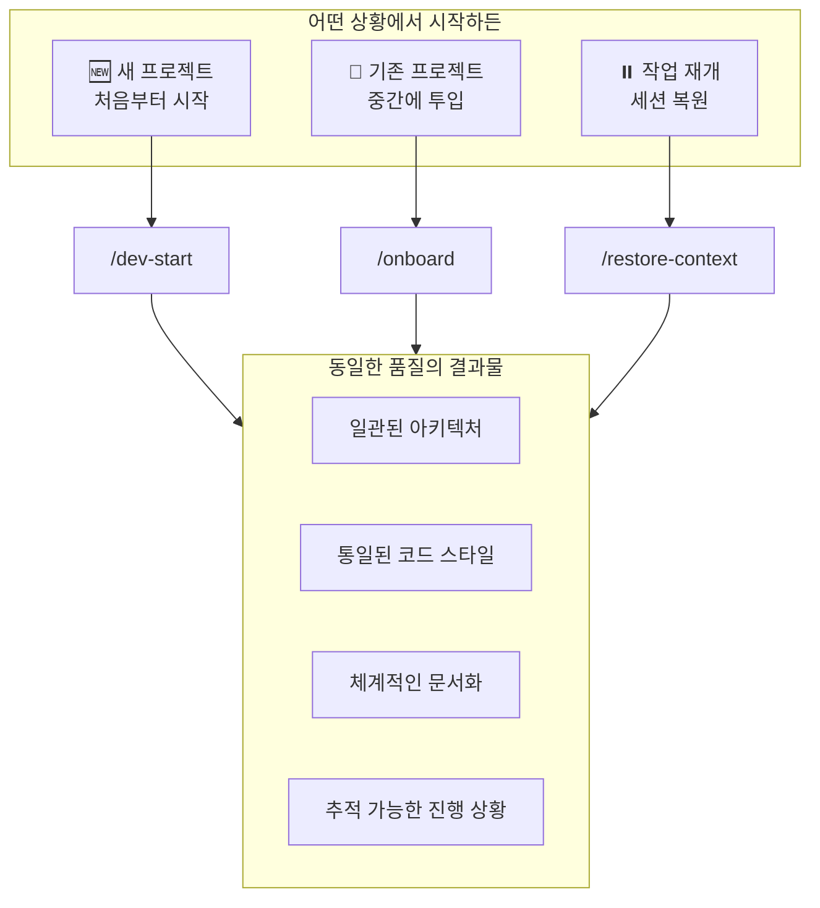
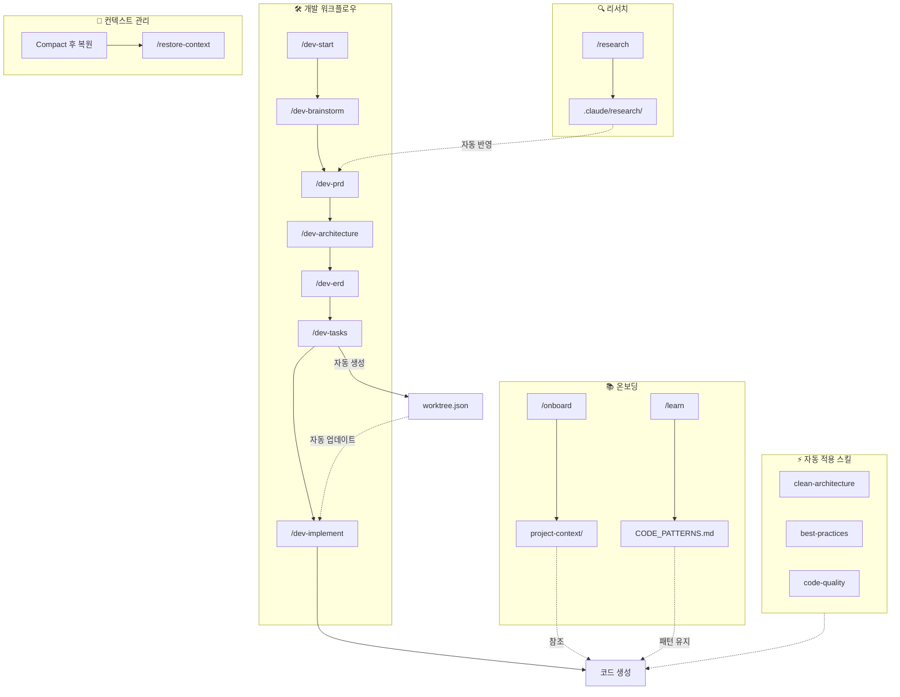
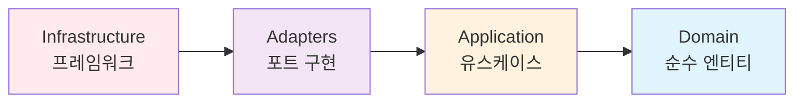
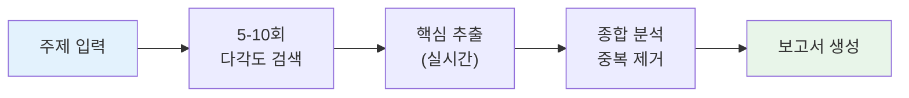

# 원더 무브 연구소 Claude Plug-in

> **어떤 상황에서든 동일한 개발 품질을 보장하는** Claude Code 업무 자동화 플러그인

---

## 개요

### 핵심 가치

**"프로젝트 시작부터 완료까지, 언제 투입되든 동일한 품질"**

이 플러그인은 AI를 활용한 개발에서 발생하는 **일관성 문제**를 해결합니다.



### 해결하는 문제

| 상황 | 문제 | 해결 |
|------|------|------|
| **새 프로젝트 시작** | 설계 없이 바로 코딩, 아키텍처 무시 | `/dev-start` → 체계적 진행 |
| **기존 프로젝트 투입** | 기존 패턴 무시, 스타일 불일치 | `/onboard` → 프로젝트 학습 |
| **작업 재개** | 이전 맥락 망각, 규칙 무시 | `/restore-context` → 상태 복원 |
| **장기 프로젝트** | 진행 상황 파악 어려움 | `/worktree` → 실시간 추적 |
| **기술 검토 필요** | 검색 결과 정리 어려움 | `/research` → 자동 요약 |

---

## 플러그인 통합 플로우

모든 플러그인이 유기적으로 연결되어 있습니다:



**자동 연동 포인트:**

| 트리거 | 자동 동작 |
|--------|----------|
| `/dev-tasks` 완료 | `worktree.json` 자동 생성 |
| `/dev-prd` 실행 | `.claude/research/` 자동 검색 및 반영 |
| `/dev-implement` 실행 | worktree 태스크 자동 시작 |
| 코드 작성 | `project-onboarding` skill 컨텍스트 참조 |
| "TASK-XXX 완료" 키워드 | worktree 태스크 자동 완료 |
| Context Compact | `pre_compact.py` 훅으로 상태 저장 |

---

## 설치

```bash
# 저장소 클론
git remote add origin https://github.com/Wondermove-Inc/calab-claude-plugin.git

# 프로젝트에 .claude 폴더 복사
cp -r claude-wondermove-marketplace/.claude /your-project/
cp claude-wondermove-marketplace/CLAUDE.md /your-project/
```

---

## 빠른 시작

```bash
# 1. 새 프로젝트 시작
/dev-start 사용자 인증 시스템

# 2. 기존 프로젝트에 AI 투입
/onboard

# 3. 세션 재개
/restore-context
```

---

## 사용 시나리오

### 시나리오 1: 새 기능 개발

```bash
# 1. 개발 워크플로우 시작
/dev-start 사용자 인증 시스템

# 2. 브레인스토밍 결과 확인 후 PRD 작성
/dev-prd

# 3. 아키텍처 설계
/dev-architecture

# 4. 태스크 분해
/dev-tasks

# 5. 순차적 구현
/dev-implement TASK-001
/dev-implement TASK-002
...
```

### 시나리오 2: 기존 프로젝트 투입

```bash
# 1. 프로젝트 온보딩
/onboard

# 2. 특정 영역 심층 학습
/learn src/services/

# 3. 기존 패턴에 맞춰 개발
"UserService와 같은 패턴으로 ProductService 만들어줘"
```

### 시나리오 3: 클린 아키텍처 적용

```bash
# 1. 구조 초기화
/clean-init

# 2. 도메인 엔티티 생성
/clean-entity User
/clean-entity Order
/clean-entity Product

# 3. 유스케이스 생성
/clean-usecase CreateUser
/clean-usecase CreateOrder

# 4. 아키텍처 검증
/clean-validate
```

### 시나리오 4: 세션 재개

```bash
# 1. 컨텍스트 복원
/restore-context

# 2. 현재 상태 확인
/context-show

# 3. 이전 작업 이어서 진행
"리프레시 토큰 구현 이어서 해줘"

# 4. 종료 전 저장
/save-progress 리프레시 토큰 구현 완료
```

---

## 명령어 요약표

### 전체 명령어 매트릭스

| 카테고리 | 명령어 | 필수 인자 | 선택 인자 | 주요 출력 |
|----------|--------|----------|----------|----------|
| **개발** | `/dev-start` | - | `[아이디어]` | 워크플로우 시작 |
| | `/dev-brainstorm` | - | `[주제]` | 아이디어 문서 |
| | `/dev-prd` | - | - | PRD 문서 |
| | `/dev-architecture` | - | - | 아키텍처 문서 |
| | `/dev-erd` | - | - | ERD 문서 |
| | `/dev-tasks` | - | - | 태스크 목록 |
| | `/dev-implement` | - | `[task-id]` | 구현 코드 |
| | `/dev-status` | - | - | 진행 상황 |
| **클린 아키텍처** | `/clean-init` | - | - | 디렉토리 구조 |
| | `/clean-entity` | `<name>` | - | 엔티티 파일 |
| | `/clean-usecase` | `<name>` | - | 유스케이스 파일 |
| | `/clean-validate` | - | - | 검증 리포트 |
| **온보딩** | `/onboard` | - | - | 컨텍스트 문서 |
| | `/onboard-quick` | - | - | 요약 문서 |
| | `/context-refresh` | - | - | 문서 갱신 |
| | `/context-show` | - | - | 컨텍스트 표시 |
| | `/learn` | `<path>` | - | 패턴 문서 |
| **컨텍스트** | `/restore-context` | - | - | 상태 복원 |
| | `/save-progress` | - | `[메시지]` | 체크포인트 |
| | `/show-rules` | - | - | 규칙 표시 |
| **품질** | `/check-quality` | - | - | 품질 리포트 |
| **Worktree** | `/worktree` | - | - | 작업 트리 표시 |
| | `/worktree status` | - | - | 상태 요약 |
| | `/worktree start` | `<task-id>` | - | 태스크 시작 |
| | `/worktree done` | `<task-id>` | - | 태스크 완료 |
| | `/worktree block` | `<task-id>` | `"사유"` | 블로커 등록 |
| **리서치** | `/research` | `<주제>` | - | 심층 리서치 |
| | `/research --quick` | `<주제>` | - | 빠른 리서치 |
| | `/research --deep` | `<주제>` | - | 상세 리서치 |

---

## 명령어 상세 레퍼런스

### 개발 워크플로우

체계적인 개발 프로세스를 위한 명령어입니다.

| 명령어 | 설명 | 인자 | 출력 |
|--------|------|------|------|
| `/dev-start` | 전체 워크플로우 시작 | `[아이디어]` | 브레인스토밍 → PRD → 설계 → 구현 |
| `/dev-brainstorm` | 아이디어 브레인스토밍 | `[주제]` | 아이디어 정리 문서 |
| `/dev-prd` | PRD 문서 작성 | - | `docs/prd/{feature}/prd.md` |
| `/dev-architecture` | 시스템 아키텍처 설계 | - | `docs/architecture/system-architecture.md` |
| `/dev-erd` | ERD 데이터 모델 설계 | - | `docs/architecture/erd.md` |
| `/dev-tasks` | 구현 태스크 분해 | - | `docs/tasks/{feature}/tasks.md` |
| `/dev-implement` | 태스크 구현 | `[task-id]` | 베스트 프랙티스 적용 코드 |
| `/dev-status` | 진행 상황 확인 | - | 현재 단계, 완료율 표시 |

**사용 예시:**

```bash
# 전체 워크플로우 시작
/dev-start 결제 시스템

# 출력:
# ============================================
#  개발 워크플로우 시작: 결제 시스템
# ============================================
#
# Phase 1: Brainstorming
# → 아이디어를 구체화합니다...
```

```bash
# 특정 태스크 구현
/dev-implement TASK-003

# 출력:
# ============================================
#  태스크 구현: TASK-003
# ============================================
#
#  태스크: 결제 API 엔드포인트 구현
#  적용 패턴: Clean Architecture, Repository Pattern
#  생성 파일:
#  • src/application/use-cases/payment/ProcessPaymentUseCase.ts
#  • src/adapters/controllers/PaymentController.ts
```

---

### 클린 아키텍처

4-레이어 클린 아키텍처를 강제 적용합니다.

| 명령어 | 설명 | 인자 | 출력 |
|--------|------|------|------|
| `/clean-init` | 클린 아키텍처 구조 초기화 | - | 4-레이어 디렉토리 구조 |
| `/clean-entity` | 도메인 엔티티 생성 | `<name>` | Entity, Value Object, Interface |
| `/clean-usecase` | 유스케이스 생성 | `<name>` | UseCase, DTO, Port, Test |
| `/clean-validate` | 아키텍처 규칙 검증 | - | 의존성 위반 리포트 |

**레이어 구조:**

```
src/
├── domain/           # 엔티티 (순수 비즈니스 로직, 외부 의존성 없음)
├── application/      # 유스케이스 (비즈니스 규칙, 인터페이스 의존)
├── adapters/         # 어댑터 (컨트롤러, 리포지토리 구현)
└── infrastructure/   # 인프라 (프레임워크, DB, 외부 서비스)
```

**의존성 규칙:**



> 의존성은 항상 **외부 → 내부** 방향. Domain은 어떤 것도 의존하지 않음.

---

### 프로젝트 온보딩

기존 프로젝트를 분석하고 AI가 일관된 코드를 생성하도록 합니다.

| 명령어 | 설명 | 인자 | 출력 |
|--------|------|------|------|
| `/onboard` | 전체 프로젝트 분석 | - | 5개 컨텍스트 문서 생성 |
| `/onboard-quick` | 빠른 분석 (핵심만) | - | PROJECT_SUMMARY.md |
| `/context-refresh` | 컨텍스트 문서 갱신 | - | 업데이트된 컨텍스트 |
| `/context-show` | 현재 컨텍스트 표시 | - | 컨텍스트 요약 출력 |
| `/learn` | 특정 영역 심층 학습 | `<path>` | 패턴 추출 및 문서화 |

**생성되는 컨텍스트 문서:**

| 파일 | 내용 |
|------|------|
| `PROJECT_SUMMARY.md` | 프로젝트 요약, 기술 스택, 디렉토리 구조 |
| `ARCHITECTURE.md` | 레이어 구조, 모듈 의존성, 데이터 흐름 |
| `CODE_PATTERNS.md` | 컴포넌트 패턴, API 패턴, 테스트 패턴 |
| `CONVENTIONS.md` | 네이밍 규칙, import 순서, 주석 규칙 |
| `DOMAIN_KNOWLEDGE.md` | 비즈니스 개념, 용어 사전, 규칙 |

---

### 컨텍스트 관리

세션 간 컨텍스트를 유지하고 복원합니다.

| 명령어 | 설명 | 인자 | 출력 |
|--------|------|------|------|
| `/restore-context` | 규칙 + 작업 상태 복원 | - | 핵심 규칙, 현재 작업 표시 |
| `/save-progress` | 진행 상황 저장 | `[메시지]` | 체크포인트 저장 |
| `/show-rules` | 프로젝트 규칙 표시 | - | 전체 규칙 출력 |

**사용 예시:**

```bash
# 컨텍스트 복원 (새 세션 시작 시)
/restore-context

# 출력:
# ============================================
#  컨텍스트 복원 완료
# ============================================
#
#  적용된 핵심 규칙:
# • 코드 품질 - 가독성 최우선, DRY 원칙
# • 파일 제한 - 300줄 이하, 함수 주석 필수
# • 금지 사항 - any, console.log, 하드코딩 비밀키
#
#  현재 작업 상태:
# • 현재 목표: 사용자 인증 시스템 구현
# • 진행 중인 작업: JWT 토큰 검증 로직
# • 다음 단계: 리프레시 토큰 구현
```

---

### 코드 품질

코드 품질을 검사하고 강제합니다.

| 명령어 | 설명 | 인자 | 출력 |
|--------|------|------|------|
| `/check-quality` | 전체 프로젝트 품질 검사 | - | 위반 사항 리포트 |

**자동 적용 규칙:**

| 규칙 | 기준 | 자동 경고 |
|------|------|----------|
| 파일 줄 수 | 300줄 이하 | 초과 시 분리 권고 |
| 함수 주석 | JSDoc 필수 | 누락 시 경고 |
| any 타입 | 사용 금지 | 사용 시 경고 |
| console.log | 사용 금지 | 사용 시 경고 |

---

### 리서치 (Research)

주제에 대해 다각도로 검색하고 핵심만 추출하여 보고서로 정리합니다.

| 명령어 | 설명 | 인자 | 출력 |
|--------|------|------|------|
| `/research` | 심층 리서치 시작 | `<주제>` | 구조화된 보고서 |
| `/research --quick` | 빠른 리서치 | `<주제>` | 핵심 요약 |
| `/research --deep` | 심층 리서치 | `<주제>` | 상세 보고서 |

**리서치 프로세스:**



**생성되는 보고서:**

| 파일 | 내용 |
|------|------|
| `report.md` | 전체 보고서 (상세 분석) |
| `summary.md` | 1페이지 핵심 요약 |
| `sources.md` | 출처 목록 (신뢰도 포함) |

**PRD 자동 연계:**

리서치 결과는 `/dev-prd` 실행 시 자동으로 통합됩니다.

---

### Worktree (작업 트리)

개발 진행 상황을 실시간으로 추적하는 작업 트리입니다.

| 명령어 | 설명 | 인자 | 출력 |
|--------|------|------|------|
| `/worktree` | 현재 작업 트리 표시 | - | 트리 구조 시각화 |
| `/worktree status` | 상태 요약 | - | 진행률, 통계 |
| `/worktree start` | 태스크 시작 | `<task-id>` | 태스크 상세 정보 |
| `/worktree done` | 태스크 완료 | `<task-id>` | 진행률 업데이트 |
| `/worktree block` | 블로커 등록 | `<task-id> "사유"` | 대체 작업 추천 |

**작업 트리 출력 예시:**

```
============================================
 WORKTREE: 사용자 인증 시스템
============================================

 진행률: ████████░░░░░░░░░░░░ 40% (4/10)

┌─ Epic 1: 사용자 인증
│
├─┬─ Story 1.1: 회원가입
│ │
│ ├── ✅ TASK-001: User 테이블 마이그레이션
│ ├── ✅ TASK-002: RegisterDto 정의
│ ├── 🔄 TASK-003: AuthService.register()  ← 현재 작업
│ ├── ⬚ TASK-004: AuthController 구현
│ └── ⬚ TASK-005: 회원가입 폼 컴포넌트
│
├─┬─ Story 1.2: 로그인
│ │
│ ├── ⬚ TASK-006: LoginDto 정의
│ ├── ⬚ TASK-007: AuthService.login() 구현
│ └── ⬚ TASK-008: 로그인 폼 컴포넌트

============================================
 상태: ✅ 완료 | 🔄 진행중 | 🚫 블로커 | ⬚ 대기
============================================
```

---

## 스킬 레퍼런스

스킬은 특정 키워드 감지 시 자동으로 활성화됩니다.

| 스킬 | 활성화 키워드 | 동작 |
|------|--------------|------|
| `project-rules` | 코드 작성, 수정, 리뷰 | 프로젝트 규칙 자동 참조 |
| `work-tracker` | 작업 시작, 전환, 완료 | 작업 상태 + Worktree 자동 추적 |
| `code-quality` | 코드 생성, 함수 추가 | 300줄 제한, 주석 필수 적용 |
| `dev-workflow` | 새 기능 개발, 프로젝트 시작 | 개발 워크플로우 안내 |
| `best-practices` | React, Node.js, TypeScript 개발 | 기술별 베스트 프랙티스 적용 |
| `clean-architecture` | 코드 구현, 클래스 생성 | 클린 아키텍처 강제 |
| `project-onboarding` | 프로젝트 분석, 코드베이스 학습 | 컨텍스트 문서 참조 |
| `research` | 리서치, 조사, 알아봐, 찾아봐 | 다각도 검색 + 핵심 요약 |

---

## 훅 레퍼런스

훅은 특정 이벤트 발생 시 자동으로 실행됩니다.

| 훅 | 트리거 | 동작 |
|----|--------|------|
| `pre_compact.py` | Context Compact 전 | 현재 상태를 체크포인트에 저장 |
| `session_start.py` | 세션 시작 시 | 이전 컨텍스트 자동 로드 |
| `session_end.py` | 세션 종료 시 | 작업 상태 자동 저장 |
| `code_quality_validator.py` | 파일 생성/수정 시 | 300줄 초과, 주석 누락 경고 |
| `track_changes.py` | 파일 변경 시 | 변경 이력 기록 |

---

## 베스트 프랙티스 레퍼런스

기술별 베스트 프랙티스가 자동 적용됩니다.

| 파일 | 내용 |
|------|------|
| `react.md` | 컴포넌트 패턴, 훅 사용법, 상태 관리 |
| `nextjs.md` | App Router, 서버 컴포넌트, 데이터 페칭 |
| `nodejs.md` | 에러 처리, 비동기 패턴, 보안 |
| `typescript.md` | 타입 정의, 제네릭, 유틸리티 타입 |
| `database.md` | 쿼리 최적화, 인덱싱, 트랜잭션 |
| `api-design.md` | RESTful 설계, 에러 응답, 페이지네이션 |
| `testing.md` | 단위 테스트, 통합 테스트, 목킹 |
| `clean-architecture.md` | 레이어 규칙, 의존성 주입, 패턴 예시 |
| `project-onboarding.md` | 온보딩 가이드, 컨텍스트 유지 전략 |

---

## 프로젝트 구조

```
project/
├── CLAUDE.md                          # Claude 메인 설정 (필수)
├── README.md                          # 이 문서
│
├── .claude/
│   ├── memory/                        # 영구 메모리
│   │   ├── PROJECT_RULES.md           # 프로젝트 규칙
│   │   ├── CURRENT_CONTEXT.md         # 현재 작업 상태
│   │   └── WORK_HISTORY.md            # 작업 히스토리
│   │
│   ├── project-context/               # 프로젝트 컨텍스트 (온보딩 생성)
│   │   ├── PROJECT_SUMMARY.md
│   │   ├── ARCHITECTURE.md
│   │   ├── CODE_PATTERNS.md
│   │   ├── CONVENTIONS.md
│   │   └── DOMAIN_KNOWLEDGE.md
│   │
│   ├── research/                      # 리서치 결과 저장
│   │   └── {topic}/
│   │       ├── report.md              # 전체 보고서
│   │       ├── summary.md             # 핵심 요약
│   │       └── sources.md             # 출처 목록
│   │
│   ├── skills/                        # 자동 활성화 스킬
│   ├── commands/                      # 슬래시 커맨드
│   ├── hooks/                         # 이벤트 훅
│   ├── best-practices/                # 기술별 베스트 프랙티스
│   ├── templates/                     # 문서 템플릿
│   └── agents/                        # 서브에이전트
│
├── docs/                              # 생성된 문서
└── .claude-state/                     # 런타임 상태
    └── worktree.json                  # 작업 트리 상태
```

---

## 트러블슈팅

| 문제 | 원인 | 해결 |
|------|------|------|
| 명령어가 동작하지 않음 | .claude 폴더 누락 | 플러그인 재설치 |
| 컨텍스트가 복원되지 않음 | 저장된 상태 없음 | `/save-progress` 실행 |
| 온보딩 실패 | package.json 없음 | 프로젝트 루트 확인 |
| 클린 아키텍처 위반 | 잘못된 import | `/clean-validate` 후 수정 |
| 품질 검사 미작동 | 훅 설정 오류 | `hooks.json` 확인 |
