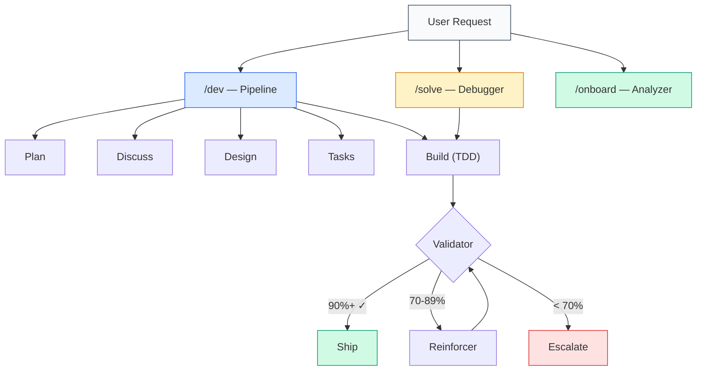
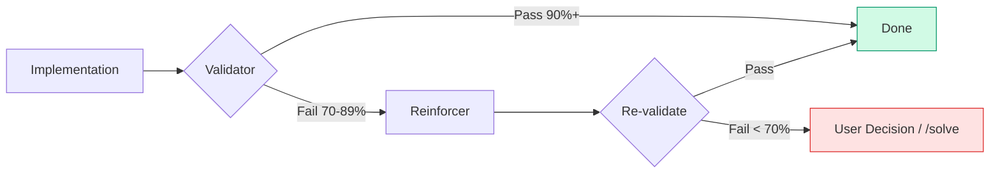

<div align="center">

# CALAB

**Code Assurance Layer for AI Building**

[](https://github.com/Wondermove-Inc/calab-claude-plugin/releases)
[](https://claude.ai/code)
[](LICENSE)

A workflow automation plugin that brings **17 skills**, **23 specialized agents**, and **27 lifecycle hooks** to Claude Code — enforcing best practices, eliminating hallucinations, and maintaining full traceability from planning to deployment.

[Quick Start](#quick-start) · [Architecture](#architecture) · [Commands](#commands) · [Agents](#agents) · [Contributing](#contributing)

</div>

---

## The Problem

AI-assisted development suffers from inconsistency: varying code quality, lost context between sessions, missing documentation, and unverified outputs. Teams waste time compensating for what the AI should handle automatically.

## The Solution

Calab Plugin wraps Claude Code in a structured development lifecycle — every plan gets reviewed, every implementation gets tested, every output gets validated. Context persists across sessions. Quality gates are non-negotiable.

| Without Calab | With Calab |
|:---|:---|
| Code quality varies by prompt | Enforced quality gates on every output |
| Context lost on compact/restart | Automatic state persistence & restoration |
| Documentation drifts from code | Auto-synchronized on every change |
| Hallucinated code ships unchecked | Validator → Reinforcer verification chain |
| Ad-hoc development process | Plan → Design → Tasks → Build pipeline |
| No traceability across phases | Mandatory artifacts with structured handoffs |

---

## Architecture



### Skill Layers

| Layer | Skills | Trigger |
|:------|:-------|:--------|
| **Core** | `/dev` · `/solve` · `/onboard` | User-invoked |
| **Utility** | `/docs` · `/security` · `/research` · `/jira` · `/refactor` · `/e2e` · `/guard` | User-invoked |
| **Passive** | best-practices · code-quality · tdd-workflow · project-rules · work-tracker · clarification-protocol · skill-completion-rules | Auto-loaded contextually |

### Lifecycle Hooks (27)

Session start/stop, pre-compact state save, code quality validation, worktree tracking, build error detection, artifact verification, confidence-based reinforcer escalation, and more — all running automatically in the background.

---

## Key Features (v2.9.0)

### Prompt Engineering Best Practices

| Feature | Description |
|:--------|:-----------|
| **6-Element Task Specification** | Every task includes What/How/Avoid+WHY/Verify/Done/Files with specificity testing |
| **Structured Returns** | All agents communicate via fixed JSON schemas for reliable inter-agent handoffs |
| **Deviation Rules** | Auto-fix protocol for 5 safe categories; user confirmation for 4 high-risk categories |
| **50% Context Budget Rule** | 4-tier quality management (PEAK/GOOD/DEGRADING/POOR) based on context usage |
| **Checkpoint Classification** | human-verify (90%) · decision (9%) · human-action (1%) — minimizes unnecessary interruptions |
| **3-Level Artifact Verification** | Existence → Substantive → Wired — ensures artifacts are real, meaningful, and connected |
| **Goal-Backward Verification** | Validates from user goal → observable truth → code artifact → key link |
| **Fresh Context Pattern** | Each executor starts with only its task definition — no cross-contamination |
| **Wave-based Parallel Execution** | Dependency graph → topological sort → wave grouping for parallel task execution |
| **Questioning Guide** | "Think partner, not interviewer" — Ask vs Decide framework to minimize user fatigue |

### Roadmap & Phase Management

```bash
/dev --roadmap                       # View roadmap status
/dev --roadmap add "Phase title"     # Add phase
/dev --roadmap insert N "Title"      # Insert urgent phase before N
/dev --roadmap complete N            # Complete phase N
/dev --roadmap milestone "v1.0.0"    # Create milestone + archive
```

---

## Quick Start

```bash
# 1. Add marketplace
/plugin marketplace add Wondermove-Inc/calab-claude-plugin

# 2. Install plugin
/plugin install calab-plugin@calab-marketplace

# 3. Verify installation
/plugins

# 4. Onboard your project
/onboard

# 5. Start building
/dev --plan user-authentication
```

### Skill Autocomplete (Optional)

Register plugin skills for `/` tab-completion:

```bash
git clone https://github.com/Wondermove-Inc/calab-claude-plugin.git
cd calab-claude-plugin && ./link-skills.sh
```

This creates `~/.claude/skills/calab-*` symlinks, enabling `/calab-dev`, `/calab-solve`, etc.
Remove with `./link-skills.sh --remove`.

---

## Commands

### `/dev` — Development Pipeline

```bash
/dev --plan <feature>         # PRD & requirements brainstorming
/dev --discuss <feature>      # Collect implementation decisions (resolve gray areas)
/dev --design <feature>       # Architecture & ERD design
/dev --tasks <feature>        # Task breakdown with acceptance criteria
/dev --build <TASK-ID>        # TDD implementation (single task)
/dev --build --wave <N>       # Parallel execution of Wave N tasks
/dev --build --all            # Sequential wave execution (parallel within each wave)
/dev --status                 # Progress dashboard
```

Each phase produces mandatory artifacts and validates prerequisites before advancing:

```mermaid
graph LR
    A["--plan"] -->|"01-brainstorm.md\n02-PRD.md"| A2["--discuss"]
    A2 -->|"00-CONTEXT.md"| B["--design"]
    B -->|"03-architecture.md\n04-ERD.md"| C["--tasks"]
    C -->|"05-tasks.md\nworktree.json"| D["--build"]
    D -->|"Source + Tests\n80%+ coverage"| E["QA"]

    style A fill:#dbeafe,stroke:#2563eb
    style A2 fill:#bfdbfe,stroke:#3b82f6
    style B fill:#e0e7ff,stroke:#4f46e5
    style C fill:#ede9fe,stroke:#7c3aed
    style D fill:#fae8ff,stroke:#a855f7
    style E fill:#d1fae5,stroke:#059669
```



### `/solve` — Problem Solving

```bash
/solve <error-message>        # Auto-selects methodology
/solve --5whys                # Iterative root cause analysis
/solve --rca                  # Systematic 8-step RCA
/solve --hypothesis           # Hypothesis-driven debugging
/solve --binary               # Binary search debugging
/solve --log                  # View progress log
/solve --report               # Generate resolution report
```

### `/onboard` — Project Onboarding

```bash
/onboard                      # Full onboarding (5 context documents)
/onboard --quick              # Quick onboarding (PROJECT_SUMMARY.md only)
/onboard --phase <N>          # Analyze specific phase only
/onboard --skip-domain        # Skip domain interview
```

### Utilities

| Command | Purpose |
|:--------|:--------|
| `/docs --api\|--component\|--guide\|--update` | Generate documentation from code |
| `/security --owasp\|--secrets\|--deps\|--full` | Security vulnerability scanning |
| `/research --deep\|--compare` | Web research with source analysis |
| `/jira --sync\|--create\|--update\|--link` | Bidirectional JIRA synchronization |
| `/refactor --dead-code\|--duplicates\|--imports\|--cleanup` | Automated code cleanup |
| `/e2e --run\|--debug\|--record\|--headed` | Playwright/Puppeteer E2E testing |
| `/guard --rules\|--context\|--full` | Project rule compliance check |

---

## Agents

23 specialized agents, each with defined tools, permissions, and output contracts.

<details>
<summary><strong>Workflow</strong> — 7 agents</summary>

| Agent | Role |
|:------|:-----|
| `dev-workflow` | Orchestrates Plan → Design → Tasks → Build with wave-based parallelism |
| `planner-phase` | PRD authoring, phase decomposition, and roadmap management |
| `planner-task` | Task breakdown with 6-element specification and specificity testing |
| `design` | Architecture design and ERD generation |
| `dev-executor` | TDD implementation with fresh context and deviation rules |
| `project-onboarder` | Codebase analysis and context document generation |
| `jira-connector` | Bidirectional JIRA issue synchronization |

</details>

<details>
<summary><strong>Quality & Security</strong> — 4 agents</summary>

| Agent | Role |
|:------|:-----|
| `code-reviewer` | Code quality review with structured JSON output |
| `security-reviewer` | OWASP Top 10, secret detection, dependency audit |
| `project-guardian` | Project rule and convention enforcement |
| `build-error-resolver` | Build error resolution with circuit breaker (3-strike escalation) |

</details>

<details>
<summary><strong>Verification</strong> — 3 agents</summary>

| Agent | Role |
|:------|:-----|
| `validator` | 3-level artifact verification (Existence → Substantive → Wired) with goal-backward checking |
| `task-validator` | Task-level acceptance criteria validation |
| `reinforcer` | Confidence-based auto-remediation of validation failures |

</details>

<details>
<summary><strong>Problem Solving</strong> — 2 agents</summary>

| Agent | Role |
|:------|:-----|
| `root-cause-finder` | 5 Whys, RCA, hypothesis-driven analysis |
| `bug-fixer` | TDD-based bug resolution |

</details>

<details>
<summary><strong>Research</strong> — 2 agents</summary>

| Agent | Role |
|:------|:-----|
| `web-researcher` | Real-time web search via Tavily MCP |
| `deep-researcher` | Multi-source synthesis and report generation |

</details>

<details>
<summary><strong>Documentation & Testing</strong> — 5 agents</summary>

| Agent | Role |
|:------|:-----|
| `docs-generator` | API, component, and guide documentation |
| `doc-updater` | Change-driven documentation sync |
| `refactor-cleaner` | Dead code removal and import cleanup |
| `e2e-runner` | Playwright/Puppeteer test execution |
| `qa` | 8-stage QA verification pipeline |

</details>

---

## How It Works

### Verification Chain

Every implementation passes through a mandatory verification chain before completion:



### Structured Handoffs

Each phase validates prerequisites before proceeding:

| Phase | Prerequisite | Produces |
|:------|:-------------|:---------|
| `--plan` | None | `01-brainstorm.md`, `02-PRD.md`, `ROADMAP.md` |
| `--discuss` | PRD exists | `00-CONTEXT.md` (implementation decisions) |
| `--design` | PRD exists | `03-architecture.md`, `04-ERD.md` |
| `--tasks` | Architecture + ERD exist | `05-tasks.md`, `worktree.json` |
| `--build` | Tasks + worktree exist | Source code, test code |

### Context Persistence

Session state is automatically preserved across compacts and restarts:

```
.claude-state/
├── checkpoint.json       # Full session checkpoint
├── worktree.json         # Task tree with progress
├── circuit-breaker.json  # Failure tracking
└── request-log.jsonl     # Request history

.claude/memory/
├── CURRENT_CONTEXT.md    # Active work context
└── PROJECT_RULES.md      # Learned project rules
```

Recovery priority: `checkpoint.json` → `worktree.json` → `CURRENT_CONTEXT.md` → `/onboard`

### Quality Enforcement

| Rule | Enforcement |
|:-----|:-----------|
| Max 500 lines per file | `code-quality` passive skill |
| JSDoc on all public functions | `code-quality` passive skill |
| 100% type coverage | `code-quality` passive skill |
| 80%+ test coverage | `tdd-workflow` passive skill |
| No hardcoded secrets | `security-reviewer` agent |
| Mandatory artifacts per phase | `post_skill_artifact_check` hook |

---

## Project Structure

```
calab-claude-plugin/
├── CLAUDE.md                        # Project-level AI instructions
├── README.md
├── link-skills.sh                   # Skill autocomplete setup
└── plugins/calab-plugin/
    ├── skills/                      # 17 skills (10 active + 7 passive)
    │   ├── dev/                     #   Development pipeline
    │   │   ├── SKILL.md
    │   │   └── references/          #   Phase-specific prompts
    │   ├── solve/                   #   Problem solving
    │   ├── onboard/                 #   Project onboarding
    │   ├── docs/                    #   Documentation generation
    │   ├── security/                #   Security scanning
    │   ├── research/                #   Web research
    │   ├── jira/                    #   JIRA integration
    │   ├── refactor/                #   Code cleanup
    │   ├── e2e/                     #   E2E testing
    │   ├── guard/                   #   Rule enforcement
    │   ├── best-practices/          #   (passive) Tech-specific practices
    │   ├── code-quality/            #   (passive) 500-line limit, JSDoc
    │   ├── tdd-workflow/            #   (passive) Red-Green-Refactor
    │   ├── project-rules/           #   (passive) Project conventions
    │   ├── work-tracker/            #   (passive) Worktree updates
    │   ├── clarification-protocol/  #   (passive) Subagent Q&A protocol
    │   └── skill-completion-rules/  #   (passive) Skill completion gates
    ├── agents/                      # 23 specialized agents
    │   ├── dev-workflow.md
    │   ├── planner-phase.md
    │   ├── planner-task.md
    │   ├── design.md
    │   ├── dev-executor.md
    │   ├── validator.md
    │   ├── reinforcer.md
    │   ├── code-reviewer.md
    │   ├── security-reviewer.md
    │   └── ... (14 more)
    └── hooks/                       # 27 lifecycle hooks
        ├── session_start.py
        ├── pre_compact.py
        ├── code_quality_validator.py
        ├── confidence_based_reinforcer.py
        ├── post_skill_artifact_check.py
        └── ... (21 more)
```

### Runtime Directories (auto-generated)

```
.claude/
├── memory/                  # Persistent context
│   ├── CURRENT_CONTEXT.md   #   Active work state
│   └── PROJECT_RULES.md     #   Learned project rules
├── project-context/         # Onboarding output
│   ├── PROJECT_SUMMARY.md
│   ├── CODE_PATTERNS.md
│   └── ARCHITECTURE.md
├── docs/active/{feature}/   # Feature artifacts
│   ├── 01-brainstorm.md
│   ├── 02-PRD.md
│   ├── 03-architecture.md
│   ├── 04-ERD.md
│   └── 05-tasks.md
└── problem-solving/         # /solve output
    ├── active/
    ├── resolved/
    └── knowledge-base/

.claude-state/               # Session state
├── checkpoint.json
├── worktree.json
├── circuit-breaker.json
└── request-log.jsonl
```

---

## Requirements

- **Claude Code** CLI v1.0+
- **Python** 3.8+ (lifecycle hooks)
- **Node.js** 18+ (optional, for specific hooks)

---

## Installation Options

<details>
<summary><strong>Marketplace (Recommended)</strong></summary>

```bash
/plugin marketplace add Wondermove-Inc/calab-claude-plugin
/plugin install calab-plugin@calab-marketplace
```

</details>

<details>
<summary><strong>Interactive Browser</strong></summary>

```bash
/plugin
# → "Add Marketplace" → "Wondermove-Inc/calab-claude-plugin"
# → "Discover" tab → Install calab-plugin
```

</details>

<details>
<summary><strong>Local Development</strong></summary>

```bash
git clone https://github.com/Wondermove-Inc/calab-claude-plugin.git
/plugin marketplace add /path/to/calab-claude-plugin
```

</details>

---

## Contributing

```bash
git clone https://github.com/Wondermove-Inc/calab-claude-plugin.git
cd calab-claude-plugin
git checkout -b feature/your-feature
# Make changes
git commit -m "feat: description"
git push origin feature/your-feature
# Open Pull Request
```

---

## License

MIT — [Wondermove CALab](https://wondermove.net)

**Issues**: [GitHub Issues](https://github.com/Wondermove-Inc/calab-claude-plugin/issues) · **Contact**: captain@wondermove.net
