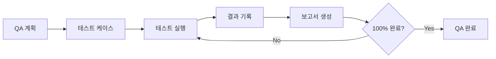
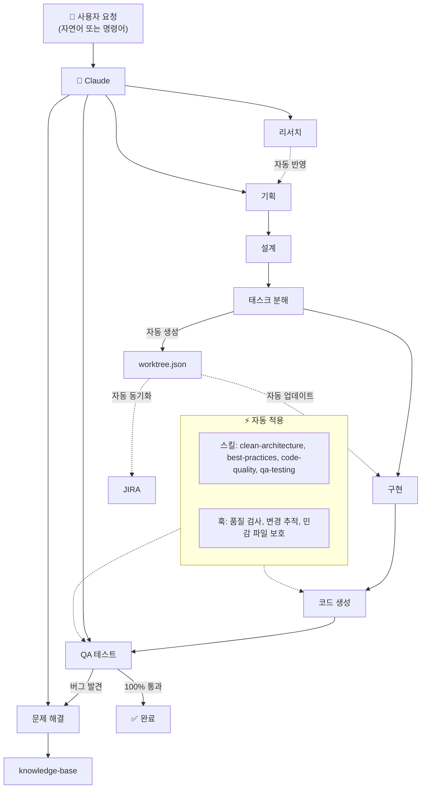

# Calab Claude Plugin

> **어떤 상황에서든 동일한 개발 품질을 보장하는** Claude Code 공식 플러그인

---

## Breaking Changes

> ⚠️ **알려진 버그 (Claude Code 플러그인 시스템)**
>
> `/plugin uninstall`과 `/plugin marketplace remove` 명령어로는 **완전 제거가 안 됩니다**.
> 재설치, 업데이트, 제거 시 **반드시 수동 파일 삭제가 필요**합니다.
>
> ```bash
> # 완전 제거 필수 명령어 (Claude Code 종료 후 터미널에서)
> rm -rf ~/.claude/plugins/cache
> rm -f ~/.claude/plugins/installed_plugins.json
> rm -f ~/.claude/plugins/known_marketplaces.json
> rm -rf ~/.claude/calab-marketplace
> ```

**기존 v1.x 사용자는 마이그레이션 필수입니다:**

| 항목 | v1.x (Old) | v2.1 (Current) |
|------|-----------|----------------|
| 설치 방식 | 파일 복사 (레거시) | `install-plugin.sh` (마켓플레이스 + 전체 복사) |
| 명령어 | `/dev-plan` | `/calab-plugin:dev-plan` |
| 설정 위치 | `~/.claude/` 직접 수정 | 플러그인 스코프 분리 |
| 업데이트 | 수동 재설치 | 수동 파일 삭제 + `./install-plugin.sh` |
| 제거 | 수동 | 수동 파일 삭제 + `./uninstall-plugin.sh` ⚠️ |

**마이그레이션 가이드:**

> ⚠️ **알려진 버그**: `/plugin uninstall`과 `/plugin marketplace remove` 명령어로는 완전 제거가 안 됩니다.
> 반드시 수동으로 파일을 삭제해야 합니다.

```bash
# Step 1: Claude Code 종료 후 터미널에서 잔여 파일 완전 삭제
rm -rf ~/.claude/plugins/cache
rm -f ~/.claude/plugins/installed_plugins.json
rm -f ~/.claude/plugins/known_marketplaces.json
rm -rf ~/.claude/calab-marketplace

# Step 2: 기존 글로벌 파일 제거 (v1.x 사용자)
./uninstall-plugin.sh    # 또는 수동으로 ~/.claude/ 파일들 삭제

# Step 3: 마켓플레이스 재생성
./install-plugin.sh

# Step 4: Claude Code 시작 후 내부에서 등록
/plugin marketplace add ~/.claude/calab-marketplace
/plugin install calab-plugin@calab-marketplace --scope user

# Step 5: 설치 확인
/calab-plugin:onboard  # (기존 v1.x: /onboard)
```

> **v1.x에서 처음 마이그레이션하는 경우**: Step 1의 파일들이 없어도 정상입니다. Step 2부터 진행하세요.

---

## 문제 해결 매트릭스

| 상황 | 문제점 | 플러그인 솔루션 | 명령어 |
|------|--------|----------------|--------|
| **새 프로젝트 시작** | 어떻게 시작할지 막막함 | 체계적 워크플로우 제공 | `/calab-plugin:dev-plan` |
| **기존 프로젝트 투입** | 코드베이스 파악에 시간 소요 | 5개 컨텍스트 문서 자동 분석 | `/calab-plugin:onboard` |
| **기술 조사 필요** | 검색 + 요약 반복 작업 | 5-10회 자동 검색 + 핵심 요약 | `/calab-plugin:research` |
| **버그 발생** | 원인 파악 어려움 | 5 Whys, RCA 방법론 적용 | `/calab-plugin:solve` |
| **코드 품질 저하** | 일관성 없는 코드 스타일 | 자동 베스트 프랙티스 적용 | 자동 스킬 |
| **아키텍처 혼란** | 의존성 규칙 위반 | 클린 아키텍처 강제 | `/calab-plugin:clean-init` |
| **QA 누락** | 수동 테스트 반복 | MCP Puppeteer E2E 자동화 | `/calab-plugin:qa` |
| **작업 추적 어려움** | 진행률 파악 불가 | Worktree 자동 추적 | `/calab-plugin:worktree` |
| **JIRA 수동 업데이트** | 중복 작업 | 양방향 자동 동기화 | `/calab-plugin:jira-sync` |
| **컨텍스트 손실** | Compact 후 작업 맥락 소실 | 자동 체크포인트 + 복원 | `/calab-plugin:restore-context` |
| **문서화 필요** | 사용자 문서 수동 작성 | Docusaurus 자동 생성 | `/calab-plugin:docs` |

---

## 특징

### 핵심 기능

- ✅ **체계적 개발 워크플로우**: Plan → Design → Tasks → Build
- ✅ **클린 아키텍처**: 4-레이어 자동 생성 + 의존성 검증
- ✅ **프로젝트 온보딩**: 5개 컨텍스트 문서 자동 분석 (기술 스택, 패턴, 아키텍처, 도메인, 주요 파일)
- ✅ **심층 리서치**: 5-10회 자동 검색 + 핵심 요약
- ✅ **체계적 문제 해결**: 5 Whys, RCA, 가설 기반 방법론
- ✅ **QA 테스트 자동화**: MCP Puppeteer E2E 테스트 + 스크린샷
- ✅ **JIRA 양방향 연동**: Worktree ↔ JIRA 자동 동기화
- ✅ **작업 추적**: Worktree 실시간 진행률 관리
- ✅ **컨텍스트 보존**: 자동 체크포인트 + Compact 복원
- ✅ **문서 사이트 자동 생성**: Docusaurus 기반 docs.cast.ai 스타일 문서화

### 자동 적용 기능 (패시브 스킬)

코드 작성 시 **사용자 요청 없이** 자동으로 활용되는 기능:

| 스킬 | 활성화 조건 | 효과 |
|------|------------|------|
| `clean-architecture` | 코드 구현 시 (항상) | 4-레이어 구조 강제, 의존성 규칙 검증 |
| `best-practices` | 기술 감지 시 | 15개 언어별 베스트 프랙티스 자동 적용 |
| `code-quality` | 코드 생성 시 | 300줄 제한, 주석 필수, 타입 완전성 검증 |
| `project-rules` | 코드 작성/수정 시 | 프로젝트 규칙 자동 참조 |
| `work-tracker` | 소스 코드 수정 시 | Worktree 태스크 자동 시작 |
| `problem-solving` | 에러/버그 언급 시 | 5 Whys, RCA 방법론 자동 적용 |
| `jira-integration` | JIRA/이슈 언급 시 | JIRA 양방향 동기화 활성화 |
| `qa-testing` | QA/테스트 언급 시 | E2E 테스트 + MCP Puppeteer |

---

## 플러그인 명령어별 적용 표준 정리

### 1. 개발 워크플로우 (Development Workflow)

| 명령어             | 적용 표준                               | 설명                                                                        |
| --------------- | ----------------------------------- | ------------------------------------------------------------------------- |
| **/dev plan**   | PRD 템플릿                             | 브레인스토밍 + 요구사항 문서 작성<br>· 배경<br>· 목표<br>· 사용자 스토리<br>· 기능 요구사항             |
| **/dev design** | C4 Model + Layered Architecture     | 시스템 아키텍처(C4)<br>ERD 설계<br>3NF 정규화<br>필수 컬럼 규칙                             |
| **/dev tasks**  | Epic–Story–Task 구조 + AC             | 작업 분해(Epic→Story→Task)<br>의존성 분석<br>우선순위(P0~P3)<br>Acceptance Criteria 필수 |
| **/dev build**  | Clean Architecture + Best Practices | 4-Layer 구조<br>기술별 베스트 프랙티스<br>파일 300줄 제한<br>JSDoc 필수                      |
| **/dev status** | Worktree 진행률 추적                     | 작업 상태 시각화<br>완료 / 진행중 / 블로킹                                               |

---

### 2. 클린 아키텍처 (Clean Architecture)

| 명령어                 | 적용 표준                      | 설명                                                       |
| ------------------- | -------------------------- | -------------------------------------------------------- |
| **/clean-init**     | 4-Layer Clean Architecture | Domain / Application / Adapters / Infrastructure 디렉토리 구조 |
| **/clean-entity**   | Domain Layer 규칙            | 외부 import 금지<br>순수 TypeScript<br>Value Object 중심         |
| **/clean-usecase**  | Application Layer 규칙       | Domain만 import<br>Interface 의존<br>DTO / Port 정의          |
| **/clean-validate** | 의존성 규칙 검증                  | 내부 → 외부 참조 금지<br>순환 의존성 탐지                               |

---

### 3. 온보딩 & 컨텍스트 관리

| 명령어                | 적용 표준                   | 설명                                                                                                                |
| ------------------ | ----------------------- | ----------------------------------------------------------------------------------------------------------------- |
| **/onboard**       | C4 Model + Docs-as-Code | 5개 핵심 컨텍스트 문서 생성<br>· PROJECT_SUMMARY<br>· ARCHITECTURE<br>· CODE_PATTERNS<br>· CONVENTIONS<br>· DOMAIN_KNOWLEDGE |
| **/onboard-quick** | 핵심 컨텍스트 추출              | 기술 스택<br>디렉토리 구조<br>핵심 패턴 요약                                                                                      |
| **/learn**         | 패턴 추출                   | 특정 영역 심층 분석<br>코드 패턴 식별                                                                                           |

---

### 4. 리서치 (Research)

| 명령어           | 적용 표준        | 설명                                       |
| ------------- | ------------ | ---------------------------------------- |
| **/research** | 체계적 리서치 프로토콜 | 5~10회 다각도 검색<br>핵심 요약<br>출처 검증<br>신뢰도 평가 |

---

### 5. 문제 해결 (Problem Solving)

| 명령어                     | 적용 표준                            | 설명                                                                   |
| ----------------------- | -------------------------------- | -------------------------------------------------------------------- |
| **/solve**              | 5 Whys + RCA + Scientific Method | 6단계 문제 해결<br>① 문제 정의<br>② 데이터 수집<br>③ 분석<br>④ 가설 수립<br>⑤ 해결<br>⑥ 문서화 |
| **/solve --5whys**      | 5 Whys                           | “왜?”를 5번 반복하여 근본 원인 추적                                               |
| **/solve --rca**        | Root Cause Analysis              | 8단계 RCA<br>Fishbone 다이어그램                                            |
| **/solve --hypothesis** | 가설 기반 접근                         | 가설 → 예측 → 실험 → 검증                                                    |
| **/solve --binary**     | Binary Search Debugging          | 코드 이분 탐색으로 문제 위치 특정                                                  |

---

### 6. QA & 테스트

| 명령어            | 적용 표준                   | 설명                                               |
| -------------- | ----------------------- | ------------------------------------------------ |
| **/qa**        | 7단계 QA 프로세스             | 요구사항 분석 → 계획 → 케이스 설계 → 실행 → 결함 관리 → 보고 → 회귀     |
| **/qa-plan**   | 테스트 피라미드 + Risk-based   | Unit 70%<br>Integration 20%<br>E2E 10%<br>고위험 우선 |
| **/qa-run**    | MCP Puppeteer E2E + BDD | 자동화 브라우저 테스트<br>Given–When–Then                  |
| **/qa-report** | 표준 QA 보고서               | 통과율<br>실패 상세<br>버그 목록<br>권장사항                    |

---

### 7. Worktree & JIRA 연동

| 명령어           | 적용 표준              | 설명                        |
| ------------- | ------------------ | ------------------------- |
| **/worktree** | Epic–Story–Task 트리 | 계층적 작업 구조<br>진행률 시각화      |
| **/jira-***   | 양방향 동기화            | Worktree ↔ JIRA 상태 자동 동기화 |

---

### 8. 컨텍스트 저장 & 복원

| 명령어                  | 적용 표준         | 설명                                 |
| -------------------- | ------------- | ---------------------------------- |
| **/restore-context** | 규칙 + 작업 상태 복원 | PROJECT_RULES + CURRENT_CONTEXT 로드 |
| **/save-progress**   | 체크포인트 저장      | 현재 상태를 `checkpoint.json`에 저장       |

---

### 9. 문서 사이트 (Documentation Site)

> Docusaurus 기반 전문 문서 사이트 자동 생성 (docs.cast.ai 스타일)

| 명령어              | 적용 표준                    | 설명                                        |
| ---------------- | ------------------------ | ----------------------------------------- |
| **/docs init**   | Docusaurus + Diátaxis    | 문서 사이트 스켈레톤 생성<br>템플릿: saas, library, cli |
| **/docs generate** | PRD/컨텍스트 기반 자동 생성     | 전체 문서 자동 생성<br>섹션별 병렬 처리               |
| **/docs add**    | 6종 문서 타입                 | overview, quickstart, concept, tutorial, howto, api |
| **/docs status** | 완성도 분석                   | 문서 현황 + 품질 점수<br>권장 작업 목록              |
| **/docs preview** | Hot Reload 개발 서버        | 로컬 프리뷰<br>실시간 편집 확인                    |
| **/docs build**  | 정적 사이트 빌드               | 빌드 + 링크 검증<br>배포 준비                     |
| **/docs deploy** | GitHub Pages/Vercel/Netlify | 원클릭 배포<br>커스텀 도메인 설정                   |
| **/docs validate** | 링크/형식/품질 검증            | 4종 검증 + 자동 수정<br>CI/CD 연동 가이드          |
| **/docs update** | 코드 동기화                   | 코드 변경 → 문서 자동 반영<br>Changelog 생성       |

---

### 10. 자동 적용 스킬 (Passive Skills)

> **코드 작성 시 항상 자동 적용**

| 스킬                     | 적용 표준              | 트리거               |
| ---------------------- | ------------------ | ----------------- |
| **clean-architecture** | 4-Layer 의존성 규칙     | 모든 코드 구현          |
| **best-practices**     | 기술별 베스트 프랙티스 (15+) | 파일 확장자 / 키워드 감지   |
| **code-quality**       | 300줄 제한 + JSDoc 필수 | 코드 생성 / 수정        |
| **work-tracker**       | Worktree 자동 추적     | 작업 시작 / 완료 키워드    |
| **problem-solving**    | 6단계 문제 해결 방법론      | 에러 / 버그 / 디버깅 키워드 |

---

## 설치

### v2.1 공식 플러그인 설치 (권장)

```bash
# Step 1: 글로벌 파일 설치 (터미널에서)
./install-plugin.sh
```

```bash
# Step 2: 플러그인 등록 (Claude Code 내부에서 - 최초 1회만)
/plugin marketplace add ~/.claude/calab-marketplace
/plugin install calab-plugin@calab-marketplace --scope user
```

> **참고**: Step 2는 Claude Code를 실행한 후 내부에서 슬래시 명령어로 입력합니다.

**글로벌 설치 항목 (~/.claude/):**

| 위치 | 항목 | 용도 |
|------|------|------|
| `~/.claude/CLAUDE.md` | 마스터 지침 | 모든 프로젝트에서 동일한 규칙 적용 |
| `~/.claude/settings.json` | 훅 설정 | 이벤트 훅 자동 트리거 |
| `~/.claude/hooks/` | Python 훅 | 품질 검증, 변경 추적 등 자동 실행 |
| `~/.claude/best-practices/` | 베스트 프랙티스 | 15개 언어별 코드 품질 규칙 |
| `~/.claude/templates/` | 문서 템플릿 | PRD, 아키텍처, QA 등 템플릿 |
| `~/.claude/memory/` | 메모리 템플릿 | 규칙, 컨텍스트 기본 템플릿 |
| `~/.claude/calab-marketplace/` | 마켓플레이스 | commands/ (44개), skills/ (11개) 전체 복사 |

**프로젝트별 자동 생성 (명령어 실행 시):**

| 위치 | 항목 | 생성 시점 |
|------|------|----------|
| `프로젝트/.claude-state/` | 런타임 상태 | 자동 (훅) |
| `프로젝트/.claude/docs/active/` | 진행 중 기능 문서 | `/dev-plan` |
| `프로젝트/.claude/docs/complete/` | 완료 기능 문서 | worktree 100% 시 자동 이동 |
| `프로젝트/.claude/project-context/` | 온보딩 문서 (5개) | `/onboard` |
| `프로젝트/.claude/research/{topic}/` | 리서치 보고서 | `/research` |
| `프로젝트/.claude/problem-solving/` | 문제 해결 보고서 | `/solve` |

### 설치 스코프 비교

| 스코프 | 위치 | 사용 범위 | 용도 |
|--------|------|----------|------|
| `user` | `~/.claude/plugins/user/` | 모든 프로젝트 (글로벌) | **개인 개발 환경 (권장)** |
| `project` | `.claude/plugins/` | 현재 프로젝트 (Git 관리) | **팀 협업, Git 공유** |
| `local` | 세션 메모리 | 현재 세션만 | **테스트, 임시 사용** |

### 재설치/업데이트

> ⚠️ **알려진 버그**: `/plugin uninstall`과 `/plugin marketplace remove` 명령어로는 완전 제거가 안 됩니다.
> 반드시 수동으로 파일을 삭제해야 합니다.

버전 업데이트 또는 문제 발생 시 아래 순서를 **정확히** 따르세요:

```bash
# Step 1: Claude Code 종료 후 터미널에서 잔여 파일 삭제
rm -rf ~/.claude/plugins/cache
rm -f ~/.claude/plugins/installed_plugins.json
rm -f ~/.claude/plugins/known_marketplaces.json
rm -rf ~/.claude/calab-marketplace

# Step 2: 마켓플레이스 재생성
./install-plugin.sh

# Step 3: Claude Code 시작 후 내부에서 다시 등록
/plugin marketplace add ~/.claude/calab-marketplace
/plugin install calab-plugin@calab-marketplace --scope user
```

> **중요**: Step 1의 파일 삭제를 건너뛰면 "already installed" 또는 이전 버전 캐시 문제가 발생할 수 있습니다.

### 문제 해결

> ⚠️ **알려진 버그**: `/plugin uninstall`과 `/plugin marketplace remove` 명령어로는 완전 제거가 안 됩니다.
> 모든 문제 해결 시 수동 파일 삭제가 필요합니다.

#### 플러그인이 목록에 표시되지 않음 / "already installed" 오류

**Claude Code 종료 후** 터미널에서 실행:

```bash
# 1. 완전 초기화
rm -rf ~/.claude/plugins/cache
rm -f ~/.claude/plugins/installed_plugins.json
rm -f ~/.claude/plugins/known_marketplaces.json
rm -rf ~/.claude/calab-marketplace

# 2. 마켓플레이스 재생성
./install-plugin.sh

# 3. Claude Code 시작 후 다시 등록
/plugin marketplace add ~/.claude/calab-marketplace
/plugin install calab-plugin@calab-marketplace --scope user
```

#### Claude Code 버전 확인

플러그인 시스템은 Claude Code 2.x 이상에서 지원됩니다:
```bash
claude --version   # 2.x 이상 필요
claude update      # 구버전이면 업데이트
```

상세: [INSTALL.md](INSTALL.md)

---

## 사용법

### 명령어 네임스페이스

v2.0부터 모든 명령어는 **네임스페이스가 자동으로 붙습니다:**

```bash
# v1.x (Old)
/dev-plan
/onboard
/research

# v2.0 (New)
/calab-plugin:dev-plan
/calab-plugin:onboard
/calab-plugin:research
```

**자연어 요청도 가능:**
```
"사용자 인증 시스템 기획해줘" → /calab-plugin:dev-plan 자동 실행
"OAuth 2.0 조사해줘" → /calab-plugin:research 자동 실행
"이 프로젝트 분석해줘" → /calab-plugin:onboard 자동 실행
```

---

## 빠른 시작

### 상황별 명령어

| 상황 | 자연어 | 명령어 직접 입력 |
|------|--------|----------------|
| **새 프로젝트 시작** | "사용자 인증 시스템 기획해줘" | `/calab-plugin:dev-plan 사용자 인증` |
| **기존 프로젝트 투입** | "이 프로젝트 분석해줘" | `/calab-plugin:onboard` |
| **작업 재개 (세션 시작, Compact 후)** | "이전 컨텍스트 복원해줘" | `/calab-plugin:restore-context` |
| **버그/에러 체계적 해결** | "로그인 에러 해결해줘" | `/calab-plugin:solve 로그인 에러` |
| **QA 테스트 수행** | "QA 테스트 시작해줘" | `/calab-plugin:qa` |

### 옵션 사용법

| 옵션 표현 | 자연어 대안 |
|----------|------------|
| `/calab-plugin:research OAuth --quick` | "OAuth 빠르게 알아봐줘" |
| `/calab-plugin:research OAuth --deep` | "OAuth 자세히 조사해줘" |
| `/calab-plugin:dev-plan --brainstorm` | "브레인스토밍해줘" |
| `/calab-plugin:dev-build TASK-001 --tdd` | "TDD로 구현해줘" |
| `/calab-plugin:save-progress "메시지"` | "메시지로 저장해줘" |
| `/calab-plugin:solve 에러 --5whys` | "5 Whys로 분석해줘" |

---

## 전체 명령어 요약

### 개발 워크플로우

| 명령어 | 옵션 | 자연어 | 설명 |
|--------|------|--------|------|
| `/calab-plugin:dev-plan [기능]` | `--brainstorm`, `--prd` | "기획해줘" | 브레인스토밍 + PRD |
| `/calab-plugin:dev-design` | `--arch`, `--erd` | "설계해줘" | 아키텍처 + ERD |
| `/calab-plugin:dev-tasks` | - | "태스크 분해해줘" | 태스크 목록 생성 |
| `/calab-plugin:dev-build [task-id]` | `--tdd` | "구현해줘" | 태스크 구현 |
| `/calab-plugin:dev-status` | - | "진행 상황 보여줘" | 진행률 확인 |

### 클린 아키텍처

| 명령어 | 옵션 | 자연어 | 설명 |
|--------|------|--------|------|
| `/calab-plugin:clean-init` | - | "클린 아키텍처 만들어줘" | 4-레이어 구조 초기화 |
| `/calab-plugin:clean-entity [name]` | - | "엔티티 만들어줘" | 도메인 엔티티 생성 |
| `/calab-plugin:clean-usecase [name]` | - | "유스케이스 만들어줘" | 유스케이스 생성 |
| `/calab-plugin:clean-validate` | - | "아키텍처 검증해줘" | 의존성 검증 |

### 온보딩

| 명령어 | 옵션 | 자연어 | 설명 |
|--------|------|--------|------|
| `/calab-plugin:onboard` | - | "프로젝트 분석해줘" | 5개 컨텍스트 문서 생성 |
| `/calab-plugin:onboard-quick` | - | "빠르게 파악해줘" | 핵심만 빠른 분석 |
| `/calab-plugin:learn [path]` | - | "폴더 분석해줘" | 특정 영역 심층 학습 |
| `/calab-plugin:context-refresh` | - | "컨텍스트 업데이트해줘" | 문서 갱신 |
| `/calab-plugin:context-show` | - | "컨텍스트 보여줘" | 컨텍스트 표시 |

### 리서치

| 명령어 | 옵션 | 자연어 | 설명 |
|--------|------|--------|------|
| `/calab-plugin:research [주제]` | `--quick`, `--deep` | "조사해줘" | 5-10회 검색 + 핵심 요약 |

### Worktree (작업 추적)

| 명령어 | 옵션 | 자연어 | 설명 |
|--------|------|--------|------|
| `/calab-plugin:worktree` | - | "작업 트리 보여줘" | 트리 구조 시각화 |
| `/calab-plugin:worktree status` | - | "진행률 보여줘" | 상태 요약 |
| `/calab-plugin:worktree start [id]` | - | "시작해줘" | 태스크 시작 |
| `/calab-plugin:worktree done [id]` | - | "완료" | 태스크 완료 |
| `/calab-plugin:worktree block [id] [사유]` | - | "블로킹됨" | 블로커 등록 |
| `/calab-plugin:worktree reset` | - | "작업 초기화해줘" | 트리 초기화 |

### 컨텍스트 관리

| 명령어 | 옵션 | 자연어 | 설명 |
|--------|------|--------|------|
| `/calab-plugin:restore-context` | - | "컨텍스트 복원해줘" | 규칙 + 작업 상태 복원 |
| `/calab-plugin:save-progress [메시지]` | - | "저장해줘" | 체크포인트 저장 |
| `/calab-plugin:show-rules` | - | "규칙 보여줘" | 전체 규칙 표시 |

### 코드 품질

| 명령어 | 옵션 | 자연어 | 설명 |
|--------|------|--------|------|
| `/calab-plugin:check-quality` | - | "품질 검사해줘" | 전체 프로젝트 검사 |

### 문제 해결

| 명령어 | 옵션 | 자연어 | 설명 |
|--------|------|--------|------|
| `/calab-plugin:solve [문제]` | `--5whys`, `--rca`, `--hypothesis`, `--binary` | "해결해줘" | 체계적 문제 분석 |
| `/calab-plugin:solve-log` | - | "분석 로그 보여줘" | 진행 중 문제 확인 |
| `/calab-plugin:solve-history [키워드]` | `--recent`, `--keyword` | "해결 이력 보여줘" | 과거 사례 검색 |
| `/calab-plugin:solve-report [id]` | `--draft`, `--summary`, `--full` | "보고서 만들어줘" | 해결 보고서 생성 |

### JIRA 연동

| 명령어 | 옵션 | 자연어 | 설명 |
|--------|------|--------|------|
| `/calab-plugin:jira-init [key]` | - | "JIRA 연결해줘" | 연동 초기화 |
| `/calab-plugin:jira-push` | - | "JIRA로 동기화해줘" | Worktree → JIRA |
| `/calab-plugin:jira-pull` | - | "JIRA에서 가져와줘" | JIRA → Worktree |
| `/calab-plugin:jira-sync` | - | "양방향 동기화해줘" | 양방향 동기화 |
| `/calab-plugin:jira-link [id] [key]` | - | "JIRA에 연결해줘" | 수동 매핑 |
| `/calab-plugin:jira-status` | - | "JIRA 상태 보여줘" | 상태 확인 |

### QA 테스트

| 명령어 | 옵션 | 자연어 | 설명 |
|--------|------|--------|------|
| `/calab-plugin:qa` | `--from-prd`, `--from-worktree` | "QA 시작해줘" | QA 프로세스 시작 |
| `/calab-plugin:qa-plan` | `--edit` | "QA 계획서 만들어줘" | QA 계획서 생성 |
| `/calab-plugin:qa-run [tc-id]` | `--all`, `--failed`, `--continue` | "테스트 실행해줘" | MCP Puppeteer 테스트 |
| `/calab-plugin:qa-report` | `--summary`, `--full` | "QA 보고서 만들어줘" | 테스트 결과 보고서 |
| `/calab-plugin:qa-status` | - | "QA 진행 상태" | 테스트 진행률 확인 |

---

## 주요 기능 상세

### 1. 개발 워크플로우

순서대로 진행되는 체계적인 개발 프로세스:


**사용 예시:**
```bash
# 1. 기획
/calab-plugin:dev-plan 사용자 인증 시스템

# 2. 설계
/calab-plugin:dev-design

# 3. 태스크 분해
/calab-plugin:dev-tasks

# 4. 구현
/calab-plugin:dev-build TASK-001 --tdd

# 5. 진행 상황 확인
/calab-plugin:dev-status
```

### 2. 클린 아키텍처

**4-레이어 구조 자동 생성:**
- Domain Layer: 엔티티, 값 객체, 리포지토리 인터페이스
- Application Layer: 유스케이스, DTO, 포트
- Adapter Layer: 컨트롤러, 프레젠터, 리포지토리 구현
- Infrastructure Layer: 외부 의존성, 설정

**사용 예시:**
```bash
# 1. 4-레이어 구조 초기화
/calab-plugin:clean-init

# 2. 도메인 엔티티 생성
/calab-plugin:clean-entity User --with-repository

# 3. 유스케이스 생성
/calab-plugin:clean-usecase CreateUser --entity User

# 4. 의존성 규칙 검증
/calab-plugin:clean-validate --fix
```

### 3. 프로젝트 온보딩

**5개 컨텍스트 문서 자동 생성:**
1. **기술 스택 (TECH_STACK.md)**: 프레임워크, 라이브러리, 도구
2. **코드 패턴 (PATTERNS.md)**: 디자인 패턴, 컨벤션
3. **아키텍처 (ARCHITECTURE.md)**: 시스템 구조, 레이어
4. **도메인 지식 (DOMAIN.md)**: 비즈니스 규칙, 용어
5. **주요 파일 (KEY_FILES.md)**: 핵심 파일 위치와 역할

**사용 예시:**
```bash
# 전체 분석 (5-10분 소요)
/calab-plugin:onboard

# 빠른 분석 (1-2분 소요)
/calab-plugin:onboard-quick

# 특정 영역 심층 학습
/calab-plugin:learn src/services

# 컨텍스트 확인
/calab-plugin:context-show tech
/calab-plugin:context-show patterns

# 컨텍스트 갱신
/calab-plugin:context-refresh patterns
```

### 4. 리서치

**5-10회 자동 검색 + 핵심 요약:**

```bash
# 기본 리서치 (5회 검색)
/calab-plugin:research OAuth 2.0

# 빠른 리서치 (3회 검색)
/calab-plugin:research JWT --quick

# 심층 리서치 (10회 검색)
/calab-plugin:research 클린 아키텍처 --deep
```

**리서치 결과 저장 위치:**
- `.claude/research/[주제]/RESEARCH.md`
- PRD 작성 시 자동 반영

### 5. Worktree (작업 추적)

**실시간 진행률 관리:**

```bash
# 트리 구조 시각화
/calab-plugin:worktree

# 예시 출력:
# 📦 사용자 인증 시스템 (0/3)
# ├─ ✅ TASK-001: 로그인 API (완료)
# ├─ 🔄 TASK-002: 회원가입 API (진행중)
# └─ 📋 TASK-003: 비밀번호 재설정 (대기)

# 상태 요약
/calab-plugin:worktree status

# 태스크 시작
/calab-plugin:worktree start TASK-002

# 태스크 완료
/calab-plugin:worktree done TASK-001

# 블로커 등록
/calab-plugin:worktree block TASK-003 "API 문서 대기중"

# 트리 초기화
/calab-plugin:worktree reset
```

### 6. 문제 해결

**체계적인 방법론 (5 Whys, RCA, 가설 기반):**


**사용 예시:**
```bash
# 5 Whys 방법론
/calab-plugin:solve "로그인 시 500 에러" --5whys

# RCA (Root Cause Analysis)
/calab-plugin:solve "성능 저하" --rca

# 가설 기반 분석
/calab-plugin:solve "데이터베이스 연결 실패" --hypothesis

# 이진 탐색 방식
/calab-plugin:solve "빌드 실패" --binary

# 분석 진행 상황 확인
/calab-plugin:solve-log

# 과거 해결 사례 검색
/calab-plugin:solve-history 데이터베이스
/calab-plugin:solve-history --recent
/calab-plugin:solve-history --keyword 인증

# 해결 보고서 생성
/calab-plugin:solve-report PROB-001 --full
```

**지식 베이스 자동 구축:**
- `.claude/problem-solving/kb/solved/[문제ID]/`
- 유사 문제 자동 검색
- 패턴 분석

### 7. JIRA 연동

**Worktree ↔ JIRA 양방향 동기화:**

**사전 설정 (터미널에서):**
```bash
export JIRA_EMAIL='your-email@company.com'
export JIRA_API_TOKEN='your-api-token'
```

**사용 예시:**
```bash
# 1. JIRA 연동 초기화
/calab-plugin:jira-init AUTH

# 2. Worktree → JIRA 동기화
/calab-plugin:jira-push

# 3. JIRA → Worktree 동기화
/calab-plugin:jira-pull

# 4. 양방향 동기화
/calab-plugin:jira-sync

# 5. 수동 매핑
/calab-plugin:jira-link TASK-001 AUTH-123

# 6. 상태 확인
/calab-plugin:jira-status --detailed
```

**자동 동기화:**
- Worktree 태스크 시작 → JIRA 이슈 "In Progress"
- Worktree 태스크 완료 → JIRA 이슈 "Done"
- JIRA 이슈 변경 → Worktree 태스크 상태 업데이트

### 8. QA 테스트

**MCP Puppeteer를 활용한 프론트엔드 E2E 테스트:**



**사용 예시:**
```bash
# 1. QA 프로세스 시작
/calab-plugin:qa

# 2. PRD 기반 테스트 케이스 생성
/calab-plugin:qa --from-prd

# 3. Worktree 기반 테스트 케이스 생성
/calab-plugin:qa --from-worktree

# 4. QA 계획서 생성
/calab-plugin:qa-plan

# 5. 계획서 수정
/calab-plugin:qa-plan --edit

# 6. 테스트 실행
/calab-plugin:qa-run TC-001

# 7. 전체 테스트 실행
/calab-plugin:qa-run --all

# 8. 실패한 테스트만 재실행
/calab-plugin:qa-run --failed

# 9. 진행 상황 확인
/calab-plugin:qa-status

# 10. QA 보고서 생성
/calab-plugin:qa-report --full
```

**주요 기능:**
- MCP Puppeteer로 실제 브라우저 테스트
- 자동 스크린샷 캡처
- 버그 자동 기록 및 분류
- 100% 완료까지 지속 실행
- 테스트 결과 상세 보고서

---

## 자동 동작 (Hooks) - 완전 패시브

다음 기능들은 **이벤트 발생 시 자동으로 실행**됩니다. **사용자가 별도로 저장하거나 기록할 필요 없이** 모든 것이 자동으로 관리됩니다.

### Memory 완전 자동화

| 트리거 | 자동 동작 | 저장 위치 |
|--------|----------|----------|
| **사용자 입력 (자연어 + 슬래시 명령어)** | 작업 의도 감지 → 현재 목표 자동 업데이트 | `.claude/memory/CURRENT_CONTEXT.md` |
| **모든 프롬프트** | 히스토리 자동 기록 (명령어 + 자연어) | `.claude-state/prompt_history.json` |
| **응답 완료** | 변경 파일 분석 → 작업 내용 자동 기록 | `.claude/memory/CURRENT_CONTEXT.md` |
| **파일 수정** | 파일 카테고리 분류 → 변경 이력 기록 | `.claude-state/recent_changes.json` |
| **세션 시작** | 이전 컨텍스트 안내 | 콘솔 출력 |
| **Context Compact** | 체크포인트 자동 저장 | `.claude-state/checkpoint.json` |

### 기타 자동 동작

| 트리거 | 자동 동작 | 관련 파일 |
|--------|----------|----------|
| **파일 수정 (Edit/Write)** | 코드 품질 검사 | 300줄 초과, 주석 누락 경고 |
| **소스 코드 수정** | worktree 태스크 자동 시작 (in_progress) | `.claude-state/worktree.json` |
| **파일 수정 (Edit/Write)** | JIRA 이슈 상태 자동 업데이트 | JIRA 연동 활성화 시 |
| **민감 파일 수정 시도** | 자동 차단 | `.env`, `credentials` 등 |
| **알림 발생** | 데스크톱 알림 + 로그 기록 | `.claude-state/notifications.log` |
| **서브에이전트 시작/종료** | 에이전트 사용 추적 | `.claude-state/subagent_stats.json` |

---

## 플러그인 통합 플로우



**핵심 자동 연동:**

| 트리거 | 자동 동작 |
|--------|----------|
| 리서치 완료 | PRD 작성 시 자동 반영 |
| 태스크 분해 | `worktree.json` 자동 생성 |
| worktree 변경 | JIRA 이슈 상태 자동 동기화 |
| 코드 작성 | 품질 검사 + 베스트 프랙티스 자동 적용 |
| 구현 완료 | QA 테스트 연계 (PRD/worktree 기반 테스트 케이스) |
| QA 버그 발견 | 문제 해결 프로세스 자동 연계 |
| 민감 파일 수정 | `.env`, `credentials` 등 자동 차단 |

---

## Compact 발생 시 대응

컨텍스트가 압축되면:

1. "이전 컨텍스트 복원해줘" 또는 `/calab-plugin:restore-context` 실행
2. 복원된 규칙과 작업 상태 확인
3. 필요시 "진행 상황 보여줘" 로 상태 확인
4. 작업 재개

---

## 프로젝트 구조

### 글로벌 설치 (~/.claude/)

```
~/.claude/                       # 글로벌 (모든 프로젝트 공유)
├── CLAUDE.md                    # 마스터 지침
├── settings.json                # 훅 설정
├── hooks/                       # Python 훅 (11개)
├── best-practices/              # 언어별 베스트 프랙티스 (15개)
├── templates/                   # 문서 템플릿 (11개)
├── agents/                      # 서브에이전트 (2개)
├── integrations/                # 외부 연동 설정
├── memory/                      # 메모리 템플릿
├── problem-solving/             # 문제 해결 방법론
└── calab-marketplace/           # 마켓플레이스
    └── plugins/
        └── calab-plugin/        # 전체 복사됨
            ├── .claude-plugin/  # 플러그인 메타데이터
            ├── commands/        # 슬래시 명령어 (35개)
            └── skills/          # 자동 활성화 스킬 (11개)
```

### 프로젝트별 자동 생성

```
프로젝트/                         # 명령어 실행 시 자동 생성
├── .claude-state/               # 런타임 상태 (.gitignore 권장)
│   ├── worktree.json            # 작업 트리 상태
│   ├── checkpoint.json          # 체크포인트
│   ├── jira_mapping.json        # JIRA ID 매핑
│   ├── recent_changes.json      # 최근 변경 이력
│   ├── prompt_history.json      # 프롬프트 히스토리
│   ├── session_stats.json       # 세션 통계
│   ├── quality_violations.json  # 코드 품질 위반
│   ├── activity.log             # 활동 로그
│   └── qa/                      # QA 런타임
│       ├── test-results.json
│       ├── bugs.json
│       └── screenshots/
│
└── .claude/                     # 프로젝트별 문서
    │
    ├── docs/                    # 기능별 문서 (/dev-plan 시)
    │   ├── active/              # 진행 중인 기능
    │   │   └── {feature-name}/
    │   │       ├── 01-brainstorm.md
    │   │       ├── 02-prd.md
    │   │       ├── 03-architecture.md
    │   │       ├── 04-erd.md
    │   │       ├── 05-tasks.md
    │   │       └── qa/
    │   │           ├── QA_PLAN.md
    │   │           ├── TEST_CASES.md
    │   │           └── QA_REPORT.md
    │   │
    │   └── complete/            # 완료된 기능 (자동 이동)
    │
    ├── project-context/         # 온보딩 문서 (/onboard 시)
    │   ├── PROJECT_SUMMARY.md
    │   ├── ARCHITECTURE.md
    │   ├── CODE_PATTERNS.md
    │   ├── CONVENTIONS.md
    │   └── DOMAIN_KNOWLEDGE.md
    │
    ├── research/                # 리서치 결과 (/research 시)
    │   └── {topic}/
    │       ├── report.md
    │       ├── summary.md
    │       └── sources.md
    │
    └── problem-solving/         # 문제 해결 보고서 (/solve 시)
        ├── active/              # 진행 중인 문제
        └── resolved/            # 해결된 문제
            └── {problem-id}/
                └── report.md
```

---

## 제거

> ⚠️ **알려진 버그**: `/plugin uninstall`과 `/plugin marketplace remove` 명령어로는 완전 제거가 안 됩니다.
> 반드시 수동으로 파일을 삭제해야 합니다.

### 방법 1: 완전 제거 스크립트 (권장)

```bash
./uninstall-plugin.sh
```

### 방법 2: 수동 완전 제거

**Claude Code 종료 후** 터미널에서 실행:

```bash
# 1. 플러그인 캐시 및 설정 파일 삭제 (필수)
rm -rf ~/.claude/plugins/cache
rm -f ~/.claude/plugins/installed_plugins.json
rm -f ~/.claude/plugins/known_marketplaces.json

# 2. 마켓플레이스 및 글로벌 파일 제거
rm -rf ~/.claude/calab-marketplace
rm ~/.claude/CLAUDE.md ~/.claude/settings.json
rm -rf ~/.claude/hooks ~/.claude/best-practices ~/.claude/templates
rm -rf ~/.claude/agents ~/.claude/integrations ~/.claude/memory
rm -rf ~/.claude/problem-solving ~/.claude/project-context
```

**프로젝트별 파일 (수동 제거 필요):**
```bash
rm -rf 프로젝트경로/.claude-state/   # 런타임 상태
rm -rf 프로젝트경로/.claude/docs/    # 기능 문서
```

---

## 상세 문서

- [INSTALL.md](INSTALL.md) - 설치/제거 상세 가이드
- [CLAUDE.md](CLAUDE.md) - 핵심 사용법 및 규칙 (상세)

---

## 버전 히스토리

### v2.1 (2026-01-10)
- **글로벌/프로젝트 경로 명확화**: 설치 위치와 프로젝트별 자동 생성 구분
- **설치 안정성 개선**: 심볼릭 링크 → 전체 복사 (`cp -r`)로 변경
- **프로젝트별 폴더 완성**: `project-context/`, `research/`, `problem-solving/` 추가
- **문서 정확도 개선**: best-practices 15개, 전체 파일 개수 통일
- 설치/제거 스크립트 일관성 확보

### v2.0 (2026-01-02)
- **Breaking Change**: 파일 복사 방식 → 공식 플러그인 시스템으로 전환
- 명령어 네임스페이스 자동 적용 (`/calab-plugin:명령어`)
- 마켓플레이스 기반 설치 (`install-plugin.sh`)
- 3가지 스코프 지원 (user, project, local)
- 비침투적 설치 (사용자 설정 보존)

### v1.x (deprecated)
- 파일 복사 방식 설치 (레거시)
- 직접 명령어 사용 (`/dev-plan`)
- 글로벌 설치만 지원
- **주의**: v1.x 스크립트는 더 이상 포함되지 않음

---

## 라이선스

MIT License - Wonder Move Lab
