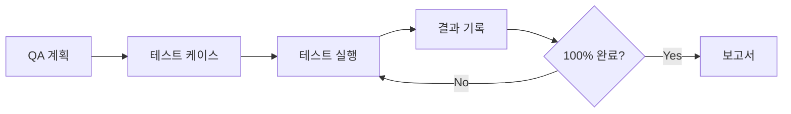
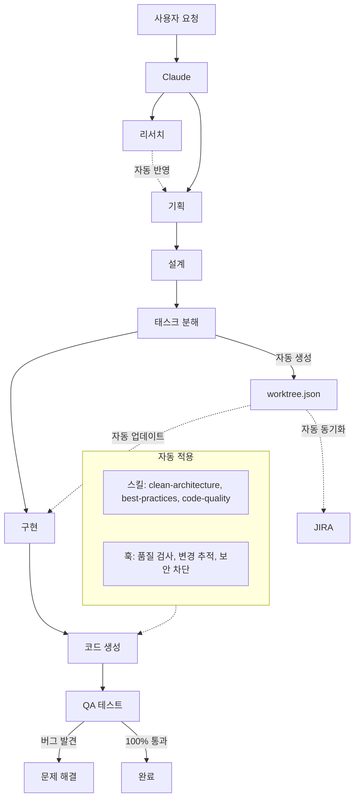

# Calab Claude Plugin v2.3.0

> **어떤 상황에서든 동일한 개발 품질을 보장하는** Claude Code 공식 플러그인

---

## 한눈에 보기

| 항목 | 수량 | 설명 |
|------|------|------|
| **명령어** | 42개 | 개발 워크플로우, 클린 아키텍처, QA 등 |
| **스킬** | 13개 | 자동 활성화되는 패시브 스킬 |
| **에이전트** | 7개 | 특화된 작업 수행 서브에이전트 |
| **베스트 프랙티스** | 15개 | 언어별 코드 품질 규칙 |

---

## 목차

1. [핵심 기능](#핵심-기능)
2. [설치](#설치)
3. [빠른 시작](#빠른-시작)
4. [명령어 레퍼런스](#명령어-레퍼런스)
5. [주요 기능 상세](#주요-기능-상세)
6. [자동화 시스템](#자동화-시스템)
7. [프로젝트 구조](#프로젝트-구조)
8. [문제 해결](#문제-해결)
9. [버전 히스토리](#버전-히스토리)

---

## 핵심 기능

### 개발 워크플로우

```
Plan → Design → Tasks → Build → QA
```

| 단계 | 명령어 | 적용 표준 | 설명 |
|------|--------|----------|------|
| 기획 | `/dev-plan` | PRD 템플릿 | 브레인스토밍 + 요구사항 문서 |
| 설계 | `/dev-design` | C4 Model + Layered Architecture | 아키텍처 + ERD (3NF 정규화) |
| 분해 | `/dev-tasks` | Epic-Story-Task + AC | 작업 분해 + 우선순위(P0~P3) |
| 구현 | `/dev-build` | Clean Architecture + Best Practices | 4-Layer + TDD 지원 |
| 검증 | `/qa` | 7단계 QA 프로세스 | E2E 테스트 자동화 |

### 자동 활성화 스킬 (13개)

코드 작성 시 **자동으로 적용**되는 기능:

| 스킬 | 트리거 | 효과 |
|------|--------|------|
| `clean-architecture` | 코드 구현 시 | 4-레이어 의존성 규칙 강제 |
| `best-practices` | 기술 감지 시 | 15개 언어별 베스트 프랙티스 |
| `code-quality` | 코드 생성 시 | 500줄 제한, 주석 필수, 타입 완전성 |
| `security-review` | 보안 키워드 시 | OWASP Top 10 취약점 검사 |
| `tdd-workflow` | TDD 키워드 시 | Red-Green-Refactor, 80% 커버리지 |
| `problem-solving` | 에러/버그 시 | 5 Whys, RCA 방법론 |
| `qa-testing` | QA/테스트 시 | E2E + MCP Puppeteer |
| `jira-integration` | JIRA 언급 시 | 양방향 자동 동기화 |
| `work-tracker` | 소스 수정 시 | Worktree 자동 추적 |
| `project-rules` | 코드 작성 시 | 프로젝트 규칙 참조 |
| `project-onboarding` | 분석 요청 시 | 5개 컨텍스트 문서 생성 |
| `research-skill` | 조사 요청 시 | 5-10회 검색 + 요약 |
| `dev-workflow` | 개발 시작 시 | 워크플로우 가이드 |

### 특화 에이전트 (7개)

| 에이전트 | 역할 | 자동 호출 조건 |
|----------|------|---------------|
| `code-reviewer` | 코드 품질 검토, 개선점 제안 | 리뷰 요청 시 |
| `project-guardian` | 규칙 준수 검증, 작업 맥락 유지 | 규칙 확인 시 |
| `security-reviewer` | OWASP Top 10, SQL Injection, XSS 검사 | 보안 검사 시 |
| `build-error-resolver` | TypeScript, ESLint, 번들러 오류 해결 | 빌드 실패 시 |
| `refactor-cleaner` | 데드 코드, 미사용 import, 중복 코드 정리 | 리팩토링 요청 시 |
| `e2e-runner` | Playwright/Puppeteer E2E 테스트 실행 | 통합 테스트 시 |
| `doc-updater` | 코드 변경 기반 문서 자동 업데이트 | 문서 동기화 시 |

---

## 설치

### Step 1: 글로벌 파일 설치 (터미널)

```bash
./install-plugin.sh
```

### Step 2: 플러그인 등록 (Claude Code 내부)

```bash
/plugin marketplace add ~/.claude/calab-marketplace
/plugin install calab-plugin@calab-marketplace --scope user
```

### 설치 확인

```bash
/calab-plugin:onboard
```

### 설치 스코프

| 스코프 | 위치 | 용도 |
|--------|------|------|
| `user` | `~/.claude/plugins/user/` | **개인 개발 환경 (권장)** |
| `project` | `.claude/plugins/` | 팀 협업, Git 공유 |
| `local` | 세션 메모리 | 테스트, 임시 사용 |

### 재설치/업데이트

```bash
# 1. Claude Code 종료 후 캐시 삭제
rm -rf ~/.claude/plugins/cache
rm -f ~/.claude/plugins/installed_plugins.json
rm -f ~/.claude/plugins/known_marketplaces.json
rm -rf ~/.claude/calab-marketplace

# 2. 재설치
./install-plugin.sh

# 3. Claude Code에서 재등록
/plugin marketplace add ~/.claude/calab-marketplace
/plugin install calab-plugin@calab-marketplace --scope user
```

---

## 빠른 시작

### 상황별 사용법

| 상황 | 자연어 | 명령어 |
|------|--------|--------|
| 새 프로젝트 시작 | "기획해줘" | `/dev-plan [기능명]` |
| 기존 프로젝트 투입 | "프로젝트 분석해줘" | `/onboard` |
| 세션/Compact 후 | "복원해줘" | `/restore-context` |
| 버그 해결 | "해결해줘" | `/solve [문제]` |
| 기술 조사 | "조사해줘" | `/research [주제]` |
| QA 테스트 | "테스트해줘" | `/qa` |
| 보안 검사 | "보안 검사해줘" | `/security-review` |
| 코드 정리 | "리팩토링해줘" | `/check-quality` |

### 개발 워크플로우 예시

```bash
# 1. 기획 (브레인스토밍 + PRD)
/dev-plan 사용자 인증 시스템

# 2. 설계 (아키텍처 + ERD)
/dev-design

# 3. 태스크 분해
/dev-tasks

# 4. TDD로 구현
/dev-build TASK-001 --tdd

# 5. 진행 상황 확인
/worktree

# 6. QA 테스트
/qa --from-worktree
```

---

## 명령어 레퍼런스

### 개발 워크플로우

| 명령어 | 옵션 | 적용 표준 | 설명 |
|--------|------|----------|------|
| `/dev-plan [기능]` | `--brainstorm`, `--prd` | PRD 템플릿 | 브레인스토밍 + PRD |
| `/dev-design` | `--arch`, `--erd` | C4 Model, 3NF | 아키텍처 + ERD |
| `/dev-tasks` | - | Epic-Story-Task | 태스크 분해 + AC |
| `/dev-build [task]` | `--tdd` | Clean Architecture | 태스크 구현 |
| `/dev-status` | - | Worktree 추적 | 진행률 확인 |

### 클린 아키텍처

| 명령어 | 적용 표준 | 설명 |
|--------|----------|------|
| `/clean-init` | 4-Layer Clean Architecture | Domain/Application/Adapters/Infrastructure |
| `/clean-entity [name]` | Domain Layer 규칙 | 외부 import 금지, 순수 TypeScript |
| `/clean-usecase [name]` | Application Layer 규칙 | Domain만 import, Interface 의존 |
| `/clean-validate` | 의존성 규칙 검증 | 내부→외부 참조 금지, 순환 의존성 탐지 |

### 온보딩 & 컨텍스트

| 명령어 | 설명 |
|--------|------|
| `/onboard` | 5개 컨텍스트 문서 생성 (기술스택, 패턴, 아키텍처, 도메인, 주요파일) |
| `/onboard-quick` | 핵심만 빠른 분석 |
| `/learn [path]` | 특정 영역 심층 학습 |
| `/context-show` | 컨텍스트 표시 |
| `/context-refresh` | 컨텍스트 갱신 |
| `/restore-context` | 규칙 + 작업 상태 복원 |
| `/save-progress` | 체크포인트 저장 |

### 리서치

| 명령어 | 옵션 | 적용 표준 | 설명 |
|--------|------|----------|------|
| `/research [주제]` | `--quick`, `--deep` | 체계적 리서치 프로토콜 | 5-10회 검색 + 핵심 요약 + 출처 검증 |

### 문제 해결

| 명령어 | 옵션 | 적용 표준 | 설명 |
|--------|------|----------|------|
| `/solve [문제]` | `--5whys` | 5 Whys | "왜?"를 5번 반복하여 근본 원인 추적 |
| `/solve [문제]` | `--rca` | Root Cause Analysis | 8단계 RCA + Fishbone 다이어그램 |
| `/solve [문제]` | `--hypothesis` | 가설 기반 접근 | 가설 → 예측 → 실험 → 검증 |
| `/solve [문제]` | `--binary` | Binary Search | 코드 이분 탐색으로 문제 위치 특정 |
| `/solve-log` | - | - | 진행 중 분석 로그 |
| `/solve-history` | `--recent`, `--keyword` | - | 과거 해결 사례 검색 |
| `/solve-report [id]` | `--full`, `--summary` | - | 해결 보고서 생성 |

### QA & 테스트

| 명령어 | 옵션 | 적용 표준 | 설명 |
|--------|------|----------|------|
| `/qa` | `--from-prd`, `--from-worktree` | 7단계 QA 프로세스 | QA 시작 |
| `/qa-plan` | `--edit` | 테스트 피라미드 | Unit 70%, Integration 20%, E2E 10% |
| `/qa-run [tc]` | `--all`, `--failed` | MCP Puppeteer + BDD | Given-When-Then 테스트 |
| `/qa-report` | `--summary`, `--full` | 표준 QA 보고서 | 통과율, 버그 목록, 권장사항 |
| `/qa-status` | - | - | 테스트 진행률 |

### 보안 & 품질

| 명령어 | 적용 표준 | 설명 |
|--------|----------|------|
| `/security-review` | OWASP Top 10 | SQL Injection, XSS, 시크릿 탐지 |
| `/check-quality` | 코드 품질 규칙 | 500줄 초과, 주석 누락 검사 |

### Worktree & JIRA

| 명령어 | 설명 |
|--------|------|
| `/worktree` | Epic-Story-Task 트리 시각화 |
| `/worktree start [id]` | 태스크 시작 |
| `/worktree done [id]` | 태스크 완료 |
| `/worktree block [id] [사유]` | 블로커 등록 |
| `/jira-init [key]` | JIRA 연동 초기화 |
| `/jira-sync` | 양방향 동기화 |
| `/jira-push` | Worktree → JIRA |
| `/jira-pull` | JIRA → Worktree |

### 문서 생성

| 명령어 | 설명 |
|--------|------|
| `/docs generate` | 전체 문서 생성 (API, 컴포넌트, 가이드 등) |
| `/docs add [type]` | 특정 유형 문서 추가 |
| `/docs update` | 코드 변경 → 문서 자동 반영 |
| `/docs status` | 문서 현황 + 품질 점수 |
| `/docs validate` | 구조/링크/완성도 검증 |

**문서 유형**: `getting-started`, `architecture`, `api`, `component`, `guide`, `config`, `faq`, `troubleshooting`

---

## 주요 기능 상세

### 1. 개발 워크플로우


**사용 예시:**

```bash
# 1. 기획 - 브레인스토밍만
/dev-plan 사용자 인증 --brainstorm

# 2. 기획 - PRD만
/dev-plan 사용자 인증 --prd

# 3. 설계 - 아키텍처만
/dev-design --arch

# 4. 설계 - ERD만
/dev-design --erd

# 5. TDD 모드로 구현
/dev-build TASK-001 --tdd
```

### 2. 클린 아키텍처

**4-레이어 구조:**

| 레이어 | 역할 | 의존성 규칙 |
|--------|------|------------|
| Domain | 엔티티, 값 객체, 리포지토리 인터페이스 | 외부 의존 금지 |
| Application | 유스케이스, DTO, 포트 | Domain만 의존 |
| Adapter | 컨트롤러, 프레젠터, 리포지토리 구현 | Application, Domain 의존 |
| Infrastructure | 외부 의존성, 설정 | 모든 레이어 의존 가능 |

**사용 예시:**

```bash
# 1. 구조 초기화
/clean-init

# 2. 엔티티 생성
/clean-entity User --with-repository

# 3. 유스케이스 생성
/clean-usecase CreateUser --entity User

# 4. 의존성 검증
/clean-validate --fix
```

### 3. 프로젝트 온보딩

**5개 컨텍스트 문서 자동 생성:**

| 문서 | 내용 |
|------|------|
| `PROJECT_SUMMARY.md` | 프로젝트 개요, 목적, 주요 기능 |
| `ARCHITECTURE.md` | 시스템 구조, 레이어, 데이터 흐름 |
| `CODE_PATTERNS.md` | 디자인 패턴, 코딩 컨벤션 |
| `CONVENTIONS.md` | 네이밍 규칙, 파일 구조 |
| `DOMAIN_KNOWLEDGE.md` | 비즈니스 규칙, 도메인 용어 |

**사용 예시:**

```bash
# 전체 분석 (5-10분)
/onboard

# 빠른 분석 (1-2분)
/onboard-quick

# 특정 영역 심층 학습
/learn src/services

# 컨텍스트 확인
/context-show tech
/context-show patterns
```

### 4. 리서치

**체계적 리서치 프로토콜:**

```bash
# 기본 리서치 (5회 검색)
/research OAuth 2.0

# 빠른 리서치 (3회 검색)
/research JWT --quick

# 심층 리서치 (10회 검색)
/research 클린 아키텍처 --deep
```

**결과 저장 위치:** `.claude/research/[주제]/RESEARCH.md`

### 5. 문제 해결


**사용 예시:**

```bash
# 5 Whys 방법론
/solve "로그인 시 500 에러" --5whys

# RCA (Root Cause Analysis)
/solve "성능 저하" --rca

# 과거 해결 사례 검색
/solve-history 데이터베이스
/solve-history --recent
```

**지식 베이스:** `.claude/problem-solving/kb/solved/[문제ID]/`

### 6. QA 테스트



**사용 예시:**

```bash
# PRD 기반 테스트 케이스 생성
/qa --from-prd

# Worktree 기반 테스트 케이스 생성
/qa --from-worktree

# 전체 테스트 실행
/qa-run --all

# 실패한 테스트만 재실행
/qa-run --failed

# QA 보고서 생성
/qa-report --full
```

**주요 기능:**
- MCP Puppeteer로 실제 브라우저 테스트
- 자동 스크린샷 캡처
- 버그 자동 기록 및 분류

### 7. JIRA 연동

**사전 설정:**

```bash
export JIRA_EMAIL='your-email@company.com'
export JIRA_API_TOKEN='your-api-token'
```

**사용 예시:**

```bash
# JIRA 연동 초기화
/jira-init AUTH

# 양방향 동기화
/jira-sync

# 상태 확인
/jira-status --detailed
```

**자동 동기화:**
- Worktree 태스크 시작 → JIRA "In Progress"
- Worktree 태스크 완료 → JIRA "Done"

---

## 자동화 시스템

### Hooks (자동 실행)

| 트리거 | 동작 | 저장 위치 |
|--------|------|----------|
| **사용자 입력** | 작업 의도 감지 → 현재 목표 업데이트 | `.claude/memory/CURRENT_CONTEXT.md` |
| **파일 수정** | 품질 검사 + 변경 추적 + 자동 포맷팅 | `.claude-state/recent_changes.json` |
| **소스 코드 수정** | Worktree 자동 업데이트 + JIRA 동기화 | `.claude-state/worktree.json` |
| **세션 시작** | 패키지 매니저 감지 + 이전 컨텍스트 안내 | 콘솔 출력 |
| **세션 종료** | 연속 학습 (패턴 자동 추출) | `.claude/learned-patterns/` |
| **Context Compact** | 전략적 컴팩트 제안 (80% 사용 시) + 체크포인트 저장 | `.claude-state/checkpoint.json` |
| **민감 파일 접근** | `.env`, `credentials` 자동 차단 | - |

### 통합 플로우



**핵심 자동 연동:**

| 트리거 | 자동 동작 |
|--------|----------|
| 리서치 완료 | PRD 작성 시 자동 반영 |
| 태스크 분해 | `worktree.json` 자동 생성 |
| Worktree 변경 | JIRA 이슈 상태 자동 동기화 |
| 코드 작성 | 품질 검사 + 베스트 프랙티스 자동 적용 |
| 구현 완료 | QA 테스트 연계 |
| QA 버그 발견 | 문제 해결 프로세스 자동 연계 |

---

## 프로젝트 구조

### 글로벌 설치 (`~/.claude/`)

```
~/.claude/
├── CLAUDE.md                    # 마스터 지침
├── settings.json                # 훅 설정
├── hooks/                       # Python 훅
│   ├── suggest_compact.py       # 전략적 컴팩트 제안
│   ├── continuous_learning.py   # 연속 학습
│   ├── detect_package_manager.py# 패키지 매니저 감지
│   ├── auto_format.py           # 자동 포맷팅
│   ├── code_quality_validator.py# 품질 검사
│   └── ...
├── agents/                      # 서브에이전트 (7개)
│   ├── code-reviewer.md
│   ├── project-guardian.md
│   ├── security-reviewer.md
│   ├── build-error-resolver.md
│   ├── refactor-cleaner.md
│   ├── e2e-runner.md
│   └── doc-updater.md
├── best-practices/              # 베스트 프랙티스 (15개)
├── templates/                   # 문서 템플릿
├── memory/                      # 메모리 템플릿
├── rules/                       # 규칙 (testing.md 등)
└── calab-marketplace/           # 마켓플레이스
    └── plugins/calab-plugin/
        ├── .claude-plugin/      # 플러그인 메타데이터
        ├── commands/            # 슬래시 명령어 (42개)
        └── skills/              # 자동 활성화 스킬 (13개)
```

### 프로젝트별 자동 생성

```
프로젝트/
├── .claude-state/               # 런타임 상태 (.gitignore 권장)
│   ├── worktree.json            # 작업 트리 상태
│   ├── checkpoint.json          # 체크포인트
│   ├── jira_mapping.json        # JIRA ID 매핑
│   ├── recent_changes.json      # 최근 변경 이력
│   ├── quality_violations.json  # 코드 품질 위반
│   └── qa/                      # QA 런타임
│       ├── test-results.json
│       ├── bugs.json
│       └── screenshots/
│
└── .claude/
    ├── docs/                    # 기능별 문서 (/dev-plan)
    │   ├── active/              # 진행 중인 기능
    │   │   └── {feature-name}/
    │   │       ├── 01-brainstorm.md
    │   │       ├── 02-prd.md
    │   │       ├── 03-architecture.md
    │   │       ├── 04-erd.md
    │   │       ├── 05-tasks.md
    │   │       └── qa/
    │   └── complete/            # 완료된 기능
    │
    ├── project-context/         # 온보딩 문서 (/onboard)
    │   ├── PROJECT_SUMMARY.md
    │   ├── ARCHITECTURE.md
    │   ├── CODE_PATTERNS.md
    │   ├── CONVENTIONS.md
    │   └── DOMAIN_KNOWLEDGE.md
    │
    ├── research/                # 리서치 결과 (/research)
    │   └── {topic}/
    │       └── RESEARCH.md
    │
    └── problem-solving/         # 문제 해결 (/solve)
        ├── active/
        └── resolved/
```

---

## 문제 해결

### 플러그인이 작동하지 않음

```bash
# Claude Code 종료 후 실행
rm -rf ~/.claude/plugins/cache
rm -f ~/.claude/plugins/installed_plugins.json
rm -f ~/.claude/plugins/known_marketplaces.json
rm -rf ~/.claude/calab-marketplace

# 재설치
./install-plugin.sh

# Claude Code에서 재등록
/plugin marketplace add ~/.claude/calab-marketplace
/plugin install calab-plugin@calab-marketplace --scope user
```

### Compact 후 컨텍스트 손실

```bash
/restore-context
```

### Claude Code 버전 확인

```bash
claude --version   # 2.x 이상 필요
claude update      # 업데이트
```

### 완전 제거

```bash
# 방법 1: 스크립트
./uninstall-plugin.sh

# 방법 2: 수동
rm -rf ~/.claude/plugins/cache
rm -f ~/.claude/plugins/installed_plugins.json
rm -f ~/.claude/plugins/known_marketplaces.json
rm -rf ~/.claude/calab-marketplace
rm ~/.claude/CLAUDE.md ~/.claude/settings.json
rm -rf ~/.claude/hooks ~/.claude/best-practices ~/.claude/agents
```

---

## 버전 히스토리

### v2.3.0 (2026-01-25)
- **신규 에이전트 3개**: refactor-cleaner, e2e-runner, doc-updater
- 총 7개 에이전트 구성 완료

### v2.2.0 (2026-01-24)
- **보안 기능**: security-reviewer 에이전트, OWASP Top 10 검사
- **TDD 워크플로우**: Red-Green-Refactor, 80% 커버리지 요구
- **전략적 Compact**: 80% 컨텍스트 사용 시 제안
- **연속 학습**: 세션 종료 시 패턴 자동 추출
- **패키지 매니저 감지**: npm/pnpm/yarn/bun 자동 감지
- **자동 포맷팅**: Prettier/Black/gofmt + console.log 경고
- build-error-resolver 에이전트 추가

### v2.1.0 (2026-01-10)
- 글로벌/프로젝트 경로 명확화
- 설치 안정성 개선 (심볼릭 링크 → 전체 복사)

### v2.0.0 (2026-01-02)
- 공식 플러그인 시스템으로 전환
- 명령어 네임스페이스 적용

---

## 상세 문서

- [INSTALL.md](INSTALL.md) - 설치/제거 상세 가이드
- [CLAUDE.md](CLAUDE.md) - 핵심 사용법 및 규칙
- [docs/COMMANDS_REFERENCE.md](docs/COMMANDS_REFERENCE.md) - 전체 명령어
- [docs/FEATURES_GUIDE.md](docs/FEATURES_GUIDE.md) - 기능 상세

---

## 라이선스

MIT License - Wonder Move Lab
