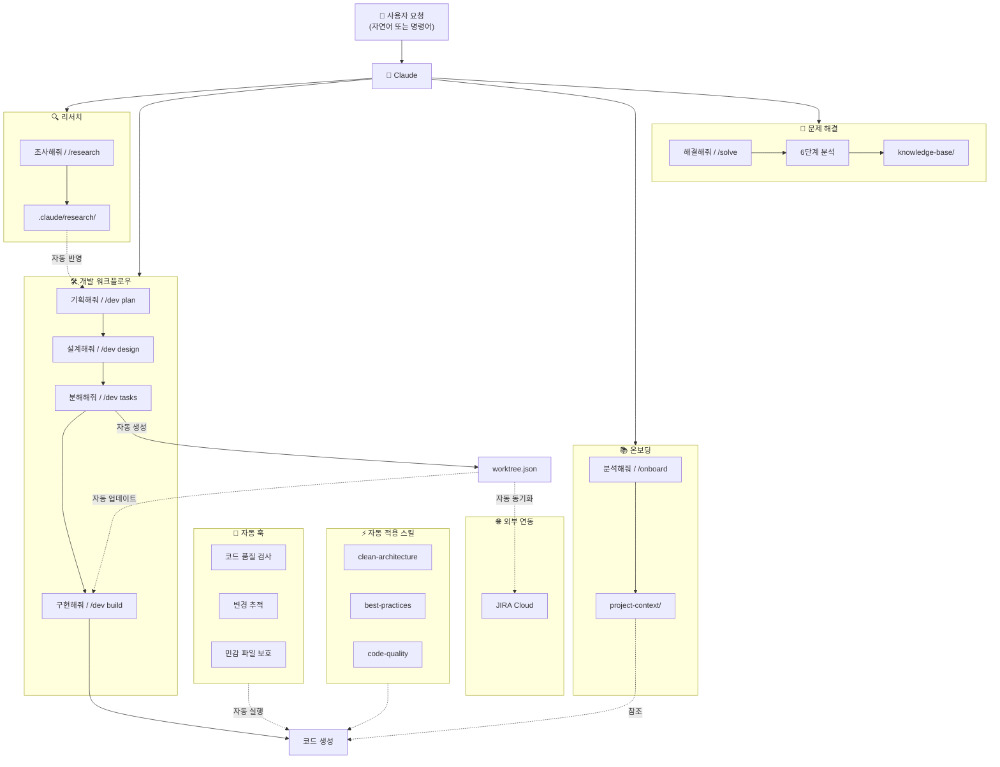
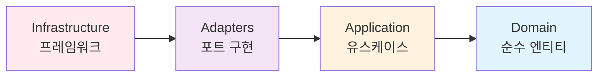
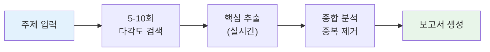
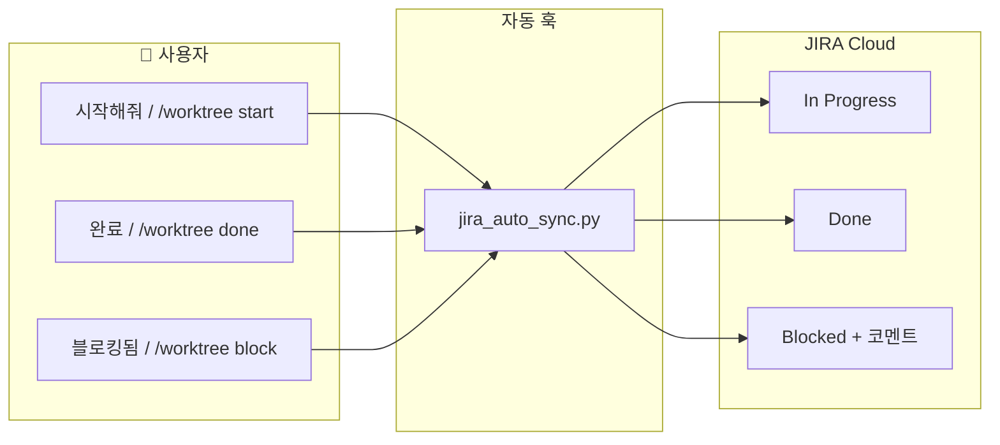
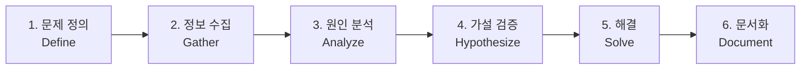

# 원더 무브 연구소 Claude Plug-in

> **어떤 상황에서든 동일한 개발 품질을 보장하는** Claude Code 업무 자동화 플러그인

---

## 개요

### 핵심 가치

**"프로젝트 시작부터 완료까지, 언제 투입되든 동일한 품질"**

이 플러그인은 AI를 활용한 개발에서 발생하는 **일관성 문제**를 해결합니다.

### 해결하는 문제

| 상황 | 문제 | 해결 |
|------|------|------|
| **새 프로젝트 시작** | 설계 없이 바로 코딩, 아키텍처 무시 | "기획해줘" → 체계적 진행 |
| **기존 프로젝트 투입** | 기존 패턴 무시, 스타일 불일치 | "분석해줘" → 프로젝트 학습 |
| **작업 재개** | 이전 맥락 망각, 규칙 무시 | "복원해줘" → 상태 복원 |
| **장기 프로젝트** | 진행 상황 파악 어려움 | "진행률 보여줘" → 실시간 추적 |
| **기술 검토 필요** | 검색 결과 정리 어려움 | "조사해줘" → 자동 요약 |

---

## 사용 방법

사용자는 **자연어** 또는 **명령어 직접 입력** 두 가지 방식으로 요청할 수 있습니다.

```
┌─────────────────────────────────────────────────────────────┐
│  사용 방식 1: 자연어                                         │
│  → "사용자 인증 시스템 기획해줘"                             │
│  → "OAuth 2.0에 대해 조사해줘"                               │
└─────────────────────────────────────────────────────────────┘

┌─────────────────────────────────────────────────────────────┐
│  사용 방식 2: 명령어 직접 입력                               │
│  → /dev plan 사용자 인증                                     │
│  → /research OAuth 2.0                                       │
│  → /onboard                                                  │
└─────────────────────────────────────────────────────────────┘
```

---

## 설치

```bash
# 저장소 클론
git clone https://github.com/Wondermove-Inc/calab-claude-plugin.git

# 프로젝트에 .claude 폴더와 CLAUDE.md 복사
cp -r calab-claude-plugin/.claude /your-project/
cp calab-claude-plugin/CLAUDE.md /your-project/

# (선택) JIRA 연동 사용 시 Python 의존성 설치
pip install requests
```

---

## 전체 명령어 요약

| 카테고리 | 명령어 | 옵션 | 자연어 | 설명 |
|----------|--------|------|--------|------|
| **개발 워크플로우** | `/dev plan [기능]` | `--brainstorm`, `--prd` | "기획해줘" | 브레인스토밍 + PRD |
| | `/dev design` | `--arch`, `--erd` | "설계해줘" | 아키텍처 + ERD |
| | `/dev tasks` | - | "태스크 분해해줘" | 태스크 목록 생성 |
| | `/dev build [task-id]` | `--tdd` | "구현해줘" | 태스크 구현 |
| | `/dev status` | - | "진행 상황 보여줘" | 진행률 확인 |
| **클린 아키텍처** | `/clean-init` | - | "클린 아키텍처 만들어줘" | 4-레이어 구조 초기화 |
| | `/clean-entity [name]` | - | "엔티티 만들어줘" | 도메인 엔티티 생성 |
| | `/clean-usecase [name]` | - | "유스케이스 만들어줘" | 유스케이스 생성 |
| | `/clean-validate` | - | "아키텍처 검증해줘" | 의존성 검증 |
| **온보딩** | `/onboard` | - | "프로젝트 분석해줘" | 5개 컨텍스트 문서 생성 |
| | `/onboard-quick` | - | "빠르게 파악해줘" | 핵심만 빠른 분석 |
| | `/learn [path]` | - | "폴더 분석해줘" | 특정 영역 심층 학습 |
| | `/context-refresh` | - | "컨텍스트 업데이트해줘" | 문서 갱신 |
| | `/context-show` | - | "컨텍스트 보여줘" | 컨텍스트 표시 |
| **리서치** | `/research [주제]` | `--quick`, `--deep` | "조사해줘" | 5-10회 검색 + 핵심 요약 |
| **Worktree** | `/worktree` | - | "작업 트리 보여줘" | 트리 구조 시각화 |
| | `/worktree status` | - | "진행률 보여줘" | 상태 요약 |
| | `/worktree start [id]` | - | "시작해줘" | 태스크 시작 |
| | `/worktree done [id]` | - | "완료" | 태스크 완료 |
| | `/worktree block [id] [사유]` | - | "블로킹됨" | 블로커 등록 |
| | `/worktree reset` | - | "작업 초기화해줘" | 트리 초기화 |
| **컨텍스트 관리** | `/restore-context` | - | "컨텍스트 복원해줘" | 규칙 + 작업 상태 복원 |
| | `/save-progress [메시지]` | - | "저장해줘" | 체크포인트 저장 |
| | `/show-rules` | - | "규칙 보여줘" | 전체 규칙 표시 |
| **코드 품질** | `/check-quality` | - | "품질 검사해줘" | 전체 프로젝트 검사 |
| **문제 해결** | `/solve [문제]` | `--5whys`, `--rca`, `--hypothesis`, `--binary` | "해결해줘" | 체계적 문제 분석 |
| | `/solve-log` | - | "분석 로그 보여줘" | 진행 중 문제 확인 |
| | `/solve-history [키워드]` | `--recent`, `--keyword` | "해결 이력 보여줘" | 과거 사례 검색 |
| | `/solve-report [id]` | `--draft`, `--summary`, `--full` | "보고서 만들어줘" | 해결 보고서 생성 |
| **JIRA 연동** | `/jira-init [key]` | - | "JIRA 연결해줘" | 연동 초기화 |
| | `/jira-push` | - | "JIRA로 동기화해줘" | Worktree → JIRA |
| | `/jira-pull` | - | "JIRA에서 가져와줘" | JIRA → Worktree |
| | `/jira-sync` | - | "양방향 동기화해줘" | 양방향 동기화 |
| | `/jira-link [id] [key]` | - | "JIRA에 연결해줘" | 수동 매핑 |
| | `/jira-status` | - | "JIRA 상태 보여줘" | 상태 확인 |

---

## 빠른 시작

### 시나리오별 사용 예시

| 상황 | 자연어 | 명령어 직접 입력 |
|------|--------|----------------|
| 새 프로젝트 시작 | "사용자 인증 시스템 기획해줘" | `/dev plan 사용자 인증` |
| 기존 프로젝트 투입 | "이 프로젝트 분석해줘" | `/onboard` |
| 세션 재개 | "이전 컨텍스트 복원해줘" | `/restore-context` |
| 버그/에러 해결 | "로그인 에러 해결해줘" | `/solve 로그인 에러` |

### 옵션 사용법

명령어 옵션도 자연어로 표현할 수 있습니다:

| 옵션 표현 | 자연어 대안 | 예시 |
|----------|------------|------|
| `/research OAuth --quick` | "OAuth 빠르게 알아봐줘" | 3회 검색 |
| `/research OAuth --deep` | "OAuth 자세히 조사해줘" | 10회 검색 |
| `/dev plan --brainstorm` | "결제시스템 브레인스토밍해줘" | 브레인스토밍만 |
| `/dev design --erd` | "ERD만 설계해줘" | ERD만 생성 |
| `/dev build TASK-001 --tdd` | "TASK-001 TDD로 구현해줘" | 테스트 먼저 |
| `/save-progress "기능 완료"` | "기능 완료로 저장해줘" | 메시지 포함 |
| `/solve 에러 --5whys` | "5 Whys로 분석해줘" | 5 Whys 방법론 |
| `/solve-history DB` | "DB 관련 해결 이력 보여줘" | 키워드 검색 |

---

## 플러그인 통합 플로우

모든 플러그인이 유기적으로 연결되어 있습니다:



**자동 연동 포인트:**

| 카테고리 | 트리거 | 자동 동작 |
|---------|--------|----------|
| **리서치** | "조사해줘" 또는 `/research` | 다각도 검색 → 보고서 생성 |
| **기획** | "기획해줘" 또는 `/dev plan` | `.claude/research/` 자동 검색 및 PRD 반영 |
| **설계** | "설계해줘" 또는 `/dev design` | 아키텍처/ERD 문서 → 태스크 분해 연계 |
| **태스크** | "분해해줘" 또는 `/dev tasks` | `worktree.json` 자동 생성 |
| **구현** | "구현해줘" 또는 `/dev build` | 소스 코드 수정 시 태스크 자동 시작 (in_progress), 베스트 프랙티스 로드 |
| **온보딩** | "분석해줘" 또는 `/onboard` | 5개 project-context 문서 자동 생성 |
| **문제 해결** | "해결해줘" 또는 `/solve` | 6단계 체계적 분석, 지식 베이스 축적 |
| **코드 작성** | 파일 생성/수정 시 | `code-quality`, `best-practices` skill 자동 활성화 |
| **보안** | 민감 파일 수정 시도 | `.env`, `credentials` 등 자동 차단 |
| **JIRA** | worktree 상태 변경 시 | JIRA 이슈 상태 자동 동기화 |
| **컨텍스트** | 사용자 입력 시 | 현재 태스크/규칙 리마인더 자동 주입 |
| **백업** | Context Compact 시 | 현재 상태 체크포인트 자동 저장 |
| **세션** | 응답 완료 시 | 진행 상황 자동 백업 |

---

## 사용 시나리오

### 시나리오 1: 새 기능 개발

**대화 예시:**
```
👤: "결제 시스템 기획해줘" (또는 /dev plan 결제시스템)
🤖: 브레인스토밍 + PRD 작성...

👤: "아키텍처 설계해줘" (또는 /dev design)
🤖: 아키텍처 + ERD 설계...

👤: "태스크 분해해줘" (또는 /dev tasks)
🤖: 태스크 목록 생성, worktree.json 자동 생성...

👤: "TASK-001 구현해줘" (또는 /dev build TASK-001)
🤖: 구현 시작...
```

### 시나리오 2: 기존 프로젝트 투입

**대화 예시:**
```
👤: "이 프로젝트 분석해줘" (또는 /onboard)
🤖: 5개 컨텍스트 문서 생성...

👤: "src/services 폴더 분석해줘" (또는 /learn src/services)
🤖: 패턴 분석...

👤: "UserService와 같은 패턴으로 ProductService 만들어줘"
🤖: 기존 패턴에 맞춰 코드 생성...
```

### 시나리오 3: 클린 아키텍처 적용

**대화 예시:**
```
👤: "클린 아키텍처 구조 만들어줘" (또는 /clean-init)
🤖: 4-레이어 구조 생성...

👤: "User 엔티티 만들어줘" (또는 /clean-entity User)
🤖: Entity, Value Object 생성...

👤: "CreateUser 유스케이스 만들어줘" (또는 /clean-usecase CreateUser)
🤖: UseCase, DTO, Port 생성...

👤: "아키텍처 규칙 검증해줘" (또는 /clean-validate)
🤖: 의존성 위반 검사...
```

### 시나리오 4: 세션 재개

**대화 예시:**
```
👤: "이전 컨텍스트 복원해줘" (또는 /restore-context)
🤖: 규칙 + 작업 상태 복원...

👤: "현재 컨텍스트 보여줘" (또는 /context-show)
🤖: 컨텍스트 표시...

👤: "현재 상태 저장해줘" (또는 /save-progress)
🤖: 체크포인트 저장...
```

### 시나리오 5: JIRA 연동으로 팀 협업

**1단계: 터미널에서 환경변수 설정**
```bash
export JIRA_EMAIL='dev@company.com'
export JIRA_API_TOKEN='your-api-token'
```

**2단계: Claude와 대화**
```
👤: "JIRA AUTH 프로젝트 연결해줘" (또는 /jira-init AUTH)
🤖: JIRA 연동 초기화...

👤: "JIRA로 동기화해줘" (또는 /jira-push)
🤖: Worktree → JIRA 이슈 자동 생성...

👤: "TASK-001 시작해줘" (또는 /worktree start TASK-001)
🤖: JIRA: To Do → In Progress

👤: "TASK-001 완료" (또는 /worktree done TASK-001)
🤖: JIRA: In Progress → Done

👤: "JIRA 연동 상태 보여줘" (또는 /jira-status)
🤖: 상태 리포트...
```

### 시나리오 6: 버그/에러 체계적 해결

**대화 예시:**
```
👤: "로그인 API가 500 에러 나는데 해결해줘" (또는 /solve 로그인 API 500 에러)
🤖: 문제 정의 시작...
    정보 수집 (git log, 에러 로그)...
    5 Whys 분석...

    ━━━━━━━━━━━━━━━━━━━━━━━━━━━━━━
    근본 원인: 마이그레이션 누락
    ━━━━━━━━━━━━━━━━━━━━━━━━━━━━━━

👤: "해결 이력 보여줘" (또는 /solve-history)
🤖: 과거 유사 문제 검색...
    PROB-012: DB 쿼리 실패 (유사도 85%)

👤: "해결 보고서 만들어줘" (또는 /solve-report PROB-001)
🤖: 보고서 생성...
    .claude/problem-solving/resolved/PROB-001/report.md
```

---

## 기능 레퍼런스

### 개발 워크플로우

체계적인 개발 프로세스를 위한 기능입니다.


| 명령어 | 옵션 | 자연어 | 출력 |
|--------|------|--------|------|
| `/dev plan [기능]` | `--brainstorm`, `--prd` | "결제 시스템 기획해줘" | `docs/prd/{feature}/` |
| `/dev design` | `--arch`, `--erd` | "아키텍처 설계해줘" | `docs/architecture/` |
| `/dev tasks` | - | "태스크 분해해줘" | `docs/tasks/`, `worktree.json` |
| `/dev build [task-id]` | `--tdd` | "TASK-001 구현해줘" | 베스트 프랙티스 적용 코드 |
| `/dev status` | - | "진행 상황 보여줘" | 현재 단계, 완료율 표시 |

**출력 예시:**
```
============================================
 [PLAN] 기획 완료
============================================

 기능: 결제 시스템
 생성된 문서:
 • docs/prd/payment/brainstorm.md
 • docs/prd/payment/prd.md

 다음 단계: "설계해줘" 또는 /dev design
============================================
```

---

### 클린 아키텍처

4-레이어 클린 아키텍처를 강제 적용합니다.

| 명령어 | 옵션 | 자연어 | 출력 |
|--------|------|--------|------|
| `/clean-init` | - | "클린 아키텍처 구조 만들어줘" | 4-레이어 디렉토리 구조 |
| `/clean-entity [name]` | - | "User 엔티티 만들어줘" | Entity, Value Object, Interface |
| `/clean-usecase [name]` | - | "CreateUser 유스케이스 만들어줘" | UseCase, DTO, Port, Test |
| `/clean-validate` | - | "아키텍처 규칙 검증해줘" | 의존성 위반 리포트 |

**레이어 구조:**

```
src/
├── domain/           # 엔티티 (순수 비즈니스 로직, 외부 의존성 없음)
├── application/      # 유스케이스 (비즈니스 규칙, 인터페이스 의존)
├── adapters/         # 어댑터 (컨트롤러, 리포지토리 구현)
└── infrastructure/   # 인프라 (프레임워크, DB, 외부 서비스)
```

**의존성 규칙:**



> 의존성은 항상 **외부 → 내부** 방향. Domain은 어떤 것도 의존하지 않음.

---

### 프로젝트 온보딩

기존 프로젝트를 분석하고 AI가 일관된 코드를 생성하도록 합니다.

| 명령어 | 옵션 | 자연어 | 출력 |
|--------|------|--------|------|
| `/onboard` | - | "이 프로젝트 분석해줘" | 5개 컨텍스트 문서 생성 |
| `/onboard-quick` | - | "프로젝트 빠르게 파악해줘" | PROJECT_SUMMARY.md |
| `/learn [path]` | - | "src/services 폴더 분석해줘" | 패턴 추출 및 문서화 |
| `/context-refresh` | - | "컨텍스트 문서 업데이트해줘" | 업데이트된 컨텍스트 |
| `/context-show` | - | "현재 컨텍스트 보여줘" | 컨텍스트 요약 출력 |

**생성되는 컨텍스트 문서:**

| 파일 | 내용 |
|------|------|
| `PROJECT_SUMMARY.md` | 프로젝트 요약, 기술 스택, 디렉토리 구조 |
| `ARCHITECTURE.md` | 레이어 구조, 모듈 의존성, 데이터 흐름 |
| `CODE_PATTERNS.md` | 컴포넌트 패턴, API 패턴, 테스트 패턴 |
| `CONVENTIONS.md` | 네이밍 규칙, import 순서, 주석 규칙 |
| `DOMAIN_KNOWLEDGE.md` | 비즈니스 개념, 용어 사전, 규칙 |

---

### 컨텍스트 관리

세션 간 컨텍스트를 유지하고 복원합니다.

| 명령어 | 옵션 | 자연어 | 출력 |
|--------|------|--------|------|
| `/restore-context` | - | "이전 컨텍스트 복원해줘" | 핵심 규칙, 현재 작업 표시 |
| `/save-progress [메시지]` | - | "현재 상태 저장해줘" | 체크포인트 저장 |
| `/show-rules` | - | "프로젝트 규칙 보여줘" | 전체 규칙 출력 |

**출력 예시:**
```
============================================
 컨텍스트 복원 완료
============================================

 적용된 핵심 규칙:
• 코드 품질 - 가독성 최우선, DRY 원칙
• 파일 제한 - 300줄 이하, 함수 주석 필수
• 금지 사항 - any, console.log, 하드코딩 비밀키

 현재 작업 상태:
• 현재 목표: 사용자 인증 시스템 구현
• 진행 중인 작업: JWT 토큰 검증 로직
• 다음 단계: 리프레시 토큰 구현
```

---

### 코드 품질

코드 품질을 검사하고 강제합니다.

| 명령어 | 옵션 | 자연어 | 출력 |
|--------|------|--------|------|
| `/check-quality` | - | "코드 품질 검사해줘" | 위반 사항 리포트 |

**자동 적용 규칙:**

| 규칙 | 기준 | 자동 경고 |
|------|------|----------|
| 파일 줄 수 | 300줄 이하 | 초과 시 분리 권고 |
| 함수 주석 | JSDoc 필수 | 누락 시 경고 |
| any 타입 | 사용 금지 | 사용 시 경고 |
| console.log | 사용 금지 | 사용 시 경고 |

---

### 리서치 (Research)

주제에 대해 다각도로 검색하고 핵심만 추출하여 보고서로 정리합니다.

| 명령어 | 옵션 | 자연어 | 출력 |
|--------|------|--------|------|
| `/research [주제]` | - | "OAuth 2.0에 대해 조사해줘" | 구조화된 보고서 |
| `/research [주제]` | `--quick` | "JWT 빠르게 알아봐줘" | 핵심 요약 |
| `/research [주제]` | `--deep` | "클린 아키텍처 자세히 조사해줘" | 상세 보고서 |

**리서치 프로세스:**



**생성되는 보고서:**

| 파일 | 내용 |
|------|------|
| `report.md` | 전체 보고서 (상세 분석) |
| `summary.md` | 1페이지 핵심 요약 |
| `sources.md` | 출처 목록 (신뢰도 포함) |

---

### Worktree (작업 트리)

개발 진행 상황을 실시간으로 추적하는 작업 트리입니다.

| 명령어 | 옵션 | 자연어 | 출력 |
|--------|------|--------|------|
| `/worktree` | - | "현재 작업 트리 보여줘" | 트리 구조 시각화 |
| `/worktree status` | - | "진행률 보여줘" | 진행률, 통계 |
| `/worktree start [task-id]` | - | "TASK-001 시작해줘" | 태스크 상세 정보 |
| `/worktree done [task-id]` | - | "TASK-001 완료" | 진행률 업데이트 |
| `/worktree block [task-id] [사유]` | - | "TASK-001 블로킹됨, API 대기중" | 대체 작업 추천 |
| `/worktree reset` | - | "작업 트리 초기화해줘" | 트리 초기화 |

**작업 트리 출력 예시:**

```
============================================
 WORKTREE: 사용자 인증 시스템
============================================

 진행률: ████████░░░░░░░░░░░░ 40% (4/10)

┌─ Epic 1: 사용자 인증
│
├─┬─ Story 1.1: 회원가입
│ │
│ ├── ✅ TASK-001: User 테이블 마이그레이션
│ ├── ✅ TASK-002: RegisterDto 정의
│ ├── 🔄 TASK-003: AuthService.register()  ← 현재 작업
│ ├── ⬚ TASK-004: AuthController 구현
│ └── ⬚ TASK-005: 회원가입 폼 컴포넌트
│
├─┬─ Story 1.2: 로그인
│ │
│ ├── ⬚ TASK-006: LoginDto 정의
│ ├── ⬚ TASK-007: AuthService.login() 구현
│ └── ⬚ TASK-008: 로그인 폼 컴포넌트

============================================
 상태: ✅ 완료 | 🔄 진행중 | 🚫 블로커 | ⬚ 대기
============================================
```

---

### JIRA 연동

Worktree와 JIRA를 양방향으로 동기화합니다. 관리자/PM이 JIRA 대시보드에서 진행 상황을 확인할 수 있습니다.

| 명령어 | 옵션 | 자연어 | 출력 |
|--------|------|--------|------|
| `/jira-init [project-key]` | - | "JIRA AUTH 프로젝트 연결해줘" | 연결 상태 |
| `/jira-push` | - | "JIRA로 동기화해줘" | 생성/업데이트 결과 |
| `/jira-pull` | - | "JIRA에서 가져와줘" | 반영 결과 |
| `/jira-sync` | - | "JIRA 양방향 동기화해줘" | 동기화 결과 |
| `/jira-link [task-id] [jira-key]` | - | "TASK-001을 AUTH-123에 연결해줘" | 매핑 정보 |
| `/jira-status` | - | "JIRA 연동 상태 보여줘" | 상태 리포트 |

**초기 설정:**

*터미널에서 환경변수 설정:*
```bash
export JIRA_EMAIL='your-email@company.com'
export JIRA_API_TOKEN='your-api-token'
```

**사용 흐름:**



**자동 동기화:**

| 사용자 요청 | JIRA 자동 동작 |
|------------|---------------|
| "TASK-001 시작해줘" 또는 "/worktree start TASK-001" | JIRA 이슈 → In Progress |
| "TASK-001 완료" 또는 "/worktree done TASK-001" | JIRA 이슈 → Done |
| "TASK-001 블로킹됨" 또는 "/worktree block TASK-001 사유" | JIRA 이슈 → Blocked + 코멘트 |

**상태 확인 예시:**

```
============================================
 JIRA 연동 상태
============================================

 연결 정보:
 • 상태: ✅ 연결됨
 • URL: https://company.atlassian.net
 • 프로젝트: AUTH (Authentication System)

 동기화 상태:
 • 총 매핑: 8개
 • Worktree 항목: 10개
 • 미동기화: 2개

 자동 동기화: ✅ 활성화

============================================
```

---

### 문제 해결 (Problem Solving)

체계적인 방법론(5 Whys, RCA, 가설 기반)으로 버그와 에러를 분석하고 해결합니다.

| 명령어 | 옵션 | 자연어 | 출력 |
|--------|------|--------|------|
| `/solve [문제]` | `--5whys`, `--rca`, `--hypothesis`, `--binary` | "에러 해결해줘" | 6단계 분석 + 해결책 |
| `/solve-log` | - | "분석 진행 상황 보여줘" | 현재 분석 상태 |
| `/solve-history [키워드]` | `--recent`, `--keyword` | "해결 이력 보여줘" | 과거 해결 사례 검색 |
| `/solve-report [id]` | `--draft`, `--summary`, `--full` | "해결 보고서 만들어줘" | 상세 보고서 |

**6단계 문제 해결 프로세스:**



**분석 방법론:**

| 방법론 | 옵션 | 사용 시점 |
|--------|------|----------|
| **5 Whys** | `--5whys` | 원인이 불명확할 때, 반복적 "왜?" 질문 |
| **RCA** | `--rca` | 복잡한 문제, 8단계 체계적 분석 |
| **가설 기반** | `--hypothesis` | 검증이 필요할 때, 과학적 방법 |
| **Binary Search** | `--binary` | 코드 디버깅, 이분 탐색으로 위치 특정 |

**5 Whys 분석 예시:**

```
문제: 로그인 API 500 에러

Why 1: 왜 500 에러가 발생하나요?
→ DB 쿼리에서 예외 발생

Why 2: 왜 DB 쿼리에서 예외가 발생하나요?
→ users 테이블에 email 컬럼 없음

Why 3: 왜 컬럼이 없나요?
→ 마이그레이션이 실행되지 않음

Why 4: 왜 마이그레이션이 실행되지 않았나요?
→ 배포 스크립트에서 누락됨

Why 5: 왜 배포 스크립트에서 누락됐나요?
→ CI/CD 파이프라인 변경 시 마이그레이션 단계 삭제됨

━━━━━━━━━━━━━━━━━━━━━━━━━━━━━━
근본 원인: CI/CD 파이프라인에서 마이그레이션 단계 누락
━━━━━━━━━━━━━━━━━━━━━━━━━━━━━━
```

**지식 베이스:**

해결된 문제는 자동으로 `.claude/problem-solving/knowledge-base/`에 저장되어 유사 문제 발생 시 자동 추천됩니다.

```
.claude/problem-solving/
├── active/               # 진행 중인 문제
├── resolved/             # 해결 완료
└── knowledge-base/       # 패턴 및 해결책 DB
    ├── patterns.json
    └── solutions.json
```

---

## 자동 활성화 스킬

다음 스킬들은 **키워드 감지 시 자동으로 적용**됩니다.
사용자가 별도로 요청하지 않아도 Claude가 자동으로 활성화합니다.

| 스킬 | 활성화 조건 | 자동 동작 |
|------|------------|----------|
| `project-rules` | 코드 작성, 수정, 리뷰 시 | 프로젝트 규칙 자동 참조 |
| `work-tracker` | 작업 시작, 전환, 완료 언급 시 | Worktree 추적 (시작 자동, 완료는 수동) |
| `code-quality` | 코드 생성, 함수 추가 시 | 300줄 제한, 주석 필수 적용 |
| `dev-workflow` | 기능 개발, 설계 언급 시 | 개발 워크플로우 안내 |
| `best-practices` | React, TypeScript, TDD 언급 시 | 기술별 베스트 프랙티스 적용 |
| `clean-architecture` | 클래스 생성, 레이어 언급 시 | 클린 아키텍처 강제 |
| `project-onboarding` | 프로젝트 분석 요청 시 | 컨텍스트 문서 참조 |
| `research-skill` | 조사, 알아봐, 리서치 언급 시 | 다각도 검색 + 핵심 요약 |
| `problem-solving` | 에러, 버그, 문제, 디버깅 언급 시 | 체계적 문제 해결 방법론 적용 |
| `jira-integration` | JIRA, 이슈, 티켓 언급 시 | JIRA 양방향 동기화 |

**예시:** "React 컴포넌트 만들어줘" 요청 시 → `best-practices`, `code-quality` 스킬 자동 적용
**예시:** "로그인 500 에러 해결해줘" 요청 시 → `problem-solving` 스킬 자동 적용

---

## 자동 동작 (Hooks) - 완전 패시브

다음 기능들은 **이벤트 발생 시 자동으로 실행**됩니다. **사용자가 별도로 저장하거나 기록할 필요 없이** 모든 것이 자동으로 관리됩니다.

### Memory 완전 자동화

| 트리거 | 자동 동작 | 저장 위치 |
|--------|----------|----------|
| **사용자 입력 (자연어 + 슬래시 명령어)** | 작업 의도 감지 → 현재 목표 자동 업데이트 | `.claude/memory/CURRENT_CONTEXT.md` |
| **모든 프롬프트** | 히스토리 자동 기록 (명령어 + 자연어) | `.claude-state/prompt_history.json` |
| **응답 완료** | 변경 파일 분석 → 작업 내용 자동 기록 | `.claude/memory/CURRENT_CONTEXT.md` |
| **파일 수정** | 파일 카테고리 분류 → 변경 이력 기록 | `.claude-state/recent_changes.json` |
| **세션 시작** | 이전 컨텍스트 안내 | 콘솔 출력 |
| **Context Compact** | 체크포인트 자동 저장 | `.claude-state/checkpoint.json` |

### 기타 자동 동작

| 트리거 | 자동 동작 | 관련 파일 |
|--------|----------|----------|
| **파일 수정 (Edit/Write)** | 코드 품질 검사 | 300줄 초과, 주석 누락 경고 |
| **소스 코드 수정** | worktree 태스크 자동 시작 (in_progress) | `.claude-state/worktree.json` |
| **민감 파일 수정 시도** | 자동 차단 (.env, credentials 등) | 보안 보호 |
| **파일 수정 (Edit/Write)** | JIRA 이슈 상태 자동 업데이트 | JIRA 연동 활성화 시 |
| **알림 발생 시** | 데스크톱 알림 + 로깅 | 알림 커스터마이징 |
| **서브에이전트 시작/종료** | 사용 통계 추적 | 에이전트 분석 |

> 💡 위 기능들은 `.claude/settings.json`에서 설정되며, Memory 파일들은 **완전 자동으로** 관리됩니다. 사용자는 저장에 대해 신경 쓸 필요가 없습니다.

---

## 훅 레퍼런스

훅은 특정 이벤트 발생 시 자동으로 실행됩니다.

### 기본 훅

| 훅 | 트리거 | 동작 |
|----|--------|------|
| `pre_compact.py` | Context Compact 전 | 현재 상태를 체크포인트에 저장 |
| `session_start.py` | 세션 시작 시 | 이전 컨텍스트 자동 로드 |
| `session_end.py` | 세션 종료 시 | 작업 상태 자동 저장 |
| `code_quality_validator.py` | 파일 생성/수정 시 | 300줄 초과, 주석 누락 경고 |
| `track_changes.py` | 파일 변경 시 | 변경 이력 기록 |
| `jira_auto_sync.py` | 파일 수정 후 (PostToolUse) | JIRA 이슈 상태 자동 업데이트 |
| `worktree_auto_update.py` | 소스 코드 수정 후 (PostToolUse) | 현재 태스크 status를 in_progress로 자동 변경 |

### 고급 훅 (신규)

| 훅 | 트리거 | 동작 |
|----|--------|------|
| `user_prompt_submit.py` | 사용자 입력 시 | 현재 태스크/규칙 리마인더 자동 주입 |
| `notification_handler.py` | 알림 발생 시 | 데스크톱 알림 + 로깅 |
| `session_stop.py` | Stop 이벤트 발생 시 | 체크포인트 자동 저장, 세션 통계 |
| `subagent_tracker.py` | 서브에이전트 시작/종료 시 | 사용 통계 추적, 실행 시간 분석 |

### 보안 훅

| 훅 | 트리거 | 동작 |
|----|--------|------|
| PreToolUse (인라인) | 민감 파일 수정 시도 | `.env`, `credentials`, `.pem` 등 수정 자동 차단 |

### 고급 훅 타입 (prompt/agent)

LLM을 호출하는 고급 훅 예시는 `.claude/hooks/examples/hooks-advanced-examples.json`에서 확인할 수 있습니다.

```json
{
  "type": "prompt",
  "prompt": "이 코드 변경에 대해 보안 취약점을 분석하세요..."
}

{
  "type": "agent",
  "prompt": "클린 아키텍처 의존성 규칙을 검증하세요..."
}
```

> ⚠️ `prompt`와 `agent` 타입은 각 호출마다 LLM API를 사용하므로 비용에 주의하세요.

---

## 베스트 프랙티스 레퍼런스

기술별 베스트 프랙티스가 자동 적용됩니다.

| 파일 | 내용 |
|------|------|
| `react.md` | 컴포넌트 패턴, 훅 사용법, 상태 관리 |
| `nextjs.md` | App Router, 서버 컴포넌트, 데이터 페칭 |
| `nodejs.md` | 에러 처리, 비동기 패턴, 보안 |
| `typescript.md` | 타입 정의, 제네릭, 유틸리티 타입 |
| `database.md` | 쿼리 최적화, 인덱싱, 트랜잭션 |
| `api-design.md` | RESTful 설계, 에러 응답, 페이지네이션 |
| `testing.md` | 단위 테스트, 통합 테스트, 목킹 |
| `clean-architecture.md` | 레이어 규칙, 의존성 주입, 패턴 예시 |
| `project-onboarding.md` | 온보딩 가이드, 컨텍스트 유지 전략 |

---

## 프로젝트 구조

```
project/
├── CLAUDE.md                          # Claude 메인 설정 (필수)
├── README.md                          # 이 문서
│
├── .claude/
│   ├── settings.json                  # 훅 설정 (핵심 설정 파일)
│   │
│   ├── memory/                        # 영구 메모리
│   │   ├── PROJECT_RULES.md           # 프로젝트 규칙
│   │   ├── CURRENT_CONTEXT.md         # 현재 작업 상태
│   │   └── WORK_HISTORY.md            # 작업 히스토리
│   │
│   ├── project-context/               # 프로젝트 컨텍스트 (온보딩 생성)
│   │   ├── PROJECT_SUMMARY.md
│   │   ├── ARCHITECTURE.md
│   │   ├── CODE_PATTERNS.md
│   │   ├── CONVENTIONS.md
│   │   └── DOMAIN_KNOWLEDGE.md
│   │
│   ├── research/                      # 리서치 결과 저장
│   │   └── {topic}/
│   │       ├── report.md              # 전체 보고서
│   │       ├── summary.md             # 핵심 요약
│   │       └── sources.md             # 출처 목록
│   │
│   ├── integrations/                  # 외부 시스템 연동
│   │   ├── jira_config.json           # JIRA 설정
│   │   └── jira_connector.py          # JIRA API 커넥터
│   │
│   ├── skills/                        # 자동 활성화 스킬 (10개)
│   ├── commands/                      # 슬래시 명령어 (30개)
│   ├── problem-solving/               # 문제 해결 지식 베이스
│   │   ├── active/                    # 진행 중인 문제
│   │   ├── resolved/                  # 해결 완료
│   │   └── knowledge-base/            # 패턴 및 해결책 DB
│   ├── hooks/                         # 이벤트 훅 (11개)
│   ├── best-practices/                # 기술별 베스트 프랙티스 (9개)
│   ├── templates/                     # 문서 템플릿 (9개)
│   └── agents/                        # 서브에이전트 (2개)
│
├── docs/                              # 생성된 문서 (PRD, 아키텍처, 태스크)
└── .claude-state/                     # 런타임 상태 (자동 관리)
    ├── worktree.json                  # 작업 트리 상태
    ├── jira_mapping.json              # JIRA ID 매핑
    ├── checkpoint.json                # 체크포인트 (컨텍스트 백업)
    ├── recent_changes.json            # 최근 변경 파일 이력
    ├── prompt_history.json            # 프롬프트 히스토리 (자연어 + 명령어)
    ├── session_stats.json             # 세션 통계
    └── file_stats.json                # 파일 변경 통계
```

---

## 서브에이전트 (Subagents)

서브에이전트는 특정 작업에 특화된 AI 어시스턴트입니다. 자체 컨텍스트를 유지하며 복잡한 작업을 처리합니다.

### 제공되는 서브에이전트

| 에이전트 | 역할 | 자동 로드 스킬 |
|----------|------|---------------|
| `code-reviewer` | 코드 품질 검토, 개선점 제안 | code-quality, clean-architecture, project-rules |
| `project-guardian` | 규칙 준수 검증, 맥락 유지 | project-rules, work-tracker |

### 에이전트 설정 옵션

```yaml
name: agent-name
description: 에이전트 설명
tools: Read, Grep, Glob           # 사용 가능한 도구
model: haiku | sonnet | opus      # 사용할 모델
permissionMode: default | acceptEdits | bypassPermissions | plan
skills: skill1, skill2            # 자동 로드할 스킬
```

### 사용 예시

```
> 코드 리뷰해줘
→ code-reviewer 에이전트가 자동 호출

> 규칙 검증해줘
→ project-guardian 에이전트가 자동 호출
```

---

## 트러블슈팅

| 문제 | 원인 | 해결 |
|------|------|------|
| 기능이 동작하지 않음 | .claude 폴더 누락 | 플러그인 재설치 |
| 컨텍스트가 복원되지 않음 | 저장된 상태 없음 | "저장해줘" 또는 "/save-progress" 요청 |
| 온보딩 실패 | package.json 없음 | 프로젝트 루트 확인 |
| 클린 아키텍처 위반 | 잘못된 import | "검증해줘" 또는 "/clean-validate" 요청 후 수정 |
| 품질 검사 미작동 | 훅 설정 오류 | `.claude/settings.json` 확인 |
| JIRA 연결 실패 (401) | API 토큰 오류 | `JIRA_API_TOKEN` 재설정 |
| JIRA 연결 실패 (403) | 권한 없음 | JIRA 관리자에게 권한 요청 |
| JIRA 동기화 안됨 | 매핑 없음 | "JIRA로 동기화해줘" 또는 "/jira-push" 요청 |
| JIRA 상태 전환 실패 | 워크플로우 제한 | JIRA 워크플로우 확인 |
