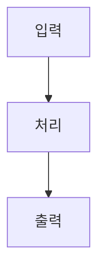

# /docs-add - 개별 문서 추가

> **🚨 중요**: 문서, 코드, 기타 확인 및 검증이 필요한 부분은 **전부 에이전트 사용 필수**.

## 목적

문서 사이트에 개별 문서를 추가합니다.
Diátaxis 프레임워크의 4가지 문서 타입에 맞는 템플릿을 제공합니다.

## 문서 타입

| 타입 | 설명 | 저장 위치 |
|------|------|-----------|
| `overview` | 제품/기능 개요 | docs/getting-started/ |
| `quickstart` | 빠른 시작 가이드 | docs/getting-started/ |
| `concept` | 핵심 개념 설명 (Explanation) | docs/concepts/ |
| `tutorial` | 단계별 학습 (Tutorial) | docs/tutorials/ |
| `howto` | How-to 가이드 | docs/guides/ |
| `api` | API Reference | docs/api/ |

## 사용법

```bash
/docs add <type> [title]
```

### 예시

```bash
/docs add overview               # 기본 개요 문서
/docs add quickstart             # 빠른 시작 가이드
/docs add concept "인증 시스템"   # 인증 시스템 개념 문서
/docs add tutorial "첫 API 호출" # API 호출 튜토리얼
/docs add howto "환경 설정"      # 환경 설정 가이드
/docs add api                    # API Reference
```

## 실행 단계

### 1. 인자 파싱

$ARGUMENTS에서:
- `type`: 문서 타입 (필수)
- `title`: 문서 제목 (선택, 없으면 기본값)

### 2. 파일명 생성

제목을 기반으로 파일명 생성:
- 한글 → 영문 slug 변환 또는 그대로 사용
- 공백 → 하이픈(-) 변환
- 소문자 변환

예: "첫 API 호출" → `first-api-call.md` 또는 `첫-api-호출.md`

### 3. 템플릿 적용

타입별 템플릿 적용 후 파일 생성.

### 4. 완료 메시지

```
============================================
 ✅ 문서 추가 완료!
============================================

 타입: tutorial
 제목: 첫 API 호출
 파일: docs-site/docs/tutorials/first-api-call.md

 다음 단계:
 1. 생성된 파일 편집
 2. /docs preview 로 확인
 3. /docs status 로 완성도 체크

============================================
```

## 타입별 템플릿

### Overview 템플릿

```markdown
---
sidebar_position: 1
---

# [제목]

## 개요

[한 문단 설명]

## 주요 기능

- 기능 1
- 기능 2
- 기능 3

## 구성 요소

| 구성 요소 | 설명 |
|-----------|------|
| 컴포넌트 A | 역할 설명 |
| 컴포넌트 B | 역할 설명 |

## 다음 단계

- [빠른 시작](/getting-started/quickstart)
- [핵심 개념](/concepts/key-concepts)
```

### Quickstart 템플릿

```markdown
---
sidebar_position: 2
---

# [제목]

:::info 소요 시간
이 가이드는 약 5분이 소요됩니다.
:::

## 사전 요구사항

- 요구사항 1
- 요구사항 2

## 1단계: [단계명]

```bash
# 명령어
```

## 2단계: [단계명]

```bash
# 명령어
```

## 3단계: [단계명]

```bash
# 명령어
```

## 결과 확인

[예상 결과 설명]

## 다음 단계

- [상세 가이드 링크]
- [튜토리얼 링크]
```

### Concept 템플릿 (Explanation)

```markdown
---
sidebar_position: 1
---

# [제목]

## 개념 소개

[이 개념이 무엇인지 설명]

## 왜 중요한가?

[이 개념이 왜 필요한지 설명]

## 작동 원리

[어떻게 작동하는지 설명]



## 핵심 용어

| 용어 | 정의 |
|------|------|
| 용어 1 | 정의 |
| 용어 2 | 정의 |

## 관련 개념

- [관련 개념 1 링크]
- [관련 개념 2 링크]

## 더 알아보기

- [외부 리소스 링크]
```

### Tutorial 템플릿

```markdown
---
sidebar_position: 1
---

# [제목]

:::info 학습 목표
이 튜토리얼을 완료하면 다음을 할 수 있습니다:
- 목표 1
- 목표 2
- 목표 3
:::

## 소개

[튜토리얼 배경 설명]

## 사전 준비

- [ ] 준비물 1
- [ ] 준비물 2

## Step 1: [단계명]

### 1.1 [소단계]

[설명]

```bash
# 코드
```

### 1.2 [소단계]

[설명]

## Step 2: [단계명]

[내용]

## Step 3: [단계명]

[내용]

## 최종 결과

[완성된 결과물 설명]

## 마무리

축하합니다! 🎉

### 배운 내용

- 내용 1
- 내용 2

### 다음 단계

- [심화 튜토리얼]
- [관련 가이드]
```

### How-to 템플릿

```markdown
---
sidebar_position: 1
---

# [제목]

## 목표

[이 가이드를 통해 달성할 수 있는 것]

## 사전 요구사항

- 요구사항 1
- 요구사항 2

## 방법

### 1. [단계명]

```bash
# 명령어
```

### 2. [단계명]

```bash
# 명령어
```

### 3. [단계명]

```bash
# 명령어
```

## 검증

[작업 완료 확인 방법]

## 문제 해결

### 문제 1: [증상]

**원인**: [원인]

**해결**: [해결 방법]

## 관련 가이드

- [관련 가이드 1]
- [관련 가이드 2]
```

### API Reference 템플릿

```markdown
---
sidebar_position: 1
---

# API Reference

## 개요

[API 소개]

## 인증

```bash
curl -H "Authorization: Bearer YOUR_TOKEN" \
  https://api.example.com/v1/resource
```

## 엔드포인트

### GET /resource

리소스 목록을 조회합니다.

**요청**

```bash
GET /v1/resource?limit=10
```

**파라미터**

| 이름 | 타입 | 필수 | 설명 |
|------|------|------|------|
| limit | integer | No | 최대 개수 (기본: 20) |

**응답**

```json
{
  "data": [],
  "meta": {
    "total": 100
  }
}
```

### POST /resource

새 리소스를 생성합니다.

**요청**

```bash
POST /v1/resource
Content-Type: application/json

{
  "name": "example"
}
```

**응답**

```json
{
  "id": "res_123",
  "name": "example",
  "created_at": "2024-01-01T00:00:00Z"
}
```

## 에러 코드

| 코드 | 설명 |
|------|------|
| 400 | 잘못된 요청 |
| 401 | 인증 실패 |
| 404 | 리소스 없음 |
| 500 | 서버 오류 |

## Rate Limiting

- 분당 100 요청
- 초과 시 429 응답
```

## 관련 명령어

| 명령어 | 설명 |
|--------|------|
| `/docs generate` | 전체 문서 자동 생성 |
| `/docs status` | 문서 현황 확인 |
| `/docs preview` | 로컬 프리뷰 |
