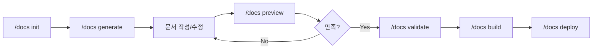

# /docs - 솔루션 문서 사이트 생성기

> **🚨 중요**: 문서, 코드, 기타 확인 및 검증이 필요한 부분은 **전부 에이전트 사용 필수**.

## 목적

프로젝트의 사용자 대상 문서 사이트를 자동으로 생성합니다.
docs.cast.ai, Stripe Docs 스타일의 전문적인 문서 사이트를 구축합니다.

## 하위 명령어

| 명령어 | 설명 |
|--------|------|
| `/docs init` | Docusaurus 기반 문서 사이트 스켈레톤 생성 |
| `/docs generate` | 프로젝트 분석 기반 전체 문서 자동 생성 |
| `/docs add [type]` | 개별 문서 추가 (overview, quickstart, concept, tutorial, howto, api) |
| `/docs status` | 문서 현황 및 완성도 확인 |
| `/docs preview` | 로컬 프리뷰 서버 실행 |
| `/docs build` | 정적 사이트 빌드 |
| `/docs deploy` | 배포 (GitHub Pages, Vercel, Netlify) |
| `/docs validate` | 문서 검증 (링크, 형식, 품질) |
| `/docs update` | 기존 문서 업데이트 |

## 문서 구조 (Diátaxis 프레임워크)

```
.claude/docs-site/                        # Docusaurus 프로젝트
├── docs/
│   ├── intro.md                  # 제품 소개
│   ├── getting-started/
│   │   ├── overview.md           # 개요
│   │   ├── quickstart.md         # 빠른 시작 (5분)
│   │   └── installation.md       # 설치 가이드
│   ├── concepts/                 # 핵심 개념 (Explanation)
│   │   ├── architecture.md
│   │   └── key-concepts.md
│   ├── tutorials/                # 학습 (Tutorials)
│   │   └── first-project.md
│   ├── guides/                   # How-to Guides
│   │   └── configuration.md
│   ├── api/                      # Reference
│   │   └── reference.md
│   └── troubleshooting/
│       └── common-issues.md
├── blog/                         # Changelog/Release Notes
│   └── releases.md
└── docusaurus.config.js
```

## 실행 방법

### $ARGUMENTS 확인

$ARGUMENTS에서 하위 명령어 확인:

- `init` → `/docs-init` 실행
- `generate` → `/docs-generate` 실행
- `add [type]` → `/docs-add` 실행
- `status` → `/docs-status` 실행
- `preview` → `/docs-preview` 실행
- `build` → `/docs-build` 실행
- `deploy` → `/docs-deploy` 실행
- `validate` → `/docs-validate` 실행
- `update` → `/docs-update` 실행
- 없음 → 하위 명령어 안내 출력

### 하위 명령어 없을 경우 안내

```
============================================
 📚 /docs - 솔루션 문서 사이트 생성기
============================================

 하위 명령어:

 /docs init              문서 사이트 초기화 (Docusaurus)
 /docs generate          전체 문서 자동 생성
 /docs add <type>        개별 문서 추가
 /docs status            문서 현황 확인
 /docs preview           로컬 프리뷰 서버
 /docs build             정적 사이트 빌드
 /docs deploy            배포 (GitHub Pages, Vercel, Netlify)
 /docs validate          문서 검증 (링크, 형식, 품질)
 /docs update            기존 문서 업데이트

 사용 예시:

 /docs init --template saas     # SaaS 템플릿으로 초기화
 /docs generate --from-prd      # PRD 기반 문서 생성
 /docs add quickstart           # 빠른 시작 가이드 추가
 /docs add tutorial "첫 프로젝트" # 튜토리얼 추가
 /docs deploy --target vercel   # Vercel로 배포
 /docs validate --fix           # 문서 검증 및 자동 수정

 문서 타입:

 overview     - 제품 개요
 quickstart   - 빠른 시작 (5분 가이드)
 concept      - 핵심 개념 설명
 tutorial     - 단계별 학습
 howto        - How-to 가이드
 api          - API Reference
 changelog    - Changelog/릴리즈 노트

============================================
```

## 워크플로우



## 관련 명령어

| 명령어 | 연계 |
|--------|------|
| `/onboard` | 프로젝트 분석 결과를 문서 생성에 활용 |
| `/dev plan` | PRD를 문서 콘텐츠로 활용 |
| `/research` | 리서치 결과를 문서에 통합 |

## 참조

- `.claude/research/docs-site-generator/report.md` - 리서치 보고서
- Diátaxis Framework: https://diataxis.fr/
- Docusaurus: https://docusaurus.io/
