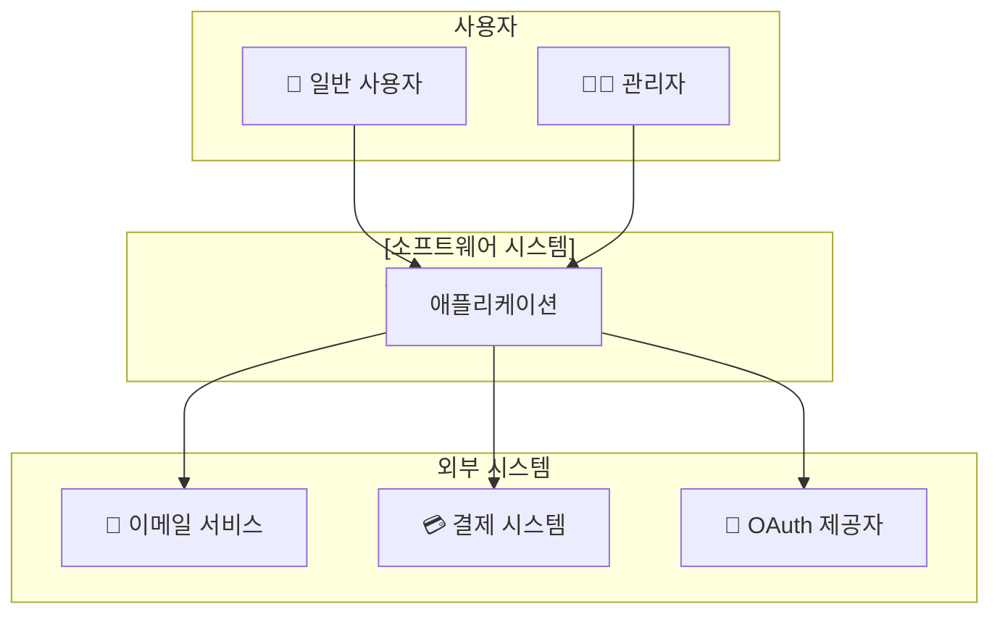
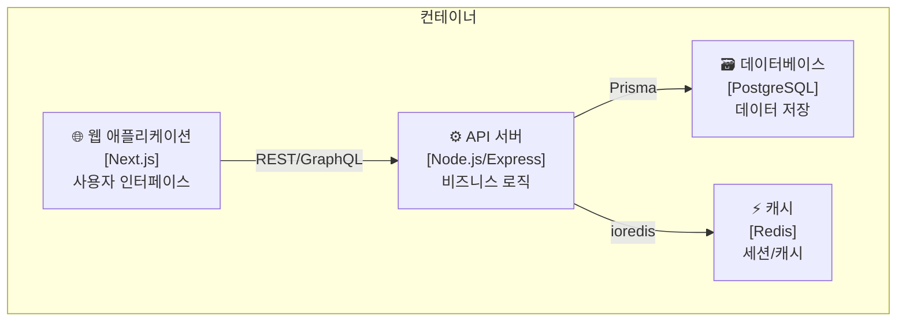

# Phase 3: 아키텍처 분석 (C4 Model)

> **🚨 중요**: 문서, 코드, 기타 확인 및 검증이 필요한 부분은 **전부 에이전트 사용 필수**. 에이전트를 적극 활용하고, 파일이 크면 분할해서 읽어라.

---

## 3.1 System Context (Level 1)

**분석 항목:**

```
┌─────────────────────────────────────────────────────────┐
│                    시스템 컨텍스트                        │
├─────────────────────────────────────────────────────────┤
│ 사용자 유형: (일반 사용자, 관리자, API 소비자)              │
│ 외부 시스템: (결제 API, 이메일 서비스, 소셜 로그인)         │
│ 데이터 흐름: (인바운드, 아웃바운드)                        │
└─────────────────────────────────────────────────────────┘
```

**Mermaid 다이어그램 생성:**



## 3.2 Container Diagram (Level 2)

**분석 항목:**

```
┌─────────────────────────────────────────────────────────┐
│                    컨테이너 다이어그램                     │
├─────────────────────────────────────────────────────────┤
│ 웹 애플리케이션: (Next.js, React SPA)                     │
│ API 서버: (Express, NestJS, Serverless)                  │
│ 데이터베이스: (PostgreSQL, MongoDB)                       │
│ 캐시: (Redis)                                           │
│ 메시지 큐: (RabbitMQ, SQS)                               │
│ CDN/스토리지: (S3, CloudFront)                           │
└─────────────────────────────────────────────────────────┘
```

**Mermaid 다이어그램:**



## 3.3 Component Diagram (Level 3)

**레이어별 분석:**

| 레이어 | 역할 | 주요 컴포넌트 |
|--------|------|-------------|
| **Presentation** | UI/UX | Pages, Components, Layouts |
| **Application** | 유스케이스 | Services, UseCases, Handlers |
| **Domain** | 비즈니스 규칙 | Entities, ValueObjects, DomainServices |
| **Infrastructure** | 외부 연동 | Repositories, ExternalAPIs, Adapters |

## 3.4 의존성 분석

**의존성 방향 검증:**

```
✅ 올바른 의존성: Presentation → Application → Domain ← Infrastructure
❌ 잘못된 의존성: Domain → Infrastructure (위반!)
```

**순환 의존성 탐지:**

```bash
# 순환 의존성 탐지 (madge 사용)
npx madge --circular src/

# Import 관계 시각화
npx madge --image graph.svg src/
```
