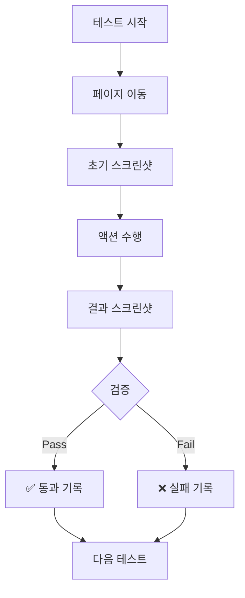
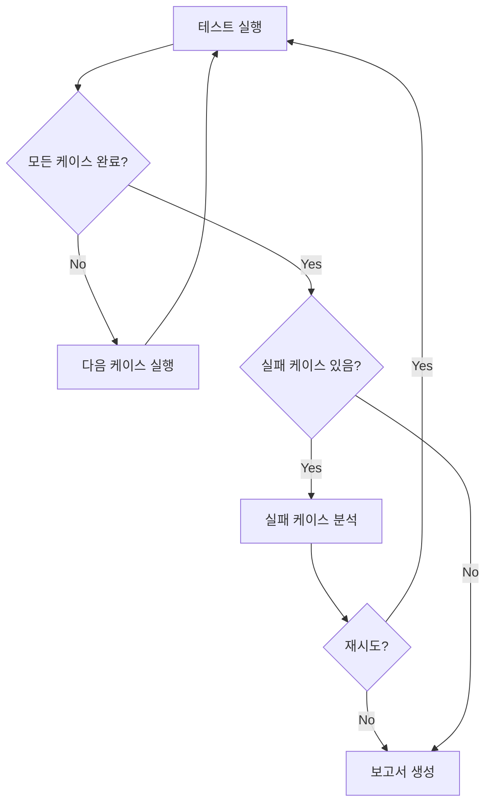

# /qa-run - 테스트 실행

## 설명

MCP Puppeteer를 활용하여 **실제 프론트엔드 테스트**를 실행합니다.
각 테스트 케이스를 순차적으로 진행하고 결과를 기록합니다.

**핵심**: 100% 완료까지 자동으로 계속 진행

---

## 사용법

```bash
/qa-run                     # 모든 테스트 실행
/qa-run TC-001              # 특정 테스트 실행
/qa-run --priority P0       # P0 테스트만 실행
/qa-run --failed            # 실패한 테스트만 재실행
/qa-run --continue          # 중단된 곳부터 이어서 실행
```

---

## 테스트 실행 프로세스

### Step 1: 환경 준비

**사전 체크:**

```bash
# 1. 개발 서버 확인
curl -s http://localhost:3000 > /dev/null
echo "서버 상태: $?"

# 2. MCP Puppeteer 연결 확인
# puppeteer_navigate 호출로 확인
```

**환경 체크리스트:**
- [ ] 개발 서버 실행 중
- [ ] MCP Puppeteer 연결됨
- [ ] 테스트 데이터 준비됨
- [ ] 스크린샷 폴더 생성됨

### Step 2: 테스트 케이스 로드

```json
// .claude-state/qa/test-cases.json
{
  "cases": [
    {
      "id": "TC-001",
      "feature": "로그인",
      "scenario": "정상 로그인",
      "priority": "P0",
      "status": "pending",
      "steps": [...]
    }
  ]
}
```

### Step 3: 순차 테스트 실행

**단일 테스트 실행 흐름:**



**MCP Puppeteer 실행 예시:**

```javascript
// TC-001: 로그인 테스트

// 1. 로그인 페이지 이동
mcp__puppeteer__puppeteer_navigate({
  url: "http://localhost:3000/login"
})

// 2. 초기 상태 스크린샷
mcp__puppeteer__puppeteer_screenshot({
  name: "TC-001-step1-login-page"
})

// 3. 이메일 입력
mcp__puppeteer__puppeteer_fill({
  selector: "input[name='email']",
  value: "test@example.com"
})

// 4. 비밀번호 입력
mcp__puppeteer__puppeteer_fill({
  selector: "input[name='password']",
  value: "password123"
})

// 5. 입력 후 스크린샷
mcp__puppeteer__puppeteer_screenshot({
  name: "TC-001-step2-filled"
})

// 6. 로그인 버튼 클릭
mcp__puppeteer__puppeteer_click({
  selector: "button[type='submit']"
})

// 7. 결과 확인 (2초 대기 후)
// 잠시 대기 후 스크린샷
mcp__puppeteer__puppeteer_screenshot({
  name: "TC-001-step3-result"
})

// 8. URL 확인
mcp__puppeteer__puppeteer_evaluate({
  script: "window.location.pathname"
})
// 기대값: "/dashboard"
```

### Step 4: 결과 기록

**테스트 결과 형식:**

```json
{
  "id": "TC-001",
  "status": "passed", // passed, failed, blocked, skipped
  "executedAt": "2025-01-01T10:30:00Z",
  "duration": 5200,
  "screenshots": [
    ".claude-state/qa/screenshots/TC-001-step1-login-page.png",
    ".claude-state/qa/screenshots/TC-001-step2-filled.png",
    ".claude-state/qa/screenshots/TC-001-step3-result.png"
  ],
  "assertions": [
    {
      "type": "url",
      "expected": "/dashboard",
      "actual": "/dashboard",
      "passed": true
    }
  ],
  "notes": ""
}
```

**실패 시 버그 자동 생성:**

```json
{
  "id": "BUG-001",
  "testCaseId": "TC-001",
  "severity": "Major",
  "title": "로그인 후 대시보드로 이동 안 됨",
  "expected": "URL이 /dashboard로 변경",
  "actual": "URL이 /login에 그대로",
  "screenshot": "TC-001-step3-result.png",
  "status": "open",
  "createdAt": "2025-01-01T10:30:05Z"
}
```

### Step 5: 진행 상태 업데이트

```json
// .claude-state/qa/qa-status.json
{
  "status": "in_progress",
  "totalCases": 30,
  "completed": 15,
  "passed": 12,
  "failed": 2,
  "blocked": 1,
  "pending": 15,
  "currentCase": "TC-016",
  "progress": "50%",
  "lastUpdate": "2025-01-01T11:00:00Z"
}
```

### Step 6: 자동 계속 진행

**100% 완료까지 반복:**



---

## 테스트 시나리오별 패턴

### 1. 페이지 로드 테스트

```javascript
// 페이지 이동
puppeteer_navigate({ url: "http://localhost:3000/products" })

// 스크린샷
puppeteer_screenshot({ name: "products-page" })

// 요소 존재 확인
puppeteer_evaluate({
  script: `
    const products = document.querySelectorAll('.product-card');
    return products.length > 0;
  `
})
```

### 2. 폼 유효성 검사 테스트

```javascript
// 빈 폼 제출
puppeteer_click({ selector: "button[type='submit']" })

// 에러 메시지 확인
puppeteer_evaluate({
  script: `
    const error = document.querySelector('.error-message');
    return error ? error.innerText : 'NO_ERROR';
  `
})
// 기대값: "이메일을 입력하세요"
```

### 3. 모달/팝업 테스트

```javascript
// 버튼 클릭으로 모달 열기
puppeteer_click({ selector: ".open-modal-btn" })

// 모달 스크린샷
puppeteer_screenshot({ name: "modal-open" })

// 모달 닫기
puppeteer_click({ selector: ".modal-close" })

// 모달 닫힘 확인
puppeteer_evaluate({
  script: `
    const modal = document.querySelector('.modal');
    return modal ? 'VISIBLE' : 'HIDDEN';
  `
})
```

### 4. 드롭다운 테스트

```javascript
// 드롭다운 선택
puppeteer_select({
  selector: "#category",
  value: "electronics"
})

// 선택 확인
puppeteer_evaluate({
  script: `document.querySelector('#category').value`
})
```

### 5. 네비게이션 테스트

```javascript
// 메뉴 클릭
puppeteer_click({ selector: "nav a[href='/about']" })

// URL 변경 확인
puppeteer_evaluate({
  script: `window.location.pathname`
})
// 기대값: "/about"
```

### 6. 반응형 테스트

```javascript
// 뷰포트 크기 조절 (JavaScript로)
puppeteer_evaluate({
  script: `
    // 모바일 뷰 시뮬레이션
    window.innerWidth = 375;
    window.dispatchEvent(new Event('resize'));
    return 'resized';
  `
})

// 모바일 뷰 스크린샷
puppeteer_screenshot({
  name: "mobile-view",
  width: 375,
  height: 812
})
```

---

## 출력 예시

```
🧪 테스트 실행 시작...

══════════════════════════════════════════════
 환경 확인
══════════════════════════════════════════════
✅ 개발 서버: http://localhost:3000
✅ MCP Puppeteer: 연결됨
✅ 테스트 케이스: 30개 로드됨

══════════════════════════════════════════════
 테스트 진행
══════════════════════════════════════════════

[TC-001] 로그인 - 정상 로그인 (P0)
  → 페이지 이동... ✅
  → 이메일 입력... ✅
  → 비밀번호 입력... ✅
  → 로그인 클릭... ✅
  → 결과 검증... ✅ PASS
  📸 스크린샷 저장: 3개

[TC-002] 로그인 - 잘못된 비밀번호 (P0)
  → 페이지 이동... ✅
  → 이메일 입력... ✅
  → 잘못된 비밀번호... ✅
  → 로그인 클릭... ✅
  → 에러 메시지 확인... ✅ PASS
  📸 스크린샷 저장: 3개

[TC-003] 회원가입 - 정상 가입 (P0)
  → 페이지 이동... ✅
  → 폼 입력... ✅
  → 제출... ✅
  → 결과 검증... ❌ FAIL
  🐛 버그 생성: BUG-001
  📸 스크린샷 저장: 4개

══════════════════════════════════════════════
 진행 상태
══════════════════════════════════════════════
진행률: ████████░░ 30/30 (100%)

통과: 27 (90%)
실패: 2 (7%)
블록: 1 (3%)

══════════════════════════════════════════════
 발견된 버그
══════════════════════════════════════════════
🐛 BUG-001 [Major] 회원가입 후 리다이렉트 실패
🐛 BUG-002 [Minor] 검색 결과 페이지 스타일 깨짐

══════════════════════════════════════════════
🎯 테스트 실행 완료!
══════════════════════════════════════════════

📁 결과 파일:
├── .claude-state/qa/test-results.json
├── .claude-state/qa/bugs.json
└── .claude-state/qa/screenshots/ (90개)

💡 다음 단계:
   /qa-report        → 보고서 생성
   /qa-run --failed  → 실패 테스트 재실행
   /qa-status        → 상태 확인
```

---

## 옵션 설명

| 옵션 | 설명 |
|------|------|
| `TC-XXX` | 특정 테스트 케이스 ID 실행 |
| `--priority P0` | 특정 우선순위만 실행 |
| `--failed` | 실패한 테스트만 재실행 |
| `--continue` | 중단된 곳부터 이어서 |
| `--dry-run` | 실제 실행 없이 계획만 출력 |
| `--verbose` | 상세 로그 출력 |

---

## 에러 처리

### 요소를 찾을 수 없을 때

```javascript
// 요소 대기 (JavaScript 활용)
puppeteer_evaluate({
  script: `
    return new Promise((resolve) => {
      const check = setInterval(() => {
        const el = document.querySelector('#target');
        if (el) {
          clearInterval(check);
          resolve('found');
        }
      }, 100);
      setTimeout(() => {
        clearInterval(check);
        resolve('timeout');
      }, 5000);
    });
  `
})
```

### 페이지 로드 실패

```markdown
상태: blocked
사유: "페이지 로드 실패 - 서버 오류"
권장: "개발 서버 재시작 후 /qa-run --continue"
```

---

## 참조

- `/qa-status` - 진행 상태 확인
- `/qa-report` - 보고서 생성
- `skills/qa-testing/SKILL.md`
