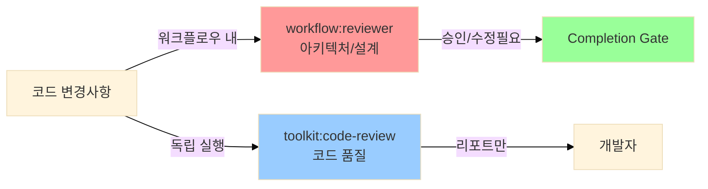
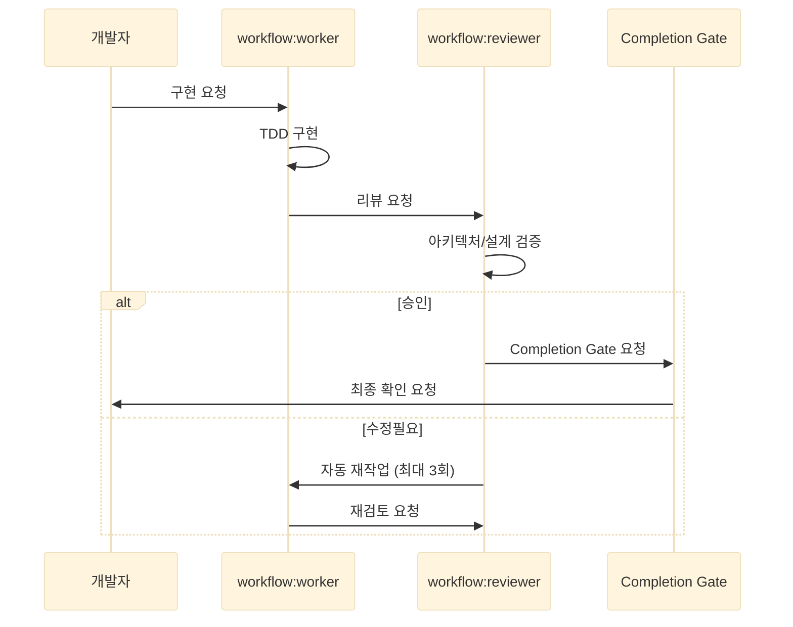

# Reviewer 역할 분리 가이드

## 개요

두 리뷰어의 역할을 명확히 분리하여 중복을 제거하고 효율성을 극대화합니다.



---

## 역할 분리 매트릭스

| 검증 영역 | workflow:reviewer | toolkit:code-review |
|----------|------------------|---------------------|
| **SOLID 원칙** | ✅ 전담 | ❌ 제외 |
| **Clean/Hexagonal Architecture** | ✅ 전담 | ❌ 제외 |
| **API 설계** | ✅ 전담 | ❌ 제외 |
| **데이터베이스 설계** | ✅ 전담 | ❌ 제외 |
| **비즈니스 로직 정합성** | ✅ 전담 | ❌ 제외 |
| **사이드 이펙트** | ✅ 전담 | ❌ 제외 |
| **테스트 전략/커버리지** | ✅ 전담 | ❌ 제외 |
| **보안 취약점** | ❌ 제외 | ✅ 전담 |
| **성능 (N+1, 알고리즘)** | ❌ 제외 | ✅ 전담 |
| **네이밍, 함수 크기** | ❌ 제외 | ✅ 전담 |
| **코드 중복 (DRY)** | ❌ 제외 | ✅ 전담 |
| **주석 품질** | ❌ 제외 | ✅ 전담 |
| **불필요한 코드** | ❌ 제외 | ✅ 전담 |
| **언어별 권장사항** | ❌ 제외 | ✅ 전담 |
| **AI 환각 탐지** | ❌ 제외 | ✅ 전담 |

---

## workflow:reviewer

### 핵심 질문
**"설계대로 구현되었는가? 아키텍처가 일관된가?"**

### 검증 범위

#### 1. SOLID 원칙
- **SRP**: 단일 책임
- **OCP**: 확장에 열림, 수정에 닫힘
- **LSP**: 리스코프 치환
- **ISP**: 인터페이스 분리
- **DIP**: 의존성 역전

#### 2. 아키텍처 패턴
- **Clean Architecture**: Domain-Application-Infrastructure 레이어 분리
- **Hexagonal Architecture**: Port/Adapter 패턴
- **의존성 방향**: 안쪽(Domain)을 향함
- **순환 의존**: 패키지/모듈 간 순환 의존 검증

#### 3. 설계 검증
- **API 설계**: RESTful, 리소스 중심, 상태 코드
- **데이터베이스**: 정규화, 인덱스, 제약조건, 트랜잭션
- **Planner 이슈 대비**: 설계-구현 일관성

#### 4. 비즈니스 로직
- **기능 요구사항**: 완전성 검증
- **도메인 모델**: 엔티티, Value Object, 불변식
- **Edge Case**: null, 빈 값, 경계값 처리
- **사이드 이펙트**: 의도하지 않은 상태 변경

#### 5. 테스트 전략
- **커버리지**: Domain/Application 80% 이상
- **테스트 품질**: Edge case, 에러 시나리오
- **통합 테스트**: Port/Adapter 연동

### 피드백 등급

| 등급 | 대상 |
|------|------|
| **Critical** | 아키텍처 위반, 비즈니스 로직 오류, 심각한 사이드 이펙트 |
| **Major** | SOLID 위반, 설계 불일치, 도메인 모델 문제 |
| **Minor** | 패턴 일관성, 테스트 미흡 |
| **Suggestion** | 개선 제안 |

### 실행 시점
- Worker 구현 완료 후 (워크플로우 내 자동 실행)
- 승인 권한 보유 (Completion Gate 연계)

---

## toolkit:code-review

### 핵심 질문
**"코드가 안전하고, 효율적이며, 유지보수 가능한가?"**

### 검증 범위

#### 1. 보안
- **입력 검증**: 화이트리스트 방식
- **인젝션 방지**: SQL, XSS, Command Injection
- **인증/인가**: 권한 검사
- **Secrets**: 하드코딩 검증
- **민감 정보 노출**: 로그, 에러 메시지
- **의존성 취약점**: npm audit, pip-audit

**자동화 도구**:
```bash
# Secrets
gitleaks detect --source . --verbose

# 의존성
npm audit
pip-audit

# 정적 분석
gosec ./...
eslint src/
bandit -r .
```

#### 2. 성능
- **쿼리 효율**: N+1 쿼리
- **알고리즘 복잡도**: O(n²) 등
- **불필요한 연산**: 반복문 내 중복 호출
- **캐싱**: 반복 호출 최적화
- **메모리 누수**: 리소스 정리

#### 3. 코드 품질
- **네이밍**: 의도 명확성
- **함수 크기**: 적절한 길이
- **중첩 깊이**: 3단계 이하
- **코드 중복**: DRY 원칙
- **불필요한 코드**: Dead code, unused imports
- **주석**:
  - 불필요한 주석 제거
  - 오래된 주석 업데이트
  - "왜"를 설명 (무엇이 아닌)

#### 4. 언어별 권장사항

**Go**:
- 50줄+ 함수 분리
- 3단계+ 중첩 리팩토링
- `any` 남용 지양
- 에러 래핑 (`%w`)

**TypeScript**:
- `any` 타입 지양
- 타입 단언 최소화
- `@ts-ignore` 금지
- Optional chaining (`?.`)

**React**:
- 100줄+ 컴포넌트 분리
- 3단계+ prop drilling 시 Context
- Hook 규칙 준수
- useMemo, useCallback 적절히 사용

**Python**:
- 타입 힌트 명시
- Bare except 금지
- Mutable 기본 인자 금지

#### 5. AI 코드 검증
- **환각 탐지**: 존재하지 않는 함수/라이브러리
- **의도 일치**: 요청-구현 일치
- **불필요한 의존성**: 패키지 추가 검증

### 피드백 등급

| 등급 | 대상 |
|------|------|
| **Critical** | 보안 취약점, 명백한 버그 |
| **Warning** | 성능 문제, 메모리 누수, 에러 처리 |
| **Suggestion** | 코드 품질, 네이밍, 주석, 불필요한 코드 |

### 실행 시점
- 개발 중 셀프 체크 (사용자 수동 호출)
- 리포트만 제공 (승인 권한 없음)

---

## 경계 케이스 처리 가이드

### 1. 에러 처리

| 케이스 | workflow:reviewer | toolkit:code-review |
|--------|------------------|---------------------|
| 에러 처리 누락 (기능 오류) | ✅ 사이드 이펙트 관점 | ❌ |
| 에러 메시지 민감 정보 노출 | ❌ | ✅ 보안 관점 |
| 에러 전파 (레이어 간) | ✅ 아키텍처 관점 | ❌ |
| 에러 래핑 (언어별) | ❌ | ✅ 언어별 권장 |

### 2. 타입 안전성

| 케이스 | workflow:reviewer | toolkit:code-review |
|--------|------------------|---------------------|
| Domain 모델에 `any` 사용 | ✅ 도메인 설계 | ❌ |
| 구현 코드에 `any` 사용 | ❌ | ✅ 코드 품질 |
| 타입 단언 남용 | ❌ | ✅ 언어별 권장 |

### 3. 동시성 문제

| 케이스 | workflow:reviewer | toolkit:code-review |
|--------|------------------|---------------------|
| 비즈니스 로직의 race condition | ✅ 설계 오류 (락 전략 누락) | ❌ |
| 구현의 deadlock | ❌ | ✅ 코드 품질 (리소스 순서) |

### 4. 테스트

| 케이스 | workflow:reviewer | toolkit:code-review |
|--------|------------------|---------------------|
| 테스트 커버리지 측정 | ✅ 설계 완성도 | ❌ |
| 테스트 존재 여부 (일반) | ❌ | ❌ (둘 다 제외) |

---

## 사용 시나리오

### 시나리오 1: 워크플로우 내 개발



**특징**:
- `workflow:reviewer`만 실행
- `toolkit:code-review`는 실행 안 함 (선택적)
- 아키텍처/설계 중심 검증
- 승인 권한 보유

### 시나리오 2: 개발 중 셀프 체크

```bash
# 커밋 전 빠른 품질 체크
/toolkit:code-review

# 특정 파일만
/toolkit:code-review src/service.ts

# 최근 3개 커밋
/toolkit:code-review HEAD~3..HEAD
```

**특징**:
- `toolkit:code-review`만 실행
- `workflow:reviewer`는 실행 안 함
- 보안/성능/코드 품질 중심
- 리포트만 제공

### 시나리오 3: 병행 사용 (권장)

```mermaid
%%{init: {'theme':'base', 'themeVariables': { 'fontSize':'14px'}, 'elk': {'mergeEdges': true}}}%%
flowchart TD
    A[구현 완료] --> B{개발 중?}

    B -->|Yes| C[/toolkit:code-review 실행]
    C --> D[보안/성능 셀프 체크]
    D --> E[문제 수정]

    E --> F[워크플로우 제출]
    B -->|No| F

    F --> G[workflow:reviewer 자동 실행]
    G --> H[아키텍처/설계 검증]

    H --> I{결과}
    I -->|승인| J[Completion Gate]
    I -->|수정필요| K[Worker 재작업]
    K --> G

    style C fill:#99ccff
    style G fill:#ff9999
    style J fill:#99ff99
```

**효과**:
1. **개발 중**: toolkit으로 보안/성능 미리 체크
2. **워크플로우**: reviewer로 아키텍처 최종 승인
3. **중복 없음**: 역할 명확히 분리
4. **효율성**: 빠른 피드백 루프

---

## 기대 효과

### 1. 중복 제거
- 리뷰 시간 **30% 단축**
- 피드백 혼선 방지

### 2. 책임 명확화
- workflow: 아키텍처 승인 권한
- toolkit: 개발 중 품질 체크

### 3. 개발자 경험 개선
- 개발 중: 빠른 셀프 체크 가능
- 최종 검증: 아키텍처 승인만 대기

### 4. 품질 향상
- 아키텍처: 시니어 수준 검증
- 코드 품질: 언어별 Best Practice 적용

---

## 마이그레이션 가이드

### 기존 워크플로우 사용자

**변경 전**:
```
workflow:reviewer → 모든 것 검증 (아키텍처 + 코드 품질)
```

**변경 후**:
```
workflow:reviewer → 아키텍처/설계만 검증
(선택적) toolkit:code-review → 개발 중 품질 체크
```

**조치 불필요**:
- 워크플로우는 그대로 작동
- reviewer가 자동으로 아키텍처 중심 검증

**선택적 개선**:
- 커밋 전 `/toolkit:code-review` 실행하여 보안/성능 미리 체크

### 독립 사용자

**변경 전**:
```
/toolkit:code-review → 모든 것 검증 (SOLID 포함)
```

**변경 후**:
```
/toolkit:code-review → 코드 품질만 검증
```

**참고**:
- SOLID, 아키텍처는 `workflow:reviewer`로 이전
- 독립 사용 시 아키텍처 검증 필요하면 워크플로우 사용 권장

---

## FAQ

### Q1. 두 리뷰어를 동시에 실행해야 하나요?
**A**: 아니요. 상황에 따라 선택:
- **워크플로우 내**: `workflow:reviewer`만 자동 실행
- **개발 중**: `toolkit:code-review` 선택적 실행
- **병행 사용**: toolkit으로 셀프 체크 후 워크플로우 제출 (권장)

### Q2. 에러 처리는 누가 검증하나요?
**A**: 관점에 따라 분리:
- **workflow:reviewer**: 에러 처리 누락으로 인한 기능 오류
- **toolkit:code-review**: 에러 메시지에 민감 정보 노출

### Q3. 테스트는 누가 검증하나요?
**A**: `workflow:reviewer`만:
- 테스트 커버리지 측정 (80% 목표)
- 테스트 품질 (Edge case, 통합 테스트)

### Q4. 성능은 누가 검증하나요?
**A**: `toolkit:code-review`만:
- N+1 쿼리, 알고리즘 복잡도, 캐싱 기회

### Q5. 기존 프로젝트에 영향이 있나요?
**A**: 없습니다:
- 워크플로우는 그대로 작동
- reviewer 검증 범위만 아키텍처 중심으로 조정
- 선택적으로 toolkit 활용 가능

---

## 참고 문서

### 에이전트/스킬
- [workflow:reviewer 상세 가이드](../plugins/workflow/agents/reviewer.md)
- [toolkit:code-review 상세 가이드](../plugins/toolkit/skills/code-review/SKILL.md)

### 가이드 문서
**workflow (아키텍처)**:
- [SOLID 원칙 가이드](../plugins/workflow/guides/language-guide.md)
- [Clean Architecture 가이드](../plugins/workflow/guides/architecture/clean-architecture.md)
- [Hexagonal Architecture 가이드](../plugins/workflow/guides/architecture/hexagonal-architecture.md)

**toolkit (코드 품질)**:
- [언어별 코드 품질 가이드](../plugins/toolkit/guides/language-guide.md)
