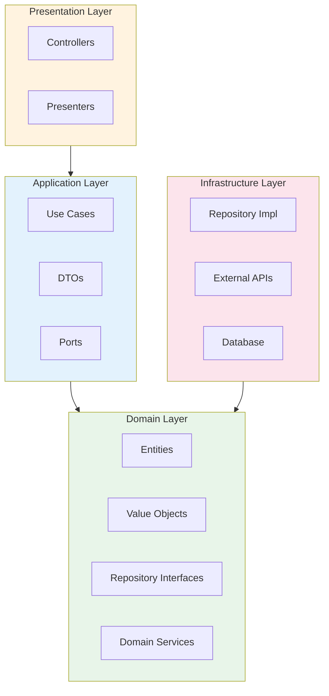

# Architecture Plugin

> **클린 아키텍처 설계 및 검증**: 4-레이어 구조 자동 생성 + 의존성 규칙 강제

---

## 문제 해결 매트릭스

| 상황 | 문제점 | 솔루션 | 명령어 |
|------|--------|--------|--------|
| **아키텍처 혼란** | 의존성 규칙 위반 | 클린 아키텍처 강제 | `/architecture:clean-init` |
| **엔티티 생성** | 일관성 없는 도메인 모델 | 표준화된 엔티티 생성 | `/architecture:clean-entity` |
| **유스케이스 작성** | 비즈니스 로직 분산 | 유스케이스 패턴 적용 | `/architecture:clean-usecase` |
| **의존성 위반** | 레이어 간 잘못된 참조 | 자동 검증 + 수정 | `/architecture:clean-validate` |

---

## 명령어

| 명령어 | 옵션 | 자연어 | 설명 |
|--------|------|--------|------|
| `/architecture:clean-init` | - | "클린 아키텍처 만들어줘" | 4-레이어 구조 초기화 |
| `/architecture:clean-entity [name]` | `--with-repository` | "엔티티 만들어줘" | 도메인 엔티티 생성 |
| `/architecture:clean-usecase [name]` | `--entity [name]` | "유스케이스 만들어줘" | 유스케이스 생성 |
| `/architecture:clean-validate` | `--fix` | "아키텍처 검증해줘" | 의존성 규칙 검증 |

---

## 주요 기능 상세

### 클린 아키텍처 4-레이어



**레이어별 역할:**

| 레이어 | 역할 | 주요 컴포넌트 |
|--------|------|-------------|
| **Domain** | 핵심 비즈니스 규칙 | Entities, Value Objects, Repository Interfaces |
| **Application** | 유스케이스 구현 | Use Cases, DTOs, Ports |
| **Presentation** | UI/API 처리 | Controllers, Presenters |
| **Infrastructure** | 외부 의존성 | Repository Impl, External APIs, Database |

### 의존성 규칙

```
✅ 올바른 의존성:
   Presentation → Application → Domain ← Infrastructure

❌ 잘못된 의존성:
   Domain → Infrastructure (위반!)
   Domain → Application (위반!)
```

---

## 사용 예시

```bash
# 1. 4-레이어 구조 초기화
/architecture:clean-init

# 2. 도메인 엔티티 생성
/architecture:clean-entity User --with-repository

# 3. 유스케이스 생성
/architecture:clean-usecase CreateUser --entity User

# 4. 의존성 규칙 검증
/architecture:clean-validate --fix
```

### clean-init 실행 결과

```
src/
├── domain/                 # Domain Layer
│   ├── entities/           # 엔티티
│   ├── value-objects/      # 값 객체
│   ├── repositories/       # 리포지토리 인터페이스
│   └── services/           # 도메인 서비스
│
├── application/            # Application Layer
│   ├── use-cases/          # 유스케이스
│   ├── dtos/               # 데이터 전송 객체
│   └── ports/              # 포트 (인터페이스)
│
├── adapters/               # Presentation Layer
│   ├── controllers/        # 컨트롤러
│   └── presenters/         # 프레젠터
│
└── infrastructure/         # Infrastructure Layer
    ├── repositories/       # 리포지토리 구현
    ├── external/           # 외부 API 연동
    └── config/             # 설정
```

### clean-entity 실행 결과

```typescript
// src/domain/entities/User.ts
export class User {
  constructor(
    private readonly id: UserId,
    private name: UserName,
    private email: Email,
    private readonly createdAt: Date
  ) {}

  // Getters
  get getId(): UserId { return this.id; }
  get getName(): UserName { return this.name; }
  get getEmail(): Email { return this.email; }

  // Business methods
  changeName(name: UserName): void {
    this.name = name;
  }

  changeEmail(email: Email): void {
    this.email = email;
  }
}

// src/domain/repositories/UserRepository.ts (--with-repository)
export interface UserRepository {
  findById(id: UserId): Promise<User | null>;
  findByEmail(email: Email): Promise<User | null>;
  save(user: User): Promise<void>;
  delete(id: UserId): Promise<void>;
}
```

### clean-usecase 실행 결과

```typescript
// src/application/use-cases/CreateUser.ts
export interface CreateUserInput {
  name: string;
  email: string;
}

export interface CreateUserOutput {
  id: string;
  name: string;
  email: string;
}

export class CreateUserUseCase {
  constructor(
    private readonly userRepository: UserRepository,
    private readonly idGenerator: IdGenerator
  ) {}

  async execute(input: CreateUserInput): Promise<CreateUserOutput> {
    // 1. Validate
    const email = Email.create(input.email);
    const existingUser = await this.userRepository.findByEmail(email);
    if (existingUser) {
      throw new UserAlreadyExistsError(input.email);
    }

    // 2. Create entity
    const user = new User(
      this.idGenerator.generate(),
      UserName.create(input.name),
      email,
      new Date()
    );

    // 3. Save
    await this.userRepository.save(user);

    // 4. Return output
    return {
      id: user.getId.value,
      name: user.getName.value,
      email: user.getEmail.value,
    };
  }
}
```

### clean-validate 실행 결과

```
🔍 의존성 규칙 검증 중...

══════════════════════════════════════════════════════════════
 검증 결과
══════════════════════════════════════════════════════════════

✅ Domain Layer: 위반 없음
✅ Application Layer: 위반 없음
❌ Presentation Layer: 2개 위반
   - src/adapters/controllers/UserController.ts:5
     → Infrastructure (Prisma) 직접 import
   - src/adapters/controllers/OrderController.ts:12
     → Domain Repository 구현체 직접 import

✅ Infrastructure Layer: 위반 없음

══════════════════════════════════════════════════════════════
 수정 제안 (--fix 옵션으로 자동 수정)
══════════════════════════════════════════════════════════════

1. UserController.ts:5
   Before: import { prisma } from '@/infrastructure/database';
   After:  import { UserRepository } from '@/domain/repositories/UserRepository';

2. OrderController.ts:12
   Before: import { PrismaOrderRepository } from '@/infrastructure/repositories';
   After:  import { OrderRepository } from '@/domain/repositories/OrderRepository';
```

---

## 자동 적용 기능 (패시브 스킬)

| 스킬 | 활성화 조건 | 효과 |
|------|------------|------|
| `clean-architecture` | 코드 구현 시 (항상) | 4-레이어 구조 강제, 의존성 규칙 검증 |

**자동 적용 내용:**
- 새 파일 생성 시 올바른 레이어 위치 제안
- Import 문 작성 시 의존성 규칙 검증
- 코드 리뷰 시 아키텍처 위반 감지

---

## 문서 생성 위치

```
.claude/docs/active/{feature-name}/
├── 03-architecture.md    # 아키텍처 설계 문서
└── 04-erd.md             # ERD 다이어그램
```

---

## 포함 리소스

- **best-practices/**:
  - clean-architecture.md (의존성 규칙, 레이어 가이드)
  - api-design.md (REST API 설계 원칙)
  - database.md (데이터베이스 설계 원칙)
- **templates/**:
  - architecture-template.md (아키텍처 문서 템플릿)
  - erd-template.md (ERD 템플릿)
  - api-spec-template.md (API 스펙 템플릿)
