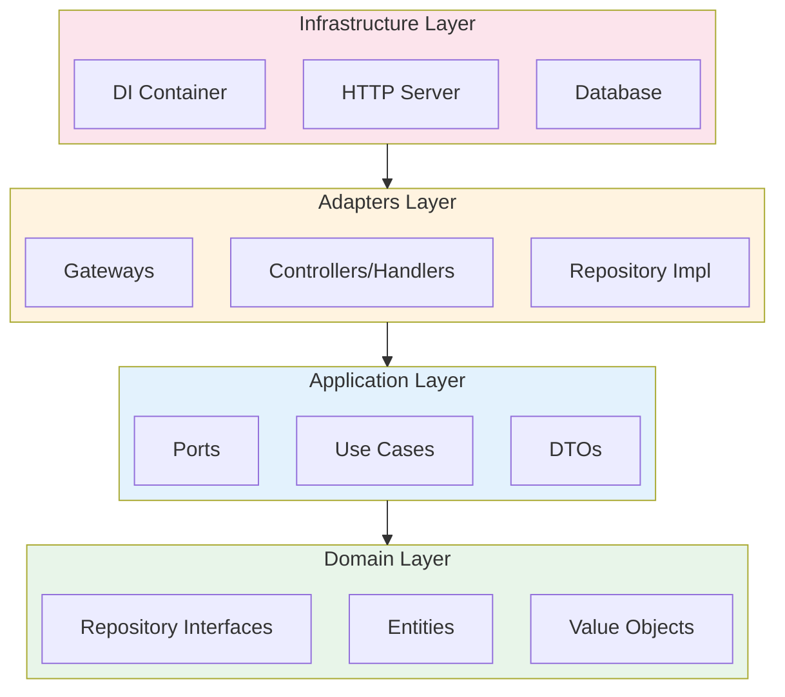
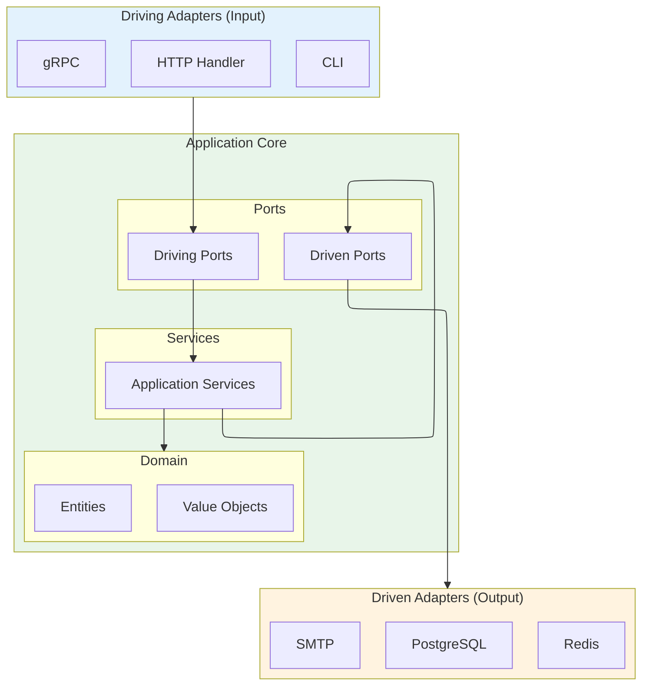

# Architecture Plugin

> **아키텍처 설계 및 검증**: Clean Architecture & Hexagonal Architecture 자동 생성 + 의존성 규칙 강제 (TypeScript, Go 자동 감지)

---

## 지원 아키텍처

| 아키텍처 | 설명 | 적합한 경우 |
|----------|------|------------|
| **Clean Architecture** | 4-레이어 동심원 구조 | 복잡한 도메인 로직 |
| **Hexagonal Architecture** | Ports & Adapters 패턴 | 다양한 외부 시스템 연동 |

## 지원 언어

| 언어 | 상태 | 자동 감지 기준 |
|------|------|---------------|
| **TypeScript** | ✅ 지원 | `tsconfig.json` 존재 |
| **Go** | ✅ 지원 | `go.mod` 존재 |

> 모든 명령어는 프로젝트 언어를 자동 감지하여 적절한 형식으로 동작합니다.

---

## 문제 해결 매트릭스

| 상황 | 문제점 | 솔루션 | 명령어 |
|------|--------|--------|--------|
| **아키텍처 혼란** | 의존성 규칙 위반 | Clean Architecture 강제 | `/architecture:clean-init` |
| **외부 시스템 연동** | 결합도 높음 | Hexagonal Architecture 적용 | `/architecture:hexa-init` |
| **의존성 위반** | 레이어/포트 경계 침범 | 자동 검증 + 리팩토링 | `/architecture:validate` |

---

## 스킬 구조

### Active Skills (명시적 호출)

| 명령어 | 옵션 | 설명 |
|--------|------|------|
| `/architecture:clean-init` | `--force` | Clean Architecture 4-레이어 구조 초기화 |
| `/architecture:hexa-init` | `--force` | Hexagonal Architecture 구조 초기화 |
| `/architecture:validate` | `--fix`, `--path=<dir>`, `--type=clean\|hexa` | 아키텍처 검증 + 리팩토링 가이드 |
| `/architecture:help` | - | 도움말 표시 |

### Passive Skills (자동 활성화)

| 스킬 | 활성화 조건 | 효과 |
|------|------------|------|
| `clean-architecture` | 코드 구현 시 (4-레이어 구조 감지) | 의존성 규칙 강제, 레이어 위치 검증 |
| `hexagonal-architecture` | 코드 구현 시 (Port/Adapter 구조 감지) | 포트/어댑터 규칙 강제 |

---

## Clean Architecture

### 4-레이어 구조



### 의존성 규칙

| 레이어 | 허용된 Import | 금지된 Import |
|--------|---------------|---------------|
| **Domain** | 표준 라이브러리만 | Application, Adapters, Infrastructure |
| **Application** | Domain | Adapters, Infrastructure |
| **Adapters** | Domain, Application | Infrastructure |
| **Infrastructure** | 모두 허용 | - |

### 프로젝트 구조 (clean-init 결과)

```
[root]/                           # TypeScript: src/, Go: internal/
├── domain/                       # Domain Layer
│   ├── entity/                   # 엔티티
│   ├── valueobject/              # 값 객체
│   ├── repository/               # 리포지토리 인터페이스
│   └── errors/                   # 도메인 에러
│
├── application/                  # Application Layer
│   ├── usecase/                  # 유스케이스
│   ├── dto/                      # 데이터 전송 객체
│   └── port/                     # 외부 서비스 인터페이스
│
├── adapters/                     # Adapters Layer
│   ├── handler/                  # HTTP 핸들러/컨트롤러
│   ├── repository/               # 리포지토리 구현
│   └── gateway/                  # 외부 서비스 구현
│
└── infrastructure/               # Infrastructure Layer
    ├── http/                     # HTTP 서버 설정
    ├── database/                 # DB 설정
    ├── config/                   # 환경 설정
    └── di/                       # 의존성 주입
```

---

## Hexagonal Architecture

### Ports & Adapters 구조



### Port & Adapter 규칙

| 포트 유형 | 방향 | 역할 | 예시 |
|----------|------|------|------|
| **Driving Port** | 외부 → Core | 애플리케이션이 제공하는 기능 | `UserService` |
| **Driven Port** | Core → 외부 | 애플리케이션이 필요로 하는 기능 | `UserRepository`, `EmailSender` |

| 어댑터 유형 | 역할 | 예시 |
|------------|------|------|
| **Driving Adapter** | Driving Port 호출 | HTTP Handler, CLI, gRPC Server |
| **Driven Adapter** | Driven Port 구현 | PostgresRepository, SMTPEmailSender |

### 프로젝트 구조 (hexa-init 결과)

```
[root]/                           # TypeScript: src/, Go: internal/
├── core/                         # Application Core
│   ├── domain/                   # 도메인 모델
│   │   ├── entity/               # 엔티티
│   │   ├── valueobject/          # 값 객체
│   │   └── event/                # 도메인 이벤트
│   │
│   ├── service/                  # 애플리케이션 서비스
│   │
│   └── port/                     # 포트 정의
│       ├── driving/              # Driving Ports (Input)
│       └── driven/               # Driven Ports (Output)
│
├── adapter/                      # 어댑터
│   ├── driving/                  # Driving Adapters (Input)
│   │   └── http/                 # REST API
│   │
│   └── driven/                   # Driven Adapters (Output)
│       └── persistence/          # 영속화
│
└── config/                       # 설정 및 DI
```

---

## 사용 예시

### Clean Architecture 시작하기

```bash
# 1. 4-레이어 구조 초기화
/architecture:clean-init

# 2. 코드 작성 (패시브 스킬이 자동으로 의존성 규칙 검증)

# 3. 아키텍처 검증
/architecture:validate --fix
```

### Hexagonal Architecture 시작하기

```bash
# 1. Ports & Adapters 구조 초기화
/architecture:hexa-init

# 2. 코드 작성 (패시브 스킬이 자동으로 포트/어댑터 규칙 검증)

# 3. 아키텍처 검증
/architecture:validate --type=hexa --fix
```

---

## 아키텍처 선택 가이드

### Clean Architecture 선택

- 복잡한 도메인 로직이 핵심인 경우
- 명확한 레이어 분리가 필요한 경우
- 팀이 레이어 기반 구조에 익숙한 경우

### Hexagonal Architecture 선택

- 다양한 입력/출력 어댑터가 필요한 경우
- 외부 시스템 교체가 빈번한 경우
- 테스트 용이성이 중요한 경우

---

## 포함 리소스

- **best-practices/**:
  - `clean-architecture.md` (Clean Architecture 가이드 - Go/TypeScript 통합)
  - `hexagonal-architecture.md` (Hexagonal Architecture 가이드)
  - `api-design.md` (REST API 설계 원칙)
  - `database.md` (데이터베이스 설계 원칙)
- **templates/**:
  - `architecture-template.md` (아키텍처 문서 템플릿)
  - `erd-template.md` (ERD 템플릿)
  - `api-spec-template.md` (API 스펙 템플릿)
- **skills/**:
  - `clean-architecture/` (Clean Architecture 패시브 스킬)
  - `clean-init/` (Clean Architecture 구조 초기화)
  - `hexagonal-architecture/` (Hexagonal Architecture 패시브 스킬)
  - `hexa-init/` (Hexagonal Architecture 구조 초기화)
  - `validate/` (아키텍처 검증 + 리팩토링)
  - `help/` (도움말)
