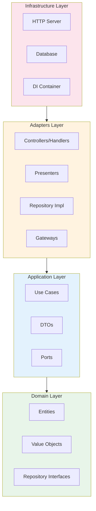

# Architecture Plugin

> **클린 아키텍처 설계 및 검증**: 4-레이어 구조 자동 생성 + 의존성 규칙 강제 (TypeScript, Go 자동 감지)

---

## 지원 언어

| 언어 | 상태 | 자동 감지 기준 |
|------|------|---------------|
| **TypeScript** | ✅ 지원 | `tsconfig.json` 존재 |
| **Go** | ✅ 지원 | `go.mod` 존재 |

> 모든 명령어는 프로젝트 언어를 자동 감지하여 적절한 형식으로 동작합니다.

---

## 문제 해결 매트릭스

| 상황 | 문제점 | 솔루션 | 명령어 |
|------|--------|--------|--------|
| **아키텍처 혼란** | 의존성 규칙 위반 | 클린 아키텍처 강제 | `/architecture:clean-init` |
| **엔티티 생성** | 일관성 없는 도메인 모델 | 표준화된 엔티티 생성 | `/architecture:clean-entity` |
| **유스케이스 작성** | 비즈니스 로직 분산 | 유스케이스 패턴 적용 | `/architecture:clean-usecase` |
| **의존성 위반** | 레이어 간 잘못된 참조 | 자동 검증 + 수정 | `/architecture:clean-validate` |

---

## 명령어

| 명령어 | 옵션 | 자연어 | 설명 |
|--------|------|--------|------|
| `/architecture:clean-init` | `--force` | "클린 아키텍처 만들어줘" | 4-레이어 구조 초기화 |
| `/architecture:clean-entity <name>` | `--with-repository`, `--with-value-objects` | "엔티티 만들어줘" | 도메인 엔티티 생성 |
| `/architecture:clean-usecase <name>` | `--entity=<name>` | "유스케이스 만들어줘" | 유스케이스 생성 |
| `/architecture:clean-validate` | `--fix`, `--path=<dir>` | "아키텍처 검증해줘" | 의존성 규칙 검증 |
| `/architecture:help` | - | "아키텍처 도움말" | 도움말 표시 |

---

## 주요 기능 상세

### 클린 아키텍처 4-레이어



**레이어별 역할:**

| 레이어 | 역할 | 주요 컴포넌트 |
|--------|------|-------------|
| **Domain** | 핵심 비즈니스 규칙 | Entities, Value Objects, Repository Interfaces |
| **Application** | 유스케이스 구현 | Use Cases, DTOs, Ports |
| **Adapters** | 포트 구현 | Controllers/Handlers, Repository Impl, Gateways |
| **Infrastructure** | 외부 의존성 | HTTP Server, Database, DI Container |

### 의존성 규칙

```
✅ 올바른 의존성:
   Infrastructure → Adapters → Application → Domain

❌ 잘못된 의존성:
   Domain → Application (위반!)
   Application → Adapters (위반!)
   Domain → Infrastructure (위반!)
```

---

## 사용 예시

```bash
# 1. 4-레이어 구조 초기화
/architecture:clean-init

# 2. 도메인 엔티티 생성
/architecture:clean-entity User --with-repository

# 3. 유스케이스 생성
/architecture:clean-usecase CreateUser --entity=User

# 4. 의존성 규칙 검증
/architecture:clean-validate --fix
```

### 프로젝트 구조 (clean-init 결과)

```
[root]/                           # TypeScript: src/, Go: internal/
├── domain/                       # Domain Layer
│   ├── entity/                   # 엔티티
│   ├── valueobject/              # 값 객체
│   ├── repository/               # 리포지토리 인터페이스
│   └── errors/                   # 도메인 에러
│
├── application/                  # Application Layer
│   ├── usecase/                  # 유스케이스
│   ├── dto/                      # 데이터 전송 객체
│   └── port/                     # 외부 서비스 인터페이스
│
├── adapters/                     # Adapters Layer
│   ├── handler/                  # HTTP 핸들러/컨트롤러
│   ├── repository/               # 리포지토리 구현
│   └── gateway/                  # 외부 서비스 구현
│
└── infrastructure/               # Infrastructure Layer
    ├── http/                     # HTTP 서버 설정
    ├── database/                 # DB 설정
    ├── config/                   # 환경 설정
    └── di/                       # 의존성 주입
```

> **언어별 차이점**은 `best-practices/clean-architecture-{lang}.md` 참조

---

## 자동 적용 기능 (패시브 스킬)

| 스킬 | 활성화 조건 | 효과 |
|------|------------|------|
| `clean-architecture` | 코드 구현 시 (언어 자동 감지) | 4-레이어 구조 강제, 의존성 규칙 검증 |

**자동 적용 내용:**
- 새 파일 생성 시 올바른 레이어 위치 제안
- Import 문 작성 시 의존성 규칙 검증
- 코드 리뷰 시 아키텍처 위반 감지

---

## 포함 리소스

- **best-practices/**:
  - `clean-architecture-ts.md` (TypeScript 의존성 규칙, 레이어 가이드)
  - `clean-architecture-go.md` (Go 의존성 규칙, 레이어 가이드)
  - `api-design.md` (REST API 설계 원칙)
  - `database.md` (데이터베이스 설계 원칙)
- **templates/**:
  - `architecture-template.md` (아키텍처 문서 템플릿)
  - `erd-template.md` (ERD 템플릿)
  - `api-spec-template.md` (API 스펙 템플릿)
- **skills/**:
  - `clean-architecture/` (클린 아키텍처 패시브 스킬)
  - `clean-init/` (구조 초기화)
  - `clean-entity/` (엔티티 생성)
  - `clean-usecase/` (유스케이스 생성)
  - `clean-validate/` (검증)
  - `help/` (도움말)
