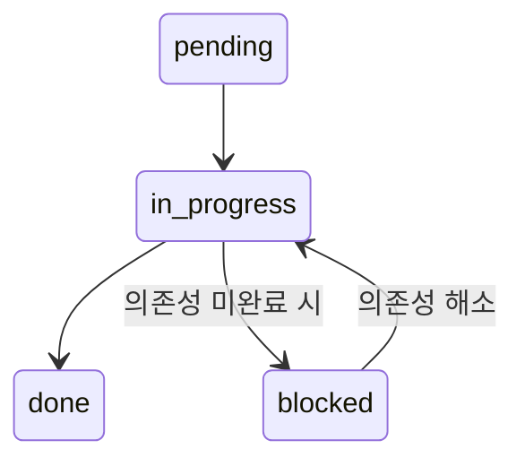
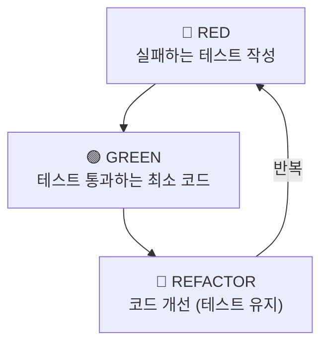
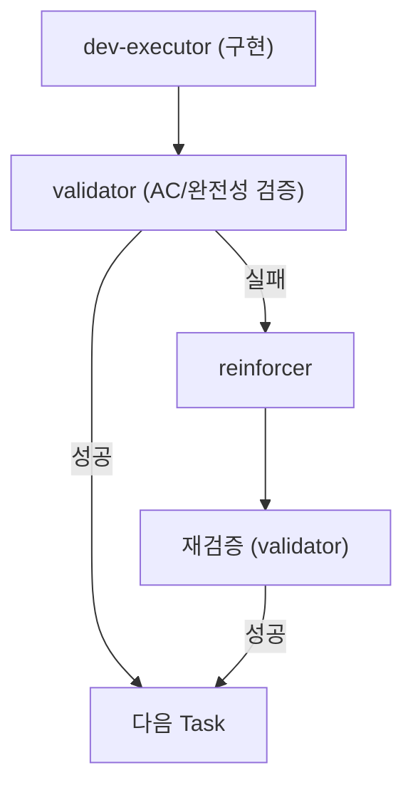

# Build Phase - 에이전트 호출 프롬프트

> **dev-executor 에이전트 호출 시 사용되는 프롬프트 템플릿**

---

## 에이전트 호출

```python
Task(
    subagent_type="calab-plugin:dev-executor",
    description="TDD 구현",
    prompt="""
## Role
TDD 기반 구현 전문가

## Goal
'{task_id}' 태스크 구현 (Acceptance Criteria 100% 충족)

## Input (필수)
- 태스크 목록: .claude/docs/active/{feature_name}/05-tasks.md
- 워크트리: .claude-state/worktree.json
- 프로젝트 규칙: .claude/memory/PROJECT_RULES.md

## Output
- 소스 코드 (AC 충족)
- 테스트 코드 (TDD 필수)
- worktree.json 상태 업데이트

## Workflow
1. 05-tasks.md에서 {task_id} AC 추출
2. worktree.json에서 상태를 'in_progress'로 변경
3. TDD 사이클 (항상 적용):
   - RED: 실패하는 테스트 작성
   - GREEN: 테스트 통과하는 최소 코드
   - REFACTOR: 코드 개선
4. AC 검증 (모든 항목 충족 확인)
6. worktree.json 상태를 'done'으로 변경
7. 완료 보고

## Constraints
- AC 100% 충족 전 완료 불가
- 파일 500줄 이하
- 모든 함수에 JSDoc 주석
- 타입 100% 커버리지
- 테스트 커버리지 80% 이상

## Template
references/build.md 참조
"""
)
```

---

## Data Flow

### Input (이전 단계에서)
| 소스 | 데이터 |
|------|--------|
| /dev --tasks | .claude/docs/active/{feature}/05-tasks.md |
| /dev --tasks | .claude-state/worktree.json |

### Output
| 산출물 | 용도 |
|--------|------|
| 소스 코드 | 기능 구현 |
| 테스트 코드 | 품질 보장 |
| worktree.json (업데이트) | 진행률 추적 |

---

## AC 검증 프로세스

```
[TASK 완료 검증] TASK-001

AC 체크리스트:
✅ AC1: 충족 - {설명}
✅ AC2: 충족 - {설명}
✅ AC3: 충족 - {설명}

결과: ✅ 완료 가능
→ worktree.json 상태 업데이트
→ 다음 태스크 안내
```

### AC 미충족 시

```
[TASK 완료 검증] TASK-001

AC 체크리스트:
✅ AC1: 충족
❌ AC2: 미충족 - {이유}

결과: ❌ 완료 불가
→ AC2 구현 후 재검증 필요
```

---

## Worktree 상태 전이



---

## TDD 사이클 (기본 구현 방식)



---

## 검증 체인


