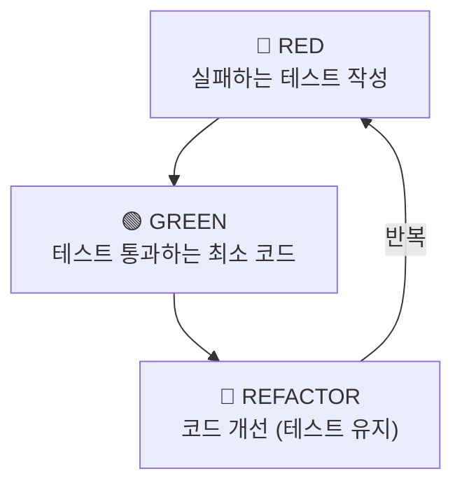

# /dev --build - 구현 단계

> **베스트 프랙티스 적용 태스크 구현**

## 사용법

```bash
/dev --build TASK-001           # TDD 기반 구현 (기본)
/dev --build --all              # 전체 Wave 병렬 실행
```

---

## 전제 조건

- [ ] `/dev --tasks` 완료됨
- [ ] `05-tasks.md` 존재함

- [ ] `worktree.json` 존재함
- [ ] 해당 TASK의 의존성 완료됨

---

## 실행 절차

### Step 1: 컨텍스트 로드

```
필수 로드:
1. .claude/memory/CURRENT_CONTEXT.md
2. .claude/memory/PROJECT_RULES.md
3. .claude-state/worktree.json
4. .claude/docs/active/{feature}/05-tasks.md
```

### Step 2: Worktree 상태 업데이트

```
🚨 필수: TASK 시작 시 worktree.json 업데이트

{
  "current_task": "TASK-001",
  "tasks": [{
    "id": "TASK-001",
    "status": "in_progress",  // ← 변경
    "started_at": "2024-01-15T10:30:00Z"
  }]
}
```

### Step 3: 패시브 스킬 로드

```
자동 로드:
- skills/clean-architecture/SKILL.md
- skills/best-practices/SKILL.md
- skills/code-quality/SKILL.md
- .claude/memory/PROJECT_RULES.md
```

### Step 4: AC 확인

```
05-tasks.md에서 해당 TASK의 Acceptance Criteria 추출

TASK-001 AC:
- [ ] AC1: ...
- [ ] AC2: ...
- [ ] AC3: ...
```

### Step 5: TDD 구현

> **모든 빌드는 TDD로 실행됩니다.** `--tdd` 플래그 없이도 항상 TDD 사이클을 따릅니다.

### TDD 사이클



### TDD 규칙

1. **테스트 먼저**: 프로덕션 코드 전에 테스트 작성
2. **최소 구현**: 테스트 통과에 필요한 최소 코드만
3. **리팩토링**: 테스트 통과 유지하며 개선
4. **커버리지**: 80% 이상 유지

---

## 코드 품질 규칙

### 파일 크기

```
🚨 500줄 초과 금지

초과 시:
- 파일 분리 필요
- 책임 분리 검토
```

### 함수/클래스 문서화

```typescript
/**
 * 사용자를 생성합니다.
 *
 * @param data - 사용자 생성 데이터
 * @returns 생성된 사용자
 * @throws {ValidationError} 유효성 검사 실패 시
 */
export async function createUser(data: CreateUserDto): Promise<User> {
  // 구현
}
```

### 타입 안전성

```typescript
// ✅ Good
function process(data: ProcessInput): ProcessOutput {
  return { result: data.value * 2 };
}

// ❌ Bad
function process(data: any): any {
  return { result: data.value * 2 };
}
```

---

## 클린 아키텍처 검증

### 레이어 의존성 규칙

```
✅ 허용:
- Presentation → Application
- Application → Domain
- Infrastructure → Application
- Infrastructure → Domain

❌ 금지:
- Domain → Application
- Domain → Infrastructure
- Application → Presentation
```

### 레이어별 책임

| 레이어 | 책임 | 예시 |
|--------|------|------|
| Domain | 비즈니스 로직, 엔티티 | User, Order |
| Application | 유스케이스, DTO | CreateUserUseCase |
| Infrastructure | DB, 외부 API | UserRepository |
| Presentation | UI, 컨트롤러 | UserController |

---

## Step 6: AC 검증 (완료 전 필수)

```
🚨 모든 AC 충족 전 완료 불가!

[TASK 완료 검증] TASK-001
✅ AC1: 충족 - Prisma 스키마에 User 모델 정의됨
✅ AC2: 충족 - 마이그레이션 파일 생성됨
✅ AC3: 충족 - DB에 users 테이블 생성됨
✅ AC4: 충족 - 필수 컬럼 존재함

결과: ✅ 완료 가능
```

### AC 미충족 시

```
[TASK 완료 검증] TASK-001
✅ AC1: 충족
✅ AC2: 충족
❌ AC3: 미충족 - DB 테이블 미생성

결과: ❌ 완료 불가
→ AC3 구현 후 재검증 필요
```

---

## Step 7: Worktree 완료 처리

```
AC 100% 충족 시에만:

{
  "current_task": "TASK-002",  // 다음 태스크로 이동
  "tasks": [{
    "id": "TASK-001",
    "status": "done",  // ← 변경
    "completed_at": "2024-01-15T12:00:00Z"
  }]
}
```

---

## 완료 보고

```
============================================
 DEV BUILD 완료: TASK-001
============================================

 📋 구현 결과:
 • Task: {Task 설명}
 • 모드: TDD (Red-Green-Refactor)

 ✅ AC 검증:
 • AC1: 충족 ✓
 • AC2: 충족 ✓
 • AC3: 충족 ✓

 📁 변경된 파일:
 • src/features/{feature}/types/{file}.ts
 • src/features/{feature}/services/{file}.ts
 • tests/{file}.test.ts

 📊 테스트:
 • 통과: {N}개
 • 커버리지: {N}%

============================================
 다음 태스크: TASK-002 {설명}
 명령어: /dev --build TASK-002
============================================
```

---

## 다음 단계

| 상황 | 명령어 |
|------|--------|
| 다음 태스크 | `/dev --build TASK-002` |
| 진행 확인 | `/worktree` |
| 전체 완료 | `/qa` |
| 상태 확인 | `/dev --status` |
