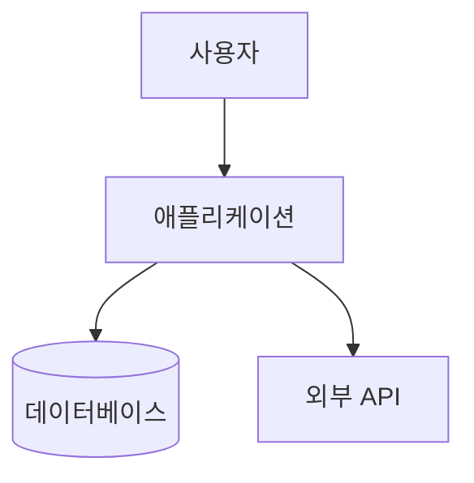
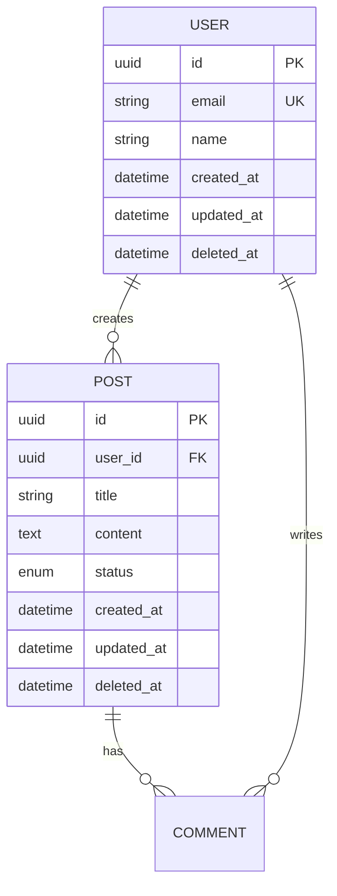

# /dev --design - 설계 단계

> **시스템 아키텍처 + ERD 설계**

## 실행 옵션

```bash
/dev --design [기능명]    # 전체 설계 (아키텍처 + ERD)
/dev --design --arch      # 아키텍처만
/dev --design --erd       # ERD만
```

---

## 산출물 (필수)

```
.claude/docs/active/{feature-name}/
├── 03-architecture.md    ← 아키텍처 설계 문서
└── 04-ERD.md             ← 데이터베이스 스키마
```

---

## 전제 조건

- [ ] `/dev --plan` 완료됨
- [ ] `01-brainstorm.md` 존재함
- [ ] `02-PRD.md` 존재함

---

## 실행 절차

### Step 1: PRD 분석

```
.claude/docs/active/{feature-name}/02-PRD.md 읽기
- P0/P1 요구사항 추출
- 비기능 요구사항 확인
```

### Step 2: 아키텍처 문서 작성

**03-architecture.md 작성 (필수):**

```markdown
# 아키텍처: {기능명}

## 1. 시스템 컨텍스트 (C4 Level 1)



---

## 2. 기술 스택

| 레이어 | 기술 | 선택 이유 |
|--------|------|----------|
| Frontend | {React/Next.js} | {이유} |
| Backend | {Node.js/NestJS} | {이유} |
| Database | {PostgreSQL} | {이유} |
| ORM | {Prisma} | {이유} |

---

## 3. 디렉토리 구조

### Feature-based 구조
```
src/features/{feature-name}/
├── components/           # UI 컴포넌트
│   ├── {Feature}Form.tsx
│   └── {Feature}List.tsx
├── hooks/               # 커스텀 훅
│   └── use{Feature}.ts
├── services/            # API 호출
│   └── {feature}Service.ts
├── types/               # 타입 정의
│   └── {feature}.types.ts
└── index.ts             # 배럴 export
```

---

## 4. API 설계

| Method | Endpoint | 설명 |
|--------|----------|------|
| GET | /api/{feature} | 목록 조회 |
| GET | /api/{feature}/:id | 상세 조회 |
| POST | /api/{feature} | 생성 |
| PUT | /api/{feature}/:id | 수정 |
| DELETE | /api/{feature}/:id | 삭제 |

---

## 5. 컴포넌트 구조

```mermaid
graph TD
    Page[{Feature}Page] --> List[{Feature}List]
    Page --> Form[{Feature}Form]
    List --> Item[{Feature}Item]
    Form --> Input[FormInput]
    Form --> Button[SubmitButton]
```

---

## 6. 상태 관리

| 상태 | 관리 방식 | 범위 |
|------|----------|------|
| 서버 상태 | TanStack Query | 글로벌 |
| 폼 상태 | React Hook Form | 로컬 |
| UI 상태 | useState/Zustand | 컴포넌트 |

---

## 7. 보안 고려사항

- [ ] 인증: {JWT/Session}
- [ ] 인가: {RBAC/ABAC}
- [ ] 입력 검증: {Zod/Yup}
- [ ] XSS 방지
- [ ] CSRF 방지

---

## 8. 참조
- 브레인스토밍: 01-brainstorm.md
- PRD: 02-PRD.md
- 프로젝트 규칙: .claude/memory/PROJECT_RULES.md
```

---

## Phase 2: ERD 설계 (`--erd`)

### Step 1: 엔티티 식별

PRD에서 명사 추출 → 엔티티 후보

### Step 2: ERD 문서 작성

**04-ERD.md 작성 (필수):**

```markdown
# ERD: {기능명}

## 1. 엔티티 관계도



---

## 2. 테이블 정의

### 2.1 {table_name}

| 컬럼 | 타입 | 제약조건 | 설명 |
|------|------|----------|------|
| id | UUID | PK, DEFAULT uuid_generate_v4() | 고유 식별자 |
| created_at | TIMESTAMP | NOT NULL, DEFAULT NOW() | 생성일시 |
| updated_at | TIMESTAMP | NOT NULL, DEFAULT NOW() | 수정일시 |
| deleted_at | TIMESTAMP | NULL | 삭제일시 (소프트 삭제) |

---

## 3. 인덱스 전략

| 테이블 | 인덱스 | 컬럼 | 용도 |
|--------|--------|------|------|
| {table} | idx_{table}_email | email | 로그인 조회 |
| {table} | idx_{table}_created | created_at | 정렬 |

---

## 4. Prisma 스키마

```prisma
model User {
  id        String    @id @default(uuid())
  email     String    @unique
  name      String
  posts     Post[]
  comments  Comment[]
  createdAt DateTime  @default(now()) @map("created_at")
  updatedAt DateTime  @updatedAt @map("updated_at")
  deletedAt DateTime? @map("deleted_at")

  @@map("users")
}

model Post {
  id        String    @id @default(uuid())
  userId    String    @map("user_id")
  title     String
  content   String
  status    PostStatus @default(DRAFT)
  user      User      @relation(fields: [userId], references: [id])
  comments  Comment[]
  createdAt DateTime  @default(now()) @map("created_at")
  updatedAt DateTime  @updatedAt @map("updated_at")
  deletedAt DateTime? @map("deleted_at")

  @@map("posts")
}

enum PostStatus {
  DRAFT
  PUBLISHED
  ARCHIVED
}
```

---

## 5. 마이그레이션 계획

| 순서 | 마이그레이션 | 설명 |
|------|-------------|------|
| 1 | create_users_table | 사용자 테이블 |
| 2 | create_posts_table | 게시물 테이블 |
| 3 | add_indexes | 인덱스 추가 |

---

## 6. 명명 규칙

- **테이블명**: 복수형, snake_case (예: `users`, `blog_posts`)
- **컬럼명**: snake_case (예: `created_at`, `user_id`)
- **PK**: `id` (UUID)
- **FK**: `{referenced_table}_id` (예: `user_id`)
- **인덱스**: `idx_{table}_{column}` (예: `idx_users_email`)
```

---

## 완료 조건

- [ ] **03-architecture.md 생성됨** (필수)
- [ ] **04-ERD.md 생성됨** (DB 사용 시 필수)
- [ ] 기술 스택 명시됨
- [ ] API 엔드포인트 정의됨
- [ ] Prisma 스키마 작성됨 (DB 사용 시)

---

## 완료 보고

```
============================================
 DEV DESIGN 완료: {기능명}
============================================

 📁 생성된 문서:
 • .claude/docs/active/{feature-name}/03-architecture.md
 • .claude/docs/active/{feature-name}/04-ERD.md

 📋 설계 요약:
 • 기술 스택: {Frontend} + {Backend} + {DB}
 • API 엔드포인트: {N}개
 • 엔티티: {N}개
 • 테이블: {N}개

============================================
 다음 단계: /dev --tasks {feature-name}
============================================
```

---

## 다음 단계

| 상황 | 명령어 |
|------|--------|
| 태스크 분해 | `/dev --tasks` |
| 설계 수정 | 문서 직접 수정 |
| 상태 확인 | `/dev --status` |
