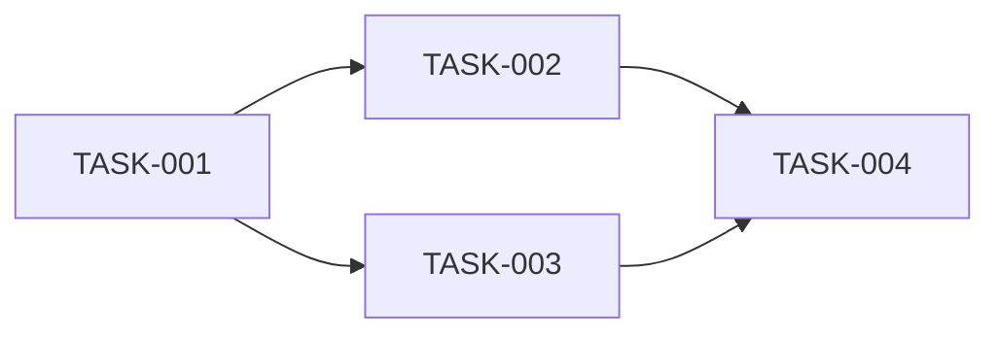

# /dev --tasks - 태스크 분해 단계

> **Epic → Story → Task 분해 + Acceptance Criteria 정의**

## 사용법

```bash
/dev --tasks [기능명]    # 태스크 분해 실행
```

---

## 전제 조건

- [ ] `/dev --design` 완료됨
- [ ] `03-architecture.md` 존재함
- [ ] `04-erd.md` 존재함

---

## 실행 절차

### Step 1: 기능 폴더 확인

```
.claude/docs/active/{feature-name}/ 존재 확인
- 01-brainstorm.md
- 02-prd.md
- 03-architecture.md
- 04-erd.md
```

### Step 2: 컨텍스트 로드

모든 문서 읽기:
- PRD에서 요구사항 추출
- 아키텍처에서 컴포넌트 추출
- ERD에서 엔티티 추출

### Step 3: Epic 정의

```markdown
## Epic 구조

Epic = 대규모 기능 단위 (릴리스 단위)

예시:
- Epic 1: 사용자 인증
- Epic 2: 게시물 관리
- Epic 3: 댓글 기능
```

### Step 4: Story 분해

```markdown
## Story 구조

Story = 사용자 관점의 기능 단위

형식: "As a [사용자], I want to [기능], so that [가치]"

예시:
- Story 1.1: 회원가입
- Story 1.2: 로그인
- Story 1.3: 로그아웃
```

### Step 5: Task 분해

```markdown
## Task 구조

Task = 개발자 작업 단위 (2-4시간)

TASK-{3자리}: {작업 설명}
```

### Step 5.5: 🚨 Acceptance Criteria 정의 (필수)

**AC 없는 Task는 완료 불가!**

```markdown
### AC 작성 규칙

1. 구체적이고 검증 가능해야 함
2. 3-5개 항목
3. Given-When-Then 형식 권장

예시:
TASK-001: User 테이블 마이그레이션
  AC:
  - [ ] Prisma 스키마에 User 모델 정의됨
  - [ ] 마이그레이션 파일 생성됨
  - [ ] DB에 users 테이블 생성됨
  - [ ] 필수 컬럼(id, email, name, timestamps) 존재함
```

### Step 6: 의존성 분석

```
TASK-002 → TASK-001 (TASK-002는 TASK-001에 의존)
```

### Step 7: 우선순위 할당

| 우선순위 | 설명 |
|---------|------|
| P0 | 필수, 즉시 |
| P1 | 중요, 곧 |
| P2 | 보통, 나중에 |
| P3 | 낮음, 여유 있을 때 |

---

## 05-tasks.md 작성

```markdown
# 태스크 목록: {기능명}

## 메타 정보
| 항목 | 내용 |
|------|------|
| 기능명 | {기능명} |
| 총 Epic | {N}개 |
| 총 Story | {N}개 |
| 총 Task | {N}개 |

---

## Epic 1: {Epic 이름}

### Story 1.1: {Story 이름}

#### TASK-001: {Task 설명}

| 항목 | 내용 |
|------|------|
| 우선순위 | P0 |
| 의존성 | 없음 |
| 예상 크기 | S/M/L |

**Acceptance Criteria:**
- [ ] AC1: {검증 가능한 조건}
- [ ] AC2: {검증 가능한 조건}
- [ ] AC3: {검증 가능한 조건}

**구현 가이드:**
- {힌트 1}
- {힌트 2}

---

#### TASK-002: {Task 설명}

| 항목 | 내용 |
|------|------|
| 우선순위 | P0 |
| 의존성 | TASK-001 |
| 예상 크기 | M |

**Acceptance Criteria:**
- [ ] AC1: {조건}
- [ ] AC2: {조건}

---

## 의존성 그래프



---

## 실행 순서 권장

1. TASK-001 (의존성 없음)
2. TASK-002 (TASK-001 완료 후)
3. TASK-003 (TASK-001 완료 후)
4. TASK-004 (TASK-002, TASK-003 완료 후)
```

---

## Step 8: worktree.json 생성

```json
{
  "project": "{기능명}",
  "feature_folder": ".claude/docs/active/{feature-name}/",
  "status": "in_progress",
  "current_task": "TASK-001",
  "progress": {
    "total": 10,
    "done": 0,
    "in_progress": 0,
    "blocked": 0,
    "pending": 10,
    "percentage": 0
  },
  "epics": [
    {
      "id": "EPIC-001",
      "name": "{Epic 이름}",
      "stories": [
        {
          "id": "STORY-001",
          "name": "{Story 이름}",
          "tasks": [
            {
              "id": "TASK-001",
              "name": "{Task 이름}",
              "status": "pending",
              "priority": "P0",
              "dependencies": [],
              "acceptance_criteria": [
                "AC1 내용",
                "AC2 내용"
              ]
            }
          ]
        }
      ]
    }
  ]
}
```

---

## 완료 조건

- [ ] 05-tasks.md 생성됨
- [ ] 모든 Task에 AC 정의됨
- [ ] 의존성 분석됨
- [ ] 우선순위 할당됨
- [ ] worktree.json 생성됨

---

## 완료 보고

```
============================================
 DEV TASKS 완료: {기능명}
============================================

 📁 생성된 문서:
 • .claude/docs/active/{feature-name}/05-tasks.md
 • .claude-state/worktree.json

 📋 분해 결과:
 • Epic: {N}개
 • Story: {N}개
 • Task: {N}개

 🎯 실행 순서:
 1. TASK-001: {설명}
 2. TASK-002: {설명}
 3. ...

============================================
 다음 단계: /dev --build TASK-001
============================================
```

---

## 다음 단계

| 상황 | 명령어 |
|------|--------|
| 첫 태스크 시작 | `/dev --build TASK-001` |
| 진행 상황 확인 | `/worktree` |
| 상태 확인 | `/dev --status` |
