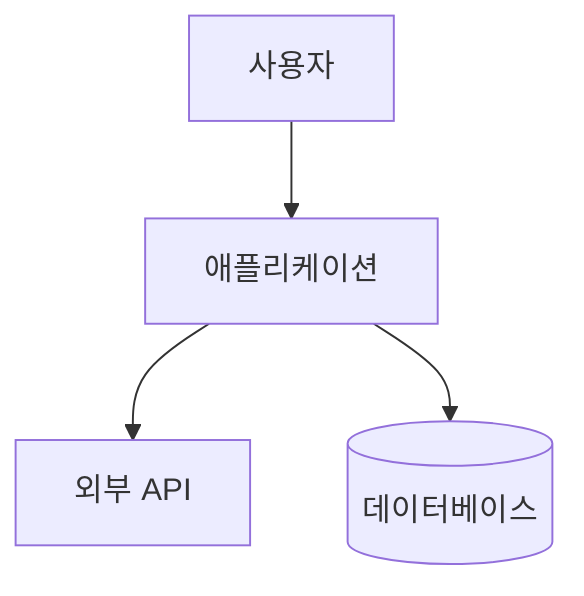

# /onboard - 프로젝트 온보딩

> **프로젝트 분석 및 컨텍스트 문서 생성**

## 사용법

```bash
/onboard                   # 전체 온보딩 (5개 문서)
/onboard --quick           # 빠른 온보딩 (1개 문서, ~1분)
/onboard --full            # 전체 온보딩 (기본)
/onboard --skip-domain     # 도메인 인터뷰 건너뛰기
/onboard --phase 1         # 특정 Phase만 실행
/onboard --help            # 도움말
```

## 🤖 에이전트 실행 (필수)

**⚠️ 이 스킬이 로드되면 아래 지침을 따라 즉시 Task 도구를 호출하세요.**

### --quick 또는 Phase 1-2

**지금 바로 Task 도구를 호출**하세요:
- `subagent_type`: `"Explore"`
- `description`: `"프로젝트 탐색 및 기술 스택 분석"`
- `prompt`: 아래 프롬프트 내용 사용

**프롬프트 내용:**
```
**역할**: 프로젝트 탐색 전문가

**목표**: 프로젝트 구조 및 기술 스택 빠른 파악

**탐색 대상**:
- package.json, tsconfig.json, 설정 파일
- 디렉토리 구조
- 주요 패턴

**출력**: PROJECT_SUMMARY.md 초안
```

### Phase 3-4: 아키텍처 및 컨텍스트 생성

**Task 도구 호출**:
- `subagent_type`: `"calab-plugin:project-onboarder"`
- `description`: `"프로젝트 온보딩 및 컨텍스트 생성"`
- `prompt`: 아래 프롬프트 내용 사용

**프롬프트 내용:**
```
**역할**: 프로젝트 온보딩 전문가

**목표**: 5개 컨텍스트 문서 생성

**산출물**:
- .claude/project-context/PROJECT_SUMMARY.md
- .claude/project-context/ARCHITECTURE.md (C4 다이어그램)
- .claude/project-context/CODE_PATTERNS.md
- .claude/project-context/CONVENTIONS.md
- .claude/project-context/DOMAIN_KNOWLEDGE.md (선택)

**C4 Model**:
- Level 1: System Context
- Level 2: Container Diagram
- Level 3: Component Diagram
```

**⚠️ 중요**: 이 지침을 읽고 있다면, 사용자에게 텍스트로 응답하지 말고 **Task 도구를 호출**하세요!

---

## 인자 파싱

입력: $ARGUMENTS

### 옵션별 라우팅

1. **`--help` 또는 `-h`** → 도움말 출력

2. **`--quick`** → `references/quick.md` 실행
   - 핵심 정보만 분석 (~1분)
   - PROJECT_SUMMARY.md만 생성
   - 빠른 개발 시작용

3. **`--full` 또는 옵션 없음** → 전체 온보딩
   - 5개 Phase 순차 실행
   - 5개 컨텍스트 문서 생성

4. **`--phase [N]`** → 특정 Phase만 실행
   - `--phase 1-2`: Discovery + Pattern Analysis
   - `--phase 3`: Architecture Analysis
   - `--phase 4`: Context Generation
   - `--phase 5`: Domain Knowledge

5. **`--skip-domain`** → 도메인 인터뷰 건너뛰기
   - Phase 5 생략
   - DOMAIN_KNOWLEDGE.md 미생성

## 온보딩 프로세스

```
┌─────────────────────────────────────────┐
│            온보딩 프로세스                │
├─────────────────────────────────────────┤
│                                         │
│  Phase 1-2: Discovery + Pattern         │
│  ├── 설정 파일 분석                      │
│  ├── 기술 스택 식별                      │
│  ├── 디렉토리 구조 매핑                   │
│  └── 코드 패턴 추출                      │
│            ↓                            │
│  Phase 3: Architecture (C4 Model)       │
│  ├── System Context (Level 1)           │
│  ├── Container Diagram (Level 2)        │
│  └── Component Diagram (Level 3)        │
│            ↓                            │
│  Phase 4: Context Generation            │
│  ├── PROJECT_SUMMARY.md                 │
│  ├── ARCHITECTURE.md                    │
│  ├── CODE_PATTERNS.md                   │
│  └── CONVENTIONS.md                     │
│            ↓                            │
│  Phase 5: Domain Knowledge              │
│  └── DOMAIN_KNOWLEDGE.md (대화형)        │
│                                         │
└─────────────────────────────────────────┘
```

## 출력 문서

```
.claude/project-context/
├── PROJECT_SUMMARY.md      # 프로젝트 요약
├── ARCHITECTURE.md         # 아키텍처 (C4 다이어그램)
├── CODE_PATTERNS.md        # 코드 패턴
├── CONVENTIONS.md          # 컨벤션
└── DOMAIN_KNOWLEDGE.md     # 도메인 지식 (선택)
```

### 문서 내용

| 문서 | 내용 |
|------|------|
| PROJECT_SUMMARY | 개요, 기술 스택, 디렉토리, 명령어 |
| ARCHITECTURE | C4 다이어그램, 레이어 구조, 데이터 플로우 |
| CODE_PATTERNS | 컴포넌트, API, Hook, 에러 처리 패턴 |
| CONVENTIONS | 네이밍, 임포트 순서, 커밋 메시지, 브랜치 |
| DOMAIN_KNOWLEDGE | 비즈니스 개념, 엔티티, 규칙, 용어 |

## Quick vs Full 비교

| 항목 | Quick | Full |
|------|-------|------|
| 시간 | ~1분 | ~10분 |
| 깊이 | 표면적 | 심층 |
| 문서 | 1개 | 5개 |
| 패턴 | 필수만 | 전체 |
| C4 다이어그램 | 없음 | 있음 |
| 도메인 지식 | 없음 | 있음 (대화형) |

## C4 Model 구조

### Level 1: System Context


### Level 2: Container
```
- Web Application (Next.js)
- API Server (Express/NestJS)
- Database (PostgreSQL)
- Cache (Redis)
```

### Level 3: Component
```
- Presentation Layer
- Application Layer
- Domain Layer
- Infrastructure Layer
```

## 레거시 명령어 호환

| 이전 명령어 | 신규 명령어 |
|------------|------------|
| `/onboard` | `/onboard` (유지) |
| `/onboard-quick` | `/onboard --quick` |
| `/onboard-phases:01-discovery` | `/onboard --phase 1-2` |
| `/onboard-phases:02-architecture` | `/onboard --phase 3` |
| `/onboard-phases:03-context-gen` | `/onboard --phase 4` |
| `/onboard-phases:04-domain` | `/onboard --phase 5` |

## 도메인 인터뷰 질문

Phase 5에서 대화형 질문:

1. **프로젝트 목적**: 어떤 문제를 해결하나요?
2. **대상 사용자**: 누가 사용하나요?
3. **핵심 개념**: 주요 비즈니스 엔티티는?
4. **비즈니스 규칙**: 중요한 불변식은?
5. **용어**: 특수 용어/약어는?
6. **워크플로우**: 핵심 사용자 시나리오는?

## 다음 단계

| 상황 | 권장 명령어 |
|------|------------|
| 빠른 시작 | `/onboard --quick` |
| 전체 분석 | `/onboard` |
| 도메인 생략 | `/onboard --skip-domain` |
| 컨텍스트 확인 | `/context` |
| 개발 시작 | `/dev --plan [기능]` |

## 📦 산출물 (CRITICAL - 누락 금지)

> **온보딩 시 반드시 산출물 생성**

| Phase | 산출물 | 파일 경로 | 필수 |
|-------|--------|----------|------|
| **Quick** | 프로젝트 요약 | `.claude/project-context/PROJECT_SUMMARY.md` | ✅ |
| **Phase 3** | 아키텍처 문서 | `.claude/project-context/ARCHITECTURE.md` | ✅ |
| **Phase 4** | 코드 패턴 | `.claude/project-context/CODE_PATTERNS.md` | ✅ |
| **Phase 4** | 컨벤션 | `.claude/project-context/CONVENTIONS.md` | ✅ |
| **Phase 5** | 도메인 지식 | `.claude/project-context/DOMAIN_KNOWLEDGE.md` | ⚠️ |
| **완료** | 프로젝트 규칙 | `.claude/memory/PROJECT_RULES.md` | ✅ |

### 필수 산출물 검증 체크리스트

#### Quick 모드 (최소 1개)
```
□ PROJECT_SUMMARY.md 생성됨
  □ 기술 스택 정보 포함
  □ 디렉토리 구조 포함
  □ 주요 명령어 포함
```

#### Full 모드 (최소 5개)
```
□ PROJECT_SUMMARY.md 생성됨
□ ARCHITECTURE.md 생성됨
  □ C4 Level 1-3 다이어그램 포함
  □ 레이어 구조 설명 포함
□ CODE_PATTERNS.md 생성됨
  □ 컴포넌트 패턴 포함
  □ API 패턴 포함
  □ Hook 패턴 포함
□ CONVENTIONS.md 생성됨
  □ 네이밍 컨벤션 포함
  □ 커밋 메시지 형식 포함
□ PROJECT_RULES.md 생성됨 (memory/)
```

## ✅ State Persistence 의무

### 온보딩 시작 시 필수 작업
- [ ] 1. `.claude/project-context/` 디렉토리 생성
- [ ] 2. 온보딩 상태 기록 → `.claude-state/checkpoint.json`
- [ ] 3. 현재 Phase 기록

### Phase 완료 시 필수 작업
- [ ] 1. 해당 Phase 산출물 생성 확인
- [ ] 2. checkpoint 업데이트 → 다음 Phase로
- [ ] 3. 부분 완료 시 재개 가능하도록 상태 저장

### 온보딩 완료 후 필수 작업
- [ ] 1. 모든 산출물 존재 확인
- [ ] 2. PROJECT_RULES.md → `.claude/memory/`에 복사
- [ ] 3. checkpoint 상태를 "completed"로 업데이트
- [ ] 4. 완료 메시지 출력 (다음 단계 안내)

### State 파일 업데이트 예시

```python
def update_onboarding_checkpoint(phase, status, artifacts):
    """온보딩 체크포인트 업데이트"""
    checkpoint = {
        "type": "onboarding",
        "current_phase": phase,
        "status": status,  # "in_progress" | "completed" | "paused"
        "artifacts_created": artifacts,
        "timestamp": datetime.now().isoformat(),
        "resumable": True,
        "next_phase": phase + 1 if status != "completed" else None
    }
    save_json(".claude-state/checkpoint.json", checkpoint)

    # Quick 모드 완료 시
    if phase == "quick" and status == "completed":
        checkpoint["quick_mode"] = True
        checkpoint["full_mode_available"] = True

    print(f"✅ 온보딩 체크포인트 업데이트: Phase {phase} - {status}")
```

### 온보딩 재개 프로토콜

```
============================================
[ONBOARD] 이전 온보딩 세션 발견
============================================

📋 이전 진행 상태:
• Phase 1-2: ✅ 완료
• Phase 3: ✅ 완료
• Phase 4: ⏸️ 중단됨

📁 생성된 문서:
• PROJECT_SUMMARY.md ✅
• ARCHITECTURE.md ✅
• CODE_PATTERNS.md ⏳ (진행 중)

============================================
이전 세션을 이어서 진행하시겠습니까?
[Y] 계속 진행 | [N] 처음부터 | [S] 상태만 확인
============================================
```

## 참조 파일

### 템플릿 (스킬 내부)

| 용도 | 템플릿 |
|------|--------|
| 분석 보고서 | `templates/analysis-report.md` |
| 아키텍처 | `templates/architecture-template.md` |

### 베스트 프랙티스 (스킬 내부)

- `references/project-onboarding.md` - 온보딩 가이드
- `references/clean-architecture.md` - 아키텍처 분석

### State 파일 (프로젝트 전역)

- `.claude-state/checkpoint.json` - 온보딩 체크포인트
- `.claude/memory/PROJECT_RULES.md` - 프로젝트 규칙 (온보딩 결과)
