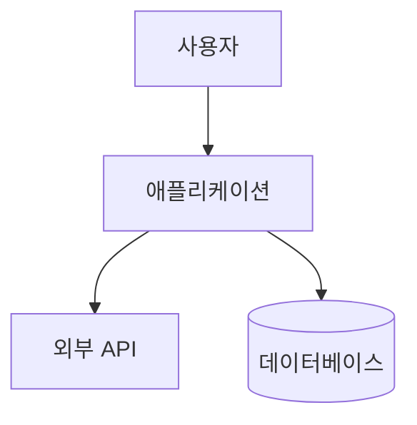

# /onboard - 프로젝트 온보딩

> **프로젝트 분석 및 컨텍스트 문서 생성**

## 사용법

```bash
/onboard                   # 전체 온보딩 (5개 문서)
/onboard --quick           # 빠른 온보딩 (1개 문서, ~1분)
/onboard --full            # 전체 온보딩 (기본)
/onboard --skip-domain     # 도메인 인터뷰 건너뛰기
/onboard --phase 1         # 특정 Phase만 실행
/onboard --help            # 도움말
```

## 인자 파싱

입력: $ARGUMENTS

### 옵션별 라우팅

1. **`--help` 또는 `-h`** → 도움말 출력

2. **`--quick`** → `references/quick.md` 실행
   - 핵심 정보만 분석 (~1분)
   - PROJECT_SUMMARY.md만 생성
   - 빠른 개발 시작용

3. **`--full` 또는 옵션 없음** → 전체 온보딩
   - 5개 Phase 순차 실행
   - 5개 컨텍스트 문서 생성

4. **`--phase [N]`** → 특정 Phase만 실행
   - `--phase 1-2`: Discovery + Pattern Analysis
   - `--phase 3`: Architecture Analysis
   - `--phase 4`: Context Generation
   - `--phase 5`: Domain Knowledge

5. **`--skip-domain`** → 도메인 인터뷰 건너뛰기
   - Phase 5 생략
   - DOMAIN_KNOWLEDGE.md 미생성

## 온보딩 프로세스

```
┌─────────────────────────────────────────┐
│            온보딩 프로세스                │
├─────────────────────────────────────────┤
│                                         │
│  Phase 1-2: Discovery + Pattern         │
│  ├── 설정 파일 분석                      │
│  ├── 기술 스택 식별                      │
│  ├── 디렉토리 구조 매핑                   │
│  └── 코드 패턴 추출                      │
│            ↓                            │
│  Phase 3: Architecture (C4 Model)       │
│  ├── System Context (Level 1)           │
│  ├── Container Diagram (Level 2)        │
│  └── Component Diagram (Level 3)        │
│            ↓                            │
│  Phase 4: Context Generation            │
│  ├── PROJECT_SUMMARY.md                 │
│  ├── ARCHITECTURE.md                    │
│  ├── CODE_PATTERNS.md                   │
│  └── CONVENTIONS.md                     │
│            ↓                            │
│  Phase 5: Domain Knowledge              │
│  └── DOMAIN_KNOWLEDGE.md (대화형)        │
│                                         │
└─────────────────────────────────────────┘
```

## 출력 문서

```
.claude/project-context/
├── PROJECT_SUMMARY.md      # 프로젝트 요약
├── ARCHITECTURE.md         # 아키텍처 (C4 다이어그램)
├── CODE_PATTERNS.md        # 코드 패턴
├── CONVENTIONS.md          # 컨벤션
└── DOMAIN_KNOWLEDGE.md     # 도메인 지식 (선택)
```

### 문서 내용

| 문서 | 내용 |
|------|------|
| PROJECT_SUMMARY | 개요, 기술 스택, 디렉토리, 명령어 |
| ARCHITECTURE | C4 다이어그램, 레이어 구조, 데이터 플로우 |
| CODE_PATTERNS | 컴포넌트, API, Hook, 에러 처리 패턴 |
| CONVENTIONS | 네이밍, 임포트 순서, 커밋 메시지, 브랜치 |
| DOMAIN_KNOWLEDGE | 비즈니스 개념, 엔티티, 규칙, 용어 |

## Quick vs Full 비교

| 항목 | Quick | Full |
|------|-------|------|
| 시간 | ~1분 | ~10분 |
| 깊이 | 표면적 | 심층 |
| 문서 | 1개 | 5개 |
| 패턴 | 필수만 | 전체 |
| C4 다이어그램 | 없음 | 있음 |
| 도메인 지식 | 없음 | 있음 (대화형) |

## C4 Model 구조

### Level 1: System Context


### Level 2: Container
```
- Web Application (Next.js)
- API Server (Express/NestJS)
- Database (PostgreSQL)
- Cache (Redis)
```

### Level 3: Component
```
- Presentation Layer
- Application Layer
- Domain Layer
- Infrastructure Layer
```

## 레거시 명령어 호환

| 이전 명령어 | 신규 명령어 |
|------------|------------|
| `/onboard` | `/onboard` (유지) |
| `/onboard-quick` | `/onboard --quick` |
| `/onboard-phases:01-discovery` | `/onboard --phase 1-2` |
| `/onboard-phases:02-architecture` | `/onboard --phase 3` |
| `/onboard-phases:03-context-gen` | `/onboard --phase 4` |
| `/onboard-phases:04-domain` | `/onboard --phase 5` |

## 도메인 인터뷰 질문

Phase 5에서 대화형 질문:

1. **프로젝트 목적**: 어떤 문제를 해결하나요?
2. **대상 사용자**: 누가 사용하나요?
3. **핵심 개념**: 주요 비즈니스 엔티티는?
4. **비즈니스 규칙**: 중요한 불변식은?
5. **용어**: 특수 용어/약어는?
6. **워크플로우**: 핵심 사용자 시나리오는?

## 다음 단계

| 상황 | 권장 명령어 |
|------|------------|
| 빠른 시작 | `/onboard --quick` |
| 전체 분석 | `/onboard` |
| 도메인 생략 | `/onboard --skip-domain` |
| 컨텍스트 확인 | `/context` |
| 개발 시작 | `/dev --plan [기능]` |

## 참조 파일

### 템플릿 (스킬 내부)

| 용도 | 템플릿 |
|------|--------|
| 분석 보고서 | `templates/analysis-report.md` |
| 아키텍처 | `templates/architecture-template.md` |

### 베스트 프랙티스 (스킬 내부)

- `references/project-onboarding.md` - 온보딩 가이드
- `references/clean-architecture.md` - 아키텍처 분석
