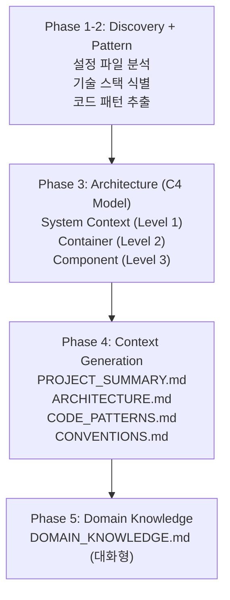

# /onboard - 프로젝트 온보딩

> **프로젝트 분석 및 컨텍스트 문서 생성**

---

## Data Flow Contract

### Input (스킬 간 데이터 수신)

| 소스 | 데이터 | 용도 |
|------|--------|------|
| 없음 | 프로젝트 소스코드 | 최초 분석 |

### Output (스킬 간 데이터 전달)

| 단계 | 산출물 | 다음 스킬 Input |
|------|--------|----------------|
| Quick | `.claude/project-context/PROJECT_SUMMARY.md` | `/plan` |
| Full | `.claude/project-context/*.md` (5개) | 모든 스킬 |
| 규칙 | `.claude/memory/PROJECT_RULES.md` | 모든 코드 작성 |

### State Update

- `.claude/project-context/` - 컨텍스트 문서
- `.claude/memory/PROJECT_RULES.md` - 프로젝트 규칙
- `.claude-state/checkpoint.json` - 온보딩 상태

---

## 사용법

```bash
/onboard                   # 전체 온보딩 (5개 문서)
/onboard --quick           # 빠른 온보딩 (1개 문서)
/onboard --skip-domain     # 도메인 인터뷰 생략
/onboard --phase 3         # 특정 Phase만
```

---

## 에이전트 호출 (필수)

> **⚠️ 이 스킬이 로드되면 아래 지침을 따라 Task 도구를 호출하세요.**

### --quick 모드

```python
Task(
    subagent_type="Explore",
    description="프로젝트 탐색 및 기술 스택 분석",
    prompt="... (references/quick.md 참조)"
)
```

**산출물 필수**: `.claude/project-context/PROJECT_SUMMARY.md`

### --full 모드 (Phase 3-4)

**Routing**: `references/project-onboarding.md` 참조

```python
Task(
    subagent_type="calab-plugin:project-onboarder",
    description="프로젝트 온보딩 및 컨텍스트 생성",
    prompt="... (references/project-onboarding.md 참조)"
)
```

**산출물 필수**:
- `.claude/project-context/PROJECT_SUMMARY.md`
- `.claude/project-context/ARCHITECTURE.md`
- `.claude/project-context/CODE_PATTERNS.md`
- `.claude/project-context/CONVENTIONS.md`
- `.claude/memory/PROJECT_RULES.md`

---

## 온보딩 프로세스



---

## Quick vs Full 비교

| 항목 | Quick | Full |
|------|-------|------|
| 시간 | ~1분 | ~10분 |
| 문서 | 1개 | 5개 |
| C4 다이어그램 | 없음 | 있음 |
| 도메인 지식 | 없음 | 있음 |

---

## 출력 문서

```
.claude/project-context/
├── PROJECT_SUMMARY.md      # 프로젝트 요약
├── ARCHITECTURE.md         # 아키텍처 (C4)
├── CODE_PATTERNS.md        # 코드 패턴
├── CONVENTIONS.md          # 컨벤션
└── DOMAIN_KNOWLEDGE.md     # 도메인 지식

.claude/memory/
└── PROJECT_RULES.md        # 프로젝트 규칙
```

---

## 레퍼런스 라우팅

| 옵션 | 참조 파일 |
|------|----------|
| `--quick` | `references/quick.md` |
| `--full` | `references/project-onboarding.md` |
| `--phase 1-2` | `references/phases/01-discovery.md` |
| `--phase 3` | `references/phases/02-architecture.md` |
| `--phase 4` | `references/phases/03-context-gen.md` |
| `--phase 5` | `references/phases/04-domain.md` |

---

## 다음 단계 선택 (필수)

| 완료 후 | 권장 |
|--------|------|
| Quick 완료 | `/plan` |
| Full 완료 | `/plan` |
| 컨텍스트 확인 | `Read .claude/project-context/` |

> **⚠️ 작업 완료 후 반드시 AskUserQuestion 호출**
>
> 온보딩이 완료되면 현재 상황을 분석하여 AskUserQuestion으로 다음 단계 선택지를 제시하세요.
> - 프로젝트 분석 결과 요약
> - 개발 시작 옵션 (권장 표시)
> - Full 온보딩 확장 옵션 (Quick인 경우)
> - 문제 해결 옵션
> - 종료 옵션
