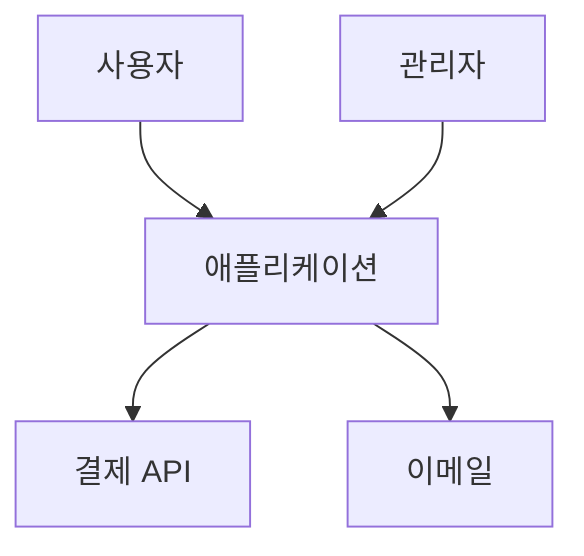
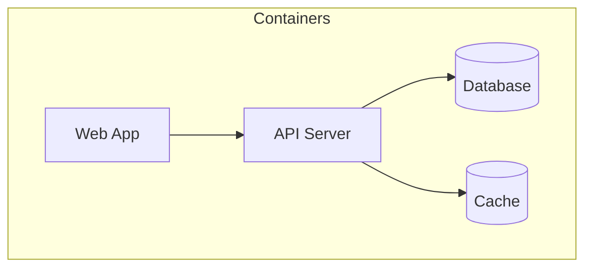

# Phase 3: Architecture Analysis

> **C4 Model 기반 아키텍처 분석**

## C4 Model 레벨

### Level 1: System Context
- 사용자 유형 (일반, 관리자, API 소비자)
- 외부 시스템 (결제, 이메일, OAuth)



### Level 2: Container Diagram
- 웹 애플리케이션 (Next.js, React SPA)
- API 서버 (Express, NestJS)
- 데이터베이스
- 캐시
- 메시지 큐
- CDN



### Level 3: Component Diagram
- Presentation Layer: Pages, Components, Layouts
- Application Layer: Services, UseCases, Handlers
- Domain Layer: Entities, ValueObjects, DomainServices
- Infrastructure Layer: Repositories, External APIs, Adapters

## 의존성 분석

### 올바른 방향
```
Presentation → Application → Domain ← Infrastructure
```

### 순환 의존성 검사
```bash
npx madge --circular src/
```

## 출력
- ARCHITECTURE.md 초안 데이터
