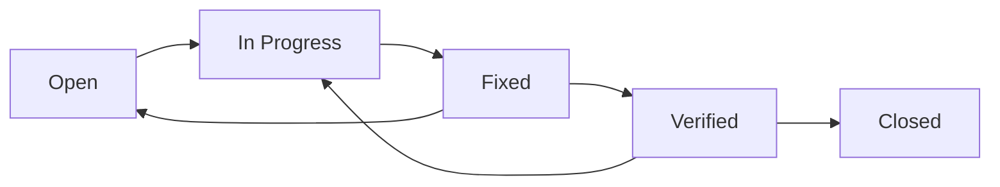

# QA Testing Best Practices

## 효과적인 프론트엔드 QA 가이드

---

## 1. QA 프로세스 원칙

### 1.1 7단계 QA 프로세스


### 1.2 테스트 피라미드

```
        /\
       /E2E\        ← 10% - 사용자 시나리오 (MCP Puppeteer)
      /------\
     / Integr \     ← 20% - API 연동
    /----------\
   /    Unit    \   ← 70% - 개별 함수
  /--------------\
```

**권장 비율:**
- Unit Tests: 70%
- Integration Tests: 20%
- E2E Tests: 10%

### 1.3 Risk-based Testing

| 리스크 레벨 | 테스트 범위 | 예시 |
|-------------|------------|------|
| 🔴 Critical | 전 시나리오 | 결제, 인증 |
| 🟠 High | 주요 시나리오 | 검색, 장바구니 |
| 🟡 Medium | 기본 시나리오 | 설정, 프로필 |
| ⚪ Low | 스모크 테스트 | 도움말, 정보 |

---

## 2. 테스트 계획 수립

### 2.1 좋은 테스트 계획

```markdown
✅ 좋은 계획
- 명확한 테스트 범위 (In/Out Scope)
- 구체적인 성공 기준
- 우선순위 기반 케이스 분류
- 리스크 대응 방안
- 일정 및 리소스 계획

❌ 나쁜 계획
- "모든 기능 테스트" (범위 불명확)
- "버그 없어야 함" (성공 기준 모호)
- 우선순위 없는 케이스 나열
- 리스크 미고려
- 일정 없음
```

### 2.2 테스트 범위 정의

**In-Scope 체크리스트:**
```
□ 사용자 대면 모든 페이지
□ 폼 유효성 검사
□ 네비게이션 흐름
□ 에러 처리
□ 반응형 (선택)
```

**Out-Scope 명시:**
```
□ 관리자 기능 (별도 QA)
□ 퍼포먼스 테스트
□ 보안 테스트
□ 접근성 테스트
```

### 2.3 성공 기준 설정

| 우선순위 | 통과율 목표 | 최소 통과율 |
|----------|------------|------------|
| P0 | 100% | 100% |
| P1 | 95% | 90% |
| P2 | 90% | 80% |

**버그 기준:**
| 심각도 | 릴리스 조건 |
|--------|------------|
| Critical | 0개 |
| Major | 모두 해결 |
| Minor | 문서화 |

---

## 3. 테스트 케이스 설계

### 3.1 Acceptance Criteria 형식

**Given-When-Then:**

```gherkin
Feature: 로그인
  Scenario: 정상 로그인
    Given 사용자가 로그인 페이지에 있음
    When 올바른 이메일과 비밀번호 입력
    And 로그인 버튼 클릭
    Then 대시보드로 이동
    And 사용자 이름이 표시됨
```

### 3.2 테스트 케이스 유형

**1. Happy Path (정상 흐름)**
```markdown
TC-001: 정상 로그인
- 올바른 자격 증명 → 성공
```

**2. Edge Case (경계값)**
```markdown
TC-002: 빈 이메일
TC-003: 최대 길이 초과
TC-004: 특수문자만
```

**3. Error Case (오류 상황)**
```markdown
TC-005: 잘못된 비밀번호
TC-006: 존재하지 않는 계정
TC-007: 네트워크 오류
```

**4. Negative Test (부정 테스트)**
```markdown
TC-008: SQL Injection 시도
TC-009: XSS 시도
```

### 3.3 테스트 케이스 템플릿

| ID | 기능 | 시나리오 | 우선순위 | 사전조건 | 단계 | 기대결과 |
|----|------|----------|----------|----------|------|----------|
| TC-001 | 로그인 | 정상 | P0 | 유효 계정 | 1.이메일 2.비밀번호 3.클릭 | 대시보드 |

---

## 4. MCP Puppeteer 테스트 패턴

### 4.1 기본 패턴

**페이지 로드:**
```javascript
// 이동
puppeteer_navigate({ url: "http://localhost:3000" })

// 스크린샷
puppeteer_screenshot({ name: "page-loaded" })
```

**폼 입력:**
```javascript
// 텍스트 입력
puppeteer_fill({ selector: "#email", value: "test@example.com" })

// 버튼 클릭
puppeteer_click({ selector: "button[type='submit']" })
```

**검증:**
```javascript
// JavaScript 실행
puppeteer_evaluate({
  script: "document.querySelector('.message').innerText"
})
```

### 4.2 셀렉터 전략

**우선순위:**
1. `data-testid` (가장 안정적)
2. `id` (고유한 경우)
3. `name` (폼 요소)
4. CSS Selector (구조 기반)

**좋은 셀렉터:**
```javascript
// ✅ 좋음: 테스트 전용 속성
"[data-testid='login-button']"

// ✅ 좋음: 고유 ID
"#submit-btn"

// ⚠️ 주의: 클래스 (변경 가능)
".btn-primary"

// ❌ 나쁨: 위치 기반 (깨지기 쉬움)
"div > div:nth-child(2) > button"
```

### 4.3 대기 전략

**명시적 대기:**
```javascript
puppeteer_evaluate({
  script: `
    return new Promise((resolve) => {
      const check = setInterval(() => {
        const el = document.querySelector('#target');
        if (el) {
          clearInterval(check);
          resolve('found');
        }
      }, 100);
      setTimeout(() => {
        clearInterval(check);
        resolve('timeout');
      }, 5000);
    });
  `
})
```

### 4.4 스크린샷 전략

**캡처 시점:**
```
□ 테스트 시작 (초기 상태)
□ 주요 액션 후 (상태 변화)
□ 검증 시점 (결과 확인)
□ 에러 발생 시 (디버깅용)
```

**네이밍 규칙:**
```
{TC-ID}-{step}-{description}.png
예: TC-001-step3-after-login.png
```

---

## 5. 결함 관리

### 5.1 버그 심각도 분류

| 심각도 | 기준 | 예시 | 대응 |
|--------|------|------|------|
| 🔴 Critical | 시스템 장애 | 서버 크래시, 데이터 손실 | 즉시 수정 |
| 🟠 Major | 핵심 기능 불가 | 로그인 실패, 결제 오류 | 24시간 내 |
| 🟡 Minor | 불편하지만 동작 | UI 깨짐, 느린 응답 | 다음 릴리스 |
| ⚪ Trivial | 사소한 이슈 | 오타, 정렬 | 백로그 |

### 5.2 좋은 버그 리포트

```markdown
✅ 좋은 리포트

# BUG-001: 로그인 후 리다이렉트 실패

## 요약
로그인 성공 후 대시보드로 이동하지 않고 로그인 페이지에 머무름

## 심각도: Major

## 재현 단계
1. http://localhost:3000/login 접속
2. 이메일: test@example.com 입력
3. 비밀번호: password123 입력
4. 로그인 버튼 클릭

## 기대 결과
- /dashboard로 리다이렉트
- 사용자 이름 표시

## 실제 결과
- /login에 그대로 머무름
- 에러 메시지 없음

## 환경
- 브라우저: Chrome 120
- OS: macOS 14

## 스크린샷
[첨부]

## 추가 정보
- 콘솔에 401 에러 발생
- 네트워크 탭에서 /api/auth 실패 확인
```

```markdown
❌ 나쁜 리포트

제목: 로그인 안됨
내용: 로그인이 안됩니다. 확인 부탁드립니다.
```

### 5.3 버그 생명주기



---

## 6. 보고서 작성

### 6.1 효과적인 보고서 구조

```markdown
1. 요약 (Executive Summary)
   - 1페이지로 전체 결과 요약
   - 핵심 숫자와 권장 사항

2. 상세 결과
   - 통과/실패 테스트 목록
   - 우선순위별/기능별 분류

3. 버그 보고서
   - 심각도별 분류
   - 각 버그 상세 설명

4. 권장 사항
   - 필수 조치 (릴리스 전)
   - 권장 조치 (릴리스 후)

5. 스크린샷 증거
   - 주요 화면
   - 버그 증거
```

### 6.2 보고서 품질 체크리스트

```
□ 모든 테스트 케이스 결과 포함
□ 통계가 정확함
□ 버그마다 재현 단계 있음
□ 스크린샷 첨부
□ 권장 사항 명확
□ 릴리스 권장 여부 명시
```

---

## 7. 회귀 테스트

### 7.1 회귀 테스트 시점

```
□ 버그 수정 후
□ 새 기능 추가 후
□ 리팩토링 후
□ 라이브러리 업데이트 후
□ 릴리스 전
```

### 7.2 회귀 테스트 범위

```
1단계: 수정된 기능 직접 테스트
2단계: 관련 기능 테스트
3단계: P0 전체 스모크 테스트
```

### 7.3 효율적인 회귀 테스트

```markdown
## 전략
1. 영향 분석: 변경으로 영향받는 기능 식별
2. 우선순위: P0 → 변경 관련 → P1
3. 자동화: 반복 테스트 자동화

## 시간이 부족할 때
- P0 스모크 테스트만
- 변경 관련 기능만
- 높은 리스크 기능만
```

---

## 8. 지속적 개선

### 8.1 QA 메트릭

| 메트릭 | 계산 | 목표 |
|--------|------|------|
| 테스트 통과율 | (통과/전체) × 100 | 95%+ |
| 버그 발견율 | 버그/테스트케이스 | 낮을수록 좋음 |
| 버그 재발률 | 재발버그/수정버그 | 5% 이하 |
| 테스트 커버리지 | 테스트된기능/전체기능 | 80%+ |

### 8.2 프로세스 개선

```markdown
## 테스트 후 회고
1. 무엇이 잘 되었나?
2. 무엇이 어려웠나?
3. 놓친 버그가 있었나?
4. 다음에 개선할 점은?

## 액션 아이템
- [ ] 테스트 케이스 업데이트
- [ ] 새 시나리오 추가
- [ ] 자동화 확대
```

---

## 9. 금지 사항

### 9.1 QA 안티패턴

```markdown
❌ 금지

1. 테스트 없이 통과 처리
   - 실제 테스트 없이 "통과" 마킹

2. 버그 무시
   - "사소한 거라서" 기록 안 함

3. 스크린샷 누락
   - 증거 없이 결과만 기록

4. 불완전한 재현 단계
   - "로그인하면 에러남"

5. 임의 종료
   - 100% 완료 전 QA 종료

6. 환경 미확인
   - 서버 상태 확인 없이 테스트

7. 기준 없는 판정
   - 주관적인 통과/실패 결정
```

### 9.2 좋은 QA 습관

```markdown
✅ 권장

1. 매 테스트마다 스크린샷
2. 버그는 무조건 기록
3. 재현 단계는 상세히
4. 환경 먼저 확인
5. 100% 완료까지 진행
6. 객관적 기준으로 판정
7. 증거 기반 보고
```

---

## 10. QA 체크리스트

### 10.1 QA 시작 전

```
□ QA 계획서 작성 완료
□ 테스트 케이스 준비 완료
□ 테스트 환경 확인 (서버 실행)
□ 테스트 데이터 준비
□ MCP Puppeteer 연결 확인
□ 스크린샷 폴더 생성
```

### 10.2 QA 진행 중

```
□ 각 테스트 스크린샷 캡처
□ 실패 시 버그 즉시 기록
□ 진행 상태 주기적 업데이트
□ 블로커 발생 시 기록
```

### 10.3 QA 완료 후

```
□ 모든 테스트 완료 확인
□ 모든 버그 기록 확인
□ 보고서 작성 완료
□ 스크린샷 정리
□ 릴리스 권장 여부 명시
□ 다음 단계 권장 사항
```

---

## 참조

- `skills/qa-testing/SKILL.md` - QA 스킬
- `commands/qa.md` - QA 시작
- `commands/qa-run.md` - 테스트 실행
- `commands/qa-report.md` - 보고서 생성
- `templates/qa-plan-template.md` - 계획서 템플릿
- `templates/qa-report-template.md` - 보고서 템플릿
