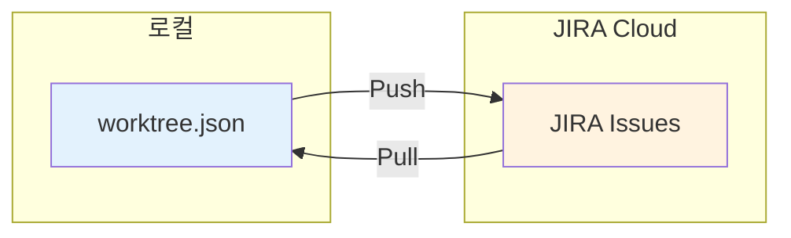

# /jira-sync

Worktree와 JIRA 간 양방향 동기화를 수행합니다.

## 사용법

```bash
/jira-sync                  # 양방향 동기화 (충돌 시 확인)
/jira-sync --prefer-jira    # 충돌 시 JIRA 우선
/jira-sync --prefer-worktree # 충돌 시 Worktree 우선
```

## 동기화 흐름



## 실행 프로토콜

### Step 1: 양쪽 상태 수집

```python
# Worktree 상태
worktree = load_worktree()
worktree_tasks = extract_all_tasks(worktree)

# JIRA 상태
jira_issues = {}
for worktree_id, jira_key in mapping['mappings'].items():
    issue = connector.get_issue(jira_key)
    jira_issues[jira_key] = issue
```

### Step 2: 변경 감지 및 충돌 확인

```python
changes = []
conflicts = []

for task_id, task in worktree_tasks.items():
    jira_key = mapping['mappings'].get(task_id)

    if not jira_key:
        # 새 항목 - Push 필요
        changes.append({'action': 'create', 'source': 'worktree', 'task': task})
        continue

    jira_issue = jira_issues.get(jira_key)
    jira_status = jira_issue['fields']['status']['name']
    worktree_status = task['status']

    # 상태 비교
    expected_jira = status_mapping.get(worktree_status)

    if jira_status != expected_jira:
        if task.get('last_sync') and jira_issue.get('updated') > task['last_sync']:
            # JIRA가 더 최신
            changes.append({'action': 'pull', 'task_id': task_id, 'jira_key': jira_key})
        elif task.get('updated') and task['updated'] > mapping.get('last_sync'):
            # Worktree가 더 최신
            changes.append({'action': 'push', 'task_id': task_id, 'jira_key': jira_key})
        else:
            # 충돌
            conflicts.append({
                'task_id': task_id,
                'jira_key': jira_key,
                'worktree_status': worktree_status,
                'jira_status': jira_status
            })
```

### Step 3: 충돌 해결

```
============================================
 충돌 감지: 2건
============================================

 1. TASK-003 (AUTH-104)
    Worktree: in_progress
    JIRA: Done

 2. TASK-007 (AUTH-108)
    Worktree: done
    JIRA: In Progress

 해결 방법 선택:
 [J] JIRA 우선 - JIRA 상태로 Worktree 업데이트
 [W] Worktree 우선 - Worktree 상태로 JIRA 업데이트
 [S] 개별 선택 - 각 충돌마다 확인

============================================
```

### Step 4: 동기화 실행

```python
# Push (Worktree → JIRA)
for change in changes:
    if change['action'] == 'push':
        connector.transition_issue(change['jira_key'], new_status)

# Pull (JIRA → Worktree)
for change in changes:
    if change['action'] == 'pull':
        task['status'] = reverse_status_mapping[jira_status]

# 새 항목 생성
for change in changes:
    if change['action'] == 'create':
        result = connector.create_issue(...)
        mapping['mappings'][task_id] = result['key']
```

### Step 5: 결과 저장

```python
save_worktree(worktree)
save_mapping(mapping)
```

## 출력 형식

```
============================================
 JIRA 양방향 동기화
============================================

 동기화 결과:

 Push (Worktree → JIRA):
 ✅ TASK-001 → AUTH-102 (In Progress)
 ✅ TASK-004 → AUTH-106 (Done)

 Pull (JIRA → Worktree):
 ✅ AUTH-103 → TASK-002 (done)
 ✅ AUTH-107 → TASK-006 (blocked)

 생성:
 ✅ TASK-008 → AUTH-110 (새로 생성)

 충돌 해결:
 🔄 TASK-003: JIRA 우선 적용 (Done)

 요약:
 • Push: 2개
 • Pull: 2개
 • 생성: 1개
 • 충돌 해결: 1개

 마지막 동기화: 2025-12-30 10:30:00

============================================
```

## 자동 동기화 설정

`jira_config.json`에서 자동 동기화 활성화:

```json
{
  "jira": {
    "auto_sync": {
      "enabled": true,
      "on_task_start": true,
      "on_task_done": true,
      "on_blocker": true
    }
  }
}
```

## 연계 명령어

- `/jira-push` - 단방향 Push
- `/jira-pull` - 단방향 Pull
- `/jira-status` - 동기화 상태 확인
