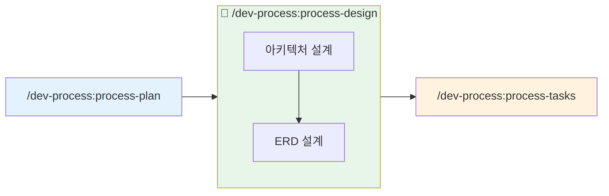
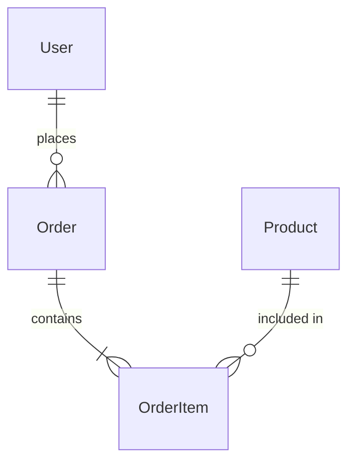

# 설계 (Design)

## 목적

PRD를 기반으로 시스템 아키텍처를 설계하고 데이터 모델을 정의합니다.

## 폴더 구조

```
.claude/docs/
├── active/                          ← 진행 중인 기능
│   └── {feature-name}/              ← 기능별 폴더 (/dev-process:process-plan에서 생성됨)
│       ├── 01-brainstorm.md         ← /dev-process:process-plan에서 생성
│       ├── 02-prd.md                ← /dev-process:process-plan에서 생성
│       ├── 03-architecture.md       ← 이 명령어에서 생성
│       ├── 04-erd.md                ← 이 명령어에서 생성
│       ├── 05-tasks.md              ← /dev-process:process-tasks에서 생성
│       └── qa/                      ← /qa에서 생성
│
└── complete/                        ← worktree 완료 시 자동 이동
    └── {완료된-기능}/
```

## 워크플로우



**자동 연계:**
- `/dev-process:process-plan`에서 생성된 PRD 자동 참조
- 완료 후 `/dev-process:process-tasks`로 자연스럽게 이어짐

## 옵션

| 옵션 | 설명 |
|------|------|
| (기본) | architecture + erd 순차 실행 |
| `--arch` | 아키텍처 설계만 실행 |
| `--erd` | ERD 설계만 실행 |

## 실행 절차

### Step 1: 옵션 확인

$ARGUMENTS에서 옵션 확인:
- `--arch`: Phase 1만 실행
- `--erd`: Phase 2만 실행
- 옵션 없음: Phase 1 → Phase 2 순차 실행

### Step 2: 기능 폴더 확인

`.claude/memory/CURRENT_CONTEXT.md`에서 현재 작업 중인 기능 확인:

```
현재 기능: {feature-name}
작업 폴더: .claude/docs/active/{feature-name}/
```

**⚠️ 주의**: `/dev-process:process-plan`이 먼저 실행되어 있어야 합니다!

### Step 3: 컨텍스트 로드

```
1. .claude/memory/CURRENT_CONTEXT.md - 현재 작업 상태
2. .claude/docs/active/{feature-name}/02-prd.md - PRD 문서
3. .claude/memory/TECH_STACK.md - 기술 스택
4. best-practices/ - 베스트 프랙티스
```


## Phase 2: ERD 설계

### 2.1 엔티티 식별

PRD의 기능 요구사항에서 엔티티 추출

### 2.2 관계 정의



### 2.3 베스트 프랙티스 적용

`best-practices/database.md` 규칙 (architecture 플러그인):

- **필수 컬럼**: id (UUID), created_at, updated_at, deleted_at
- **네이밍**: snake_case, 복수형 테이블명
- **인덱스**: FK, 검색 컬럼에 인덱스
- **정규화**: 최소 3NF 적용

### 2.4 ERD 문서 작성

`.claude/docs/active/{feature-name}/04-erd.md` 생성 (Mermaid ERD + 테이블 정의 + Prisma 스키마)
