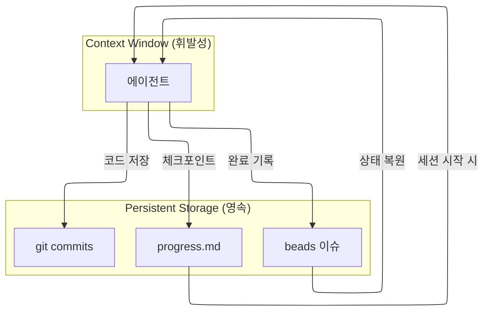

# 컨텍스트 관리 가이드

이 가이드는 에이전트가 컨텍스트 한계를 극복하고 무제한 동작할 수 있도록 하는 전략을 설명합니다.

> **핵심 원칙**: 컨텍스트는 휘발성 → 중요 정보는 파일에 저장

## 문제: 서브에이전트 컨텍스트 한계

Claude Code의 서브에이전트는 **auto compact를 지원하지 않습니다**.
컨텍스트가 가득 차면 에이전트가 강제 종료됩니다.

| 구분 | 메인 에이전트 | 서브에이전트 |
|------|-------------|-------------|
| Auto Compact | ✅ 자동 | ❌ 미지원 |
| 컨텍스트 한계 시 | 자동 요약 | **강제 종료** |

## 해결: 파일 시스템 기반 상태 관리

### 아키텍처



## 에이전트 시작 프로토콜

모든 에이전트는 작업 시작 전 다음 단계를 수행합니다:

### 필수 단계

```bash
# 1. 이슈 상태 확인
bd show <issue-id>

# 2. Epic 진행 히스토리 확인 (Epic이 있는 경우)
bd comments <epic-id>

# 3. 기존 산출물 확인
ls docs/{앱명}/{기능명}/ 2>/dev/null

# 4. Progress 파일 확인 (있는 경우)
cat .dev/progress/<epic-id>.md 2>/dev/null
```

### 시작 프로토콜 목적

1. **상태 복원**: 이전 세션에서 중단된 지점 파악
2. **중복 방지**: 이미 완료된 작업 재수행 방지
3. **컨텍스트 효율**: 필요한 정보만 로드

## 체크포인트 시스템

### 체크포인트란?

에이전트가 작업 중 주기적으로 진행 상태를 파일에 저장하는 것.
컨텍스트 한계로 종료되어도 다음 에이전트가 이어서 작업 가능.

### 체크포인트 타이밍

| 타이밍 | 저장 위치 |
|--------|----------|
| 분석 완료 | beads 코멘트 |
| 주요 단계 완료 | progress.md |
| 파일 생성/수정 | git commit |
| 작업 완료 | beads close |

### 체크포인트 코멘트 형식

```bash
# beads 코멘트로 체크포인트 기록
bd comments add <epic-id> "[Checkpoint] <에이전트명> <진행률>% - <현재상태>"
```

예시:
```bash
bd comments add bd-epic-123 "[Checkpoint] Architect 50% - 도메인 모델 완료, API 설계 시작"
bd comments add bd-epic-123 "[Checkpoint] Coder 30% - UserService 구현 중"
bd comments add bd-epic-123 "[Checkpoint] Tester 80% - 단위 테스트 완료, 통합 테스트 작성 중"
```

## Progress 파일

### 파일 위치

```
.dev/progress/<epic-id>.md
```

### 파일 형식

```markdown
# Progress: <Epic 제목>

## 메타데이터
| 항목 | 값 |
|------|-----|
| Epic ID | bd-xxx |
| 시작일 | YYYY-MM-DD |
| 최종 업데이트 | YYYY-MM-DD HH:MM |

## 현재 상태
- **완료**: 분석, 설계
- **진행중**: 구현 (UserService 50%)
- **대기**: 테스트, 리뷰

## 최근 작업 (최신 3건)
1. [YYYY-MM-DD HH:MM] Architect - design.md 작성 완료
2. [YYYY-MM-DD HH:MM] Coder - UserRepository 구현 완료
3. [YYYY-MM-DD HH:MM] Coder - UserService 구현 중 (CreateUser 완료)

## 다음 세션 지침
1. UserService.UpdateUser() 구현 재개
2. DeleteUser() 구현
3. 테스트 작성 (Tester)

## 알려진 이슈
- [ ] ErrorHandler 패턴 결정 필요
```

### Progress 파일 업데이트 규칙

1. **작업 시작 시**: 현재 상태 읽기
2. **주요 단계 완료 시**: 상태 업데이트
3. **작업 종료 시**: 다음 세션 지침 작성

## 에이전트 종료 프로토콜

작업 완료 또는 중단 시:

### 정상 완료
```bash
# 1. 이슈 업데이트
bd update <issue-id> --description "완료 요약"
bd close <issue-id>

# 2. 체크포인트 기록
bd comments add <epic-id> "[<에이전트명>] 완료 - <산출물>"

# 3. Progress 업데이트 (Planner가 수행)
```

### 중단 시 (컨텍스트 부족 예상)
```bash
# 1. 현재 상태 저장
bd comments add <epic-id> "[Checkpoint] <에이전트명> <진행률>% - <현재상태>, 다음: <남은작업>"

# 2. 작업 중인 파일 저장
git add -A && git commit -m "WIP: <작업내용>"

# 3. Planner에게 보고
```

## 토큰 효율화 전략

### 1. 이슈 ID만 전달
```
# ❌ 비효율
"UserService를 구현하세요. 요구사항은 다음과 같습니다: ..."

# ✅ 효율
"bd-abc123 작업 수행. bd show로 상세 확인."
```

### 2. 상세는 파일에, 반환은 ID만
```
# 에이전트 → Planner
완료: bd-abc123 (design.md)

# Planner → Main Thread
완료: bd-epic-123 | 상태: closed | 상세: bd show bd-epic-123
```

### 3. 불필요한 파일 읽기 금지
- 전체 파일 대신 필요한 부분만 읽기
- 이미 분석한 파일 재분석 금지
- 산출물은 파일 경로로 참조

## 재개 워크플로우

### Planner의 재개 처리

```bash
# 1. Sub-task 상태 확인 (주요 판단 기준)
bd list --parent <epic-id>

# 2. Progress 파일 확인
cat .dev/progress/<epic-id>.md

# 3. 체크포인트 코멘트 확인
bd comments <epic-id>
```

### 재개 지점 결정

| 상태 | 재개 지점 |
|------|----------|
| Sub-task `in_progress` | 해당 에이전트부터 |
| Sub-task 모두 `open` | 처음부터 |
| Checkpoint 있음 | Checkpoint 이후부터 |
| Progress 파일 있음 | "다음 세션 지침" 참조 |

## 요약

1. **시작**: 이슈 + 코멘트 + Progress 확인
2. **진행**: 주요 단계마다 체크포인트 저장
3. **종료**: 상태 저장 + 다음 지침 작성
4. **재개**: 저장된 상태에서 이어서 작업

이 패턴을 따르면 컨텍스트 한계와 무관하게 작업 연속성이 보장됩니다.
