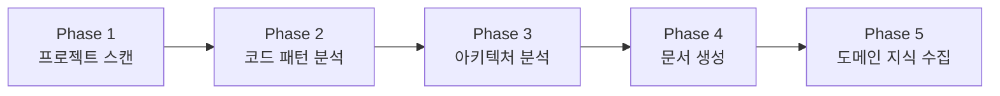

# Onboarding Plugin

> **프로젝트 분석 및 온보딩 자동화**: 5개 컨텍스트 문서 자동 생성

---

## 스킬 목록

| 상황 | 스킬 | 설명 |
|------|------|------|
| 기존 프로젝트 투입 | `/onboarding:start` | 5개 컨텍스트 문서 생성 |
| 빠른 파악 필요 | `/onboarding:quick` | 핵심만 빠른 분석 |
| 특정 영역 학습 | `/onboarding:learn [path]` | 영역별 심층 학습 |
| 코드 변경 후 동기화 | `/onboarding:refresh` | 문서 갱신 |
| 컨텍스트 확인 | `/onboarding:show` | 현재 컨텍스트 표시 |
| 도움말 | `/onboarding:help` | 플러그인 사용법 |

---

## 주요 기능 상세

### 프로젝트 온보딩

**5개 컨텍스트 문서 자동 생성:**

1. **PROJECT_SUMMARY.md**: 프로젝트 개요, 기술 스택, 환경 변수, 개발 명령어
2. **ARCHITECTURE.md**: C4 Model 기반 시스템/컨테이너/컴포넌트 다이어그램
3. **CODE_PATTERNS.md**: 컴포넌트, API, 훅, 에러 처리, 테스트 패턴
4. **CONVENTIONS.md**: 파일/코드 명명 규칙, Import 순서, 커밋 메시지, PR 규칙
5. **DOMAIN_KNOWLEDGE.md**: 비즈니스 도메인, 엔티티, 비즈니스 규칙, 용어 사전

### 분석 프로세스



**Phase 1: 프로젝트 스캔**
- 설정 파일 분석 (package.json, tsconfig.json, docker-compose.yml 등)
- 기술 스택 식별 (Frontend, Backend, Database, Infrastructure)
- 디렉토리 구조 매핑 (Feature-based, Layer-based, Domain-based)

**Phase 2: 코드 패턴 분석**
- 대표 파일 선정 (컴포넌트 3-5개, API 2-3개, 서비스 2-3개)
- 패턴 추출 (Props 정의, 상태 관리, 에러 처리, Import 순서)

**Phase 3: 아키텍처 분석 (C4 Model)**
- System Context (Level 1): 사용자, 외부 시스템, 데이터 흐름
- Container Diagram (Level 2): 웹앱, API 서버, DB, 캐시
- Component Diagram (Level 3): 레이어별 역할과 의존성

**Phase 4: 컨텍스트 문서 생성**
- 5개 문서 자동 생성
- Mermaid 다이어그램 포함

**Phase 5: 도메인 지식 수집**
- 인터뷰 형식으로 비즈니스 도메인 정보 수집
- 핵심 엔티티, 비즈니스 규칙, 용어 사전 정리

---

## 사용 예시

```bash
# 전체 분석
/onboarding:start

# 빠른 분석
/onboarding:quick

# 특정 영역 심층 학습
/onboarding:learn src/services

# 컨텍스트 확인
/onboarding:show

# 컨텍스트 갱신
/onboarding:refresh
```

---

## 자동 적용 기능 (패시브 스킬)

### `onboarding:project`

프로젝트 분석 관련 키워드가 감지되면 **자동으로 활성화**되어 온보딩을 지원합니다.

**활성화 키워드:**
- "프로젝트 분석", "코드 분석", "온보딩", "프로젝트 파악"
- "기존 프로젝트", "이어서 개발", "코드베이스 학습"
- "이 프로젝트 어떻게 되어있어?"

**자동 동작:**
- 세션 시작 시 `.claude/memory/` 폴더의 컨텍스트 문서 존재 여부 확인
- 문서가 없으면 `/onboarding:start` 또는 `/onboarding:quick` 안내
- 문서가 있으면 자동으로 컨텍스트 로드

---

## 문서 생성 위치

```
.claude/memory/
├── PROJECT_SUMMARY.md      # 프로젝트 개요
├── ARCHITECTURE.md         # 아키텍처 다이어그램
├── CODE_PATTERNS.md        # 코드 패턴
├── CONVENTIONS.md          # 코딩 컨벤션
└── DOMAIN_KNOWLEDGE.md     # 도메인 지식
```

---

## 포함 리소스

- **best-practices/**: project-onboarding.md
- **skills/**: start, quick, learn, refresh, show, help, project
