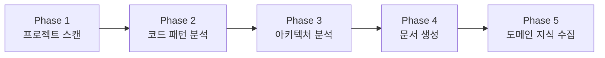

# Onboarding Plugin

> **프로젝트 분석 및 온보딩 자동화**: 5개 컨텍스트 문서 자동 생성

---

## 스킬 목록

| 상황 | 스킬 | 설명 |
|------|------|------|
| 기존 프로젝트 투입 | `/onboard` | 5개 컨텍스트 문서 생성 |
| 빠른 파악 필요 | `/onboard-quick` | 핵심만 빠른 분석 |
| 특정 영역 학습 | `/learn [path]` | 영역별 심층 학습 |
| 코드 변경 후 동기화 | `/context-refresh` | 문서 갱신 |
| 컨텍스트 확인 | `/context-show` | 현재 컨텍스트 표시 |
| 도움말 | `/help` | 플러그인 사용법 |

---

## 주요 기능 상세

### 프로젝트 온보딩

**5개 컨텍스트 문서 자동 생성:**

1. **PROJECT_SUMMARY.md**: 프로젝트 개요, 기술 스택, 환경 변수, 개발 명령어
2. **ARCHITECTURE.md**: C4 Model 기반 시스템/컨테이너/컴포넌트 다이어그램
3. **CODE_PATTERNS.md**: 컴포넌트, API, 훅, 에러 처리, 테스트 패턴
4. **CONVENTIONS.md**: 파일/코드 명명 규칙, Import 순서, 커밋 메시지, PR 규칙
5. **DOMAIN_KNOWLEDGE.md**: 비즈니스 도메인, 엔티티, 비즈니스 규칙, 용어 사전

### 분석 프로세스



**Phase 1: 프로젝트 스캔**
- 설정 파일 분석 (package.json, tsconfig.json, docker-compose.yml 등)
- 기술 스택 식별 (Frontend, Backend, Database, Infrastructure)
- 디렉토리 구조 매핑 (Feature-based, Layer-based, Domain-based)

**Phase 2: 코드 패턴 분석**
- 대표 파일 선정 (컴포넌트 3-5개, API 2-3개, 서비스 2-3개)
- 패턴 추출 (Props 정의, 상태 관리, 에러 처리, Import 순서)

**Phase 3: 아키텍처 분석 (C4 Model)**
- System Context (Level 1): 사용자, 외부 시스템, 데이터 흐름
- Container Diagram (Level 2): 웹앱, API 서버, DB, 캐시
- Component Diagram (Level 3): 레이어별 역할과 의존성

**Phase 4: 컨텍스트 문서 생성**
- 5개 문서 자동 생성
- Mermaid 다이어그램 포함

**Phase 5: 도메인 지식 수집**
- 인터뷰 형식으로 비즈니스 도메인 정보 수집
- 핵심 엔티티, 비즈니스 규칙, 용어 사전 정리

---

## 사용 예시

```bash
# 전체 분석 (5-10분 소요)
/onboard

# 빠른 분석 (1-2분 소요)
/onboard-quick

# 특정 영역 심층 학습
/learn src/services

# 컨텍스트 확인
/context-show

# 컨텍스트 갱신
/context-refresh
```

---

## 출력 예시

```
🔍 프로젝트 온보딩 시작...

══════════════════════════════════════════════════════════════
 Phase 1: 프로젝트 스캔
══════════════════════════════════════════════════════════════
✅ package.json 분석 완료
   - Framework: Next.js 14.1.0
   - Language: TypeScript 5.3.3
   - Database: PostgreSQL (Prisma 5.8.0)

✅ tsconfig.json 분석 완료
   - Path alias: @/* → src/*
   - Strict mode: enabled

✅ 디렉토리 구조 파악
   - 구조 유형: Feature-based (App Router)
   - 주요 폴더: app/, components/, lib/

══════════════════════════════════════════════════════════════
 Phase 2: 코드 패턴 분석
══════════════════════════════════════════════════════════════
✅ 컴포넌트 패턴 (5개 파일 분석)
   - Props: interface 사용
   - 스타일: Tailwind CSS + cn() 유틸
   - 상태: React Query + Zustand

✅ API 패턴 (3개 파일 분석)
   - 라우터: Next.js App Router API Routes
   - 검증: Zod
   - 응답: 표준화된 JSON 형식

══════════════════════════════════════════════════════════════
 Phase 4: 컨텍스트 문서 생성
══════════════════════════════════════════════════════════════
📄 PROJECT_SUMMARY.md 생성 완료 (2.3KB)
📄 ARCHITECTURE.md 생성 완료 (4.1KB)
📄 CODE_PATTERNS.md 생성 완료 (5.8KB)
📄 CONVENTIONS.md 생성 완료 (3.2KB)

══════════════════════════════════════════════════════════════
✅ 온보딩 완료!
══════════════════════════════════════════════════════════════

📁 생성된 컨텍스트 문서:
├── .claude/memory/PROJECT_SUMMARY.md
├── .claude/memory/ARCHITECTURE.md
├── .claude/memory/CODE_PATTERNS.md
├── .claude/memory/CONVENTIONS.md
└── .claude/memory/DOMAIN_KNOWLEDGE.md

💡 다음 단계:
   /process [아이디어]   → 새 기능 개발 시작
   /learn <path>        → 특정 영역 심층 학습
   /context-show        → 컨텍스트 확인
```

---

## 자동 적용 기능 (패시브 스킬)

| 스킬 | 활성화 조건 | 효과 |
|------|------------|------|
| `project-onboarding` | 프로젝트 분석 요청 시 | C4 Model 기반 아키텍처 문서화 |

---

## 문서 생성 위치

```
.claude/memory/
├── PROJECT_SUMMARY.md      # 프로젝트 개요
├── ARCHITECTURE.md         # 아키텍처 다이어그램
├── CODE_PATTERNS.md        # 코드 패턴
├── CONVENTIONS.md          # 코딩 컨벤션
└── DOMAIN_KNOWLEDGE.md     # 도메인 지식
```

---

## 포함 리소스

- **best-practices/**: project-onboarding.md
- **skills/**: onboard, onboard-quick, learn, context-refresh, context-show, help, project-onboarding
