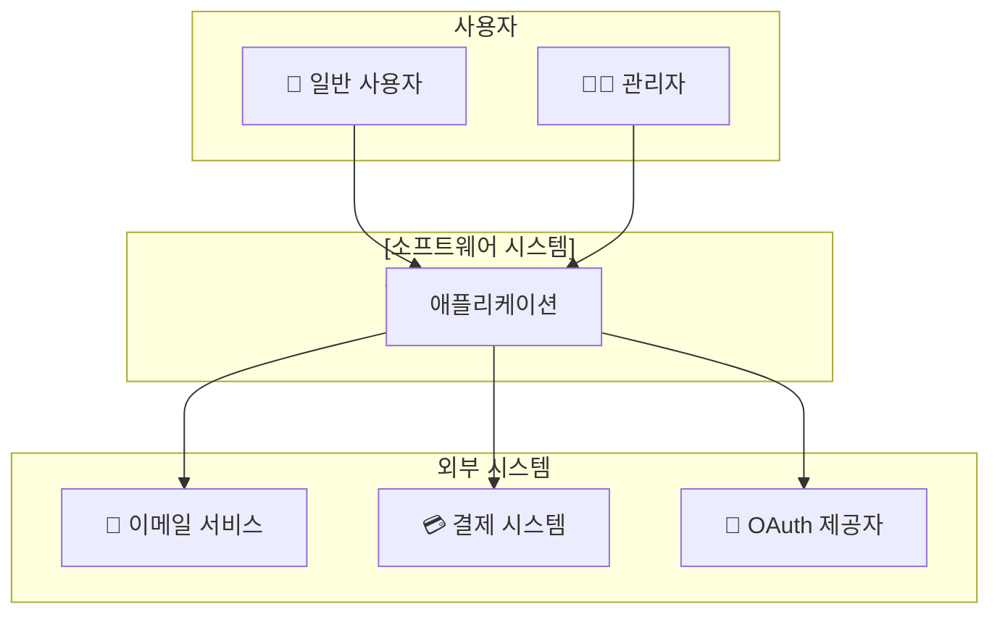
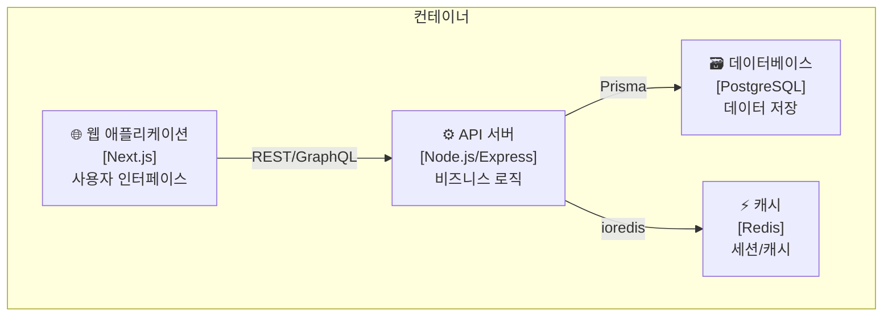
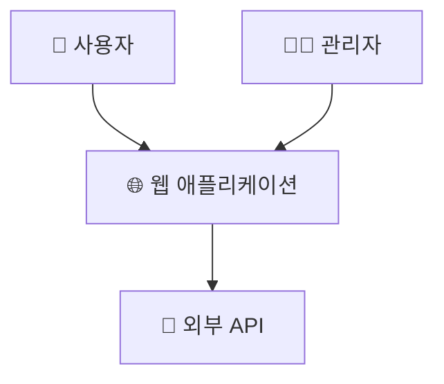
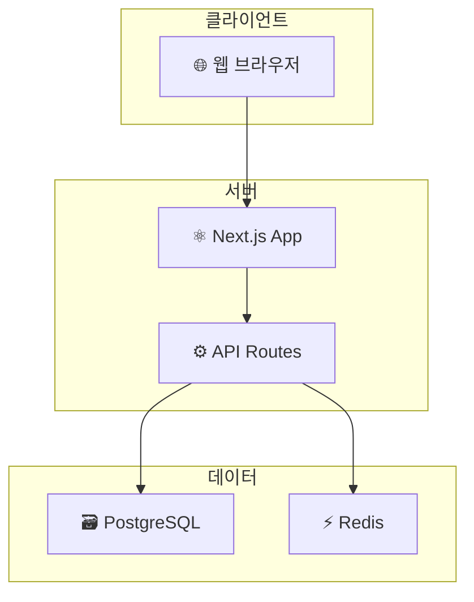
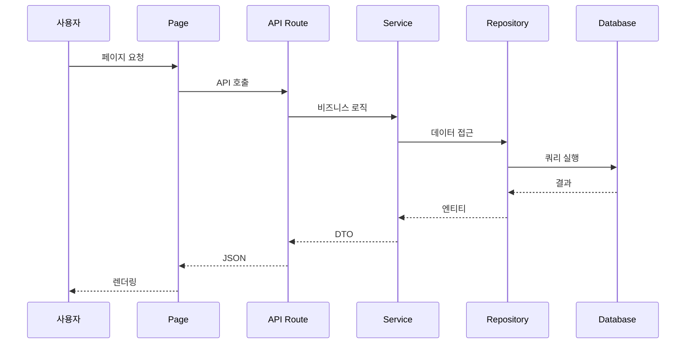
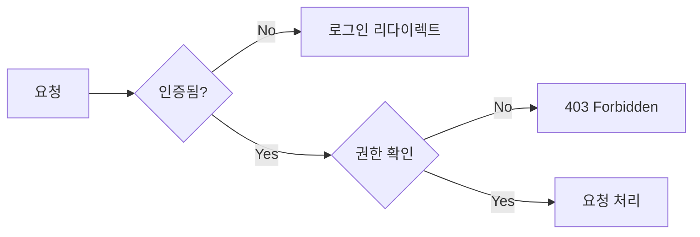

# /onboarding:onboard - 프로젝트 온보딩

## 설명

기존 프로젝트를 **체계적으로 분석**하여 AI가 효과적으로 개발을 이어나갈 수 있도록 컨텍스트 문서를 생성합니다.

**C4 Model 기반** 아키텍처 문서화와 **Docs-as-Code** 원칙을 적용합니다.

## 사용법

```bash
/onboard                 # 전체 온보딩 (5개 문서 생성)
/onboard --skip-domain   # 도메인 지식 단계 건너뛰기
```

---

## Phase 1: 프로젝트 스캔 (Discovery)

### 1.1 설정 파일 분석

**필수 분석 대상:**

| 파일 | 추출 정보 |
|------|----------|
| `package.json` | 기술 스택, 스크립트, 의존성 버전 |
| `tsconfig.json` | TypeScript 설정, Path alias |
| `.env.example` | 환경 변수 목록 |
| `docker-compose.yml` | 서비스 구성 |
| `prisma/schema.prisma` | DB 스키마, 엔티티 관계 |

**분석 명령어:**

```bash
# 프로젝트 루트 구조
ls -la

# 소스 디렉토리 구조 (3레벨까지)
find src -type d -maxdepth 3 | head -50

# 주요 설정 파일
cat package.json
cat tsconfig.json
```

### 1.2 기술 스택 식별

**분석 항목:**

```yaml
Frontend:
  - Framework: (React, Next.js, Vue, Angular)
  - State: (Redux, Zustand, Recoil, Context)
  - Styling: (CSS Modules, Tailwind, Styled-components)
  - Testing: (Jest, Vitest, RTL, Cypress)

Backend:
  - Runtime: (Node.js, Deno, Bun)
  - Framework: (Express, Fastify, NestJS, Hono)
  - ORM: (Prisma, TypeORM, Drizzle, Knex)
  - Auth: (NextAuth, Passport, JWT)

Database:
  - Primary: (PostgreSQL, MySQL, MongoDB)
  - Cache: (Redis, Memcached)
  - Search: (Elasticsearch, Algolia)

Infrastructure:
  - Container: (Docker, Podman)
  - CI/CD: (GitHub Actions, GitLab CI, Jenkins)
  - Cloud: (AWS, GCP, Azure, Vercel)
```

### 1.3 디렉토리 구조 매핑

**구조 유형 식별:**

| 패턴 | 특징 | 예시 |
|------|------|------|
| **Feature-based** | 기능별 폴더 | `features/auth/`, `features/user/` |
| **Layer-based** | 레이어별 폴더 | `controllers/`, `services/`, `repositories/` |
| **Domain-based** | 도메인별 폴더 | `domain/user/`, `domain/order/` |
| **Hybrid** | 혼합 구조 | `app/`, `lib/`, `components/` |

---

## Phase 2: 코드 패턴 분석 (Pattern Extraction)

### 2.1 대표 파일 선정

**분석할 파일 수:**

| 카테고리 | 파일 수 | 선정 기준 |
|----------|---------|----------|
| 컴포넌트 | 3-5개 | 가장 큰 파일, 재사용 컴포넌트 |
| API 라우트 | 2-3개 | CRUD 완비된 엔드포인트 |
| 서비스/유틸 | 2-3개 | 핵심 비즈니스 로직 |
| 타입 정의 | 1-2개 | 공통 타입, 엔티티 타입 |

### 2.2 패턴 추출 체크리스트

**컴포넌트 패턴:**

```typescript
// 추출할 패턴들
□ Props 정의 방식 (interface vs type)
□ 기본값 처리 (defaultProps vs 구조분해)
□ 상태 관리 (useState, useReducer, 외부 상태)
□ 부수효과 (useEffect 패턴)
□ 에러 바운더리 사용 여부
□ 메모이제이션 (useMemo, useCallback, React.memo)
□ 스타일링 방식
□ 테스트 패턴 (단위/통합)
```

**API 패턴:**

```typescript
// 추출할 패턴들
□ 라우터 구조 (Express, Fastify, Next.js API Routes)
□ 미들웨어 체인
□ 인증/인가 처리
□ 요청 검증 (Zod, Joi, class-validator)
□ 응답 형식 (표준화된 JSON 구조)
□ 에러 처리 (커스텀 에러 클래스)
□ 로깅 전략
□ 페이지네이션 패턴
```

**에러 처리 패턴:**

```typescript
// 추출할 패턴들
□ 커스텀 에러 클래스 존재 여부
□ 전역 에러 핸들러
□ 사용자 에러 vs 시스템 에러 구분
□ 에러 코드 체계
□ 로깅 레벨 (debug, info, warn, error)
```

### 2.3 Import 순서 분석

**표준 순서 추출:**

```typescript
// 1. 외부 라이브러리 (node_modules)
import React from 'react';
import { useQuery } from '@tanstack/react-query';

// 2. 내부 모듈 (절대 경로)
import { Button } from '@/components/ui/Button';
import { useAuth } from '@/hooks/useAuth';

// 3. 상대 경로 모듈
import { UserCard } from './UserCard';
import { formatDate } from '../utils';

// 4. 타입 (type-only imports)
import type { User } from '@/types';

// 5. 스타일
import styles from './styles.module.css';
```

---

## Phase 3: 아키텍처 분석 (C4 Model)

### 3.1 System Context (Level 1)

**분석 항목:**

```
┌─────────────────────────────────────────────────────────┐
│                    시스템 컨텍스트                        │
├─────────────────────────────────────────────────────────┤
│ 사용자 유형: (일반 사용자, 관리자, API 소비자)              │
│ 외부 시스템: (결제 API, 이메일 서비스, 소셜 로그인)         │
│ 데이터 흐름: (인바운드, 아웃바운드)                        │
└─────────────────────────────────────────────────────────┘
```

**Mermaid 다이어그램 생성:**



### 3.2 Container Diagram (Level 2)

**분석 항목:**

```
┌─────────────────────────────────────────────────────────┐
│                    컨테이너 다이어그램                     │
├─────────────────────────────────────────────────────────┤
│ 웹 애플리케이션: (Next.js, React SPA)                     │
│ API 서버: (Express, NestJS, Serverless)                  │
│ 데이터베이스: (PostgreSQL, MongoDB)                       │
│ 캐시: (Redis)                                           │
│ 메시지 큐: (RabbitMQ, SQS)                               │
│ CDN/스토리지: (S3, CloudFront)                           │
└─────────────────────────────────────────────────────────┘
```

**Mermaid 다이어그램:**



### 3.3 Component Diagram (Level 3)

**레이어별 분석:**

| 레이어 | 역할 | 주요 컴포넌트 |
|--------|------|-------------|
| **Presentation** | UI/UX | Pages, Components, Layouts |
| **Application** | 유스케이스 | Services, UseCases, Handlers |
| **Domain** | 비즈니스 규칙 | Entities, ValueObjects, DomainServices |
| **Infrastructure** | 외부 연동 | Repositories, ExternalAPIs, Adapters |

### 3.4 의존성 분석

**의존성 방향 검증:**

```
✅ 올바른 의존성: Presentation → Application → Domain ← Infrastructure
❌ 잘못된 의존성: Domain → Infrastructure (위반!)
```

**순환 의존성 탐지:**

```bash
# 순환 의존성 탐지 (madge 사용)
npx madge --circular src/

# Import 관계 시각화
npx madge --image graph.svg src/
```

---

## Phase 4: 컨텍스트 문서 생성

### 4.1 PROJECT_SUMMARY.md

**필수 섹션:**

```markdown
# 프로젝트 요약

## 개요
- **프로젝트명**:
- **설명**: 한 문장 설명
- **주요 기능**: 3-5개 핵심 기능

## 기술 스택

### Frontend
| 기술 | 버전 | 용도 |
|------|------|------|
| Next.js | 14.x | SSR/SSG 프레임워크 |
| React | 18.x | UI 라이브러리 |
| TypeScript | 5.x | 타입 시스템 |
| Tailwind CSS | 3.x | 스타일링 |
| React Query | 5.x | 서버 상태 관리 |

### Backend
| 기술 | 버전 | 용도 |
|------|------|------|
| Node.js | 20.x | 런타임 |
| Prisma | 5.x | ORM |
| PostgreSQL | 15.x | 데이터베이스 |

## 디렉토리 구조

```
src/
├── app/              # Next.js App Router
│   ├── (auth)/       # 인증 관련 라우트
│   ├── (dashboard)/  # 대시보드 라우트
│   └── api/          # API 라우트
├── components/       # 재사용 컴포넌트
│   ├── ui/           # 기본 UI 컴포넌트
│   └── features/     # 기능별 컴포넌트
├── lib/              # 유틸리티
│   ├── api/          # API 클라이언트
│   ├── hooks/        # 커스텀 훅
│   └── utils/        # 헬퍼 함수
├── types/            # 타입 정의
└── prisma/           # DB 스키마
```

## 개발 명령어

| 명령어 | 설명 |
|--------|------|
| `npm run dev` | 개발 서버 시작 (http://localhost:3000) |
| `npm run build` | 프로덕션 빌드 |
| `npm run test` | 테스트 실행 |
| `npm run lint` | 린트 검사 |
| `npm run db:push` | DB 스키마 동기화 |
| `npm run db:studio` | Prisma Studio 실행 |

## 환경 변수

| 변수명 | 설명 | 예시 |
|--------|------|------|
| `DATABASE_URL` | PostgreSQL 연결 문자열 | `postgresql://...` |
| `NEXTAUTH_SECRET` | NextAuth 시크릿 | 랜덤 문자열 |
| `NEXTAUTH_URL` | 앱 URL | `http://localhost:3000` |
```

### 4.2 ARCHITECTURE.md

**필수 섹션:**

```markdown
# 아키텍처 문서

## 시스템 개요 (C4 Level 1)



## 컨테이너 다이어그램 (C4 Level 2)



## 레이어 구조

### 프레젠테이션 레이어
- **역할**: UI 렌더링, 사용자 입력 처리
- **위치**: `src/app/`, `src/components/`
- **주요 패턴**: Server Components, Client Components

### 애플리케이션 레이어
- **역할**: 유스케이스 구현, 비즈니스 로직 조율
- **위치**: `src/lib/services/`, `src/app/api/`
- **주요 패턴**: Service Layer, CQRS

### 도메인 레이어
- **역할**: 핵심 비즈니스 규칙
- **위치**: `src/lib/domain/`, `prisma/schema.prisma`
- **주요 패턴**: Entity, Value Object, Domain Event

### 인프라 레이어
- **역할**: 외부 시스템 연동
- **위치**: `src/lib/infrastructure/`
- **주요 패턴**: Repository, Adapter

## 데이터 흐름



## 상태 관리

| 상태 유형 | 관리 방법 | 위치 |
|----------|----------|------|
| 서버 상태 | React Query | `src/lib/hooks/useXXX.ts` |
| 클라이언트 상태 | Zustand | `src/lib/stores/` |
| 폼 상태 | React Hook Form | 각 폼 컴포넌트 |
| URL 상태 | nuqs | 검색/필터 파라미터 |

## 인증/인가



## 아키텍처 결정 기록 (ADR)

### ADR-001: Next.js App Router 채택
- **상태**: 승인됨
- **컨텍스트**: SSR/SSG가 필요한 프로젝트
- **결정**: Pages Router 대신 App Router 사용
- **결과**: 더 나은 서버 컴포넌트 지원

### ADR-002: Prisma ORM 채택
- **상태**: 승인됨
- **컨텍스트**: TypeScript와의 타입 안전성 필요
- **결정**: TypeORM 대신 Prisma 사용
- **결과**: 자동 타입 생성, 마이그레이션 관리 용이
```

### 4.3 CODE_PATTERNS.md

**필수 섹션:**

```markdown
# 코드 패턴

## 컴포넌트 패턴

### 표준 컴포넌트 구조

```typescript
// 파일: src/components/features/UserCard.tsx

import { memo } from 'react';
import type { User } from '@/types';

// Props 인터페이스 (export for testing)
export interface UserCardProps {
  user: User;
  onEdit?: (id: string) => void;
  className?: string;
}

// 컴포넌트 정의
export const UserCard = memo(function UserCard({
  user,
  onEdit,
  className,
}: UserCardProps) {
  return (
    <div className={cn('rounded-lg border p-4', className)}>
      <h3>{user.name}</h3>
      <p>{user.email}</p>
      {onEdit && (
        <Button onClick={() => onEdit(user.id)}>편집</Button>
      )}
    </div>
  );
});
```

### 페이지 컴포넌트 구조

```typescript
// 파일: src/app/(dashboard)/users/page.tsx

import { Suspense } from 'react';
import { UserList } from '@/components/features/UserList';
import { UserListSkeleton } from '@/components/skeletons';

// 메타데이터
export const metadata = {
  title: '사용자 목록',
  description: '...',
};

// 서버 컴포넌트
export default async function UsersPage() {
  return (
    <main className="container py-8">
      <h1 className="text-2xl font-bold mb-6">사용자 목록</h1>
      <Suspense fallback={<UserListSkeleton />}>
        <UserList />
      </Suspense>
    </main>
  );
}
```

## API 패턴

### API Route 표준 구조

```typescript
// 파일: src/app/api/users/route.ts

import { NextRequest, NextResponse } from 'next/server';
import { z } from 'zod';
import { getServerSession } from 'next-auth';
import { authOptions } from '@/lib/auth';
import { userService } from '@/lib/services/user';
import { handleApiError } from '@/lib/utils/api';

// 요청 스키마
const createUserSchema = z.object({
  name: z.string().min(1).max(100),
  email: z.string().email(),
});

// GET /api/users
export async function GET(request: NextRequest) {
  try {
    const session = await getServerSession(authOptions);
    if (!session) {
      return NextResponse.json(
        { error: 'Unauthorized' },
        { status: 401 }
      );
    }

    const { searchParams } = new URL(request.url);
    const page = parseInt(searchParams.get('page') ?? '1');
    const limit = parseInt(searchParams.get('limit') ?? '10');

    const result = await userService.findAll({ page, limit });

    return NextResponse.json({
      data: result.users,
      meta: {
        page,
        limit,
        total: result.total,
        totalPages: Math.ceil(result.total / limit),
      },
    });
  } catch (error) {
    return handleApiError(error);
  }
}

// POST /api/users
export async function POST(request: NextRequest) {
  try {
    const body = await request.json();
    const validated = createUserSchema.parse(body);

    const user = await userService.create(validated);

    return NextResponse.json({ data: user }, { status: 201 });
  } catch (error) {
    return handleApiError(error);
  }
}
```

### 표준 응답 형식

```typescript
// 성공 응답
{
  "data": { ... },
  "meta": {
    "page": 1,
    "limit": 10,
    "total": 100
  }
}

// 에러 응답
{
  "error": {
    "code": "VALIDATION_ERROR",
    "message": "입력값이 올바르지 않습니다",
    "details": [
      { "field": "email", "message": "유효한 이메일을 입력하세요" }
    ]
  }
}
```

## 훅 패턴

### 데이터 페칭 훅

```typescript
// 파일: src/lib/hooks/useUsers.ts

import { useQuery, useMutation, useQueryClient } from '@tanstack/react-query';
import { userApi } from '@/lib/api/user';
import type { User, CreateUserInput } from '@/types';

// 쿼리 키 팩토리
export const userKeys = {
  all: ['users'] as const,
  lists: () => [...userKeys.all, 'list'] as const,
  list: (filters: Record<string, unknown>) => [...userKeys.lists(), filters] as const,
  details: () => [...userKeys.all, 'detail'] as const,
  detail: (id: string) => [...userKeys.details(), id] as const,
};

// 목록 조회 훅
export function useUsers(filters?: { page?: number; search?: string }) {
  return useQuery({
    queryKey: userKeys.list(filters ?? {}),
    queryFn: () => userApi.getAll(filters),
    staleTime: 1000 * 60 * 5, // 5분
  });
}

// 상세 조회 훅
export function useUser(id: string) {
  return useQuery({
    queryKey: userKeys.detail(id),
    queryFn: () => userApi.getById(id),
    enabled: !!id,
  });
}

// 생성 뮤테이션
export function useCreateUser() {
  const queryClient = useQueryClient();

  return useMutation({
    mutationFn: (input: CreateUserInput) => userApi.create(input),
    onSuccess: () => {
      queryClient.invalidateQueries({ queryKey: userKeys.lists() });
    },
  });
}
```

## 에러 처리 패턴

### 커스텀 에러 클래스

```typescript
// 파일: src/lib/errors/index.ts

export class AppError extends Error {
  constructor(
    message: string,
    public code: string,
    public statusCode: number = 500,
    public details?: unknown
  ) {
    super(message);
    this.name = 'AppError';
  }
}

export class ValidationError extends AppError {
  constructor(message: string, details?: unknown) {
    super(message, 'VALIDATION_ERROR', 400, details);
    this.name = 'ValidationError';
  }
}

export class NotFoundError extends AppError {
  constructor(resource: string, id: string) {
    super(`${resource} not found: ${id}`, 'NOT_FOUND', 404);
    this.name = 'NotFoundError';
  }
}

export class UnauthorizedError extends AppError {
  constructor(message = 'Unauthorized') {
    super(message, 'UNAUTHORIZED', 401);
    this.name = 'UnauthorizedError';
  }
}
```

## 테스트 패턴

### 컴포넌트 테스트

```typescript
// 파일: src/components/features/__tests__/UserCard.test.tsx

import { render, screen, fireEvent } from '@testing-library/react';
import { UserCard } from '../UserCard';

const mockUser = {
  id: '1',
  name: 'John Doe',
  email: 'john@example.com',
};

describe('UserCard', () => {
  it('renders user information', () => {
    render(<UserCard user={mockUser} />);

    expect(screen.getByText('John Doe')).toBeInTheDocument();
    expect(screen.getByText('john@example.com')).toBeInTheDocument();
  });

  it('calls onEdit when edit button is clicked', () => {
    const onEdit = jest.fn();
    render(<UserCard user={mockUser} onEdit={onEdit} />);

    fireEvent.click(screen.getByRole('button', { name: '편집' }));

    expect(onEdit).toHaveBeenCalledWith('1');
  });
});
```

### API 테스트

```typescript
// 파일: src/app/api/users/__tests__/route.test.ts

import { GET, POST } from '../route';
import { NextRequest } from 'next/server';

describe('GET /api/users', () => {
  it('returns paginated users', async () => {
    const request = new NextRequest('http://localhost/api/users?page=1');
    const response = await GET(request);
    const json = await response.json();

    expect(response.status).toBe(200);
    expect(json.data).toBeInstanceOf(Array);
    expect(json.meta).toHaveProperty('total');
  });
});
```
```

### 4.4 CONVENTIONS.md

**필수 섹션:**

```markdown
# 코딩 컨벤션

## 파일/폴더 명명 규칙

| 유형 | 규칙 | 예시 |
|------|------|------|
| 컴포넌트 파일 | PascalCase | `UserCard.tsx` |
| 컴포넌트 폴더 | PascalCase | `UserCard/index.tsx` |
| 유틸리티 파일 | camelCase | `formatDate.ts` |
| 훅 파일 | camelCase (use 접두사) | `useAuth.ts` |
| 상수 파일 | camelCase | `constants.ts` |
| 타입 파일 | camelCase | `user.types.ts` |
| 테스트 파일 | 원본명.test.tsx | `UserCard.test.tsx` |
| 스토리 파일 | 원본명.stories.tsx | `UserCard.stories.tsx` |

## 코드 명명 규칙

| 유형 | 규칙 | 예시 |
|------|------|------|
| 컴포넌트 | PascalCase | `UserCard`, `DashboardLayout` |
| 함수/변수 | camelCase | `getUserById`, `isLoading` |
| 상수 | UPPER_SNAKE_CASE | `MAX_RETRY_COUNT`, `API_BASE_URL` |
| 타입/인터페이스 | PascalCase | `User`, `ApiResponse<T>` |
| 열거형 | PascalCase | `UserRole.Admin` |
| 프라이빗 필드 | _camelCase | `_internalState` |

## Import 순서

```typescript
// 1. React/Next.js
import { useState, useEffect } from 'react';
import { useRouter } from 'next/navigation';

// 2. 외부 라이브러리 (알파벳순)
import { useQuery } from '@tanstack/react-query';
import { z } from 'zod';

// 3. 내부 절대 경로 (알파벳순)
import { Button } from '@/components/ui/Button';
import { useAuth } from '@/lib/hooks/useAuth';
import { cn } from '@/lib/utils';

// 4. 상대 경로 (가까운 것부터)
import { UserAvatar } from './UserAvatar';
import { formatUserName } from '../utils';

// 5. 타입 (type-only imports)
import type { User } from '@/types';

// 6. 스타일/에셋
import styles from './styles.module.css';
```

## 주석 규칙

### 함수/컴포넌트 문서화

```typescript
/**
 * 사용자 카드 컴포넌트
 *
 * @description 사용자 정보를 카드 형태로 표시합니다.
 * @example
 * ```tsx
 * <UserCard user={user} onEdit={handleEdit} />
 * ```
 */
export function UserCard({ user, onEdit }: UserCardProps) {
  // ...
}
```

### 복잡한 로직 설명

```typescript
// BAD: 무엇을 하는지 설명
// 배열을 필터링함
const filtered = items.filter(item => item.active);

// GOOD: 왜 필요한지 설명
// 삭제된 항목은 UI에 표시하지 않음 (soft delete)
const filtered = items.filter(item => item.active);
```

### TODO/FIXME 규칙

```typescript
// TODO(이름): 설명 [이슈번호]
// TODO(john): 페이지네이션 추가 [#123]

// FIXME(이름): 설명 [이슈번호]
// FIXME(jane): 메모리 누수 수정 필요 [#456]
```

## Git 커밋 메시지 규칙

### 형식

```
<type>(<scope>): <subject>

[optional body]

[optional footer]
```

### 타입

| 타입 | 설명 |
|------|------|
| `feat` | 새로운 기능 추가 |
| `fix` | 버그 수정 |
| `docs` | 문서 수정 |
| `style` | 코드 스타일 변경 (포맷팅) |
| `refactor` | 리팩토링 |
| `test` | 테스트 추가/수정 |
| `chore` | 빌드, 설정 변경 |

### 예시

```
feat(auth): add social login with Google OAuth

- Add Google OAuth provider configuration
- Create social login button component
- Implement callback handling

Closes #123
```

## 브랜치 규칙

| 브랜치 | 용도 |
|--------|------|
| `main` | 프로덕션 배포 |
| `develop` | 개발 통합 |
| `feature/xxx` | 새 기능 개발 |
| `fix/xxx` | 버그 수정 |
| `hotfix/xxx` | 긴급 수정 |

## PR 규칙

### PR 제목

```
[타입] 간단한 설명

예:
[Feature] 소셜 로그인 추가
[Fix] 로그인 페이지 렌더링 오류 수정
```

### PR 설명 템플릿

```markdown
## 변경 사항
- 변경 내용 1
- 변경 내용 2

## 테스트 방법
1. xxx 페이지 접속
2. xxx 버튼 클릭
3. xxx 확인

## 스크린샷 (UI 변경 시)
[이미지]

## 체크리스트
- [ ] 테스트 추가/수정됨
- [ ] 문서 업데이트됨
- [ ] 셀프 리뷰 완료
```
```

### 4.5 DOMAIN_KNOWLEDGE.md

**사용자 입력 수집:**

```markdown
# 도메인 지식

> 이 문서는 프로젝트의 비즈니스 도메인 지식을 담고 있습니다.

## 비즈니스 개요

### 프로젝트가 해결하는 문제
(사용자 입력 필요)

### 대상 사용자
| 사용자 유형 | 역할 | 주요 니즈 |
|------------|------|----------|
| (입력) | (입력) | (입력) |

## 핵심 도메인 개념

### 엔티티 (Entities)

| 엔티티 | 설명 | 주요 속성 |
|--------|------|----------|
| (입력) | (입력) | (입력) |

### 값 객체 (Value Objects)

| 값 객체 | 설명 | 제약 조건 |
|---------|------|----------|
| (입력) | (입력) | (입력) |

## 비즈니스 규칙

### 불변 규칙 (Invariants)
> 절대 위반되어서는 안 되는 규칙

1. (입력)
2. (입력)

### 정책 (Policies)
> 상황에 따라 변경될 수 있는 규칙

1. (입력)
2. (입력)

## 도메인 용어 사전 (Ubiquitous Language)

| 용어 | 정의 | 영문 |
|------|------|------|
| (입력) | (입력) | (입력) |

## 도메인 이벤트

| 이벤트 | 트리거 | 후속 액션 |
|--------|--------|----------|
| (입력) | (입력) | (입력) |
```

---

## Phase 5: 도메인 지식 수집 (대화형)

### 질문 목록

```markdown
## 도메인 지식 인터뷰

프로젝트의 비즈니스 도메인에 대해 알려주세요:

### 1. 프로젝트 목적
이 프로젝트는 어떤 문제를 해결하나요?
대상 사용자는 누구인가요?

### 2. 핵심 개념
가장 중요한 비즈니스 엔티티는 무엇인가요?
(예: 사용자, 주문, 상품, 예약 등)

### 3. 비즈니스 규칙
꼭 지켜야 하는 중요한 규칙이 있나요?
(예: "주문은 결제 완료 후에만 배송 시작 가능")

### 4. 용어
프로젝트에서 사용하는 특수 용어나 약어가 있나요?
(예: "SKU", "MRR", "DAU" 등)

### 5. 워크플로우
핵심 사용자 시나리오를 설명해주세요.
(예: "사용자가 상품을 검색하고 장바구니에 담아 결제")
```

---

## 출력 예시

```
🔍 프로젝트 온보딩 시작...

══════════════════════════════════════════════════════════════
 Phase 1: 프로젝트 스캔
══════════════════════════════════════════════════════════════
✅ package.json 분석 완료
   - Framework: Next.js 14.1.0
   - Language: TypeScript 5.3.3
   - Database: PostgreSQL (Prisma 5.8.0)

✅ tsconfig.json 분석 완료
   - Path alias: @/* → src/*
   - Strict mode: enabled

✅ 디렉토리 구조 파악
   - 구조 유형: Feature-based (App Router)
   - 주요 폴더: app/, components/, lib/

══════════════════════════════════════════════════════════════
 Phase 2: 코드 패턴 분석
══════════════════════════════════════════════════════════════
✅ 컴포넌트 패턴 (5개 파일 분석)
   - Props: interface 사용
   - 스타일: Tailwind CSS + cn() 유틸
   - 상태: React Query + Zustand

✅ API 패턴 (3개 파일 분석)
   - 라우터: Next.js App Router API Routes
   - 검증: Zod
   - 응답: 표준화된 JSON 형식

✅ 에러 처리 패턴
   - 커스텀 에러 클래스: AppError 기반
   - 전역 핸들러: middleware.ts

══════════════════════════════════════════════════════════════
 Phase 3: 아키텍처 분석 (C4 Model)
══════════════════════════════════════════════════════════════
✅ System Context 파악
   - 사용자: 일반 사용자, 관리자
   - 외부 시스템: Stripe (결제), SendGrid (이메일)

✅ Container 구조
   - Web App: Next.js (Vercel)
   - Database: PostgreSQL (Supabase)
   - Cache: Redis (Upstash)

✅ 레이어 구조
   - Presentation: app/, components/
   - Application: lib/services/
   - Domain: prisma/schema.prisma
   - Infrastructure: lib/api/

══════════════════════════════════════════════════════════════
 Phase 4: 컨텍스트 문서 생성
══════════════════════════════════════════════════════════════
📄 PROJECT_SUMMARY.md 생성 완료 (2.3KB)
📄 ARCHITECTURE.md 생성 완료 (4.1KB)
📄 CODE_PATTERNS.md 생성 완료 (5.8KB)
📄 CONVENTIONS.md 생성 완료 (3.2KB)

══════════════════════════════════════════════════════════════
 Phase 5: 도메인 지식 수집
══════════════════════════════════════════════════════════════
프로젝트의 비즈니스 도메인에 대해 알려주세요:
(위 질문 목록 표시)

══════════════════════════════════════════════════════════════
✅ 온보딩 완료!
══════════════════════════════════════════════════════════════

📁 생성된 컨텍스트 문서:
├── .claude/memory/PROJECT_SUMMARY.md
├── .claude/memory/ARCHITECTURE.md
├── .claude/memory/CODE_PATTERNS.md
├── .claude/memory/CONVENTIONS.md
└── .claude/memory/DOMAIN_KNOWLEDGE.md

💡 다음 단계:
   /process [아이디어]   → 새 기능 개발 시작
   /learn <path>        → 특정 영역 심층 학습
   /context-show        → 컨텍스트 확인
```

---

## 품질 체크리스트

**문서 생성 후 검증:**

- [ ] 기술 스택이 정확히 파악되었는가?
- [ ] 디렉토리 구조가 명확히 문서화되었는가?
- [ ] 주요 패턴이 코드 예시와 함께 추출되었는가?
- [ ] C4 다이어그램이 현재 상태를 반영하는가?
- [ ] 컨벤션이 실제 코드와 일치하는가?
- [ ] 개발 명령어가 동작하는가?

---

## 참조

- `skills/project-onboarding/SKILL.md`
- `best-practices/project-onboarding.md`
- [C4 Model](https://c4model.com/) - 아키텍처 문서화 표준
