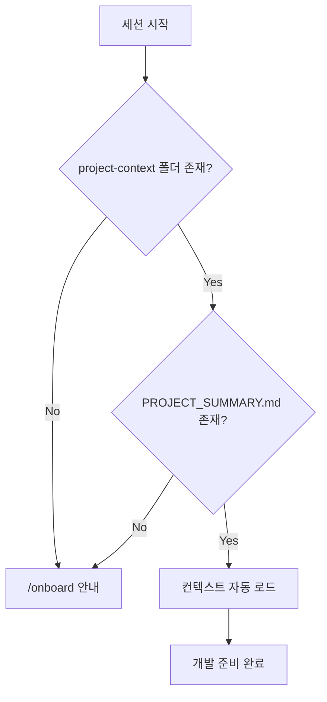
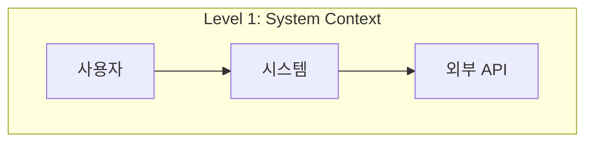
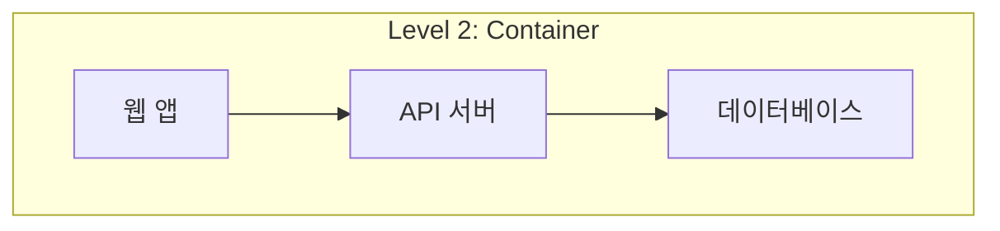
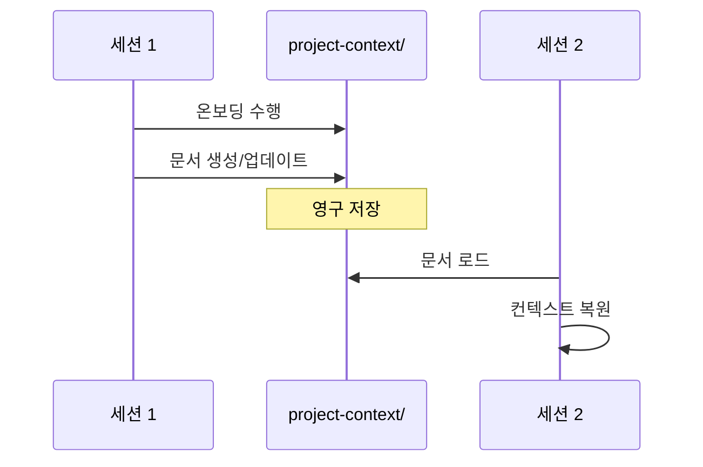
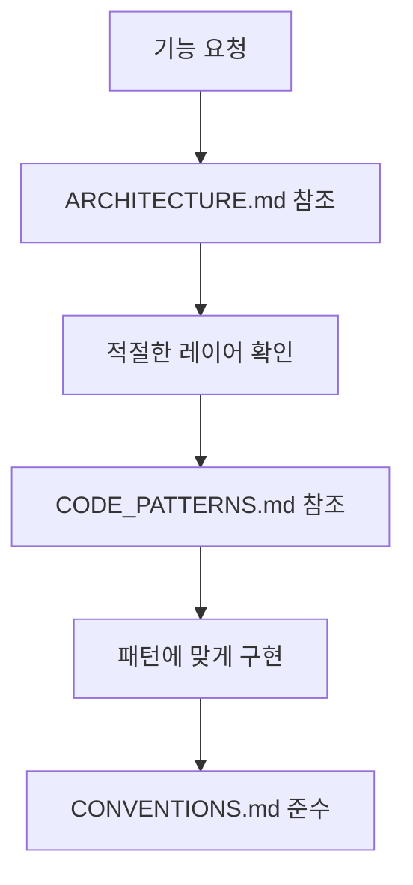

# Project Onboarding Skill

## 자동 활성화 조건

이 스킬은 다음 상황에서 **자동으로 활성화**됩니다:

### 키워드 감지

| 키워드 | 활성화 동작 |
|--------|------------|
| "프로젝트 분석", "코드 분석" | 온보딩 필요성 안내 |
| "온보딩", "프로젝트 파악" | `/onboard` 또는 `/onboard-quick` 제안 |
| "기존 프로젝트", "이어서 개발" | 컨텍스트 문서 확인 |
| "코드베이스 학습", "프로젝트 이해" | 분석 시작 |
| "이 프로젝트 어떻게 되어있어?" | 빠른 온보딩 수행 |

### 세션 시작 시 자동 체크



---

## 컨텍스트 문서 구조

### 저장 위치

```
memory/
├── PROJECT_SUMMARY.md      # 프로젝트 요약 (필수)
├── ARCHITECTURE.md         # 아키텍처 분석 (C4 Model)
├── CODE_PATTERNS.md        # 코드 패턴 및 예시
├── CONVENTIONS.md          # 코딩 컨벤션
└── DOMAIN_KNOWLEDGE.md     # 도메인 지식 (비즈니스)
```

### 문서별 역할

| 문서 | 역할 | 참조 시점 |
|------|------|----------|
| **PROJECT_SUMMARY** | 기술 스택, 디렉토리 구조, 개발 명령어 | 항상 |
| **ARCHITECTURE** | C4 다이어그램, 레이어 구조, 데이터 흐름 | 아키텍처 결정 시 |
| **CODE_PATTERNS** | 컴포넌트/API/훅/테스트 패턴 | 코드 작성 시 |
| **CONVENTIONS** | 명명 규칙, Import 순서, Git 규칙 | 코드 작성 시 |
| **DOMAIN_KNOWLEDGE** | 비즈니스 개념, 용어, 규칙 | 기능 설계 시 |

---

## 핵심 기능

### 1. 프로젝트 분석 엔진

**분석 순서:**


**분석 대상:**

| 단계 | 분석 대상 | 추출 정보 |
|------|----------|----------|
| 설정 파일 | `package.json`, `tsconfig.json` | 기술 스택, 스크립트 |
| 디렉토리 | `src/`, `app/` | 구조 유형, 폴더 역할 |
| 코드 패턴 | 대표 파일 5-10개 | 컴포넌트/API 패턴 |
| 아키텍처 | 전체 구조 | C4 다이어그램, 레이어 |

### 2. C4 Model 기반 아키텍처 문서화

**4단계 추상화:**

| Level | 이름 | 대상 청중 | 내용 |
|-------|------|----------|------|
| 1 | System Context | 비개발자 포함 | 시스템과 외부 연동 |
| 2 | Container | 아키텍트, 개발자 | 애플리케이션 구성요소 |
| 3 | Component | 개발자 | 모듈/레이어 구조 |
| 4 | Code | 개발자 | 클래스/함수 수준 |

**생성되는 다이어그램:**





### 3. 코드 패턴 추출

**추출 대상:**

| 패턴 유형 | 추출 내용 | 예시 |
|----------|----------|------|
| 컴포넌트 | Props 정의, 상태 관리, 스타일링 | `UserCard.tsx` 구조 |
| API | 라우터, 검증, 응답 형식 | `route.ts` 패턴 |
| 훅 | 쿼리 키, 페칭, 뮤테이션 | `useUsers.ts` 패턴 |
| 에러 | 커스텀 에러, 핸들러 | `AppError` 구조 |
| 테스트 | 테스트 구조, 모킹 | `*.test.tsx` 패턴 |

### 4. 세션 간 컨텍스트 영속성



---

## 온보딩 프로세스 상세

### Phase 1: Discovery (탐색)

**수행 작업:**

1. **설정 파일 분석**
   ```bash
   # 분석 대상
   package.json      # 기술 스택, 스크립트
   tsconfig.json     # TypeScript 설정
   .env.example      # 환경 변수
   docker-compose.yml # 서비스 구성
   prisma/schema.prisma # DB 스키마
   ```

2. **디렉토리 구조 파악**
   ```bash
   # 구조 유형 판단
   find src -type d -maxdepth 3
   ```

3. **기술 스택 식별**
   - Frontend: React, Next.js, Vue, Angular
   - Backend: Express, Fastify, NestJS
   - Database: PostgreSQL, MySQL, MongoDB
   - ORM: Prisma, TypeORM, Drizzle

### Phase 2: Pattern Extraction (패턴 추출)

**대표 파일 선정 기준:**

| 기준 | 이유 |
|------|------|
| 가장 큰 파일 | 복잡한 패턴 포함 가능성 |
| 가장 많이 수정된 파일 | 핵심 비즈니스 로직 |
| 공통 컴포넌트 | 재사용 패턴 |
| API 엔드포인트 | 서버 통신 패턴 |

**추출 체크리스트:**

```
컴포넌트 패턴:
□ Props 정의 (interface vs type)
□ 상태 관리 (useState, useReducer, 외부 상태)
□ 부수효과 (useEffect 패턴)
□ 메모이제이션 (useMemo, useCallback, memo)
□ 스타일링 (Tailwind, CSS Modules, styled)

API 패턴:
□ 라우터 구조
□ 인증/인가
□ 요청 검증 (Zod, Joi)
□ 응답 형식
□ 에러 처리

테스트 패턴:
□ 테스트 구조
□ 모킹 전략
□ 커버리지 목표
```

### Phase 3: Architecture Analysis (아키텍처 분석)

**C4 Model 적용:**

1. **System Context (Level 1)**
   - 사용자 유형 식별
   - 외부 시스템 연동 파악
   - 데이터 흐름 방향

2. **Container Diagram (Level 2)**
   - 웹 앱, API, DB 구분
   - 컨테이너 간 통신 방식
   - 배포 단위

3. **Component Diagram (Level 3)**
   - 레이어 구조 (Presentation, Application, Domain, Infrastructure)
   - 모듈 간 의존성
   - 주요 컴포넌트 역할

### Phase 4: Documentation (문서화)

**문서 생성 순서:**


### Phase 5: Domain Knowledge (도메인 지식)

**사용자 인터뷰 질문:**

1. 프로젝트가 해결하는 문제는?
2. 대상 사용자는 누구인가?
3. 핵심 비즈니스 엔티티는?
4. 중요한 비즈니스 규칙은?
5. 특수 용어/약어는?

---

## 컨텍스트 활용 가이드

### 새 기능 개발 시



**체크리스트:**

- [ ] ARCHITECTURE.md에서 적절한 위치 확인
- [ ] CODE_PATTERNS.md에서 관련 패턴 참조
- [ ] CONVENTIONS.md 규칙 준수
- [ ] 기존 유틸리티 재사용

### 버그 수정 시

- [ ] 관련 모듈 의존성 파악
- [ ] 에러 처리 패턴 확인
- [ ] 테스트 패턴 참조

### 리팩토링 시

- [ ] 현재 아키텍처 이해
- [ ] 영향 범위 분석
- [ ] 패턴 일관성 유지
- [ ] ADR 작성 (주요 변경 시)

---

## 명령어 참조

| 명령어 | 설명 | 생성 문서 |
|--------|------|----------|
| `/onboard` | 전체 온보딩 (5단계) | 5개 문서 |
| `/onboard-quick` | 빠른 온보딩 | PROJECT_SUMMARY만 |
| `/context-refresh` | 컨텍스트 갱신 | 기존 문서 업데이트 |
| `/context-show` | 컨텍스트 표시 | 읽기 전용 |
| `/learn <path>` | 특정 영역 학습 | 해당 영역 심층 분석 |

---

## 품질 기준

### 좋은 온보딩 문서

- [ ] 기술 스택이 버전과 함께 정확히 기록됨
- [ ] 디렉토리 구조가 각 폴더 역할과 함께 설명됨
- [ ] C4 다이어그램이 Mermaid로 시각화됨
- [ ] 코드 패턴이 실제 예시와 함께 문서화됨
- [ ] 컨벤션이 명확하고 일관됨
- [ ] 개발 명령어가 검증됨

### 나쁜 온보딩 문서

- [ ] 기술 스택만 나열 (버전 없음)
- [ ] 디렉토리 구조만 나열 (역할 설명 없음)
- [ ] 다이어그램 없음
- [ ] 코드 예시 없음
- [ ] 컨벤션 불명확
- [ ] 개발 명령어 미검증

---

## 금지 사항

1. **가정하지 않기**: 실제 코드를 분석하지 않고 가정으로 문서 작성 금지
2. **복사 금지**: 다른 프로젝트 문서를 그대로 복사하지 않기
3. **과도한 일반화**: 프로젝트 특성을 무시한 일반적인 내용 금지
4. **미검증 정보**: 실제 동작하지 않는 명령어 기록 금지
5. **오래된 정보**: 현재 코드와 불일치하는 정보 금지

---

## 참조 문서

- `commands/onboard.md` - 전체 온보딩 명령어
- `commands/onboard-quick.md` - 빠른 온보딩 명령어
- `best-practices/project-onboarding.md` - 온보딩 베스트 프랙티스
- [C4 Model](https://c4model.com/) - 아키텍처 문서화 표준
