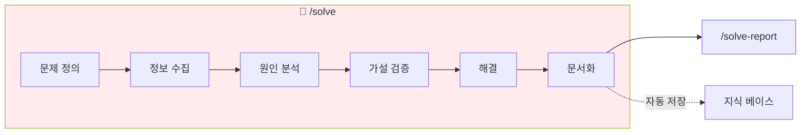

# /solve - 문제 해결 프로세스

## 목적

소프트웨어 개발 중 발생하는 문제(버그, 에러, 장애)를 **체계적으로 분석하고 해결**합니다.

## 자동 활성화 조건

이 스킬은 다음 키워드가 감지되면 자동으로 활성화됩니다:

**문제 관련**:
- "에러", "오류", "버그", "문제"
- "안 돼", "안되", "작동 안함", "동작 안함"
- "실패", "failure", "error", "bug"

**해결 관련**:
- "해결", "디버깅", "디버그", "debug"
- "왜 이런지", "원인", "이유"
- "고치", "fix", "수정"

**분석 관련**:
- "분석", "원인 분석", "RCA"
- "5 whys", "왜왜왜"

## 워크플로우



## 사용법

```bash
/toolkit:solve [문제 설명]              # 6단계 전체 프로세스
/toolkit:solve [문제] --5whys           # 5 Whys 기법으로 원인 분석
/toolkit:solve [문제] --rca             # Root Cause Analysis 실행
/toolkit:solve [문제] --hypothesis      # 가설 기반 접근
/toolkit:solve [문제] --binary          # Binary Search 디버깅
```

## 옵션

| 옵션 | 설명 |
|------|------|
| (기본) | 6단계 전체 프로세스 실행 |
| `--5whys` | 5 Whys 기법으로 원인 분석 |
| `--rca` | Root Cause Analysis 실행 |
| `--hypothesis` | 가설 기반 접근 (Scientific Method) |
| `--binary` | Binary Search 디버깅 |

---

## Phase 1: 문제 정의 (Define)

### 1.1 문제 파악

$ARGUMENTS에서 문제 설명을 파악하거나 질문:

```
============================================
[SOLVE] 문제 해결 시작
============================================

문제를 정확히 이해하기 위해 질문드립니다:

Q1. 정확히 어떤 증상이 발생하나요?
    (에러 메시지, 예상과 다른 동작 등)

Q2. 언제부터 발생했나요?
    (특정 시점, 특정 작업 후)

Q3. 재현 조건이 있나요?
    (항상 발생 / 간헐적 / 특정 조건)

Q4. 최근 변경사항이 있었나요?
    (코드, 설정, 의존성, 환경)

============================================
```

### 1.2 문제 정의서 작성

`.claude/problem-solving/active/{problem-id}/problem.md` 생성

---

## Phase 2: 정보 수집 (Gather)

### 2.1 자동 수집

다음 정보를 자동으로 수집:

```bash
# Git 최근 변경 이력
git log --oneline -10

# 현재 브랜치 상태
git status

# 최근 수정된 파일
git diff --name-only HEAD~5
```

### 2.2 관련 파일 분석

문제와 관련된 파일 검색:
- 에러 메시지에 언급된 파일
- 스택 트레이스의 파일
- 최근 수정된 파일

---

## Phase 3: 원인 분석 (Analyze)

### 3.1 5 Whys 분석 (`--5whys` 또는 기본)

```
[SOLVE] 5 Whys 분석
━━━━━━━━━━━━━━━━━━━━━━━━━━━━━━

문제: {문제 설명}

Why 1: 왜 {증상}이 발생하나요?
→ {원인 1}

Why 2: 왜 {원인 1}이 발생했나요?
→ {원인 2}

Why 3: 왜 {원인 2}가 발생했나요?
→ {원인 3}

Why 4: 왜 {원인 3}이 발생했나요?
→ {원인 4}

Why 5: 왜 {원인 4}가 발생했나요?
→ {근본 원인}

━━━━━━━━━━━━━━━━━━━━━━━━━━━━━━
근본 원인: {근본 원인 요약}
━━━━━━━━━━━━━━━━━━━━━━━━━━━━━━
```

### 3.2 Root Cause Analysis (`--rca`)

8단계 RCA 프로세스:
1. 문제 정의 (완료)
2. 데이터 수집 (완료)
3. 원인 식별 (현재)
4. 근본 원인 확정
5. 해결책 개발
6. 해결책 구현
7. 효과 검증
8. 문서화

### 3.3 Fishbone Diagram (다중 원인)

```
                    ┌── Man: {사람 관련 원인}
                    ├── Machine: {시스템/인프라 원인}
                    ├── Method: {프로세스/방법 원인}
{문제} ←────────────┼── Material: {데이터/입력 원인}
                    ├── Measurement: {모니터링/측정 원인}
                    └── Milieu: {환경/외부 원인}
```

### 3.4 Binary Search Debugging (`--binary`)

코드 이분 탐색으로 문제 위치 특정:

```
[SOLVE] Binary Search 디버깅
━━━━━━━━━━━━━━━━━━━━━━━━━━━━━━

대상: {파일명} ({총 줄 수}줄)

Step 1: {중간} 지점 → {결과}
Step 2: {조정된 중간} 지점 → {결과}
Step 3: {조정된 중간} 지점 → {결과}
...

━━━━━━━━━━━━━━━━━━━━━━━━━━━━━━
문제 위치: {줄 번호} - {설명}
━━━━━━━━━━━━━━━━━━━━━━━━━━━━━━
```

---

## Phase 4: 가설 검증 (Hypothesize)

### 4.1 가설 수립 (`--hypothesis` 강화)

```
[SOLVE] 가설 검증
━━━━━━━━━━━━━━━━━━━━━━━━━━━━━━

### 가설 1 (가능성: 높음/중간/낮음)
- **가설**: {X}가 원인이다
- **예측**: {X}를 수정하면 {Y} 현상이 사라질 것
- **검증 방법**: {검증 방법}
- **결과**: [ ] 미검증 / [x] 확인됨 / [ ] 기각

━━━━━━━━━━━━━━━━━━━━━━━━━━━━━━
```

### 4.2 실험 수행

각 가설에 대해:
1. 예측 결과 명시
2. 실험 수행
3. 결과 비교
4. 가설 채택/기각

---

## Phase 5: 해결 (Solve)

### 5.1 해결책 구현

```
[SOLVE] 해결책 적용
━━━━━━━━━━━━━━━━━━━━━━━━━━━━━━

### 즉시 조치 (Incident)
- [ ] {조치 1}
- [ ] {조치 2}

### 근본 해결 (Problem)
- [ ] {해결책 1}
- [ ] {해결책 2}

### 재발 방지
- [ ] {예방책 1}
- [ ] {예방책 2}

━━━━━━━━━━━━━━━━━━━━━━━━━━━━━━
```

### 5.2 검증

- 문제 재현 테스트
- 사이드 이펙트 확인
- 관련 테스트 실행

---

## Phase 6: 문서화 (Document)

### 6.1 해결 보고서 생성

`.claude/problem-solving/resolved/{problem-id}/report.md` 생성

### 6.2 지식 베이스 업데이트

`.claude/problem-solving/knowledge-base/` 업데이트:
- 문제 패턴 등록
- 해결책 인덱싱
- 키워드 태깅

---

## 완료 보고

```
============================================
[SOLVE] 문제 해결 완료
============================================

 문제 ID: {problem-id}
 소요 시간: {시간}

 📋 요약:
 • 문제: {문제 요약}
 • 근본 원인: {원인 요약}
 • 해결책: {해결책 요약}

 📁 생성된 문서:
 • .claude/problem-solving/resolved/{id}/report.md

 💡 다음 단계:
 • /toolkit:solve-report {id} - 상세 보고서 확인
 • /toolkit:solve-history - 해결 이력 조회

============================================
```

---

## 유사 문제 자동 추천

문제 정의 시 지식 베이스에서 유사 사례 검색:

```
[SOLVE] 유사 문제 발견
━━━━━━━━━━━━━━━━━━━━━━━━━━━━━━

현재 문제와 유사한 과거 사례:

1. PROB-001 (유사도: 85%)
   • 증상: {증상}
   • 원인: {원인}
   • 해결: {해결책}

2. PROB-003 (유사도: 60%)
   • 증상: {증상}
   • 원인: {원인}

과거 사례를 참고하시겠습니까? (Y/n)
━━━━━━━━━━━━━━━━━━━━━━━━━━━━━━
```

---

## 저장 구조

```
.claude/problem-solving/
├── active/                     # 진행 중
│   └── {problem-id}/
│       ├── problem.md          # 문제 정의
│       ├── analysis.md         # 분석 기록
│       ├── hypotheses.md       # 가설 목록
│       └── experiments.md      # 실험 기록
│
├── resolved/                   # 해결 완료
│   └── {problem-id}/
│       └── report.md           # 최종 보고서
│
└── knowledge-base/             # 지식 베이스
    ├── patterns.json           # 문제 패턴
    └── solutions.json          # 해결책 인덱스
```

---

## 관련 스킬

| 스킬 | 설명 |
|--------|------|
| `/toolkit:solve-report` | 보고서 생성 |
| `/toolkit:solve-log` | 진행 상황 확인 |
| `/toolkit:solve-history` | 과거 이력 조회 |
| `/toolkit:research` | 리서치 수행 |

---

## 참조 파일

- `skills/solve/methods/five-whys.md`
- `skills/solve/methods/rca.md`
- `skills/solve/methods/hypothesis.md`
- `skills/solve/methods/binary-search.md`
- `skills/solve/methods/fishbone.md`
