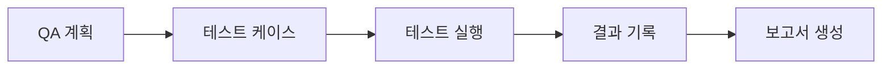

# Workflow Plugin

> **체계적 개발 워크플로우**: Plan → Design → Tasks → Build + JIRA 연동 + QA 테스트

---

## 문제 해결 매트릭스

| 상황 | 문제점 | 솔루션 | 명령어 |
|------|--------|--------|--------|
| **새 프로젝트 시작** | 어떻게 시작할지 막막함 | 체계적 워크플로우 제공 | `/workflow:dev-plan` |
| **QA 누락** | 수동 테스트 반복 | E2E 자동화 | `/workflow:qa` |
| **작업 추적 어려움** | 진행률 파악 불가 | Worktree 자동 추적 | `/workflow:worktree` |
| **JIRA 수동 업데이트** | 중복 작업 | 양방향 자동 동기화 | `/workflow:jira-sync` |
| **컨텍스트 손실** | Compact 후 작업 맥락 소실 | 자동 체크포인트 + 복원 | `/workflow:restore-context` |

---

## 명령어

### 개발 워크플로우

| 명령어 | 옵션 | 자연어 | 설명 |
|--------|------|--------|------|
| `/workflow:dev-plan [기능]` | `--brainstorm`, `--prd` | "기획해줘" | 브레인스토밍 + PRD |
| `/workflow:dev-design` | `--arch`, `--erd` | "설계해줘" | 아키텍처 + ERD |
| `/workflow:dev-tasks` | - | "태스크 분해해줘" | 태스크 목록 생성 |
| `/workflow:dev-build [task-id]` | `--tdd` | "구현해줘" | 태스크 구현 |
| `/workflow:dev-status` | - | "진행 상황 보여줘" | 진행률 확인 |

### Worktree (작업 추적)

| 명령어 | 자연어 | 설명 |
|--------|--------|------|
| `/workflow:worktree` | "작업 트리 보여줘" | 트리 구조 시각화 |
| `/workflow:worktree status` | "진행률 보여줘" | 상태 요약 |
| `/workflow:worktree start [id]` | "시작해줘" | 태스크 시작 |
| `/workflow:worktree done [id]` | "완료" | 태스크 완료 |
| `/workflow:worktree block [id] [사유]` | "블로킹됨" | 블로커 등록 |
| `/workflow:worktree reset` | "작업 초기화해줘" | 트리 초기화 |

### 컨텍스트 관리

| 명령어 | 자연어 | 설명 |
|--------|--------|------|
| `/workflow:restore-context` | "컨텍스트 복원해줘" | 규칙 + 작업 상태 복원 |
| `/workflow:save-progress [메시지]` | "저장해줘" | 체크포인트 저장 |
| `/workflow:show-rules` | "규칙 보여줘" | 전체 규칙 표시 |
| `/workflow:context-refresh` | "컨텍스트 업데이트해줘" | 문서 갱신 |
| `/workflow:context-show` | "컨텍스트 보여줘" | 컨텍스트 표시 |

### 코드 품질

| 명령어 | 자연어 | 설명 |
|--------|--------|------|
| `/workflow:check-quality` | "품질 검사해줘" | 전체 프로젝트 검사 |

### JIRA 연동

| 명령어 | 자연어 | 설명 |
|--------|--------|------|
| `/workflow:jira-init [key]` | "JIRA 연결해줘" | 연동 초기화 |
| `/workflow:jira-push` | "JIRA로 동기화해줘" | Worktree → JIRA |
| `/workflow:jira-pull` | "JIRA에서 가져와줘" | JIRA → Worktree |
| `/workflow:jira-sync` | "양방향 동기화해줘" | 양방향 동기화 |
| `/workflow:jira-link [id] [key]` | "JIRA에 연결해줘" | 수동 매핑 |
| `/workflow:jira-status` | "JIRA 상태 보여줘" | 상태 확인 |

### QA 테스트

| 명령어 | 옵션 | 자연어 | 설명 |
|--------|------|--------|------|
| `/workflow:qa` | `--from-prd`, `--from-worktree` | "QA 시작해줘" | QA 프로세스 시작 |
| `/workflow:qa-plan` | `--edit` | "QA 계획서 만들어줘" | QA 계획서 생성 |
| `/workflow:qa-run [tc-id]` | `--all`, `--failed`, `--continue` | "테스트 실행해줘" | 테스트 실행 |
| `/workflow:qa-report` | `--summary`, `--full` | "QA 보고서 만들어줘" | 테스트 결과 보고서 |
| `/workflow:qa-status` | - | "QA 진행 상태" | 테스트 진행률 확인 |

---

## 주요 기능 상세

### 1. 개발 워크플로우

순서대로 진행되는 체계적인 개발 프로세스:


**사용 예시:**

```bash
# 1. 기획
/workflow:dev-plan 사용자 인증 시스템

# 2. 설계
/workflow:dev-design

# 3. 태스크 분해
/workflow:dev-tasks

# 4. 구현
/workflow:dev-build TASK-001 --tdd

# 5. 진행 상황 확인
/workflow:dev-status
```

### 2. Worktree (작업 추적)

**실시간 진행률 관리:**

```bash
# 트리 구조 시각화
/workflow:worktree

# 예시 출력:
# 📦 사용자 인증 시스템 (0/3)
# ├─ ✅ TASK-001: 로그인 API (완료)
# ├─ 🔄 TASK-002: 회원가입 API (진행중)
# └─ 📋 TASK-003: 비밀번호 재설정 (대기)
```

### 3. JIRA 연동

**Worktree ↔ JIRA 양방향 동기화:**

**사전 설정:**
```bash
export JIRA_EMAIL='your-email@company.com'
export JIRA_API_TOKEN='your-api-token'
```

**자동 동기화:**
- Worktree 태스크 시작 → JIRA 이슈 "In Progress"
- Worktree 태스크 완료 → JIRA 이슈 "Done"
- JIRA 이슈 변경 → Worktree 태스크 상태 업데이트

### 4. QA 테스트

**E2E 테스트 자동화:**



**주요 기능:**
- 자동 스크린샷 캡처
- 버그 자동 기록 및 분류
- 100% 완료까지 지속 실행
- 테스트 결과 상세 보고서

---

## 자동 적용 기능 (패시브 스킬)

코드 작성 시 **사용자 요청 없이** 자동으로 활용:

| 스킬 | 활성화 조건 | 효과 |
|------|------------|------|
| `dev-workflow` | 개발 작업 시 | 워크플로우 가이드 |
| `best-practices` | 기술 감지 시 | 언어별 베스트 프랙티스 자동 적용 |
| `code-quality` | 코드 생성 시 | 300줄 제한, 주석 필수, 타입 완전성 검증 |
| `project-rules` | 코드 작성/수정 시 | 프로젝트 규칙 자동 참조 |
| `work-tracker` | 소스 코드 수정 시 | Worktree 태스크 자동 시작 |
| `jira-integration` | JIRA/이슈 언급 시 | JIRA 양방향 동기화 활성화 |
| `qa-testing` | QA/테스트 언급 시 | E2E 테스트 가이드 |

---

## 자동 동작 (Hooks)

| 트리거 | 자동 동작 | 저장 위치 |
|--------|----------|----------|
| **사용자 입력** | 작업 의도 감지 → 현재 목표 자동 업데이트 | `.claude/memory/CURRENT_CONTEXT.md` |
| **모든 프롬프트** | 히스토리 자동 기록 | `.claude-state/prompt_history.json` |
| **파일 수정** | 파일 카테고리 분류 → 변경 이력 기록 | `.claude-state/recent_changes.json` |
| **파일 수정 (Edit/Write)** | 코드 품질 검사 | 300줄 초과, 주석 누락 경고 |
| **소스 코드 수정** | worktree 태스크 자동 시작 | `.claude-state/worktree.json` |
| **세션 시작** | 이전 컨텍스트 안내 | 콘솔 출력 |
| **Context Compact** | 체크포인트 자동 저장 | `.claude-state/checkpoint.json` |

---

## 문서 생성 위치

```
.claude/
├── docs/
│   ├── active/                    # 진행 중인 기능
│   │   └── {feature-name}/
│   │       ├── 01-brainstorm.md   # /dev-plan (브레인스토밍)
│   │       ├── 02-prd.md          # /dev-plan (PRD)
│   │       ├── 03-architecture.md # /dev-design
│   │       ├── 04-erd.md          # /dev-design
│   │       ├── 05-tasks.md        # /dev-tasks
│   │       └── qa/
│   │           ├── QA_PLAN.md     # /qa-plan
│   │           ├── TEST_CASES.md  # /qa
│   │           └── QA_REPORT.md   # /qa-report
│   │
│   └── complete/                  # 완료된 기능 (worktree 100% 시 자동 이동)
│
└── memory/                        # 컨텍스트 문서
    ├── PROJECT_RULES.md
    ├── CURRENT_CONTEXT.md
    └── WORK_HISTORY.md
```

---

## 포함 리소스

- **best-practices/**: Go, Java, Node.js, Python, React, Rust, Tailwind, TypeScript, Next.js
- **templates/**: PRD, Task
- **agents/**: 코드 리뷰어, 프로젝트 가디언
- **hooks/**: 품질 검사, 변경 추적, 세션 관리, JIRA 동기화
