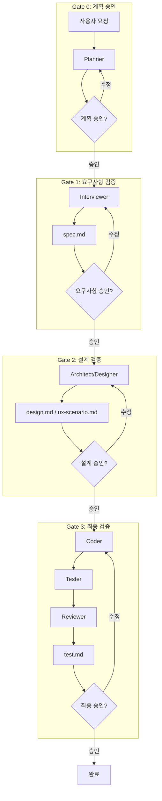
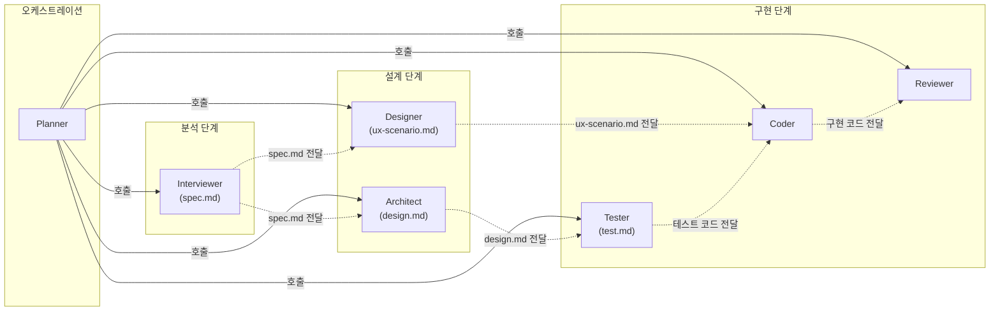

# workflow 플러그인

> 멀티 에이전트 오케스트레이션: 8개 전문 에이전트와 Quality Gates를 통한 체계적인 개발 워크플로우

---

## 구조

```
plugins/workflow/
├── agents/           # 8개 에이전트 정의
├── guides/           # 공통 가이드
│   ├── architecture/ # 아키텍처 가이드 (Clean, Hexagonal)
│   └── ...           # 코딩, TDD, Gate
├── templates/        # 설계 문서 템플릿
└── skills/           # 스킬 (start, help)
```

### 아키텍처 가이드

| 가이드 | 파일 | 설명 |
|--------|------|------|
| Clean Architecture | `guides/architecture/clean-architecture.md` | 4-레이어 구조, 의존성 규칙 |
| Hexagonal Architecture | `guides/architecture/hexagonal-architecture.md` | Port/Adapter 패턴 |
| API 설계 | `guides/architecture/api-design.md` | RESTful API 설계 원칙 |
| 데이터베이스 | `guides/architecture/database.md` | 스키마 설계 원칙 |

### 공통 가이드

| 가이드 | 파일 | 설명 |
|--------|------|------|
| 코딩 가이드 | `guides/language-guide.md` | SOLID, DRY, KISS + Go, TypeScript, React, Python |
| TDD 워크플로우 | `guides/tdd-workflow.md` | RED-GREEN-REFACTOR 사이클 |
| Quality Gate | `guides/gate-process.md` | Gate 0~3 승인 프로세스 |

---

## 해결하는 문제

| 문제점 | 솔루션 |
|--------|--------|
| 요구사항 누락, 설계 없이 구현 | 체계적 워크플로우 + Quality Gates 검증 |
| 혼자 모든 것 처리하는 비효율 | 8개 전문 에이전트 분업 |
| 리뷰 없이 배포되는 품질 문제 | Gate 3 최종 검증 + Reviewer 자동 리뷰 |
| AI가 가정하고 구현하는 문제 | Interviewer 심층 인터뷰로 요구사항 명확화 |
| 일관성 없는 코드 품질 | 통합 코딩 가이드 (SOLID, 언어별 원칙) |

---

## 명령어

| 명령어 | 설명 |
|--------|------|
| `/workflow:start <요청>` | 멀티 에이전트 워크플로우 시작 |
| `/workflow:help` | 도움말 표시 |

> **참고**: 코드 리뷰와 커밋은 `/toolkit:code-review`, `/toolkit:code-commit`으로 이동했습니다.

---

## 에이전트 목록

| 에이전트 | 역할 | 모델 | 색상 |
|----------|------|------|------|
| `planner` | 워크플로우 오케스트레이터 | opus | 🔵 |
| `interviewer` | 요구사항 명확화 | opus | 🩵 |
| `architect` | 아키텍처 설계 | opus | 🟣 |
| `designer` | UX/UI 디자인 (shadcn/ui) | opus | 🩷 |
| `coder` | 코드 구현 | sonnet | 🟢 |
| `tester` | 테스트 작성 + 커버리지 | sonnet | 🟡 |
| `reviewer` | 코드/설계 리뷰 | opus | 🔴 |
| `writer` | 문서 품질/일관성 보장 | sonnet | 🟠 |

### 모델 선택 기준

| 기준 | opus | sonnet |
|------|------|--------|
| 용도 | 복잡한 판단, 설계, 리뷰 | 명확한 지시에 따른 구현 |
| 에이전트 | planner, interviewer, architect, designer, reviewer | coder, tester, writer |
| 비용 | 높음 | opus 대비 약 1/15 |
| 선택 근거 | 다단계 추론, 아키텍처 결정, 품질 평가 등 높은 인지 능력 필요 | 명확한 설계/테스트 케이스 기반 코드 생성에 충분 |

### 색상 활용
에이전트별 색상은 로그 출력 및 진행 상황 표시 시 시각적 구분에 사용됩니다.

### 에이전트 정의 파일 구조

각 에이전트는 다음 frontmatter를 포함합니다:

```yaml
---
name: workflow:{에이전트명}
description: |
  에이전트 설명 및 Examples
tools: 사용 가능한 도구 목록
model: opus | sonnet
color: 로그 색상
permissionMode: default
---
```

| 필드 | 설명 |
|------|------|
| `name` | 에이전트 고유 식별자 (`workflow:` 접두사) |
| `tools` | 에이전트가 사용 가능한 도구 (Read, Write, Edit, Grep, Glob, Bash 등) |
| `model` | AI 모델 선택 (opus: 복잡한 판단, sonnet: 구현 작업) |
| `color` | 로그 출력 시 시각적 구분을 위한 색상 |
| `permissionMode` | 권한 모드 (default: 기본 권한) |

---

## 코딩 가이드

`guides/language-guide.md`에서 다음 원칙들을 제공합니다:

### 공통 원칙
- **SOLID**: 단일 책임, 개방-폐쇄, 리스코프 치환, 인터페이스 분리, 의존성 역전
- **DRY/KISS**: 중복 제거, 단순함 우선
- **보안**: 입력 검증, 민감 정보 관리, 최소 권한
- **에러 처리**: 컨텍스트 보존, fail fast
- **네이밍**: 의도를 드러내는 명확한 이름

### 언어별 원칙

| 언어 | 핵심 원칙 |
|------|-----------|
| **Go** | Accept interfaces, return structs / 작은 인터페이스 / 명시적 에러 처리 |
| **TypeScript** | strict 모드 필수 / any 금지 / 타입 가드 활용 |
| **React** | 단일 책임 컴포넌트 / Props drilling 지양 / Custom Hooks |
| **Python** | 타입 힌트 100% / Pydantic 검증 / async/await |

---

## 워크플로우 흐름



---

## Quality Gates

각 단계 완료 시 사용자 승인을 요청합니다:

| Gate | 검증 대상 | 산출물 |
|------|----------|--------|
| Gate 0 | 작업 계획 | - |
| Gate 1 | 요구사항 | `.workflow/artifacts/{앱}/{기능}/spec.md` |
| Gate 2 | 설계 | `design.md`, `ux-scenario.md` |
| Gate 3 | 구현 결과 | 코드, `test.md`, 리뷰 결과 |

---

## 사용 예시

### 새 기능 개발
```
/workflow:start 사용자 알림 기능 추가
```

### 버그 수정
```
/workflow:start 로그인 실패 시 에러 메시지 표시 안됨
```

### 리팩토링
```
/workflow:start 인증 모듈 클린 아키텍처로 리팩토링
```

### 복합 작업
```
/workflow:start "결제 API 추가, 결제 내역 화면 구현"
```

---

## 산출물 구조

```
.workflow/
├── progress/                # 워크플로우 진행상태
│   └── <epic-id>.md
└── artifacts/               # 워크플로우 산출물
    └── {앱명}/
        └── {기능명}/
            ├── spec.md          # 요구사항 스펙 (Interviewer)
            ├── design.md        # 기술 설계 (Architect)
            ├── ux-scenario.md   # UX 시나리오 (Designer)
            └── test.md          # 테스트 보고서 (Tester)
```

---

## beads 연동

모든 작업은 beads 이슈로 추적됩니다:

### 이슈 구조
```
Epic: [epic] 기능명
├── Sub-task: 요구사항 (interviewer)
├── Sub-task: 설계 (architect)
├── Sub-task: UI 설계 (designer)
├── Sub-task: 구현 (coder)
├── Sub-task: 테스트 (tester)
└── Sub-task: 리뷰 (reviewer)
```

### 라벨 컨벤션
| 라벨 | 담당 에이전트 |
|-----|--------------|
| `requirements`, `spec` | interviewer |
| `design`, `architecture` | architect |
| `ui`, `ux` | designer |
| `implementation` | coder |
| `test` | tester |
| `review` | reviewer |

---

## 에이전트 의존성



- **실선 화살표**: Planner의 에이전트 호출
- **점선 화살표**: 산출물 기반 데이터 흐름 (beads 이슈 ID를 통해 전달)

---

## 적응적 워크플로우

Planner가 작업 복잡도에 따라 필요한 단계만 실행합니다:

| 작업 유형 | 실행 에이전트 |
|----------|--------------|
| 단순 버그 | coder |
| 중간 작업 | tester → coder |
| 복잡 기능 | architect → tester → coder → reviewer |
| UI 기능 | designer → tester → coder → reviewer |
| 요구사항 모호 | interviewer → (이후 단계) |

### 병렬 실행

의존성이 없는 에이전트는 병렬 실행하여 효율을 높입니다 (예: architect + designer 동시 실행).

---
