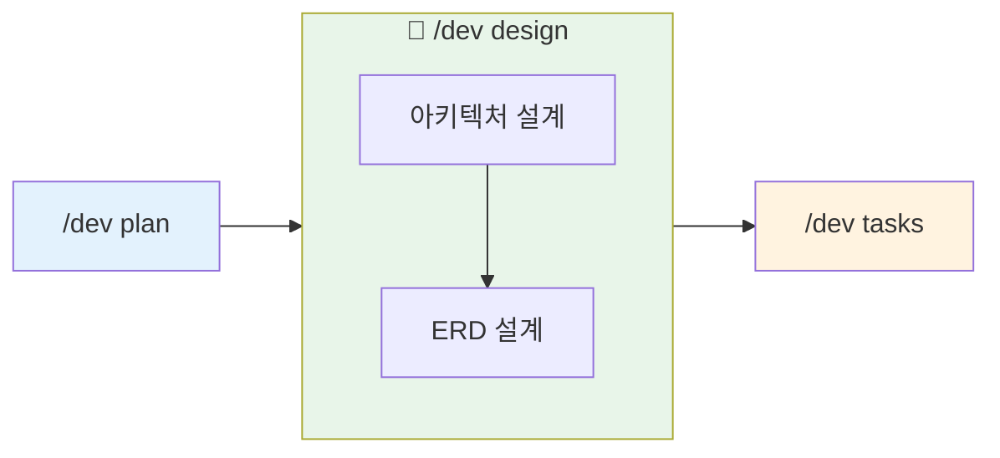
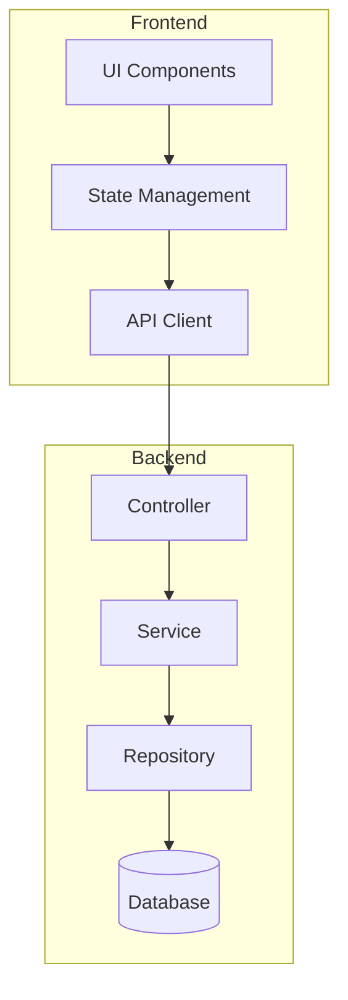
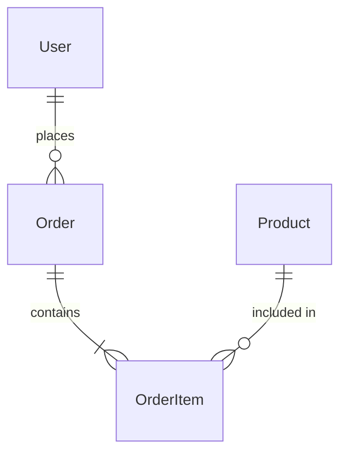

# 설계 (Design)

## 목적

PRD를 기반으로 시스템 아키텍처를 설계하고 데이터 모델을 정의합니다.

## 폴더 구조

```
.claude/docs/
├── active/                          ← 진행 중인 기능
│   └── {feature-name}/              ← 기능별 폴더 (/dev plan에서 생성됨)
│       ├── 01-brainstorm.md         ← /dev plan에서 생성
│       ├── 02-prd.md                ← /dev plan에서 생성
│       ├── 03-architecture.md       ← 이 명령어에서 생성
│       ├── 04-erd.md                ← 이 명령어에서 생성
│       ├── 05-tasks.md              ← /dev tasks에서 생성
│       └── qa/                      ← /qa에서 생성
│
└── complete/                        ← worktree 완료 시 자동 이동
    └── {완료된-기능}/
```

## 워크플로우



**자동 연계:**
- `/dev plan`에서 생성된 PRD 자동 참조
- 완료 후 `/dev tasks`로 자연스럽게 이어짐

## 옵션

| 옵션 | 설명 |
|------|------|
| (기본) | architecture + erd 순차 실행 |
| `--arch` | 아키텍처 설계만 실행 |
| `--erd` | ERD 설계만 실행 |

## 실행 절차

### Step 1: 옵션 확인

$ARGUMENTS에서 옵션 확인:
- `--arch`: Phase 1만 실행
- `--erd`: Phase 2만 실행
- 옵션 없음: Phase 1 → Phase 2 순차 실행

### Step 2: 기능 폴더 확인

`memory/CURRENT_CONTEXT.md`에서 현재 작업 중인 기능 확인:

```
현재 기능: {feature-name}
작업 폴더: .claude/docs/active/{feature-name}/
```

**⚠️ 주의**: `/dev plan`이 먼저 실행되어 있어야 합니다!

### Step 3: 컨텍스트 로드

```
1. memory/CURRENT_CONTEXT.md - 현재 작업 상태
2. .claude/docs/active/{feature-name}/02-prd.md - PRD 문서
3. memory/TECH_STACK.md - 기술 스택
4. best-practices/ - 베스트 프랙티스
```

---

## Phase 1: 아키텍처 설계

### 1.1 시스템 구조 설계



### 1.2 컴포넌트 구조

Feature-based 디렉토리 구조:

```
src/
├── features/
│   └── {feature-name}/
│       ├── components/
│       ├── hooks/
│       ├── services/
│       ├── types/
│       └── index.ts
├── shared/
└── app/
```

### 1.3 기술 결정

TECH_STACK.md와 베스트 프랙티스 기반:

- **Frontend**: Function Components + Custom Hooks
- **Backend**: Layered Architecture (Controller → Service → Repository)
- **상태 관리**: React Query / Zustand / Context

### 1.4 아키텍처 문서 작성

`.claude/docs/active/{feature-name}/03-architecture.md` 생성

```
============================================
[DESIGN] Phase 1 완료: 아키텍처 설계
============================================

 기능: {feature-name}
 폴더: .claude/docs/active/{feature-name}/
 문서: 03-architecture.md

 아키텍처 요약:
• 프론트엔드: {기술}
• 백엔드: {기술}
• 데이터베이스: {기술}

============================================
```

---

## Phase 2: ERD 설계

### 2.1 엔티티 식별

PRD의 기능 요구사항에서 엔티티 추출

### 2.2 관계 정의



### 2.3 베스트 프랙티스 적용

`best-practices/database.md` 규칙 (architecture 플러그인):

- **필수 컬럼**: id (UUID), created_at, updated_at, deleted_at
- **네이밍**: snake_case, 복수형 테이블명
- **인덱스**: FK, 검색 컬럼에 인덱스
- **정규화**: 최소 3NF 적용

### 2.4 ERD 문서 작성

`.claude/docs/active/{feature-name}/04-erd.md` 생성 (Mermaid ERD + 테이블 정의 + Prisma 스키마)

---

## 완료 보고

```
============================================
[DESIGN] 설계 완료
============================================

 기능: {feature-name}
 폴더: .claude/docs/active/{feature-name}/

 생성된 문서:
• 03-architecture.md
• 04-erd.md

 아키텍처 요약:
• 프론트엔드: React + TypeScript
• 백엔드: Node.js + Express
• 데이터베이스: PostgreSQL

 데이터 모델 요약:
• 테이블: {n}개
• 관계: {n}개
• 인덱스: {n}개

 다음 단계: /dev tasks

============================================
```

## 상태 업데이트

`memory/CURRENT_CONTEXT.md` 업데이트:

```markdown
## 워크플로우 상태

- **현재 기능**: {feature-name}
- **작업 폴더**: .claude/docs/active/{feature-name}/
- **현재 단계**: Design 완료
- **다음 단계**: Tasks

## 생성된 문서

- [x] 01-brainstorm.md
- [x] 02-prd.md
- [x] 03-architecture.md
- [x] 04-erd.md
- [ ] 05-tasks.md
```

## 참조 파일

- `memory/TECH_STACK.md` - 기술 스택
- `best-practices/` - 베스트 프랙티스
- `.claude/docs/active/{feature-name}/02-prd.md` - PRD 문서
