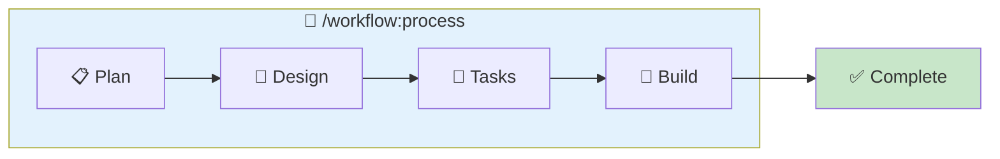

# 개발 프로세스 (Process)

## 목적

전체 개발 워크플로우를 순차적으로 실행합니다.

## 워크플로우



## 옵션

| 옵션 | 설명 |
|------|------|
| (기본) | Plan부터 시작 |
| `--from=plan` | Plan부터 시작 (기본값) |
| `--from=design` | Design부터 시작 (Plan 완료 상태에서) |
| `--from=tasks` | Tasks부터 시작 (Design 완료 상태에서) |
| `--from=build` | Build부터 시작 (Tasks 완료 상태에서) |

## 실행 절차

### Step 1: 옵션 확인

$ARGUMENTS에서 시작 단계 확인:
- `--from=plan`: Phase 1부터 시작 (기본값)
- `--from=design`: Phase 2부터 시작
- `--from=tasks`: Phase 3부터 시작
- `--from=build`: Phase 4부터 시작

### Step 2: 현재 상태 확인

`.claude/memory/CURRENT_CONTEXT.md` 확인:
- 진행 중인 기능이 있는지 확인
- 있다면 현재 단계 파악

### Step 3: 프로세스 안내

```
============================================
[PROCESS] 개발 프로세스 시작
============================================

 워크플로우: Plan → Design → Tasks → Build

 단계 설명:
 📋 Plan   : 브레인스토밍 + PRD 작성
 📐 Design : 아키텍처 + ERD 설계
 📝 Tasks  : 태스크 분해 + Worktree 생성
 🔨 Build  : 코드 구현

 시작 단계: {시작 단계}

============================================
```

---

## Phase 1: Plan (기획)

> `/workflow:process-plan` 실행

### 1.1 기능 이름 결정

$ARGUMENTS에서 아이디어 파악 또는 질문:

```
이 기능의 이름을 정해주세요.
예: user-authentication, payment-system, product-catalog
```

### 1.2 브레인스토밍

질문을 통해 아이디어 구체화:
- 어떤 문제를 해결하려고 하나요?
- 누가 사용하나요?
- 반드시 포함해야 할 기능은?

**산출물**: `.claude/docs/active/{feature}/01-brainstorm.md`

### 1.3 PRD 작성

브레인스토밍 결과를 바탕으로 PRD 작성:
- 배경 및 목적
- 목표 및 비목표
- 사용자 스토리
- 기능 요구사항 (P0/P1/P2)
- 비기능 요구사항
- 성공 지표

**산출물**: `.claude/docs/active/{feature}/02-prd.md`

```
============================================
[PROCESS] Phase 1 완료: Plan
============================================

 ✅ 01-brainstorm.md 생성
 ✅ 02-prd.md 생성

 다음 단계: Design

============================================
```

**사용자 확인 후 다음 단계 진행**

---

## Phase 2: Design (설계)

> `/workflow:process-design` 실행

### 2.1 아키텍처 설계

PRD를 기반으로 시스템 아키텍처 설계:
- 시스템 구조
- 컴포넌트 구조
- 기술 결정

**산출물**: `.claude/docs/active/{feature}/03-architecture.md`

### 2.2 ERD 설계

데이터 모델 설계:
- 엔티티 식별
- 관계 정의
- 베스트 프랙티스 적용

**산출물**: `.claude/docs/active/{feature}/04-erd.md`

```
============================================
[PROCESS] Phase 2 완료: Design
============================================

 ✅ 03-architecture.md 생성
 ✅ 04-erd.md 생성

 다음 단계: Tasks

============================================
```

**사용자 확인 후 다음 단계 진행**

---

## Phase 3: Tasks (태스크 분해)

> `/workflow:process-tasks` 실행

### 3.1 에픽/스토리/태스크 분해

PRD와 아키텍처를 기반으로:
- 에픽 정의
- 스토리 분해
- 태스크 분해
- Acceptance Criteria 정의

### 3.2 의존성 분석

태스크 간 의존성 분석 및 구현 순서 결정

### 3.3 Worktree 생성

`.claude-state/worktree.json` 생성

**산출물**:
- `.claude/docs/active/{feature}/05-tasks.md`
- `.claude-state/worktree.json`

```
============================================
[PROCESS] Phase 3 완료: Tasks
============================================

 ✅ 05-tasks.md 생성
 ✅ worktree.json 생성

 태스크 요약:
 • 총 태스크: {n}개
 • P0 (Critical): {n}개
 • P1 (High): {n}개

 다음 단계: Build

============================================
```

**사용자 확인 후 다음 단계 진행**

---

## Phase 4: Build (구현)

> `/workflow:process-build` 반복 실행

### 4.1 태스크별 구현

각 태스크를 순차적으로 구현:

1. Worktree에서 다음 태스크 확인
2. 베스트 프랙티스 로드
3. 코드 구현
4. Acceptance Criteria 검증
5. Worktree 상태 업데이트
6. 다음 태스크로 이동

### 4.2 구현 루프

```
============================================
[PROCESS] Build - 태스크 {current}/{total}
============================================

 현재 태스크: {task-id} - {task-name}
 진행률: {percentage}%

 □ 구현 중...

============================================
```

### 4.3 전체 완료

모든 태스크 완료 시:

```
============================================
[PROCESS] 🎉 개발 프로세스 완료!
============================================

 기능: {feature-name}

 완료 문서:
 ✅ 01-brainstorm.md
 ✅ 02-prd.md
 ✅ 03-architecture.md
 ✅ 04-erd.md
 ✅ 05-tasks.md

 구현 결과:
 • 총 태스크: {n}개 완료
 • 생성된 파일: {n}개

 문서 폴더: .claude/docs/active/{feature}/
 → complete/ 로 이동 가능

============================================
```

---

## 상태 관리

### CURRENT_CONTEXT.md 업데이트

각 단계 완료 시 `.claude/memory/CURRENT_CONTEXT.md` 업데이트:

```markdown
## 워크플로우 상태

- **현재 기능**: {feature-name}
- **작업 폴더**: .claude/docs/active/{feature-name}/
- **현재 단계**: {Plan | Design | Tasks | Build}
- **진행률**: {percentage}%

## 생성된 문서

- [x] 01-brainstorm.md
- [x] 02-prd.md
- [ ] 03-architecture.md
- [ ] 04-erd.md
- [ ] 05-tasks.md
```

---

## 관련 명령어

| 명령어 | 설명 |
|--------|------|
| `/workflow:process` | 전체 프로세스 실행 |
| `/workflow:process-plan` | Plan 단계만 |
| `/workflow:process-design` | Design 단계만 |
| `/workflow:process-tasks` | Tasks 단계만 |
| `/workflow:process-build` | Build 단계만 |
| `/workflow:process-status` | 현재 상태 확인 |

## 참조 파일

- `skills/process/SKILL.md` - 프로세스 스킬
- `.claude/memory/CURRENT_CONTEXT.md` - 현재 상태
- `.claude/memory/TECH_STACK.md` - 기술 스택
- `.claude-state/worktree.json` - 작업 상태
